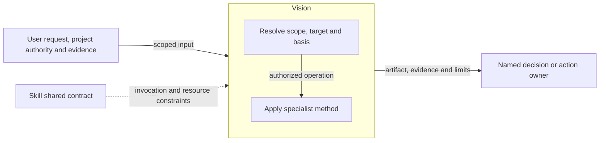
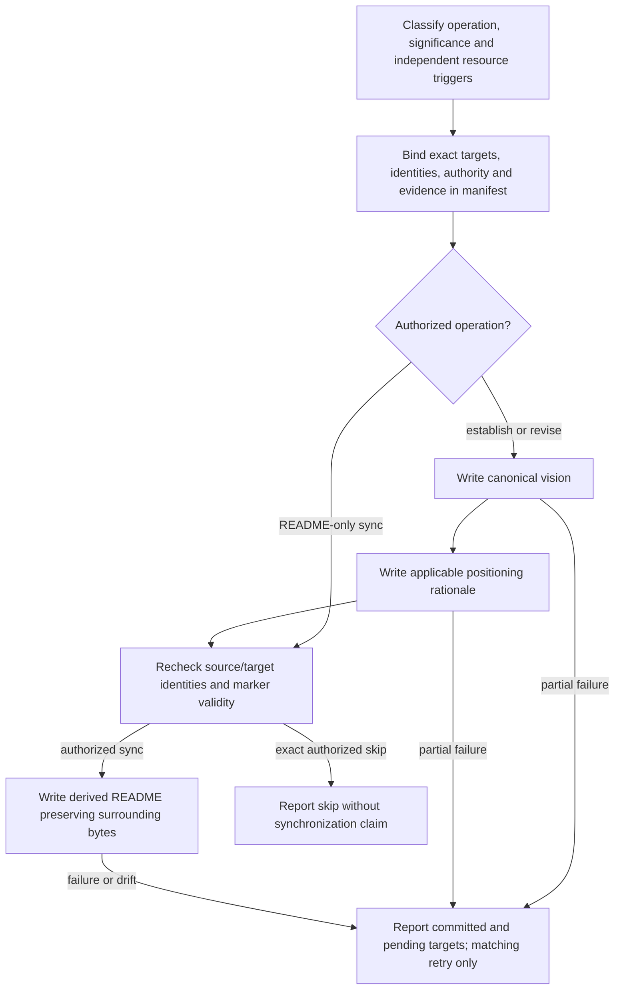

# Vision Design

Model validation contract: model-document-v1

## Responsibility and scope

Vision owns the existing `vision` capability’s scoped behavior, output and failure boundaries. Its detailed procedure below preserves the current specialist contract.

Parent: [Project Foundations](project-foundations.md). [Skill](../skill.md) retains shared invocation, evidence-access, resource and portability rules. [Workflow](../workflow.md) coordinates authorized activity; [Assessment](../assessment.md) owns independent judgment and reliance. This decomposition changes no public invocation, stored format or external permission.

## Requirements

| ID | Required behavior |
| --- | --- |
| VIS-SR-01 | Vision MUST distinguish establishment, bounded revision and README synchronization, with exact targets and owner-settled substantive scope. |
| VIS-SR-02 | Canonical VISION.md MUST own vision content; derived README writes MUST preserve marker, authority and surrounding-byte constraints. |
| VIS-SR-03 | Resource classification and operation manifests MUST bind targets, identities and basis before writes; interrupted completion MUST retain committed/pending outcomes and permit only matching retry. |

## Architecture Overview

The overview identifies the owned responsibility and external authority/evidence boundaries. Detailed behavior is in the contract sections below; output does not imply adoption or approval.

| View | Necessity and reason | Owning detail |
| --- | --- | --- |
| Context | No separate diagram: the overview and responsibility scope identify the request, shared contract and receiving owner without an additional external system boundary. | Responsibility and scope above. |
| Building Block | No separate diagram: classification and the specialist operation form one method; no separate internal subsystem is selected. | [Specialist contract](#specialist-contract). |
| Runtime | Necessary: authority, resource failures and partial or blocked outcomes must remain distinct from successful handoff. | [Runtime view](#runtime-view). |
| Deployment | No separate diagram: this is published guidance, not a separately deployed service. Artifact placement is governed by the specialist and project contracts. | [Skill Deployment](../skill.md#deployment-view). |

## Specialist contract

Vision owns canonical root `VISION.md`; README marker-bounded content is derived. `establish-vision` requires absence and establishment intent, `revise-vision` requires existing vision and bounded update intent, and `sync-readme` leaves vision unchanged. Classify editorial, substantive-nonmaterial or material-repositioning change; settle substantive scope with the owner before finalization. Strategic and README resources load independently, including late triggers. Positioning rationale changes only when its substantive basis requires it; copy structural assets only for creation or authorized full rewrite. Exact owner-approved skip does not claim marker validity or synchronization. Marker parsing rejects malformed/duplicated/reversed pairs; insertion requires authority and preserves surrounding bytes. Resolve target roles, prior/intended identities, authority and evidence in an operation manifest before writes or final skip; write canonical source, rationale, then derived README, rechecking identities before each dependent action. Partial completion reports committed and pending targets. Retry requires the same manifest and basis; lost or conflicting state cannot be adopted. No installation, ordinary README task or retired lowercase file establishes vision. Research and publication retain their separate authority.

## Interface vocabulary and outputs

The following public domains retain their existing meanings. Unknown values reject before consistency checks; recognized values still require the operation’s authority and prerequisites.

| Capability / independent axis | Supported values |
| --- | --- |
| Vision significance | editorial, substantive-nonmaterial, material-repositioning |
| Vision positioning action | unchanged, create, update, full-rewrite, blocked |
| Vision README action | synchronize-existing, insert-and-synchronize, skip, blocked |
| Vision asset context / result | not-required, create-or-full-rewrite / complete, partial-retry-required, blocked-before-write |
| Vision independent resources | strategic_authoring_context: false or true; readme_sync_context: required or skipped |

Vision reports operation/assembly/manifest, target outcomes and claims; establishment adds assumptions, open questions and positioning basis; revision adds changed sections, significance and causal evidence; README-only sync states canonical vision unchanged. Its six existing assemblies are VA0-readme-sync, VA0S-readme-skip, VA1-editorial-sync, VA1S-editorial-skip, VA2-strategic-sync and VA2S-strategic-skip, selected by the independent strategic/sync rules rather than result status.

## Runtime view

The specialist contract determines the permitted action and retry, including read-only or preparation-only operations. A successful artifact write does not grant downstream execution. Reconcile changed basis before dependent work and report partial effects truthfully.

### Boundary scan and acceptance scenarios

| Dimension | Requirement basis | Distinct outcome to demonstrate |
| --- | --- | --- |
| Input domain | VIS-SR-01, VIS-SR-02, VIS-SR-03 | An absent establishment target differs from an existing revision target; malformed marker pairs reject. |
| State/lifecycle | VIS-SR-01, VIS-SR-02, VIS-SR-03 | README-only synchronization leaves canonical vision unchanged. |
| Identity/authority | VIS-SR-01, VIS-SR-02, VIS-SR-03 | Substantive repositioning without settled owner scope cannot finalize. |
| Composition/path | VIS-SR-01, VIS-SR-02, VIS-SR-03 | Strategic and README resource triggers load independently, including late triggers. |
| Temporal/retry | VIS-SR-01, VIS-SR-02, VIS-SR-03 | A changed source identity interrupts derived writes; matching retry completes only pending targets. |
| Failure/recovery | VIS-SR-01, VIS-SR-02, VIS-SR-03 | Partial canonical/rationale/README completion reports actual committed and pending targets. |
| Compatibility/migration | VIS-SR-01, VIS-SR-02, VIS-SR-03 | Skipped README synchronization claims neither marker validity nor synchronized output. |
| External/environment | VIS-SR-01, VIS-SR-02, VIS-SR-03 | Missing packaged methods or required project authority stop dependent writes. |

## Architecture Decisions

| ID | Decision and rationale | Alternatives and consequences |
| --- | --- | --- |
| VIS-DEC-01 | Give Vision one explicit current owner while retaining shared Skill policy and the specialist’s existing authority boundaries. | Keeping unrelated support duties together obscures responsibility. Duplicating their details in Skill would create competing owners; scoped extraction requires reconciled navigation and review. |

## Quality and limits

Review outcomes against actual inputs, authority and observable effects; structural checks alone do not establish adequacy. Preserve historical subjects, existing public vocabulary and required resource behavior. Unresolved material authority or evidence gaps stop dependent claims rather than inventing a successful outcome.
