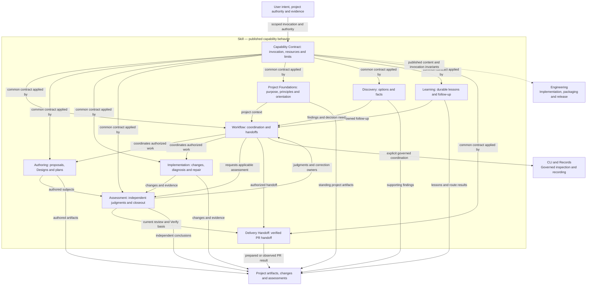
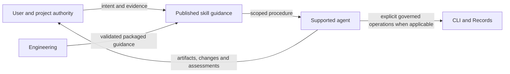
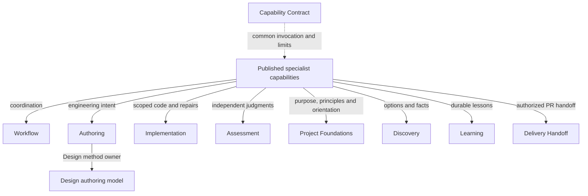
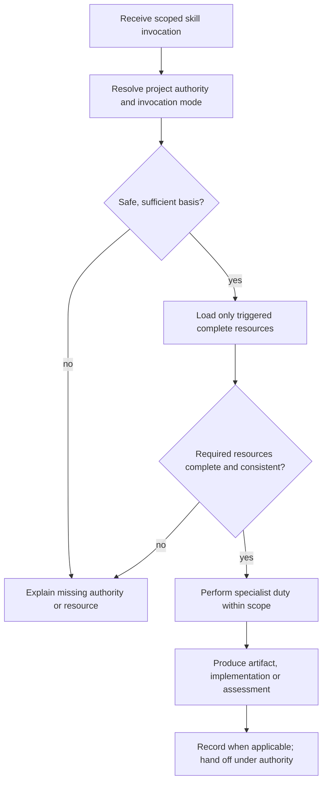
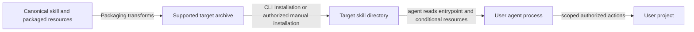

# Skill Model Design

Model validation contract: model-document-v1

For this repository’s [complete source retirement](../../changes/2026-09-14-retire-specs-and-stale-tests/source-disposition.md), current responsibilities are self-contained in the owning Designs. Original source-transfer inventories remain recoverable through [Historical provenance](#historical-provenance); their instructions to retain or amend legacy specs, architecture, activation state or retired engines are historical and superseded by this complete retirement. Source-qualified IDs and original judgments keep their original meaning; provenance is not a runtime input or current approval. Customer feature contracts and explicit portable resources remain supported under their own project authority.

## Introduction and Goals

Skill owns what the published capabilities accept, do and produce, including their applicability, handoffs, failures and claim limits. Common conventions and specialist behavior are composed under one product boundary. The CLI is optional for individual skill use; current governed recording requires its supported interface. Engineering builds, tests and publishes the skills without becoming a competing owner of their behavior.

Owning change: [repository cleanup](../../changes/2026-09-13-current-design-repository-cleanup/change.json).

Prior refinement: [independent parallel tests](../../changes/2026-09-13-independent-parallel-tests/change.json).

Original composition adoption: [three-model reconciliation](../../changes/2026-09-12-unified-validation-model/change.json).

Scoped simplification direction: [Simplify published skills using current Designs](../../proposals/2026-09-15-skill-simplification.md). The [inventory simplification](#inventory-simplification) below defines its current Design scope; earlier owning-change pointers and proposal-family judgments retain their original subjects.

## Reading guide

Start with the [submodel inventory](#context-and-scope) and [overview](#architecture-overview), then read the relevant [behavioral submodel](#behavioral-submodels). The detailed [specialist contracts](#remaining-specialist-contracts) follow those summaries. Implementation retains specialist sections here; Authoring, Project Foundations, Discovery, Learning and Delivery Handoff have dedicated model documents.

| Task | Detailed contract |
| --- | --- |
| Plan an implementation | [Plan](authoring/plan.md) |
| Implement a scoped change | [Implement](#implement) |
| Diagnose or fix a defect | [Bugfix](#bugfix) |
| Maintain CI | [CI maintenance](#ci-maintenance) and [bounded PR repair](#bounded-pr-ci-repair) |
| Establish or revise vision | [Vision](project-foundations/vision.md) |
| Map repository structure | [Project Map](project-foundations/project-map.md) |
| Capture lessons | [Learning](learning.md) |
| Prepare a PR handoff | [Delivery Handoff](delivery-handoff.md) |
| Establish principles or investigate direction | [Constitution](project-foundations/constitution.md) and [Discovery](discovery/discovery.md) |
| Check specialist values and result fields | [Interface vocabulary and outputs](#specialist-interface-vocabulary-and-outputs) |

[Requirements](#requirements), [acceptance scenarios](#boundary-scan-and-acceptance-scenarios) and [decisions](#architecture-decisions) retain their existing scope. The [capability adoption boundary](#capability-adoption-boundary) states the pilot's applicability; [historical provenance](#historical-provenance) identifies its original transfer evidence.

## Context and Scope

Users supply intent, project authority and the evidence needed by the selected capability. An agent follows published instructions and produces the scoped artifact, implementation, assessment or explanation. A skill is not an autonomous service; neither installation nor a valid output grants permission for another action. The inventory remains the existing published capabilities, not a new skill for every submodel.

| Submodel | Contract location | Product behavior |
| --- | --- | --- |
| Capability Contract | [Common requirements](#requirements) and [capability contract](#capability-contract) | Invocation, evidence access, resources, outputs, errors, portability and common limits. |
| Workflow | [Workflow](workflow.md) | Activity selection, prerequisites, handoffs, correction and continuation. |
| Authoring | [Authoring](authoring/authoring.md) | Produce proposals, coherent Designs and delivery plans from authorized intent. |
| Implementation | [Implementation](#implementation) | Implement, diagnose and repair scoped changes with appropriate proof. |
| Assessment | [Assessment](#assessment) and [Review and Closeout](assessment.md) | Judge exact work and evidence independently and report justified conclusions. |
| Project Foundations | [Project Foundations](project-foundations/project-foundations.md) | Compose purpose, governing principles and observed orientation. |
| Discovery | [Discovery](discovery/discovery.md) | Investigate materially unclear options and bounded factual uncertainty. |
| Learning | [Learning](learning.md) | Capture confirmed durable lessons and accountable follow-up. |
| Delivery Handoff | [Delivery Handoff](delivery-handoff.md) | Prepare and perform authorized PR handoff from current verified subjects. |

A child may be a named section here or a separately maintained model document. Detailed contracts are defined once at those locations. Capability IDs and existing resource paths remain stable; hierarchy alone does not rename public invocations. The historical proposal-family pilot improved only its named pair. Its SKL-SR-16–23 applicability and original judgments remain unchanged; the product behavior composition applies to the existing inventory without claiming an inventory-wide implementation audit.

SKL-SR-30–32 select a separate inventory simplification and an implement/code-review pilot. They preserve the existing capability contracts and do not extend the historical pair's approval or claim that the remaining skills have been assessed or improved.

## Architecture Overview

### Subsystem design graph

Skill owns these nine children's composition under [System's parent graph rule](../system.md#parent-graph-ownership). The submodel table above links each node to its contract; [Authoring](authoring/authoring.md) owns the composition of Proposal, Design Method and Plan. Workflow coordinates governed work, while individual capabilities retain their scoped invocation behavior. CLI and Engineering are external siblings whose shared relationships are owned by System.

Overview outputs are defined by the [behavioral submodels](#behavioral-submodels); [Context and Scope](#context-and-scope) owns user inputs, [Runtime View](#runtime-view) owns invocation behavior, and [Deployment View](#deployment-view) describes the packaged skill boundary. [CLI](../cli/cli.md) supports governed recording, while [Engineering](../engineering/engineering.md) realizes and delivers the published behavior. Individual skill use remains independent of CLI recording.

### Supporting-view decisions

| View | Necessity and reason | Owning detail |
| --- | --- | --- |
| Context | Necessary: User invocation, agent interpretation, governed recording and product delivery are distinct boundaries. | [Context view](#context-view) |
| Building Block | Necessary: Nine behavioral owners share one common capability contract and retain their specialist responsibilities. | [Building Block view](#building-block-diagram) |
| Runtime | Necessary: Portable invocation and governed recording load different resources and must preserve stage and permission limits. | [Runtime view](#runtime-diagram) |
| Deployment | Necessary: Canonical content, generated archives and target installations have distinct source and runtime roles. | [Deployment view](#deployment-diagram) |

## Architecture Constraints

The Constitution and approved owning models outrank retained legacy documents. `skills/` remains the only authored skill source; generated candidates are derived and never hand-edited. Operational projection manifests and templates stay at their current paths unless their actual consumers are coherently moved. This Design selects no such relocation.

Published text must work from the installed package and available project authority. Internal requirement IDs, source-displacement maps, selector paths, generator details and maintenance mechanisms belong here or in contributor evidence, not in shipped procedure. A project can have its own relevant specs and governance; portability does not deny access to them or substitute RigorLoop policy for them.

Only `rigorloop-records-v3` is supported runtime stored input in the adopted profile. Historical examples, approvals, names and retired recording procedures remain evidence of their original subjects, not a supported execution fallback. This constraint comes from Record Format and CLI, not from a new Skill schema.

## Architectural supporting views

These views elaborate the overview at the owning model boundary. Existing detailed contracts, scenario tables and external owners retain their authority.

### Context View

User invocation, agent interpretation, governed recording and product delivery are distinct boundaries. Detailed requirements and scenarios in this model remain authoritative.

### Building Block diagram

Nine behavioral owners share one common capability contract and retain their specialist responsibilities. Detailed requirements and scenarios in this model remain authoritative.

### Runtime diagram

Portable invocation and governed recording load different resources and must preserve stage and permission limits. Detailed requirements and scenarios in this model remain authoritative.

[Simplification resource selection](#simplification-resource-selection) applies this runtime view to the implement/code-review pilot. A later trigger returns to authority and resource selection before dependent action; an unchanged invocation does not reload unrelated procedures.

### Deployment diagram

Canonical content, generated archives and target installations have distinct source and runtime roles. Detailed requirements and scenarios in this model remain authoritative.

## Requirements

| ID | Required behavior |
| --- | --- |
| SKL-SR-01 | The common skill contract MUST have one current owner under the applicability and displacement boundaries here. Transfer of an unchanged obligation MUST preserve its prior applicability; it MUST NOT establish universal audit, normalization or customer adoption. |
| SKL-SR-02 | A published skill MUST expose a justified recurring capability, artifact, assessment, procedure or trust boundary. Its description MUST carry capability, triggers and relevant near misses independently of body headings or optional adapter metadata, without synonym dumping or hidden side effects. Existing applicable description length and metadata constraints MUST remain enforced. |
| SKL-SR-03 | A normalized skill MUST provide purpose, invocation scope, relevant inputs, executable procedure, output expectations, local handoff, stops and claim limits through its reviewed structure or approved equivalent. Lifecycle roles MUST identify the skill, stage, upstream input, downstream outcome and brief summary. Useful specialist sections and multi-role duties MUST NOT be flattened into a universal reasoning method. |
| SKL-SR-04 | A skill MUST expose the obligations owned by its specialist and shared policy sources without redefining them. Authoring, review, execution and support outputs MUST preserve their required scope, evidence, stops and claim boundaries. Progress, readiness and completion MUST remain distinguishable under Workflow; no output may imply another actor's approval or unauthorized continuation. |
| SKL-SR-05 | Public skills MUST default to customer-project mode, use relevant project-local or supplied evidence, and avoid requiring unavailable RigorLoop internals. They MUST use a safe authorized portable target/default or stop on ambiguity, without treating missing RigorLoop files as a customer defect or bypassing project governance. |
| SKL-SR-06 | Instructions MUST preserve output quality, required-rule coverage and clarity ahead of token reduction. Rules SHOULD have one authoritative location within the selected package; intentional safety repetition MUST be recognizable as a reminder and consistent. Closed vocabularies MUST preserve their owning spelling/membership and remain discoverable through the currently applicable reviewed presentation. |
| SKL-SR-07 | Evidence guidance MUST prefer bounded summaries, identities, paths and relevant excerpts, while requiring complete subjects where needed for assessment or behavior-changing decisions. Output caps MUST NOT substitute for selection or weaken check coverage, exit behavior, failure detection or required evidence. Materially omitted detail MUST remain obtainable. |
| SKL-SR-08 | A package with resources MUST map every resource and its load/use condition. COPY MUST resolve to assets/, READ to references/, and RUN to scripts/; paths MUST remain within the skill root, without traversal or implicit templates/ support. Script entries MUST state input, result/exit meaning and failure action. No-resource skills need no artificial absence section. |
| SKL-SR-09 | All mapped resources MUST exist in canonical and claimed derived packages, including resources untriggered in a particular invocation. Required transitive procedure MUST be available on the selected path. Missing required normative, schema, security, legal or non-obvious structural content MUST stop dependent work without invention; untriggered resources MUST NOT become runtime prerequisites. |
| SKL-SR-10 | Untransformed mapped resources MUST preserve skill-root relative path and raw-byte SHA-256 across claimed canonical, generated, packed and applicable installed boundaries. Timestamps MUST NOT affect parity. Any content/path normalization or rewriting MUST have a declared input, transformation owner, output path, expected identity and validation command; incomplete transformations MUST fail validation. |
| SKL-SR-11 | Runtime fallback MUST NOT validate a broken package. Only a redundant convenience resource whose entire needed contract already exists in the loaded skill may permit a bounded disclosed fallback; missing required methods MUST stop. Target invocation success MUST NOT substitute for package integrity. |
| SKL-SR-12 | Artifact-producing skills MUST provide the specialist's complete usable output shape through a compact skeleton or reviewed equivalent asset. Assets MUST remain structural, with applicable fields and no unfilled placeholders in emitted artifacts; they MUST NOT own hidden policy, triggers, judgments or lifecycle state. Existing asset metadata/fingerprint obligations retain their specific applicability. |
| SKL-SR-13 | Canonical content and adopted shared-source projections MUST remain the authored authority for generated guidance. Required copied projections MUST match their declared source and owner, preserving supported transformations. Missing sources, stale copies or incoherent candidates MUST prevent the affected conformance claim. Repair MUST update the actual source and regenerate derived output, not patch a customer's installation as the durable fix. |
| SKL-SR-14 | Mechanical checks MUST remain bounded, deterministic and explicit about the checked skill/resource and failure. They MUST distinguish instructions from negative examples, project-local paths and packaged resources; unknown closed values MUST fail before consistency checks. They MUST NOT claim semantic quality, complete reasoning or deterministic target-agent selection from keyword/structure checks. |
| SKL-SR-15 | Skill guidance, resources and evidence MUST NOT require exposing secrets, credentials, raw private environment data or unrelated machine-local information. Examples MUST be public-safe or synthetic. Package validation, installed availability and stored labels MUST NOT grant execution, release or customer-adoption authority. |
| SKL-SR-16 | For proposal and proposal-review only, the common entry path MUST establish capability, invocation classification, project authority and conditional resource selection before presenting profile-specific recording construction. Ordinary portable authoring and non-durable advisory review MUST not require CLI recording procedure. Required governed/durable paths MUST still receive the complete currently applicable procedure before dependent action. |
| SKL-SR-17 | For the pilot pair, detailed current recording procedure MUST live in their existing mapped recording references with complete context, inspection, revision/read identity, targeted-write, conflict, recovery, preservation and no-approval rules. The body MUST retain the applicability trigger, recording obligation, stop/claim limits and late-trigger reclassification. Relocation MUST not permit a missing body heading to bypass validation or select a retired profile. |
| SKL-SR-18 | The pilot pair MUST expose current specialist duties and adopted policy without requiring the reader to reconcile repeated historical judgment or unsupported recording paths. Existing classifications, authority boundaries and output obligations MUST remain complete; project-specific overrides MUST be explicit rather than imposed on every installation. No policy change is authorized by removing superseded instructions. |
| SKL-SR-19 | The pilot MUST demonstrate useful before/after improvement at the selected invocation and recording boundaries, preserving complete ordinary and exceptional paths. An audit, fewer words, or structural success alone MUST NOT establish improvement. Inconclusive or unfavorable results MUST receive an owned disposition before closeout or broader adoption; no numeric savings gate or universal target-runtime benchmark is selected. |
| SKL-SR-20 | Pilot validation and package consumers MUST reconcile the exact relocated procedure while preserving existing non-pilot checks and behavior. Pilot-only presentation requirements MUST be selected by the explicit two-skill scope, not global enforcement. Shared-source changes with uncontrolled extra consumers MUST return to Design or Delivery instead of expanding the pilot. |
| SKL-SR-21 | Adoption MUST retire every mapped duplicate current authority only after its obligation and decision have a complete destination, explicit supersession or justified retention. Useful original bytes and historical identities MUST remain recoverable under the Constitution retention policy, with current reliance self-contained; mixed and operational sources MUST retain clearly bounded ownership. This earlier pilot does not authorize whole-directory deletion; subsequent complete repository retirement follows SYS-SR-13 and ENG-SR-15 with Git-backed historical recovery. |
| SKL-SR-22 | Governance, System references, contributor navigation, exact-text validator consumers and source-retirement evidence MUST agree on the adopted owner before final reliance. Previous approvals MUST NOT be retargeted to changed subjects. Reviewed implementation, independent milestone and final whole-change review, and distinct successful Verify remain prerequisites under their existing owners. |
| SKL-SR-23 | Remaining adoption MUST identify actual remaining skills or bounded families, receiving owner, relevant differences and next decision through existing follow-up records. Completion of this pilot MUST NOT imply their improvement or universal conformance. |
| SKL-SR-24 | Every published capability MUST have one behavioral owner under the submodel inventory and expose its required inputs, scoped action, usable output, failure disposition and handoff; shared conventions MUST NOT substitute for its specialist behavior. |
| SKL-SR-25 | Individual skills MUST support their authorized portable output without requiring CLI recording. A governed recording trigger MUST instead load and use the supported CLI procedure, retain its prerequisites, and stop on missing or conflicting authority; portable output MUST NOT claim governed completion. |
| SKL-SR-26 | Published instructions that use the CLI MUST match its supported commands, selectors, request and response contracts. The agent MUST inspect scope and operation results, supply explicit decisions and handle conflicts without inferring approval from persistence. |
| SKL-SR-27 | Capability implementation MUST preserve the action and output boundaries in Authoring, Implementation, Assessment, Project Foundations, Discovery, Learning and Delivery Handoff. A shared helper, resource or parent model MUST NOT silently authorize a downstream activity or external action. |
| SKL-SR-28 | Plan assets MUST preserve the structural and metadata contract in Plan assets below; completed pilot-only scope, measurement and fixed historical-corpus obligations retire without weakening current plan completeness or package integrity. |
| SKL-SR-29 | Implementation, Project Foundations, Discovery, Learning and Delivery Handoff MUST preserve the specialist authority, identity, mutation, recovery and usable-output contracts at their declared owners. Shared guidance MUST NOT flatten these distinct behaviors or revive retired lifecycle formats. |
| SKL-SR-30 | Inventory simplification MUST account for every capability in the scope table below through a justified change or evidence-backed retention. Before removing or relocating guidance, contributors MUST identify its current owner, applicability, surviving instruction and affected consumers. A pilot result MUST NOT imply inventory completion; unresolved in-scope work remains allocated within this initiative. Existing policy, public invocations, closed values and output obligations MUST remain intact. |
| SKL-SR-31 | The implement/code-review pilot MUST establish scope, authority, invocation classification and resource triggers before detailed recording construction. Each selected path MUST retain complete specialist procedure, required evidence, stops, output and handoff under its existing owner. Recording selection MUST remain independent of planned or automated execution. Consolidation MUST preserve portable and adopted-policy paths without imposing repository internals or a new universal layout. |
| SKL-SR-32 | Acceptance of simplification MUST demonstrate a useful improvement on each changed entrypoint's selected reading paths and preserve its applicable exceptional paths. Semantic assessment, obligation coverage and existing resource/consumer checks MUST address the complete affected package. Fewer lines, moved prose or structural success alone MUST NOT establish improvement. Inconclusive or worse usability requires an owned correction or justified retention before completion; no token-cost tooling, score or length quota is introduced. |

## Behavioral submodels

### Capability Contract

SKL-SR-01–15 define the reusable invocation and resource contract. A capability establishes applicable project authority, selects sufficient evidence and resources, performs its bounded work and reports the actual output and limits. Missing required resources stop dependent work; missing RigorLoop internals in a customer project is normal when a portable invocation is valid. SKL-SR-16–23 retain the original proposal-family improvement scope. SKL-SR-24–27 establish the product-wide behavior composition without changing the stored record format.

#### Conditional resources

Under SKL-SR-04/08–12, the common skill body remains sufficient for its portable task: quality, classification, evidence precedence, stops, claims, handoff and every resource trigger. Named references specialize procedure without overriding universal rules or granting another owner's authority. Avoid duplicate loading for overlapping triggers; reread when changed or stale evidence requires it. Specialist loading rules and additional shared methods retain their own applicability. Required resources must be readable, contained and consistent. Missing, escaped, contradictory, stale or mixed-version resources stop dependent judgment, rendering, writing or handoff without reconstruction; untriggered resources neither load nor block. Engineering owns package generation and parity, while Skill owns these invocation outcomes.

#### Evidence access and proportional effort

SKL-SR-07 owns the shared evidence-access rule. Start with the specialist's default task evidence, then conditional evidence whose named trigger applies. Bounded discovery of paths, identities, headings, counts, metadata or relevant excerpts is not evidence expansion. Reading substantive evidence outside the default and triggered set requires a compact reason; emit that explanation only when expansion occurs. Required standing operating instructions remain applicable. Removing or downgrading an input requires an explicit rationale identifying its classification and replacement, rather than silently treating it as optional.

Prefer authoritative scoped state/context, known paths, IDs and diffs before broad searches merely to locate artifacts or state. Expand when evidence is missing, stale, contradictory or insufficient for the claim. Read the full file when it is the subject, its relevant section cannot be isolated safely, surrounding context can change the conclusion or the decision depends on the complete contract. Cost control never authorizes under-reading, weaker findings, omitted verification or unsupported readiness. Workflow and CLI own current governed-state access.

Proposal starts from user intent, relevant vision and governance, and the prior proposal when superseding it. Add orientation, existing contracts, routing context and code only when the direction depends on them. Proposal Review reads the complete proposal and original intent, relevant standing authority, and additional artifacts or implementation evidence the proposal relies on. Design owns downstream model authoring. Other skills retain their named evidence contracts. Keep a useful operating entry point and concise local reminders; load specialist procedures on demand without duplicating a full shared manual. Preserve mandatory inputs, independence, material findings, recording, authority, failure and handoff guidance when shortening a skill. Unclear milestone state blocks reliance rather than inviting inference from broad searches.

For broad proposals, classify each work item with its treatment and reason. The established treatments distinguish current core, a first-slice candidate, a same-slice dependency, a separate implementation slice, a deferrable follow-up, a separate proposal and exclusion. Equivalent clear treatments are acceptable when they cause no downstream ambiguity. Use the current allowed proposal sections. Preserve requested outcomes and route deferred work to the declared follow-up owner, not chat-only notes or Project Map. Assessment judges omissions, misleading classification and silent narrowing; deterministic validators do not infer breadth. Small single-decision proposals need no unnecessary scope table.

Token-cost measurement, token benchmarks and lifecycle summaries retire under [Validation's token-cost retirement contract](../engineering/validation.md#token-cost-feature-retirement); they are not maintained as optional skill duties. Preserve sufficient evidence, conditional loading and scope clarity. A runtime or efficiency claim needs observations relevant to that claim, not static token counts or a new mandatory metric. Use existing compliant guidance with a recorded no-change rationale instead of unnecessary edits. Published guidance remains project-portable, while canonical source, package mechanics and maintainer details stay in Engineering surfaces.

#### Proposal-family assets

Under SKL-SR-08/12, the proposal-family asset contract applies to proposal's `proposal-skeleton.md` and proposal-review's `review-result-skeleton.md` and `material-finding.md`. Assets contain structure: headings, field labels, visible placeholders and short fill hints. Policy, judgments, vocabulary definitions, review dimensions, routing, recording rules and authority remain in their current specialist owners. A template must be substantial enough to reduce copy errors or meaningful skeleton bulk; trivial rows remain inline.

Each asset carries metadata comments for template ID, owning skill, template status and maintained-alongside path; status is `normative` or `optional`. Placeholders must be visibly unfinished, such as bracketed names, all-caps fill markers, `TODO:` or angle-bracket fields. Reject empty required fields, realistic or generic filler, `lorem ipsum` and `your text here`. Emitted artifacts contain no unfilled placeholders. These metadata rules apply to this asset family and do not impose a universal fingerprint requirement.

The resource map uses `COPY`, identifies when to copy and what to fill, and requires completed output. Keep a compact output summary in the skill without duplicating the full skeleton. Conditional sections follow the current proposal content contract: clearly label optional material impacts or insert them only when triggered. If a full asset obscures required operating guidance, retain the necessary inline guidance and record the justified structure choice.

Validate proposal-review assets through an explicit allowlist of current structural fields and deterministic forbidden-policy label checks. Review result and finding labels follow their current owning contracts; a label does not grant its associated authority. Reject embedded severity policy, material-finding sufficiency, safe-resolution decision rules, recording-status policy, scope-budget review, vision-fit or standing-gate policy, and review-dimension guidance. Preserve valid-fill, missing/renamed-field, policy-leakage, metadata and package-parity regression protection. Extraction alone cannot change behavior or introduce broad semantic scoring.

### Workflow

The [Workflow child](workflow.md) owns coordination. Manual invocation produces only its scoped result by default. Governed continuation consumes explicit assessments and authoritative project state; it does not manufacture another actor's conclusion. The `route` capability applies this behavior. Every other capability uses its required handoff without acquiring route ownership.

### Authoring

[Authoring](authoring/authoring.md) owns the composition of [Proposal](authoring/proposal.md), [Design Method](authoring/design.md) and [Plan](authoring/plan.md). Each child owns its detailed behavior; Authoring owns their refinement and correction relationships. Workflow coordinates authorized activity and Assessment owns independent judgments. Common Skill requirements, public invocations and resource contracts retain their scope.

### Implementation

| Capability | Required input and action | Output and failure boundary |
| --- | --- | --- |
| `implement` | Implement one approved milestone or an explicitly bounded implementation request against its actual behavioral contract, with proof first where feasible. | Scoped code/tests and actual execution evidence for independent review; a specification gap returns to authoring instead of becoming an invented requirement. |
| `bugfix` | Establish the failing behavior and relevant authority, diagnose the cause and make the bounded correction. | Reproduction/regression evidence and a scoped fix or precise blocker; no widening of external permissions or unrelated refactoring. |
| `ci-maintenance` | Inspect the actual repository automation contract and coverage, execution, trigger, permission or maintenance defect. | A scoped CI/configuration correction and applicable validation evidence; an unobserved hosted check is not reported as passed. |

All three use the reusable criteria in [Validation](../engineering/validation.md#proof-quality-maintenance-and-evidence). They report commands actually run, preserve user changes and distinguish observation from review approval. Engineering Development defines this repository's invocation allocation; it does not redefine these capability behaviors.

### Assessment

[Review and Closeout](assessment.md) is the detailed assessment child. `proposal-review`, `design-review`, `delivery-review`, `code-review` and `verify` assess their exact direction, model package, delivery allocation, implementation and final integrated basis respectively. The reviewer retains independence from the work it judges. Findings identify actionable gaps and correction ownership; a passing structural check cannot replace semantic assessment. Only successful Verify owns the final closeout explanation under the adopted workflow. Assessment does not grant publication permission.

### Project Foundations

[Project Foundations](project-foundations/project-foundations.md) composes Vision, Constitution and Project Map: intended purpose, governing principles and observed repository orientation. Its child contracts preserve their distinct artifact and authority boundaries.

### Discovery

[Discovery](discovery/discovery.md) composes Explore and Research for materially unclear options and bounded factual uncertainty. These remain optional support capabilities whose conclusions return to the decision owner.

### Learning

[Learning](learning.md) owns Learn sessions, confirmed durable topics and accountable route-result recording. Recording a lesson does not adopt its proposed changes or complete its destination work.

### Delivery Handoff

[Delivery Handoff](delivery-handoff.md) owns PR preparation and authorized external handoff, including current verified identity and readback requirements. It does not own release publication or replace Assessment.

## Remaining specialist contracts

These contracts complete the selected repository source transfer; source-qualified clause groups are recorded in the owning cleanup disposition. They apply to the named capabilities, not every skill. Existing common resource, privacy, fail-closed vocabulary, scope and claim rules remain in force. Published procedures realize these contracts; incidental prose and completed migration instrumentation do not become additional policy owners.

### Implementation capability boundaries

#### Implement

Implement establishes the smallest scope-complete result: all in-scope requirements, authored and aligned surfaces, current boundary/incident failures and required focused proof are handled before Code Review. An unaffected surface needs a reason; known defects and missing required proof cannot be passed to review as later cleanup. This is first-pass completeness, not a promise of no reviewer findings. It changes no review, routing or external permission boundary.

#### Bugfix

Bugfix distinguishes `diagnose-only` from `fix`; conflicting intent permits diagnosis only. Bind exact repository, defect, authority, allowed paths/write categories, command authority, contract and evidence before mutation. Diagnosis changes no tracked or external state. Proof-authoring writes only authorized tests, fixtures and reproductions; production correction requires a failing automated proof, or established infeasibility plus a complete deterministic alternative with inputs, assumptions, expected observation and limits. Unknown causes authorize no production mutation; missing/conflicting/new behavior returns to Design, and test defects cannot weaken expected behavior speculatively. Run the identity-equal original proof after correction and the surrounding checks justified by the actual blast radius. Changed proof is a new basis, never the original test passing. Report actual commands, failures, uncertainty, identities and authority; changed implementation hands off to independent Code Review without autonomous downstream continuation. Governed evidence uses an exact authorized destination; bugfix does not edit another stage's artifacts or state.

#### CI maintenance

CI maintenance separates `create`, `revise` and read-only `review`, target kind, provider, concern and privilege. Creation requires an absent exact target; revision requires an existing exact identity. GitHub procedure applies only to GitHub workflow files; other providers require an exact project-native content, command, validation and write contract. External platform settings are review-or-route only. Privileged authoring requires an approved Design and independent review bound to repository, target, triggers/scope, permissions, credential/OIDC model, runner, environment, fork/secret policy, third-party actions and validation; omitted material choices do not come from a generic skeleton. Ordinary defaults use least privilege and protected secrets/fork boundaries. The risk-to-check resource owns semantic coverage placement; GitHub serialization consumes it and project-owned commands. Coverage-sensitive changes load that resource; narrow maintenance loads it only if coverage is affected.

CI file commits require no-clobber creation or identity-guarded replacement; a plain overwrite rename and read-back do not establish concurrency safety. Validate prepared content and read back committed bytes. If the environment cannot supply the required primitive, stop the mutation. Multi-target work first resolves every target and dependency, validates a safe intermediate ordering, and distinguishes independent, ordered-dependent and atomic-group-required work. The last class blocks before writes; no multi-file transaction is claimed. Partial outcomes identify completed and pending targets and their validity. Retries reassess all current identities. Local checks and ordinary authoring report hosted CI unobserved; only exact observed run/head evidence supports a hosted result. No authoring operation grants privileged execution, external mutation, readiness or publication.

### Specialist interface vocabulary and outputs

Under SKL-SR-29, the following current public domains are closed. Unknown values reject before cross-field consistency; a recognized value still needs its described authority and prerequisites. These are behaviorally meaningful parser/public contracts, not incidental words. Old semantic-rule/literal-migration ledger classifications, corpus sizes and token profiles retire as instrumentation; public operation and result values do not retire with them. Source-qualified IDs in the cleanup disposition remain historical identifiers.

| Capability / independent axis | Supported values |
| --- | --- |
| Bugfix command authority | not-required, current-bounded, absent-or-stale, invalid-or-ambiguous |
| Bugfix write authority | none, portable-request-bound, governed-scope-bound, absent-or-stale, invalid-or-ambiguous |
| Governed signal for Bugfix and PR | no-governed-signal, single-governed-candidate, invalid-or-ambiguous-governed-signal |
| Bugfix reproduction | reproduced, deterministic-alternative, not-established, conflicting |
| Bugfix contract basis | settled, resolvable-restoration, missing, conflicting, behavior-change-request |
| Bugfix test feasibility | feasible, infeasible-with-rationale, unresolved |
| Bugfix regression proof | failing-automated-test, deterministic-alternative, missing, conflicting |
| Bugfix cause support | supported, uncertain, conflicting |
| Bugfix root cause | implementation-defect, contract-gap, integration-mismatch, data-or-migration, race-or-timing, configuration-or-environment, test-defect, external-dependency, unknown |
| Bugfix action | stop-blocked, route-owner, continue-diagnosis, complete-diagnosis, resolve-test-feasibility, author-automated-proof, apply-production-correction, run-post-fix-validation, complete-fix |
| Bugfix terminal result | diagnosis-complete, diagnosis-incomplete, fix-applied, routed-to-owner, blocked |
| Implement profile | IP0-isolated, IP1-planned, IP2-planned-armed |
| CI concern | coverage, performance, caching, permissions, triggers, ordinary-security-hardening |
| CI target | github-workflow, project-validation-automation, related-platform-configuration, external-platform-state, invalid-or-ambiguous-target |
| CI provider | github-actions, project-native-other-provider, invalid-or-ambiguous-provider |
| CI privilege | ordinary-workflow-context, privileged-approved-design, privileged-design-required, invalid-or-ambiguous-privilege-context |
| CI structure | none, compose-from-skeleton, preserve-existing-structure |
| CI repair mode | ordinary-infrastructure, bounded-pr-ci-repair |
| CI batch relation / result | independent, ordered-dependent, atomic-group-required / complete, partial-blocked, blocked-before-write |
| CI invocation result / hosted observation | created, updated, reviewed, blocked / not-observed; eligible bounded repair may report pending, passed, failed for its exact run/head |

Bugfix chooses blockers and routing before mutation eligibility. A complete failing automated proof permits correction; conflicting proof blocks; feasible missing/alternative proof requires automated proof authoring; unresolved feasibility requires resolution; infeasible proof permits correction only with a complete deterministic alternative. Already corrected work with failed or identity-mismatched required checks blocks, with pending checks validates, and with all required checks passed completes. Terminal results distinguish completed/incomplete diagnosis, applied fix, routed ownership and blocked work; intermediate actions are not terminal results. Report operation/result, authority, repository/defect scope, actual commands, proof identity, unexecuted checks, uncertainty, changed surfaces and next owner.

Implement's planned reference loads for IP1/IP2; armed review/fix procedure requires IP2 with a valid planned milestone, and unplanned automation rejects. The result asset supplies a core group (status, completed scope, changed artifacts, tests, validation/results, blockers, handoff, limits), a planned group only for IP1/IP2 (change/milestone/plan identity, observed milestone/baseline state, milestone validation, commit and review handoff), and an armed group only for IP2 (automation mode/packet, fidelity routing, correction eligibility/cycle, rereview, pause/promotion and final-review dependency). Omit inapplicable groups and unfilled placeholders; output of observed state does not make the result asset its owner.

CI results report requested/actual operation, target kind, provider, privilege, concerns, structure, selected assembly, target identity, mutation outcome, validation evidence, blockers and hosted observation. The nine procedural assemblies remain CIM0-narrow-review, CIM1-coverage-review, CIM2-ordinary-github-create, CIM3-narrow-github-revise, CIM4-coverage-github-revise, CIM5-structural-github-revise, CIM6-project-native-authoring, CIM7-privileged-approved-create and CIM8-privileged-approved-revise. Universal classification determines the assembly; coverage and structural resources add independently and late triggers load before dependent work. Unknown assemblies cannot fall through as ordinary review.

### Bounded PR CI repair

This is the existing narrow exception within CI maintenance, not a general automatic approval. Admission requires an already-open PR, exact failing hosted run and head, current applicable Code Review and Verify evidence, no open material finding, already-authoritative commands and existing authority for every external mutation. The correction only restores already-approved behavior. Changes to requirements, architecture, runtime implementation, dependencies, lifecycle schema/routing, review outcomes or another decision-bearing contract reject this mode and return to the earliest affected owner; ambiguity cannot preserve readiness.

Inspect the exact failure, make the smallest correction, run its focused check and the exact repository-owned PR check, prefer one coherent repair commit, push only under existing authority and observe the replacement run at the actual head. Preserve current review/explanation/Verify/lifecycle evidence only when its decision basis remains unchanged under Assessment; a CI failure alone does not require a new review round, explanation, Verify report, change record or lifecycle-only commit. A missing prerequisite or unobserved replacement outcome is reported truthfully. This exception neither grants external authority nor weakens current checks.

## Solution Strategy

Use one common content contract and retain specialist composition. A package is its `SKILL.md` plus its mapped resources; it is not just a short entry file. The entry file supplies enough information to select the correct procedure safely. Conditional references provide complete procedure after that selection. Assets supply structure after the specialist has determined applicability. The source contract does not prescribe the same reasoning sequence for an author and an assessor.

For the original proposal-family pilot, no new general shared recording resource is introduced. Its two existing recording references are sufficient destinations, and their respective authoring/review commands remain distinct. That pilot does not change other skill bodies or the shared Review and Closeout application. Keep its frontmatter descriptions and existing proposal/review assets unless an implementation finding demonstrates a separate necessary correction. Their existing routing and extraction are not new deliverables.

### Inventory simplification

The [current proposal](../../proposals/2026-09-15-skill-simplification.md) selects all 19 published capabilities. This is a simplification of their presentation under current Designs, not a change to workflow policy, review gates, permission, public invocation or stored formats. `implement` and `code-review` are the selected first slice because their entrypoints combine repeated operating guidance with conditional recording and materially different execution/review duties. Other skills remain in the same initiative; they are not declared defective or forced into the pilot's arrangement.

| Capabilities in scope | Behavioral owner | Required distinction during simplification |
| --- | --- | --- |
| implement | [Implementation](#implementation-capability-boundaries) | Isolated, planned and armed profiles; scope completeness and proof before review. |
| code-review | [Assessment](assessment.md#specialist-assessment-responsibilities) | Independent actual-diff assessment; advisory, milestone and final whole-change scopes; findings before correction. |
| proposal, design, plan | [Authoring](authoring/authoring.md) and its children | Direction, engineering decisions and delivery allocation remain separate artifacts and responsibilities. |
| proposal-review, design-review, delivery-review | [Assessment](assessment.md) | Preserve each subject, judgment method, durable-evidence trigger and approval boundary. |
| route | [Workflow](workflow.md) | Semantic routing, current authority, supported automation and correction ownership remain distinct from CLI observations. |
| verify | [Assessment](assessment.md#specialist-verification-interface) | Scoped proof, final readiness and successful final explanation keep their separate applicability. |
| bugfix, ci-maintenance | [Implementation](#implementation-capability-boundaries) | Diagnosis/proof/correction and CI review/authoring retain their distinct identity, write and recovery limits. |
| vision, constitution, project-map | [Project Foundations](project-foundations/project-foundations.md) | Purpose, governing principles and observed orientation retain their own authoring and output contracts. |
| explore, research, learn | [Discovery](discovery/discovery.md) and [Learning](learning.md) | Optional support and durable learning do not approve their destination decisions or become mandatory stages. |
| pr | [Delivery Handoff](delivery-handoff.md) | Verified preparation and separately authorized external mutation retain their evidence and permission boundaries. |

For every changed skill, contributor evidence maps coherent obligation groups from the exact original package to their retained owner and destination. Record why deleted prose is duplicated or superseded, and why intentional reminders remain useful. Retained skills need an assessment of their actual package and a no-change rationale, not merely a short line count. Use existing Design, delivery allocation and stage evidence surfaces; no new registry, per-sentence ledger, public reporting duty or permanent historical corpus is required. Delivery allocates the full inventory and affected shared consumers; a newly discovered behavior or architecture decision returns to its owning Design before dependent implementation.

#### Presentation and preservation

Keep a useful local operating guide: capability and near misses, project authority, required inputs, core sequence, resource triggers, usable output, handoff and essential stops. Merge repeated descriptions where one clear instruction supplies the same obligation. Keep mandatory evidence distinct from conditionally applicable evidence; shortening an input list cannot silently downgrade a prerequisite. Preserve normal Markdown readability and complete-subject reading when the decision requires it.

Conditional references contain substantial procedures that are needed only under their stated triggers. Assets supply structure after applicability is decided; they do not own policy. Shared instructions continue to derive from their current authored sources and must remain usable inside each installed skill. Do not replace local guidance with links to this repository's internal Designs or another skill's installation directory. Do not move an unconditional compact rule to a new reference merely to shorten the entrypoint.

For implement/code-review, this Design selects an equivalent to the generic heading layout: retain `Workflow role` near the top, `Resource map` and `Expected output`; organize scope, authority and inputs before a single operating sequence, preserve specialist sections, and consolidate repeated output/handoff/stops/claims explanations. The functional coverage in SKL-SR-03/04/07/12 survives even when several generic headings become one coherent section. This equivalence applies only to the selected pair. Other skills retain their existing approved layouts until their owning Design selects a justified equivalent.

#### Pilot realization

| Observed surface | Selected treatment and surviving responsibility |
| --- | --- |
| Both entrypoints place `Explicit recording` before their role or classification and repeat scope, evidence, stops and handoff across several sections. | Put role and applicability first; retain one complete task sequence and short local recording boundary. Move the full conditional CLI construction into the skill-local recording references below. |
| implement's quick guide and input sections mix planned package inputs with isolated work; later profile rules distinguish them. | Present ordinary evidence and conditionally required planned/armed evidence together with the existing IP0/IP1/IP2 authority distinction. Preserve proof-first execution, first-pass completeness, unchanged-surface rationale and review handoff. Current project-selected Design and delivery contracts determine document inputs; a retained customer feature/test contract is not made universal or removed from an adopting project. |
| `planned-milestone-implementation.md` owns milestone inspection, execution, commit and handoff; `automated-review-correction.md` adds separately armed procedure. | Keep their existing paths and triggers. Neither is a sufficient destination for all recording instructions: requiring recording does not establish either milestone or automation authority. |
| code-review repeats review isolation, material-finding fields, judgment and milestone handoff, including explicitly historical routing language. | Retain its ten specialist checklist dimensions, published-skill semantic review, actual contributor separation, direct-proof challenge and final whole-change distinction. State current adopted judgment/ownership once through the existing assessment applications; retain a complete applicable portable policy path. Source wording suggesting that Code Review itself closes milestones cannot override Workflow ownership. |
| Existing implementation result, review result and material-finding assets provide output structure. | Keep the existing paths and required fields; retain profile/group applicability in procedure. Remove repeated full output instructions only after field coverage is established. The proposal-family metadata regime is not extended to these assets. |
| Boundary scan, review reliance, test quality/maintenance and evidence-selection instructions already have shared owners. | Preserve their existing source ownership, adoption conditions and complete local selection guidance. No shared-source wording change is selected for this pilot; a necessary correction must include every actual affected consumer under its owner. |

#### Simplification resource selection

The two new paths below are selected implementation destinations, not existing or already-qualified resources. The entrypoint retains each load condition and the obligation to stop before dependent action when required content or authority is unavailable.

| Invocation condition | Required presentation and resources |
| --- | --- |
| implement with a clear isolated request | Keep IP0 core execution and result usable without planned/armed procedure or invented lifecycle state. Apply only independently triggered shared methods or recording. |
| implement with valid planned authority | Load the existing planned-milestone reference for IP1/IP2; retain approved package, exact milestone, proof, commit and handoff requirements. A change identifier alone does not establish this profile. |
| implement with matching supported armed authority | Load the existing automation reference in addition to planned procedure for IP2. Missing planned authority or reliance on a retired automation adapter stops; extraction does not add an execution backend. |
| Either pilot with adopted record format and an explicitly selected change requiring its current recording profile | Load `references/governed-implementation-recording.md` for implement or `references/governed-code-review-recording.md` for code-review. Each retains complete scoped context, subject inspection, transport dispatch, record contract, revision/reads, targeted operation, applicability, conflict/recovery and no-approval rules. Evidence recording stays implementation-owned; review/finding recording stays reviewer-owned. |
| code-review advisory or formal assessment | Keep exact target, sufficient evidence, independence, judgment, findings, recording obligation and isolation visible in the body. Formal review requires current exact authority and durable evidence; advisory use cannot settle a gate. Adopted assessment/reliance methods retain their own triggers independently of recording and automation. |
| code-review with formally armed supported automation | Add the existing `workflow-managed-automated-review.md`; preserve its independence and correction restrictions and unsupported-adapter stop. Manual review does not acquire those prerequisites. |
| A recording, boundary, maintenance or other existing trigger becomes true later | Reassess authority and load its complete method before dependent judgment, mutation or handoff. Missing untriggered resources do not block unrelated runtime work, but still fail package integrity. |

The recording references preserve the existing profile rather than introducing a new recording mode or treating every durable advisory result as a governed write. Project-selected recording outside that profile retains its own authority. Ambiguous or conflicting governed signals stop affected recording; they are not a license to invent a store or silently fall back to portable mutation.

#### Consumer reconciliation and proof boundaries

The pilot's canonical bodies, new references, unchanged relied-on assets and shared methods form the assessed packages. The existing `scripts/lib/validation/skill_validation.py` selects proposal-family recording references but otherwise permits an absent inline recording heading to skip profile checking. Its installed-placement and plan-surface helpers also branch on that heading. Reconcile these actual readers with the pilot's selected paths and equivalent layout; removing a heading must neither bypass checks nor select retired placement. Keep non-pilot selection intact. Existing generators and package checks must carry both references with the current resource-path and byte-parity rules; no new transform, manifest schema or installer is selected.

Mechanical proof must distinguish a correctly relocated profile from missing, unreadable, escaped, unmapped, stale or wrongly selected procedure; words in an unrelated file cannot satisfy the selected path. Preserve unknown-value rejection before consistency checks for any affected closed selector. Reconcile incidental wording assertions while keeping their required behavioral protection. [Validation](../engineering/validation.md) remains the owner of check selection and adequacy criteria, including whole changed-set classification; no Markdown or advisory-evidence exception is introduced here.

Semantic assessment compares the original and revised selected reading paths: can a reader identify the task and authority before recording detail, reach every applicable instruction, perform the specialist task and produce a truthful handoff without resolving competing guidance? A package with a shorter body but additional unnecessary indirection does not establish improvement. Record a concrete before/after explanation and preservation basis for changed skills, or a reasoned retention; this is independent published-skill review under Assessment, not a new runtime benchmark or gate. Delivery allocates concrete checks and observations, including the integrated implement-to-review handoff and package boundaries.

The existing Context, Building Block, Runtime and Deployment views remain necessary: external owners, capability composition and distribution boundaries are unchanged, while the runtime view now makes resource failure explicit. The tables above refine internal instruction placement. No new service, shared runtime dependency, model, public output field or normative example is introduced. The existing proposal-family realization below retains its own scope.

Assessment's RC-SR-01–06/10–18 already own the preserved scope, independence, findings, reliance and closeout outcomes; its model needs no policy amendment for this presentation change. Workflow retains routing and automation authority, CLI/Records retain commands and persistence, and Packaging retains the source-to-candidate contract. Their interfaces and existing examples are unaffected. Validation's existing resource and semantic-assessment criteria govern the required consumer corrections without a new validation policy. Any later change to one of those relationships requires reconciliation with that owner rather than relying on this unaffected disposition.

### Inspected pilot and selected before/after outcomes

This section and the original proposal-family realization below retain that pair's scope. The new implement/code-review selection is defined in [Inventory simplification](#inventory-simplification). The exact inspected files and hashes belong to the authoring evidence. The following is stable engineering rationale, not a claim that the proposed result has been implemented or executed.

| Subject and inspected condition | Selected change and observable benefit | Preservation boundary |
| --- | --- | --- |
| Both SKILL.md files place the full Explicit recording profile before their Workflow role and invocation classification. The profile is conditionally worded but physically unavoidable on the common read path. | Put role, task scope and classification first. Keep a short recording boundary in the body and move detailed construction procedure into the existing triggered reference. A portable reader can determine the artifact/review task and required resources without first traversing governed storage instructions. | Preserve the current stored-contract rule when applicable, no implicit mutation authority, unsafe/malformed-governed-signal stop, exact target and safe portable behavior. |
| proposal's governed-proposal-authoring reference says to use the parent's scoped read procedure; the parent contains that procedure. | Make that reference complete after the move, including new-root creation only with authority and targeted proposal linking. The selected governed path has no missing-parent dependency. | Parent retains classification and resource failure stops; no new change creation on a portable path. |
| The inspected reference universally prohibited a reverse ownership pointer, conflicting with project-specific artifact conventions. | State that project governance determines any stable ownership pointer; mutable state remains solely in the record. For this repository, proposal content follows the pointer-free convention above. Preserve another project's explicit pointer requirement or prohibition. | This is authority reconciliation, not a new universal proposal field or change to portable output. Retain seven required sections and conditional impact. |
| proposal-review repeats historical status-selection and scope-failure return rules even though its top-level adopted-policy notice replaces those rules. Isolation/recording/claim rules also appear in several sections. | Keep specialist dimensions, classifications and local duties once; use the already-required review-assessment/review-reliance resources for adopted combined-condition policy. Remove superseded instructions from the current adopted path and preserve any independently supported portable policy explicitly. | No review judgment, precedence, formal recording duty, finding field, separation or isolation change. Do not remove procedure still needed by an unadopted portable project merely because this repository adopted a policy. |
| Existing proposal and review assets already supply the correct structural output and conditional groups. | Retain all three assets and their COPY selection. The improvement is navigation and procedure coherence, not another extraction or a new artifact. | Artifact fields, optional sections/groups and material-finding identity remain under specialist ownership. |

The pointer mismatch is resolved by existing precedence, not a request to change the approved direction. The review-policy simplification must preserve a complete portable policy path: either current generic specialist rules remain explicitly scoped to projects without adopted Review and Closeout, or its applicable project-provided policy is available. A blanket instruction to read this repository's model is prohibited.

## Building Block View

| Surface | Responsibility and selected treatment |
| --- | --- |
| skills/proposal/SKILL.md | Retain description, proposal contract, scope gates, classification and claim limits; improve ordering and use the governed reference for detailed recording. |
| skills/proposal/references/governed-proposal-authoring.md | Receive the complete authoring recording procedure and the project-governance pointer qualification. Keep its existing path. |
| skills/proposal-review/SKILL.md | Retain all specialist dimensions, mode pairs, predicates, durable triggers and stops; clarify adopted versus portable policy and route detailed recording through the existing reference. |
| skills/proposal-review/references/proposal-review-recording-and-settlement.md | Receive complete scoped v3 read/write/conflict/recovery procedure. Despite its historical filename, it does not acquire settlement or routing authority beyond current owners. |
| Proposal strategic gates and review conditional gates | Preserve conditions, scope-budget vocabulary and follow-up duties; no content change selected. |
| Both requirement-to-delivery-model copies; review-assessment and review-reliance | Preserve bytes and shared-source ownership under templates/shared. No common-source edit is needed for this pilot. |
| proposal-skeleton, review-result-skeleton and material-finding assets | Preserve structure and current metadata. No new resource or fingerprint regime is imposed. |
| scripts/skill_validation.py and tests/skill/test-skill-validator.py | Select the existing two recording-reference paths for pilot validation; validate complete selected procedure and all body triggers. Retain non-pilot profile checks and unrelated validators. |
| tests/engineering/packaging/test-adapter-distribution.py | Its targeted-profile archive comparison currently reads SKILL.md except for design's reference. Select the two pilot references as the recorded-profile subjects while retaining all supported adapters, inventory and raw-byte checks. |
| Existing generators, schemas, shared manifests and package metadata | Preserve formats and transformations. Regenerate candidates under existing tooling when implementation changes canonical bytes; do not edit tracked public adapter bodies. |

### Validator composition

The current `validate_targeted_recording_profile` returns no errors when the `Explicit recording` body heading is absent. Moving the section must not exploit that early return. For each of the two named skills, the validator must independently require its mapped recording reference and inspect the complete required profile there. Missing, unreadable, escaped, malformed or unknown selected resources fail explicitly. Body classification and resource-map obligations remain checked separately. A token found only in an unrelated resource is not coverage of the selected path.

The installed review-placement validator currently recognizes the current recording path through the same body heading. Its pilot selection must resolve current v3 procedure without falling into retired Markdown placement checks after relocation. Non-pilot path selection remains unchanged. No new serialized registry is required: the existing validator's explicit skill/resource mapping is enough. If a new closed constant is introduced, unknown values must have a negative regression; positive presence alone does not demonstrate fail-closed behavior.

Literal source-preservation tests in `tests/skill/test-skill-validator.py` currently name Skill Contract clauses, headings and invariant prose. At adoption, each affected assertion must be assessed against the displacement map: move its useful protection to the new owner or retire only its obsolete text-identity oracle. Keep behavior/regression protection and unrelated historical-format fixtures. This Design neither deletes tests nor approves a test-count target.

## Runtime View

For ordinary portable proposal authoring, the agent resolves the request and target, applies the project/scope predicates, reads only triggered guidance, and copies the existing proposal skeleton. No exact owning change is invented. A governed signal, including a malformed one, changes the authority assessment rather than silently falling back to portable writing. An authorized governed invocation loads the complete authoring reference before context, identity and targeted recording operations.

For an isolated advisory review, the assessor reads the complete proposal, compares original intent and applicable policy, fills applicable result groups, and stops without automatic handoff. A late material finding activates durable recording before a recording claim or dependent correction. Formal review still requires independent contributors and durable evidence even when isolated. Where adopted combined-condition policy applies, it comes from the existing assessment resource; the skill does not choose a second precedence rule.

A missing untriggered recording reference need not stop a purely portable invocation, but the distributed package remains invalid. Once governed or durable procedure is needed, missing content stops that dependent path; the agent does not reconstruct it from examples or memory. A complete reference with an unavailable CLI or unresolved project authority produces an authority/environment stop, distinguishable from a missing-package stop. CLI conflict/recovery semantics are exposed without being redefined.

## Deployment View

Canonical skill bodies and local resources feed the selected distribution producer. Before Distribution adoption, the existing local-mirror and three-target generation contract remains applicable; after adoption, Codex and Claude Code packages carry the full mapped package, including conditional resources, through the retained adapter builder. No second runtime mirror is required for resource-integrity proof. Existing adapters may transform bodies under their reviewed invocation contracts; untransformed resources retain raw bytes. No live installation, registry publication, target-agent execution or new installer implementation is selected.

Current package proof ends at Gate A/B and any independently applicable RigorLoop-owned filesystem materialization check, as selected by the validation owner. A file move cannot reinstate obsolete all-target runtime or transcript requirements. Candidate metadata may need regeneration when package bytes change; versioning/publication remains separately owned.

## Crosscutting Concepts

### Common contract details retained by consolidation

The adopted `discovery-support` shared-policy family remains supported for Explore and Research. Its copies preserve their declared canonical source and subordinate policy ownership under SKL-SR-13; initial shared-block rollout inventories do not prohibit subsequently approved projections.

The table defines the surviving presentation, portability and resource-enforcement contract under SKL-SR-02–14; source citations identify provenance, not a requirement to reconstruct the rule from historical prose. A normalized skill is one brought into the common structure contract by its approved adoption; a readability-profile skill is one brought into `skill-readability-v1`. Adoption or a declared profile establishes the obligation even if a defective file omits its marker. Absence of a marker is not an exemption for an already-adopted skill. A still-unnormalized skill does not acquire the profile through this consolidation. A reviewed equivalent must identify its actual approving owner and scope; neither existing bytes nor a passing validator constitutes approval of an exception.

| Surviving requirement | Applicable population | Approved equivalent or supersession and source disposition |
| --- | --- | --- |
| Frontmatter MUST contain non-empty string `name` and `description`. Normalized published skills MUST additionally include non-empty `version` and `schema-version`. Where the readability profile is selected, `schema-version` MUST be `skill-readability-v1`; unknown values fail explicitly rather than falling through to another profile. | Basic name/description fields apply to published skill metadata. The additional required fields apply to normalized published skills, including the pilot pair; the selected readability profile determines its marker. | Skill Contract R29g makes the version fields required, superseding Readability R32's earlier SHOULD for that population. R29h and Readability R33 retain the selected marker; this initiative selects no new version. Readability R34's initial pilot version assignment is historical, not a mandate to reset current versions. Consumers may ignore the additional fields without behavior change (R35); metadata schema representation remains with its existing owner. |
| `description` MUST state capability, trigger contexts and important near misses where competing skills or false positives exist, MUST NOT be a synonym dump, and MUST be at most 1024 characters. Essential selection logic MUST NOT exist only in body headings or optional `when_to_use` metadata. | Published skills brought into the description-routing contract; existing unnormalized populations keep their approved exemption until adoption. | Skill Contract R3m–o and R29–f. Optional adapter metadata and useful body summaries remain allowed, but are not substitutes for description coverage. No pilot exception to the maximum is selected. |
| The normalized structure MUST expose `Purpose`, `When to use`, `When not to use`, `Inputs to read`, `Outputs`, `Handoff`, `Stop conditions`, and `Claims this skill must not make`, retaining necessary specialist sections and all applicable duties for a multi-role skill. Invocation-blocking conditions SHOULD be surfaced before artifact generation/execution. | Normalized skills without an approved replacement layout; the functional duties remain required when a replacement layout is selected. | Skill Contract R3–c, R10 and R31e. The [proposal procedure](authoring/proposal.md#proposal-procedure) and [Proposal Review procedure](assessment.md#proposal-review-procedure) preserve the selected common bodies plus triggered references with their named responsibilities; they replace the generic heading layout for those skills, not its scope/stops/claims coverage. Subsequent proposal and recording amendments continue to determine their current specialist content. The implement/code-review equivalent is separately selected in [Presentation and preservation](#presentation-and-preservation); it preserves functional coverage without extending the original pair's approval. |
| A `Workflow role` block MUST be near the top and contain `role_name`, `stage`, `upstream`, `downstream`, and a plain-language `summary`. `role_name` MUST equal the skill name. The summary MUST occupy no more than two lines of normal prose in canonical source. The block MUST make received input, produced outcome and downstream claim limits clear. | Readability-profile skills, under Readability R11–15; lifecycle skills producing/closing artifacts, gating stages, handing off or claiming downstream readiness also require the role coverage under Skill Contract R30/a. | Skill Contract R30b permits omission for non-lifecycle skills outside a separately adopted role-block requirement; it does not waive Readability R11 for skills already in that profile. No later amendment identified for this pilot supersedes its required fields or two-line summary limit. |
| The role-block `stage` MUST be exactly one of `authoring`, `review`, `execution`, `verification`, `handoff`, `support`, or `periodic`; unknown values MUST fail before role consistency checks. | Readability-profile role blocks. | Readability R14 and SKL-SR-14. This is the skill-role vocabulary, not the separately owned CLI activity-stage vocabulary; the stored-format version does not replace these values with CLI stages. |
| Every closed vocabulary used by a readability-profile skill MUST have exactly one authoritative fenced block or table in its selected package; its values MUST NOT be re-enumerated in multiple prose locations. Spelling, capitalization and membership MUST match the governing vocabulary unless an approved owner explicitly changes them. | Readability-profile skills and the vocabulary-bearing body/reference selected for each invocation. | Readability R16–18 originally placed the definition in the skill body. Proposal simplification R6/35/39 and Proposal Review simplification R18/20/22 permit the detailed scope vocabulary in its triggered reference; body triggers remain visible. Asset extraction alone does not authorize moving enum policy into assets ([proposal-family assets](#proposal-family-assets), formerly PFA-R3). Under adopted Review and Closeout, its assessment resource owns judgment precedence; historical alternate rules are not a second current definition. Structural fields may refer to the owning vocabulary without re-enumerating it. No blanket exemption from vocabulary presentation is selected. |
| Long enumerations with named fields, comparisons, review dimensions, required sections or classification values MUST use a table. An ordered list MAY remain when sequence is the contract and table fields would reduce clarity. | Readability-profile skills. | Readability R19–20. This preserves the ordered-procedure exception rather than requiring every list to become a table. |
| Each rule, lookup order and guideline SHOULD appear once at the earliest point where it is needed. An intentional safety repetition MUST identify itself as a reminder and MUST NOT conflict. Workflow-wide rules MUST be visibly identified as shared; local rules MUST be distinguishable by section, label or wording. | Readability-profile skills. | Readability R21–24. An adopted-owner application section or explicit scoped resource reference can identify the shared authority; it does not transfer that owner's policy into Skill. Conditional loading changes the earliest required location, not the obligation to supply the complete rule when triggered. |
| Expected output MUST be summary-first, using a compact `Result` with `Skill`, `Status`, `Artifacts changed`, `Open blockers`, and `Next stage`, or an explicitly reviewed equivalent. Relevant review/evidence/follow-up fields MAY supplement it. | Normalized skills. | Skill Contract R11–c expressly permits equivalent summaries. The pilot's approved proposal output and proposal-review result asset are the equivalents; do not add generic fields to the proposal artifact or replace its specialist review fields. Workflow and Review and Closeout still own status/claim meaning. |
| Artifact output MUST have a complete fillable skeleton covering all required sections/fields, including applicable review-recording fields. The default is a fenced skeleton near the bottom; a mapped reviewed asset MAY supply the full layout with a compact body output summary/COPY instruction. Emitted output MUST omit untriggered groups and contain no unfilled placeholders. | Artifact-producing readability-profile/normalized skills; only groups applicable under the specialist's current contract are required. | Readability R25–28 is qualified by Skill Contract R34's reviewed equivalent and the later PFA-R14 asset pattern. The pilot retains its three existing assets. The Simplified Proposal Contract SPC-R1–6 replaces obsolete proposal status/routine Vision-fit sections with seven sections and conditional material impact; these historical fields are not reinstated by skeleton preservation. Project governance still decides any stable pointer. |
| Existing artifact requirements, item formats, coverage and output obligations MUST be mapped to their destination before a new or relocated skeleton is accepted; examples MUST NOT substitute for the normative shape. Asset metadata and fingerprint checks apply only to the exact asset family that adopted them. | Changed artifact-producing skills; plan-specific and proposal-family asset populations retain their separately scoped obligations. | Skill Contract R34a/c preserves output coverage. [Plan assets](authoring/plan.md#plan-assets) preserves R37–45's three assets/fingerprints; The Proposal-family assets section above preserves PFA-R29–31 metadata. These are explicitly retained specialist definitions, not definitions retired in favor of a vague common reference or new universal fingerprint requirement. |
| Public portability validation MUST cover canonical skill files shipped to users, generated public skill copies and public adapter skill copies. It MUST NOT apply to internal specs, plans, tests, generator scripts, maintainer documentation or repository-only contributor documentation. Those internal surfaces MAY retain repository implementation details. | Published skill text and its public copies; the excluded contributor surfaces do not acquire public-text lint through this transfer. | Skill Contract R3d–l and R33–c. Checks MUST be narrow and phrase/path based, rejecting unqualified required RigorLoop-internal dependencies while allowing relevant project-local or user-supplied artifacts, packaged resources, and internal paths when RigorLoop itself or those paths are the authorized target. Packaged skill-local scripts MUST NOT be rejected as repository-root scripts. No later supersession or pilot-specific exemption is selected. |
| Published instructions MUST route full workflow questions through `route` or another user-facing workflow surface. They MUST NOT require RigorLoop's internal workflow/skill specs, installed-authoring directories, adapter build/select scripts, shared-block mechanics or internal examples as ordinary customer prerequisites. They MAY refer to relevant project `AGENTS.md`, `VISION.md`, governed CLI context, change/plan records, a supplied local workflow contract or project validation command. | Published skills in customer-project mode; the supplied/project-local/authorized-target exceptions above apply. | Skill Contract R3e–h, R12b, R27b and R33. These are surface boundaries, not a blanket ban on every `docs/`, `scripts/` or `specs/` path. Maintainer source/generation/selector instructions remain contributor-facing. |
| Required skill-local dependencies MUST be declared in `Resource map`. Bounded legacy migration lint MUST examine recognized resource-loading instructions using `assets/`, `references/`, `scripts/` and legacy `templates/` prefixes. An unmapped legacy dependency MUST fail validation unless recorded as migration debt under an explicitly approved temporary exception. Arbitrary repository paths, artifact examples, code snippets and customer-project paths MUST NOT become packaged dependencies merely because they look path-like. | Published skills subject to the implemented resource-integrity amendment; new/changed and inventory enforcement follow the next row. | Skill Contract R49–d. The initial addition of lint is completed rollout history; its recognition scope and fail/exception behavior survive. Recognition of legacy `templates/` does not approve it as a resource class: SKL-SR-08 still requires an explicit later amendment for its verbs, packaging and validation semantics. An existing unmapped reference alone is not an exception. |
| New or changed skills MUST satisfy resource-integrity enforcement immediately once that amendment is implemented. Enforcement for all skills MUST NOT be enabled until the mapped-resource audit is clean or unresolved drift has an explicit resolved, deferred or excepted disposition in a review-visible surface. | New/changed skills immediately under the implemented amendment; the existing inventory under its approved audit/disposition boundary. This population is distinct from the two-skill scope of new SKL-SR-16–19 improvements. | Skill Contract R53–b. Starting the initial inventory in audit mode is historical rollout, not a new audit deliverable. Transfer MUST NOT reset already active enforcement or reopen completed audit work; it also MUST NOT silently enable a previously unapproved inventory-wide enforcement population. Any temporary exception remains explicit and scoped under the preceding row. |
| Evidence collection MUST start with targeted summaries, identities, headings, paths, counts or excerpts on high-volume surfaces and broaden when insufficient. Full-subject reads MUST remain available when the whole file is the target, safe isolation is impossible, context may change the conclusion, bounded evidence conflicts/is incomplete, or a behavior-changing edit depends on the whole authority. Omitted detail affecting reviewability MUST include how to obtain it. | Normalized skills collecting or assessing evidence. | Skill Contract R16–b and R21–24c; SKL-SR-07. Caps do not justify broad first-pass queries or alter check selection, exit behavior, failure detection or required proof. Optional examples remain bounded; long examples belong in an appropriate reference, asset or other artifact, not the common entry body (R17–b and R34b). |
| Static evidence/overclaim checks MUST remain narrow, reviewable and incident-based, preserve full-read escapes, distinguish caps from selection and avoid blocking explicit negative guidance. Positive required wording SHOULD be preferred; broad natural-language quality scoring MUST NOT be a required gate. A process finding about noisy evidence MUST name the affected surface and a safer bounded strategy without reducing checks, artifacts or necessary full reads. | Validators applying these common contracts and assessors raising such process findings; any existing skill-specific forbidden-phrase checks retain their selected scope. | Skill Contract R18–d, R25–26b and R35c/d; SKL-SR-14. Historical pilot prompt/transcript requirements remain superseded by the published-skill-first proof policy. These checks do not establish semantic adequacy or deterministic runtime selection. |

Definitions of progress, readiness, closeout and Done remain with Workflow; formal review fields and disposition meanings remain with Review and Closeout and the specialist. The table and SKL-SR-01–15 define the transferred common rules, while the explicitly retained specialist asset/method definitions remain current at their named owners. If a claimed equivalent lacks an approved source or an obligation cannot be stated with a known population, retain that source definition and resolve the gap before retirement; a generic preservation assertion cannot serve as its replacement.

### Boundary scan and acceptance scenarios

| Dimension | Requirement basis | Distinct outcome to demonstrate |
| --- | --- | --- |
| Input domain | SKL-SR-02, SKL-SR-03, SKL-SR-05, SKL-SR-16, SKL-SR-31 | Portable authoring, governed authoring, advisory review and formal review resolve different legitimate procedure/resource selections. A malformed governed signal stops rather than becoming portable. Description differentiates the pair from Design and later review work. For the new pilot, isolated implementation, planned implementation, manual review and governed recording select independently applicable guidance; recording alone cannot arm automation. |
| State/lifecycle | SKL-SR-01, SKL-SR-04, SKL-SR-18, SKL-SR-22, SKL-SR-30, SKL-SR-31 | A draft model, independent Design approval, a saved review and package validation remain distinguishable from implementation/adoption or publication. Late material findings require recording before dependent correction even during isolated review. The new pilot's completion leaves remaining inventory work explicit; an implementation handoff cannot close a milestone or replace independent final review. |
| Identity/authority | SKL-SR-04, SKL-SR-10, SKL-SR-13, SKL-SR-21, SKL-SR-29, SKL-SR-30, SKL-SR-31 | A changed proposal/resource cannot inherit an old identity-based approval; project policy governs pointers and recording authority. Archived original bytes remain retrievable without retargeting old judgments. A diagnose-only request, CI review, learn confirmation and PR preparation each preserve their different write boundaries. Obligation dispositions preserve original applicability and reviewer separation; a new layout cannot renew an earlier approval. |
| Composition/path | SKL-SR-08, SKL-SR-09, SKL-SR-12, SKL-SR-17, SKL-SR-20, SKL-SR-31, SKL-SR-32 | Entry classification reaches the complete selected reference and correct existing asset in supported candidates. Moving the body section does not bypass profile/placement validation; an unrelated resource containing required words does not satisfy the selected path. The implement-to-code-review handoff retains scope, direct proof and authority through relocated recording references; all selected package readers inspect those exact destinations. |
| Temporal/retry | SKL-SR-04, SKL-SR-10, SKL-SR-13, SKL-SR-17, SKL-SR-31 | A late durable trigger loads procedure before writing; concurrent source/reference changes expose stale parity and exact recording conflicts. Retry rereads current basis and never converts an interrupted write into approval. A late recording trigger during a manual pilot invocation loads current procedure before a write without inventing planned or armed state. |
| Failure/recovery | SKL-SR-09, SKL-SR-11, SKL-SR-14, SKL-SR-17, SKL-SR-29, SKL-SR-31, SKL-SR-32 | Missing required methods stop without invention; missing untriggered resources need not stop unrelated runtime work but fail package validity. A redundant convenience fallback is distinguishable from a missing normative method. Unknown profile selection or escaped paths fail explicitly. Changed proof, a concurrent CI target, partial area registration, lost vision manifest or conflicting learn result stops the affected mutation. Removing a pilot body heading while omitting its recording reference fails validation; a rejected or interrupted write remains visibly incomplete and leaves neighboring records intact. |
| Compatibility/migration | SKL-SR-01, SKL-SR-13, SKL-SR-19, SKL-SR-20, SKL-SR-21, SKL-SR-23, SKL-SR-28, SKL-SR-29, SKL-SR-30, SKL-SR-31, SKL-SR-32 | Both improved pilots coexist with unchanged skill bodies and their validators. Current obligations resolve once, mixed sources keep bounded authority, Git history remains recoverable, and the original pilot leaves the other 17 skills outside its procedure-improvement claim. The later complete repository retirement reconciles their current contracts below rather than deferring their remaining spec authority. Retirement removes pilot metrics and historical counts while preserving plan assets and current specialist outcomes. The later inventory initiative retains each skill's public values, output fields, invocation and policy applicability; pilot-specific layout validation does not force other skills into that layout. A retained package has an assessed no-change rationale. |
| External/environment | SKL-SR-05, SKL-SR-10, SKL-SR-14, SKL-SR-15, SKL-SR-31, SKL-SR-32 | Installed package instructions work without this internal checkout; supported candidate resources preserve identities. Missing local authority/tooling is distinct from a package defect. No live customer install, target-agent accuracy or release authorization is inferred. Both supported candidate packages supply the relocated pilot guidance without checkout-only links; semantic review reports the concrete reading-path improvement and its limits, not a runtime or token-saving claim. |

Material combined hazards are a shorter entry file plus a missing transitive procedure (SKL-SR-09/17), a moved section plus an early-return validator that silently stops checking it (SKL-SR-14/20), adopted review-policy cleanup plus loss of the portable path (SKL-SR-04/18), and an owner link plus a surviving independently maintained old definition (SKL-SR-01/21/22). Delivery must observe each complete affected boundary and its prohibited side effects, not substitute parser success or a word-count change. These scenarios are representative, not an exhaustive test whitelist. The new pilot additionally combines independent recording selection with late triggers and missing resources (SKL-SR-31), shortened entrypoints with heading-dependent validator fallthrough (SKL-SR-31/32), and correct local packages with an incomplete implementation-to-review handoff (SKL-SR-30–32).

## Architecture Decisions

| ID | Context and decision | Alternatives and consequences |
| --- | --- | --- |
| SKL-DEC-01 | Shared shape and usability rules are scattered among successive pilots. Consolidate preserved common authority while applying the selected navigation/procedure improvements only to proposal and proposal-review. | A universal rewrite exceeds scope; a model-only extraction does not demonstrate value. Explicit applicability leaves later adoption work but avoids hidden global tightening. |
| SKL-DEC-02 | Preserve ADR-20260623-published-skill-resource-integrity's incident and decision: required dependencies must be mapped, complete and raw-byte identifiable, with explicit transformations and bounded lint; runtime fallback cannot validate a package. | Hand-copy repair hides the failing layer; all-inline guidance discards selective resources; presence-only checks miss stale bytes; broad path scanning rejects examples. Old mandatory clean installs are superseded by the current proof owner; live-registry proof remains release-owned. |
| SKL-DEC-03 | The pair already has extracted assets and useful descriptions. Improve classification-before-recording and complete existing conditional references; retain compliant assets and shared policy copies. | Repeating asset extraction gives no new value. A new generic recording resource adds unnecessary consumers. Leaving all construction prose at the top preserves avoidable common-path reading and dependent-reference fragility. |
| SKL-DEC-04 | Review policy is already separately owned. Remove obsolete competing instructions only where the selected adopted path replaces them, while retaining a complete portable policy path. | Universal adoption by installation would exceed authority; blindly deleting historical-looking prose can remove still-required portable behavior. The improvement must be assessed semantically, not by keyword count. |
| SKL-DEC-05 | Keep important current knowledge in its owner and retain mixed operational inputs. Retired originals use recoverable Git provenance rather than duplicate archive files. | Indiscriminate deletion loses live constraints; rewriting old judgments erases provenance; copying every old clause into the living model preserves fragmentation. Historical-only wording and rollout details need no current copy. |
| SKL-DEC-06 | Simplify the entire inventory through obligation-preserving changes or justified retention, beginning with implement/code-review. Select a compact equivalent layout only for that pair; other skills retain their approved structure until specifically reconciled. | A global rewrite hides specialist differences; stopping at the pilot silently drops the inventory goal. Existing delivery and evidence surfaces can allocate the remainder without another registry. |
| SKL-DEC-07 | Put each pilot's detailed recording in its own triggered reference, independent of planned or automated procedure. Preserve existing shared sources and output assets. | Reusing an automation-only reference leaves manual recording incomplete; a new universal recording manual adds cross-skill dependencies. Two local references preserve skill-specific operations and package containment at the cost of two deliberately bounded load points. |

## Quality Requirements

Usability is assessed at the selected read path: the reader can identify authoring versus assessment, select portable/governed/durable procedure, reach complete required methods and produce the specialist's usable output. The concrete expected improvement is removal of premature construction guidance and competing current instructions, not a promised token saving. Independent assessment must consider whether extra reference loading has made the ordinary path harder.

Maintainability is assessed through one current definition, complete source dispositions and coherent validator/resource consumers. Package integrity is assessed at the canonical-to-supported-candidate boundary under current Gate A/B contracts. Historical preservation is assessed through original bytes, source-qualified destinations and accessible related navigation. No target-runtime benchmark, semantic scoring, new numeric budget, service availability metric or graphical accessibility requirement is introduced; text remains readable without color, images or internal checkout access.

The inspected sources establish a feasible realization: both conditional reference paths and asset maps already exist, and existing validators/generators can check them. The significant implementation risk is selecting the new profile path without losing non-pilot or missing-resource protection. Design Review judges this reconciliation; Delivery chooses exact commands and evidence allocation. That original feasibility assessment did not claim pilot behavior, generated parity or source retirement had been implemented.

## Risks and Technical Debt

The legacy Skill Contract contains historical pilots interleaved with common and specialist clauses. The explicit retention map limits retirement; any newly discovered normative clause without a destination prevents that clause's displacement. New dependency evidence may require a bounded Design correction, not automatic expansion of the pilot.

Portable and adopted review-policy paths must both remain usable. Source shortening that merely hides the same decision burden in more references is an unfavorable result, not acceptance. Unknown user/customer governance is an invocation-specific stop, not permission to impose this repository's model. No unresolved direction-owner decision is selected in this Design; exact proof allocation remains a Delivery responsibility; the selected historical-only sources may be removed with their obsolete consumers under the current cleanup policy.

Remaining skill adoption retains the existing follow-up identities. The inventory simplification now selects a direction and receiving Design for those capability families; neither this Design nor the implement/code-review pilot closes their unassessed implementation remainder. Broader validation, distribution, installation, release and observability consolidation remains with its previous receiving owners.

## Glossary

- **Common obligation:** a preserved shared rule with its existing applicability; transferring ownership does not audit its consumers.
- **Original pilot requirement:** SKL-SR-16–23's selected requirement applying only to proposal and proposal-review; the later implement/code-review pilot is separately scoped under SKL-SR-30–32.
- **Complete package:** entry instructions plus all mapped resources, including conditionally unused files.
- **Selected read path:** the body and resources required for one classified invocation; it may be smaller than the complete package.
- **Resource identity:** skill-root relative path and raw-byte SHA-256, except for a complete approved transformation contract.
- **Historical provenance:** an exact recoverable Git revision and original path; it does not require retaining a non-current source in the working tree.

## Capability adoption boundary

The proposal/proposal-review pilot remains bounded by SKL-SR-16–23. Common capability rules, resource integrity and specialist methods remain with their current sections above; the pilot does not establish adoption for every capability. FU-015–018 in the [follow-up register](../../follow-ups.md) retain the remaining families' identities and receiving owners. The [inventory simplification proposal](../../proposals/2026-09-15-skill-simplification.md) and SKL-SR-30–32 supply their new direction and scope without rewriting original approval or marking those follow-ups complete. The entire inventory needs its own justified change or retention evidence; unrelated consolidation is not absorbed into this initiative.

## Historical provenance

Completed source-transfer mappings and original adoption handoffs are recoverable at `38a3042e63c7c2462ecf8ffed29f4ac0cbb8923f:docs/design/skill/skill.md`. Their source-qualified IDs and judgments retain their original scope; they do not supply current approval or operational inputs. Current behavior and proof obligations are specified in this Design and its named owners.
