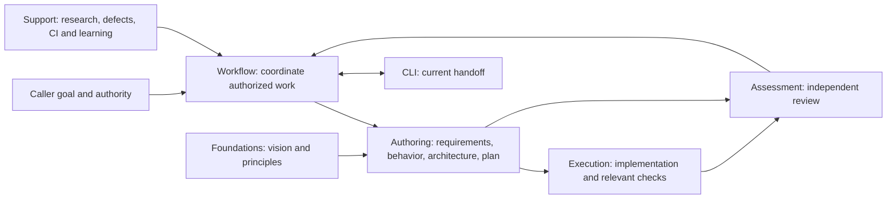
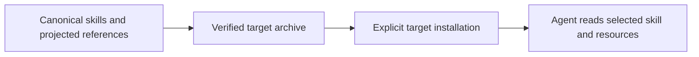

# Skill Model Design

Model validation contract: model-document-v1

## Introduction and Goals

Skill owns published engineering guidance and its common invocation, resource and authority boundaries. Current responsibilities follow the requirement-first [Workflow](workflow.md), [Assessment](assessment.md), [engineering authoring](authoring/design.md) and the canonical [REM models](../../../rem/README.md). A skill guides an authorized actor; it is not an autonomous service and does not supply permission or engineering approval merely by running or recording a result.

## Context and Scope

| Responsibility | Owner |
| --- | --- |
| Coordinate authorized work and resumption | route; [Workflow](workflow.md) |
| Interpret RR, reuse/refine requirements, assess the proposed basis | requirement-analysis and independent requirement-review |
| Define logical behavior and accountable realization | system-design and architecture-design; one integrated design-review |
| Allocate delivery and proof | plan and independent delivery-review |
| Implement with relevant checks | implement; milestones are checkpoints |
| Assess the delivered whole Change | code-review; optional interim advice has no approval authority |
| Assess final success and preserve compact completion | verify |
| Diagnose defects, maintain CI, investigate uncertainty, learn and submit a PR | Scoped support capabilities under their owning methods and existing authority |
| Establish vision, principles and repository orientation | Project Foundations |

The current canonical inventory contains 20 skills. `proposal`, `proposal-review` and combined `design` are retired from the successor package. A proposal remains valid RR input. Earlier proposals and approvals keep their original meaning and are not automatically requirement approvals. No extra skill is required for each REM entity or analysis method.

## Subsystem design graph

```mermaid
flowchart LR
  Caller["Caller goal and authority"] --> Workflow["Workflow: coordinate authorized work"]
  Workflow --> Authoring["Authoring: requirements, behavior, architecture, plan"]
  Authoring --> Execution["Execution: implementation and relevant checks"]
  Authoring --> Assessment["Assessment: independent review"]
  Execution --> Assessment
  Assessment --> Workflow
  Foundations["Foundations: vision and principles"] --> Authoring
  Support["Support: research, defects, CI and learning"] --> Workflow
  Workflow <--> CLI["CLI: current handoff"]
```

The caller supplies intent, authority and judgments; the CLI supplies identities, validation, bounded projections and persistence. The operational contract is targeted-recording-v2 / rigorloop-records-v4. Skills never write SQL or require direct navigation of runtime storage. Isolated direct invocations remain scoped; broader continuation follows existing authorization and the current handoff.

## Requirements

| ID | Required behavior |
| --- | --- |
| SKL-SR-01 | The common skill contract MUST have one current owner under the applicability and displacement boundaries here. Transfer of an unchanged obligation MUST preserve its prior applicability; it MUST NOT establish universal audit, normalization or customer adoption. |
| SKL-SR-02 | A published skill MUST expose a justified recurring capability, artifact, assessment, procedure or trust boundary. Its description MUST carry capability, triggers and relevant near misses independently of body headings or optional adapter metadata, without synonym dumping or hidden side effects. Existing applicable description length and metadata constraints MUST remain enforced. |
| SKL-SR-03 | A normalized skill MUST provide purpose, invocation scope, relevant inputs, executable procedure, output expectations, local handoff, stops and claim limits through its reviewed structure or approved equivalent. Lifecycle roles MUST identify the skill, stage, upstream input, downstream outcome and brief summary. Useful specialist sections and multi-role duties MUST NOT be flattened into a universal reasoning method. |
| SKL-SR-04 | A skill MUST expose the obligations owned by its specialist and shared policy sources without redefining them. Authoring, review, execution and support outputs MUST preserve their required scope, evidence, stops and claim boundaries. Progress, readiness and completion MUST remain distinguishable under Workflow; no output may imply another actor's approval or unauthorized continuation. |
| SKL-SR-05 | Public skills MUST default to customer-project mode, use relevant project-local or supplied evidence, and avoid requiring unavailable RigorLoop internals. They MUST use a safe authorized portable target/default or stop on ambiguity, without treating missing RigorLoop files as a customer defect or bypassing project governance. |
| SKL-SR-06 | Instructions MUST preserve output quality, required-rule coverage and clarity ahead of token reduction. Rules SHOULD have one authoritative location within the selected package; intentional safety repetition MUST be recognizable as a reminder and consistent. Closed vocabularies MUST preserve their owning spelling/membership and remain discoverable through the currently applicable reviewed presentation. |
| SKL-SR-07 | Evidence guidance MUST prefer bounded summaries, identities, paths and relevant excerpts, while requiring complete subjects where needed for assessment or behavior-changing decisions. Output caps MUST NOT substitute for selection or weaken check coverage, exit behavior, failure detection or required evidence. Materially omitted detail MUST remain obtainable. |
| SKL-SR-08 | A package with resources MUST map every resource and its load/use condition. COPY MUST resolve to assets/, READ to references/, and RUN to scripts/; paths MUST remain within the skill root, without traversal or implicit templates/ support. Script entries MUST state input, result/exit meaning and failure action. No-resource skills need no artificial absence section. |
| SKL-SR-09 | All mapped resources MUST exist in canonical and claimed derived packages, including resources untriggered in a particular invocation. Required transitive procedure MUST be available on the selected path. Missing required normative, schema, security, legal or non-obvious structural content MUST stop dependent work without invention; untriggered resources MUST NOT become runtime prerequisites. |
| SKL-SR-10 | Untransformed mapped resources MUST preserve skill-root relative path and raw-byte SHA-256 across claimed canonical, generated, packed and applicable installed boundaries. Timestamps MUST NOT affect parity. Any content/path normalization or rewriting MUST have a declared input, transformation owner, output path, expected identity and validation command; incomplete transformations MUST fail validation. |
| SKL-SR-11 | Runtime fallback MUST NOT validate a broken package. Only a redundant convenience resource whose entire needed contract already exists in the loaded skill may permit a bounded disclosed fallback; missing required methods MUST stop. Target invocation success MUST NOT substitute for package integrity. |
| SKL-SR-12 | Artifact-producing skills MUST provide the specialist's complete usable output shape through a compact skeleton or reviewed equivalent asset. Assets MUST remain structural, with applicable fields and no unfilled placeholders in emitted artifacts; they MUST NOT own hidden policy, triggers, judgments or lifecycle state. Existing asset metadata/fingerprint obligations retain their specific applicability. |
| SKL-SR-13 | Canonical content and adopted shared-source projections MUST remain the authored authority for generated guidance. Required copied projections MUST match their declared source and owner, preserving supported transformations. Missing sources, stale copies or incoherent candidates MUST prevent the affected conformance claim. Repair MUST update the actual source and regenerate derived output, not patch a customer's installation as the durable fix. |
| SKL-SR-14 | Mechanical checks MUST remain bounded, deterministic and explicit about the checked skill/resource and failure. They MUST distinguish instructions from negative examples, project-local paths and packaged resources; unknown closed values MUST fail before consistency checks. They MUST NOT claim semantic quality, complete reasoning or deterministic target-agent selection from keyword/structure checks. |
| SKL-SR-15 | Skill guidance, resources and evidence MUST NOT require exposing secrets, credentials, raw private environment data or unrelated machine-local information. Examples MUST be public-safe or synthetic. Package validation, installed availability and stored labels MUST NOT grant execution, release or customer-adoption authority. |
| SKL-SR-21 | Adoption MUST retire every mapped duplicate current authority only after its obligation and decision have a complete destination, explicit supersession or justified retention. Useful original bytes and historical identities MUST remain recoverable under the Constitution retention policy, with current reliance self-contained; mixed and operational sources MUST retain clearly bounded ownership. This earlier pilot does not authorize whole-directory deletion; subsequent complete repository retirement follows SYS-SR-13 and ENG-SR-15 with Git-backed historical recovery. |
| SKL-SR-22 | Governance, System references, contributor navigation, exact-text validator consumers and source-retirement evidence MUST agree on the adopted owner before final reliance. Previous approvals MUST NOT be retargeted to changed subjects. Reviewed implementation, one independent whole-change review gate, and distinct successful Verify remain prerequisites under their existing owners. |
| SKL-SR-24 | Every published capability MUST have one behavioral owner under the submodel inventory and expose its required inputs, scoped action, usable output, failure disposition and handoff; shared conventions MUST NOT substitute for its specialist behavior. |
| SKL-SR-25 | Individual skills MUST support their authorized portable output without requiring CLI recording. A governed recording trigger MUST instead load and use the supported CLI procedure, retain its prerequisites, and stop on missing or conflicting authority; portable output MUST NOT claim governed completion. |
| SKL-SR-26 | Published instructions that use the CLI MUST match its supported commands, selectors, request and response contracts. The agent MUST inspect scope and operation results, supply explicit decisions and handle conflicts without inferring approval from persistence. |
| SKL-SR-27 | Capability implementation MUST preserve the action and output boundaries in Authoring, Implementation, Assessment, Project Foundations, Discovery, Learning and Delivery Handoff. A shared helper, resource or parent model MUST NOT silently authorize a downstream activity or external action. |
| SKL-SR-28 | Plan assets MUST preserve the structural and metadata contract in Plan assets below; completed pilot-only scope, measurement and fixed historical-corpus obligations retire without weakening current plan completeness or package integrity. |
| SKL-SR-29 | Implementation, Project Foundations, Discovery, Learning and Delivery Handoff MUST preserve the specialist authority, identity, mutation, recovery and usable-output contracts at their declared owners. Shared guidance MUST NOT flatten these distinct behaviors or revive retired lifecycle formats. |
| SKL-SR-32 | Acceptance of simplification MUST demonstrate a useful improvement on each changed entrypoint's selected reading paths and preserve its applicable exceptional paths. Semantic assessment, obligation coverage and existing resource/consumer checks MUST address the complete affected package. Fewer lines, moved prose or structural success alone MUST NOT establish improvement. Inconclusive or worse usability requires an owned correction or justified retention before completion; no token-cost tooling, score or length quota is introduced. |
| SKL-SR-33 | The current refinement round MUST assess all 20 current skill packages, including descriptions, conditional resources and assets, against current owners. Apply the selected presentation changes below; retain other packages only with current complete-package evidence. A prior approval or short entrypoint alone MUST NOT establish current retention. |
| SKL-SR-34 | Route, Verify, PR, Design Review and Delivery Review MUST expose task scope, independent authority classification and essential stops before conditional recording detail. The selected local references MUST supply complete current procedures, retain their existing triggers and preserve all native values, outputs and isolated/portable paths. Required-resource failures and late triggers MUST remain observable before dependent work. |
| SKL-SR-35 | Current descriptions and output aids MUST name supported responsibilities and current artifact owners. Historical rollout labels and incidental wording MUST NOT become new runtime prerequisites; semantic guidance remains review-owned. Changed resource locations MUST be consumed by every applicable validator and package reader without heading-dependent validation bypass. |

### Common contract details retained by consolidation

The adopted `discovery-support` shared-policy family remains supported for Explore and Research. Its copies preserve their declared canonical source and subordinate policy ownership under SKL-SR-13; initial shared-block rollout inventories do not prohibit subsequently approved projections.

The table defines the surviving presentation, portability and resource-enforcement contract under SKL-SR-02–14; source citations identify provenance, not a requirement to reconstruct the rule from historical prose. A normalized skill is one brought into the common structure contract by its approved adoption; a readability-profile skill is one brought into `skill-readability-v1`. Adoption or a declared profile establishes the obligation even if a defective file omits its marker. Absence of a marker is not an exemption for an already-adopted skill. A still-unnormalized skill does not acquire the profile through this consolidation. A reviewed equivalent must identify its actual approving owner and scope; neither existing bytes nor a passing validator constitutes approval of an exception.

| Surviving requirement | Applicable population |
| --- | --- |
| Frontmatter MUST contain non-empty string `name` and `description`. Normalized published skills MUST additionally include non-empty `version` and `schema-version`. Where the readability profile is selected, `schema-version` MUST be `skill-readability-v1`; unknown values fail explicitly rather than falling through to another profile. | Basic name/description fields apply to published skill metadata. The additional required fields apply to normalized published skills, including the pilot pair; the selected readability profile determines its marker. |
| `description` MUST state capability, trigger contexts and important near misses where competing skills or false positives exist, MUST NOT be a synonym dump, and MUST be at most 1024 characters. Essential selection logic MUST NOT exist only in body headings or optional `when_to_use` metadata. | Published skills brought into the description-routing contract; existing unnormalized populations keep their approved exemption until adoption. |
| The normalized structure MUST expose `Purpose`, `When to use`, `When not to use`, `Inputs to read`, `Outputs`, `Handoff`, `Stop conditions`, and `Claims this skill must not make`, retaining necessary specialist sections and all applicable duties for a multi-role skill. Invocation-blocking conditions SHOULD be surfaced before artifact generation/execution. | Normalized skills without an approved replacement layout; the functional duties remain required when a replacement layout is selected. |
| A `Workflow role` block MUST be near the top and contain `role_name`, `stage`, `upstream`, `downstream`, and a plain-language `summary`. `role_name` MUST equal the skill name. The summary MUST occupy no more than two lines of normal prose in canonical source. The block MUST make received input, produced outcome and downstream claim limits clear. | Readability-profile skills, under Readability R11–15; lifecycle skills producing/closing artifacts, gating stages, handing off or claiming downstream readiness also require the role coverage under Skill Contract R30/a. |
| The role-block `stage` MUST be exactly one of `authoring`, `review`, `execution`, `verification`, `handoff`, `support`, or `periodic`; unknown values MUST fail before role consistency checks. | Readability-profile role blocks. |
| Every closed vocabulary used by a readability-profile skill MUST have exactly one authoritative fenced block or table in its selected package; its values MUST NOT be re-enumerated in multiple prose locations. Spelling, capitalization and membership MUST match the governing vocabulary unless an approved owner explicitly changes them. | Readability-profile skills and the vocabulary-bearing body/reference selected for each invocation. |
| Long enumerations with named fields, comparisons, review dimensions, required sections or classification values MUST use a table. An ordered list MAY remain when sequence is the contract and table fields would reduce clarity. | Readability-profile skills. |
| Each rule, lookup order and guideline SHOULD appear once at the earliest point where it is needed. An intentional safety repetition MUST identify itself as a reminder and MUST NOT conflict. Workflow-wide rules MUST be visibly identified as shared; local rules MUST be distinguishable by section, label or wording. | Readability-profile skills. |
| Expected output MUST be summary-first, using a compact `Result` with `Skill`, `Status`, `Artifacts changed`, `Open blockers`, and `Next stage`, or an explicitly reviewed equivalent. Relevant review/evidence/follow-up fields MAY supplement it. | Normalized skills. |
| Artifact output MUST have a complete fillable skeleton covering all required sections/fields, including applicable review-recording fields. The default is a fenced skeleton near the bottom; a mapped reviewed asset MAY supply the full layout with a compact body output summary/COPY instruction. Emitted output MUST omit untriggered groups and contain no unfilled placeholders. | Artifact-producing readability-profile/normalized skills; only groups applicable under the specialist's current contract are required. |
| Existing artifact requirements, item formats, coverage and output obligations MUST be mapped to their destination before a new or relocated skeleton is accepted; examples MUST NOT substitute for the normative shape. Asset metadata and fingerprint checks apply only to the exact asset family that adopted them. | Changed artifact-producing skills; current plan assets retain their applicable scoped obligations. |
| Public portability validation MUST cover canonical skill files shipped to users, generated public skill copies and public adapter skill copies. It MUST NOT apply to internal specs, plans, tests, generator scripts, maintainer documentation or repository-only contributor documentation. Those internal surfaces MAY retain repository implementation details. | Published skill text and its public copies; the excluded contributor surfaces do not acquire public-text lint through this transfer. |
| Published instructions MUST route full workflow questions through `route` or another user-facing workflow surface. They MUST NOT require RigorLoop's internal workflow/skill specs, installed-authoring directories, adapter build/select scripts, shared-block mechanics or internal examples as ordinary customer prerequisites. They MAY refer to relevant project `AGENTS.md`, `VISION.md`, governed CLI context, change/plan records, a supplied local workflow contract or project validation command. | Published skills in customer-project mode; the supplied/project-local/authorized-target exceptions above apply. |
| Required skill-local dependencies MUST be declared in `Resource map`. Bounded legacy migration lint MUST examine recognized resource-loading instructions using `assets/`, `references/`, `scripts/` and legacy `templates/` prefixes. An unmapped legacy dependency MUST fail validation unless recorded as migration debt under an explicitly approved temporary exception. Arbitrary repository paths, artifact examples, code snippets and customer-project paths MUST NOT become packaged dependencies merely because they look path-like. | Published skills subject to the implemented resource-integrity amendment; new/changed and inventory enforcement follow the next row. |
| New or changed skills MUST satisfy resource-integrity enforcement immediately once that amendment is implemented. Enforcement for all skills MUST NOT be enabled until the mapped-resource audit is clean or unresolved drift has an explicit resolved, deferred or excepted disposition in a review-visible surface. | New/changed skills immediately under the implemented amendment; the existing inventory under its approved audit/disposition boundary. This population is distinct from the two-skill scope of new SKL-SR-16–19 improvements. |
| Evidence collection MUST start with targeted summaries, identities, headings, paths, counts or excerpts on high-volume surfaces and broaden when insufficient. Full-subject reads MUST remain available when the whole file is the target, safe isolation is impossible, context may change the conclusion, bounded evidence conflicts/is incomplete, or a behavior-changing edit depends on the whole authority. Omitted detail affecting reviewability MUST include how to obtain it. | Normalized skills collecting or assessing evidence. |
| Static evidence/overclaim checks MUST remain narrow, reviewable and incident-based, preserve full-read escapes, distinguish caps from selection and avoid blocking explicit negative guidance. Positive required wording SHOULD be preferred; broad natural-language quality scoring MUST NOT be a required gate. A process finding about noisy evidence MUST name the affected surface and a safer bounded strategy without reducing checks, artifacts or necessary full reads. | Validators applying these common contracts and assessors raising such process findings; any existing skill-specific forbidden-phrase checks retain their selected scope. |

Definitions of progress, readiness, closeout and Done remain with Workflow; formal review fields and disposition meanings remain with Review and Closeout and the specialist. The table and SKL-SR-01–15 define the transferred common rules, while the explicitly retained specialist asset/method definitions remain current at their named owners. If a claimed equivalent lacks an approved source or an obligation cannot be stated with a known population, retain that source definition and resolve the gap before retirement; a generic preservation assertion cannot serve as its replacement.

### Implementation capability boundaries

#### Implement

Implement establishes the smallest scope-complete result: all in-scope requirements, authored and aligned surfaces, current boundary/incident failures and required focused proof are handled before Code Review. An unaffected surface needs a reason; known defects and missing required proof cannot be passed to review as later cleanup. This is first-pass completeness, not a promise of no reviewer findings. It changes no review, routing or external permission boundary.

#### Bugfix

Bugfix distinguishes `diagnose-only` from `fix`; conflicting intent permits diagnosis only. Bind exact repository, defect, authority, allowed paths/write categories, command authority, contract and evidence before mutation. Diagnosis changes no tracked or external state. Proof-authoring writes only authorized tests, fixtures and reproductions; production correction requires a failing automated proof, or established infeasibility plus a complete deterministic alternative with inputs, assumptions, expected observation and limits. Unknown causes authorize no production mutation; missing/conflicting/new behavior returns to the relevant requirement or design owner, and test defects cannot weaken expected behavior speculatively. Run the identity-equal original proof after correction and the surrounding checks justified by the actual blast radius. Changed proof is a new basis, never the original test passing. Report actual commands, failures, uncertainty, identities and authority; changed implementation hands off to independent Code Review without autonomous downstream continuation. Governed evidence uses an exact authorized destination; bugfix does not edit another stage's artifacts or state.

#### CI maintenance

CI maintenance separates `create`, `revise` and read-only `review`, target kind, provider, concern and privilege. Creation requires an absent exact target; revision requires an existing exact identity. GitHub procedure applies only to GitHub workflow files; other providers require an exact project-native content, command, validation and write contract. External platform settings are review-or-route only. Privileged authoring requires an approved Design and independent review bound to repository, target, triggers/scope, permissions, credential/OIDC model, runner, environment, fork/secret policy, third-party actions and validation; omitted material choices do not come from a generic skeleton. Ordinary defaults use least privilege and protected secrets/fork boundaries. The risk-to-check resource owns semantic coverage placement; GitHub serialization consumes it and project-owned commands. Coverage-sensitive changes load that resource; narrow maintenance loads it only if coverage is affected.

CI file commits require no-clobber creation or identity-guarded replacement; a plain overwrite rename and read-back do not establish concurrency safety. Validate prepared content and read back committed bytes. If the environment cannot supply the required primitive, stop the mutation. Multi-target work first resolves every target and dependency, validates a safe intermediate ordering, and distinguishes independent, ordered-dependent and atomic-group-required work. The last class blocks before writes; no multi-file transaction is claimed. Partial outcomes identify completed and pending targets and their validity. Retries reassess all current identities. Local checks and ordinary authoring report hosted CI unobserved; only exact observed run/head evidence supports a hosted result. No authoring operation grants privileged execution, external mutation, readiness or publication.

### Specialist interface vocabulary and outputs

Under SKL-SR-29, the following current public domains are closed. Unknown values reject before cross-field consistency; a recognized value still needs its described authority and prerequisites. These are behaviorally meaningful parser/public contracts, not incidental words. Old semantic-rule/literal-migration ledger classifications, corpus sizes and token profiles retire as instrumentation; public operation and result values do not retire with them. Source-qualified IDs in the cleanup disposition remain historical identifiers.

| Capability / independent axis | Supported values |
| --- | --- |
| Bugfix command authority | not-required, current-bounded, absent-or-stale, invalid-or-ambiguous |
| Bugfix write authority | none, portable-request-bound, governed-scope-bound, absent-or-stale, invalid-or-ambiguous |
| Bugfix reproduction | reproduced, deterministic-alternative, not-established, conflicting |
| Bugfix contract basis | settled, resolvable-restoration, missing, conflicting, behavior-change-request |
| Bugfix test feasibility | feasible, infeasible-with-rationale, unresolved |
| Bugfix regression proof | failing-automated-test, deterministic-alternative, missing, conflicting |
| Bugfix cause support | supported, uncertain, conflicting |
| Bugfix root cause | implementation-defect, contract-gap, integration-mismatch, data-or-migration, race-or-timing, configuration-or-environment, test-defect, external-dependency, unknown |
| Bugfix action | stop-blocked, route-owner, continue-diagnosis, complete-diagnosis, resolve-test-feasibility, author-automated-proof, apply-production-correction, run-post-fix-validation, complete-fix |
| Bugfix terminal result | diagnosis-complete, diagnosis-incomplete, fix-applied, routed-to-owner, blocked |
| CI concern | coverage, performance, caching, permissions, triggers, ordinary-security-hardening |
| CI target | github-workflow, project-validation-automation, related-platform-configuration, external-platform-state, invalid-or-ambiguous-target |
| CI provider | github-actions, project-native-other-provider, invalid-or-ambiguous-provider |
| CI privilege | ordinary-workflow-context, privileged-approved-design, privileged-design-required, invalid-or-ambiguous-privilege-context |
| CI structure | none, compose-from-skeleton, preserve-existing-structure |
| CI repair mode | ordinary-infrastructure, bounded-pr-ci-repair |
| CI batch relation / result | independent, ordered-dependent, atomic-group-required / complete, partial-blocked, blocked-before-write |
| CI invocation result / hosted observation | created, updated, reviewed, blocked / not-observed; eligible bounded repair may report pending, passed, failed for its exact run/head |

Bugfix chooses blockers and routing before mutation eligibility. A complete failing automated proof permits correction; conflicting proof blocks; feasible missing/alternative proof requires automated proof authoring; unresolved feasibility requires resolution; infeasible proof permits correction only with a complete deterministic alternative. Already corrected work with failed or identity-mismatched required checks blocks, with pending checks validates, and with all required checks passed completes. Terminal results distinguish completed/incomplete diagnosis, applied fix, routed ownership and blocked work; intermediate actions are not terminal results. Report operation/result, authority, repository/defect scope, actual commands, proof identity, unexecuted checks, uncertainty, changed surfaces and next owner.

CI results report requested/actual operation, target kind, provider, privilege, concerns, structure, selected assembly, target identity, mutation outcome, validation evidence, blockers and hosted observation. The nine procedural assemblies remain CIM0-narrow-review, CIM1-coverage-review, CIM2-ordinary-github-create, CIM3-narrow-github-revise, CIM4-coverage-github-revise, CIM5-structural-github-revise, CIM6-project-native-authoring, CIM7-privileged-approved-create and CIM8-privileged-approved-revise. Universal classification determines the assembly; coverage and structural resources add independently and late triggers load before dependent work. Unknown assemblies cannot fall through as ordinary review.

#### CI assembly selection and resources

The published short CIM0–CIM8 labels with reassigned meanings are an implementation mismatch, not aliases for the declared assemblies. Correct current guidance to the existing full names; preserve historical outputs and records without migration or reinterpretation.

Validate the closed classification values, exact target and applicable authority before selecting an assembly. Invalid or ambiguous inputs stop with the supported blocked outcome; they are not a tenth assembly or an alias for a valid one. External platform state remains review-or-route only. Privileged authoring without the required exact approved Design/review stops before resource-dependent mutation.

Use the following disjoint selections for supported invocations. Review is classified first, independently of provider or privilege; it never acquires authoring authority. For authoring, select the project-native branch before the GitHub-specific branches. Within GitHub authoring, approved privilege takes precedence over ordinary structural/coverage selections. For ordinary revision, authorized structural replacement takes precedence over coverage; coverage still independently adds its resource. These rules preserve the nine existing assembly identities while making the previously implicit combined cases explicit.

| Assembly | Selection | Required resources and external evidence |
| --- | --- | --- |
| CIM0-narrow-review | Read-only review without coverage-sensitive judgment, including supported privileged, project-native or external-state review | Entrypoint; relevant exact project or privileged evidence only as required to judge the reviewed target. No authoring reference or skeleton. |
| CIM1-coverage-review | Read-only review with coverage-sensitive judgment | Entrypoint and risk map; relevant exact external evidence as required by the review. |
| CIM6-project-native-authoring | Supported non-GitHub repository-file authoring under an exact project-native contract | Entrypoint, risk map when coverage-sensitive, and external content/command/validation/write contract. Existing privileged-authoring authority remains independently required when applicable; no GitHub serialization or skeleton. |
| CIM7-privileged-approved-create | GitHub creation under exact approved privileged Design/review | Entrypoint, GitHub authoring reference, risk map, skeleton and exact external approved Design/review. |
| CIM8-privileged-approved-revise | GitHub revision under exact approved privileged Design/review | Entrypoint, GitHub authoring reference and exact external approved Design/review; independently add risk map for coverage and skeleton for authorized structural replacement. |
| CIM2-ordinary-github-create | Ordinary GitHub creation | Entrypoint, GitHub authoring reference, risk map and skeleton. New workflow coverage must be selected from project risk/command evidence even when coverage was not the user's initial concern. |
| CIM5-structural-github-revise | Ordinary GitHub revision with authorized structural replacement | Entrypoint, GitHub authoring reference and skeleton; independently add risk map when coverage-sensitive. |
| CIM4-coverage-github-revise | Ordinary GitHub revision preserving structure with coverage-sensitive judgment | Entrypoint, GitHub authoring reference and risk map. |
| CIM3-narrow-github-revise | Ordinary GitHub revision preserving structure without coverage-sensitive judgment | Entrypoint and GitHub authoring reference. |

Every successful selection reports exactly one assembly, actual conditional resources and external evidence separately. A late coverage, structural or privilege trigger requires reclassification and loading the complete newly required resource before dependent judgment or mutation; it never supplies missing authority. Late-discovered privilege stops authoring without exact approved Design/review; with that authority, GitHub work selects CIM7/CIM8 and project-native work retains CIM6 with the newly required external evidence before mutation. Existing create/revise identity, privilege, no-clobber/conditional-write, batch and failure rules still apply. A blocked classification reports its reason without inventing an assembly value.

Acceptance must distinguish ordinary create, narrow/coverage/structural revision, coverage plus structural revision, approved privileged create/revise with independent additions, project-native authoring, narrow/coverage reviews across supported target/privilege contexts, invalid values and denied external/privileged writes, and late coverage/structure/privilege additions. Assess unique selection and resource reachability independently from output-token presence. Structural checks can protect the closed nine-row vocabulary and selected resource paths; independent semantic inspection judges classification meaning and permission preservation. No executable CI classifier, new invocation enum or general agent-compliance harness is introduced.

### Bounded PR CI repair

This is the existing narrow exception within CI maintenance, not a general automatic approval. Admission requires an already-open PR, exact failing hosted run and head, current applicable Code Review and Verify evidence, no open material finding, already-authoritative commands and existing authority for every external mutation. The correction only restores already-approved behavior. Changes to requirements, architecture, runtime implementation, dependencies, lifecycle schema/routing, review outcomes or another decision-bearing contract reject this mode and return to the earliest affected owner; ambiguity cannot preserve readiness.

Inspect the exact failure, make the smallest correction, run its focused check and the exact repository-owned PR check, prefer one coherent repair commit, push only under existing authority and observe the replacement run at the actual head. Preserve current review/explanation/Verify/lifecycle evidence only when its decision basis remains unchanged under Assessment; a CI failure alone does not require a new review round, explanation, Verify report, change record or lifecycle-only commit. A missing prerequisite or unobserved replacement outcome is reported truthfully. This exception neither grants external authority nor weakens current checks.

## Conditional resources

Load only resources whose declared conditions apply. Each mutation-capable package includes its request and record schemas. Shared methods and REM excerpts are projected from their canonical owners with source identities; generated adapters are built from `skills/`. Publication and actual installed-resource checks remain owned by [Packaging](../engineering/packaging.md). A package validation pass cannot establish semantic quality or review approval.

## Plan assets

[Plan](authoring/plan.md) owns stable milestones and proof allocation. Its plan and milestone skeletons remain structural aids. Current work, blockers, evidence and review standing belong to the Change handoff. The old decision-log-row asset and per-milestone review dossiers are retired; important current rationale retains its appropriate design or operational owner.

## Deployment View

```mermaid
flowchart LR
  Source["Canonical skills and projected references"] --> Package["Verified target archive"]
  Package --> Install["Explicit target installation"]
  Install --> Agent["Agent reads selected skill and resources"]
```

A successor archive carries its workflow descriptor. Installation verifies candidate identity and explicitly preserves/removes selected obsolete units when authorized; it does not adopt governance or import records. See [Installation](../cli/installation.md) and [MOD-014](../../../design/architecture/modules/MOD-019-product-delivery/modules/MOD-014-verified-skill-installation/README.md).

## Test design

Validate resource availability/parity, unknown closed values, actual generated and installed packages, and independent semantic walkthroughs of the complete affected responsibilities. Include covered-request reuse, missing upstream basis, direct invocation limits, milestones without review gates, advisory outcomes without approval, reassessment after material corrections, and a missing final whole-change review. Check optional support paths and their transitive resources too. Retain useful parser, resource, filesystem, negative and recovery tests; retired pilot wording is not current behavior.

## Reconciliation and historical provenance

Common obligations retain their IDs above. SKL-SR-16–20, 23, 30 and 31 selected earlier presentation pilots; their exclusive layout, profile and old-recording procedures are retired. Applicable resource integrity, useful semantic assessment and complete instructions remain under SKL-SR-01–15, 21–29 and 32–35. The old implementation profile system is replaced by explicit invocation scope and authority. Historic test results and approvals retain their original subjects.

Prior pilot procedures and their exact wording are recoverable at commit `39be9c81`, under this path and the former skill directories. Current consumers use the owners above and the supported CLI; they must not load historical sources to reconstruct active procedure.

### Boundary scan and acceptance scenarios

| Dimension | Requirement basis | Distinct outcome to demonstrate |
| --- | --- | --- |
| Input domain | SKL-SR-01 | Unknown contracts, malformed references or unsupported scope stop the affected operation without inferred defaults. |
| State/lifecycle | SKL-SR-01 | Progress, accepted basis, review judgment, final Verify and historical completion remain distinct; saved state alone advances none. |
| Identity/authority | SKL-SR-01 | The actual responsible actor, declared scope and current support govern reliance; an identifier or role label does not establish authority. |
| Composition/path | SKL-SR-01 | Changed producer and consumer contracts are reconciled together, including packaged conditional resources and referenced engineering definitions. |
| Temporal/retry | SKL-SR-01 | A changed basis requires rereading and proportionate reassessment; an old submission does not acquire current authority on retry. |
| Failure/recovery | SKL-SR-01 | Interrupted work exposes its actual outcome and an owned next step without erasing unresolved issues or inventing success. |
| Compatibility/migration | SKL-SR-01 | Retired procedures remain historical; successor behavior requires explicit applicable adoption/import and cannot relabel old approval. |
| External/environment | SKL-SR-01 | Local engineering results remain separate from installed, published or hosted outcomes; required observations must actually be made. |
