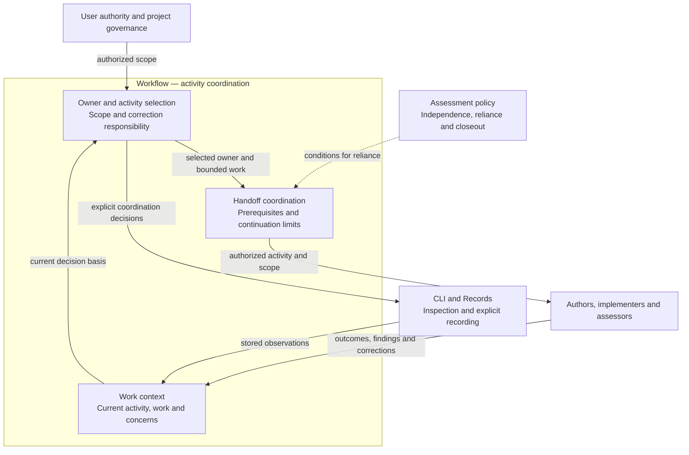
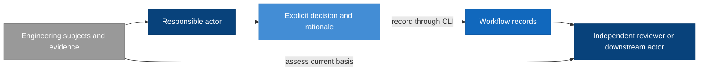
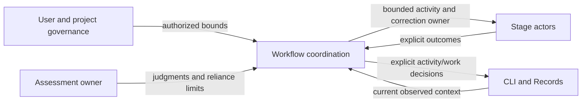
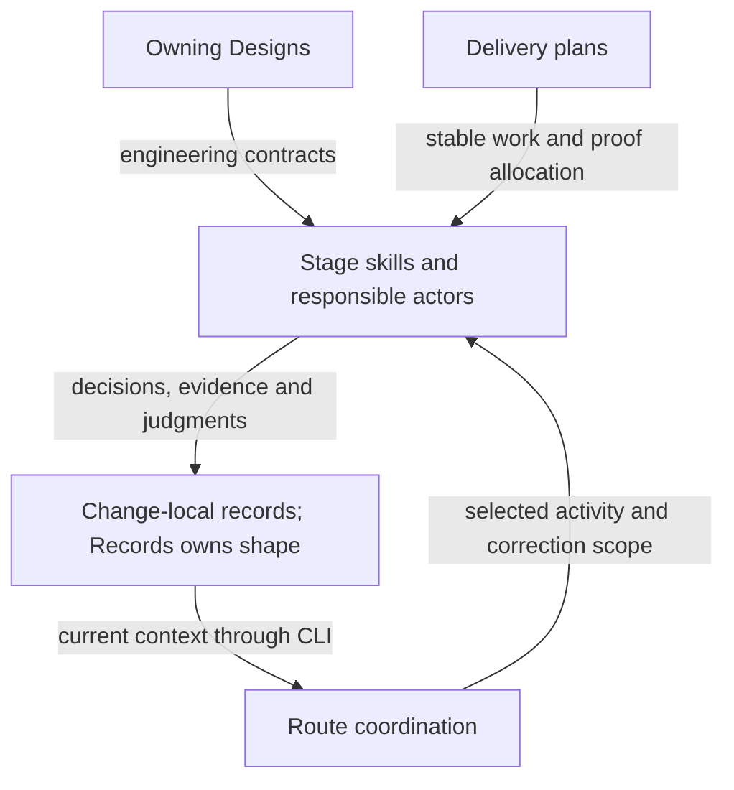
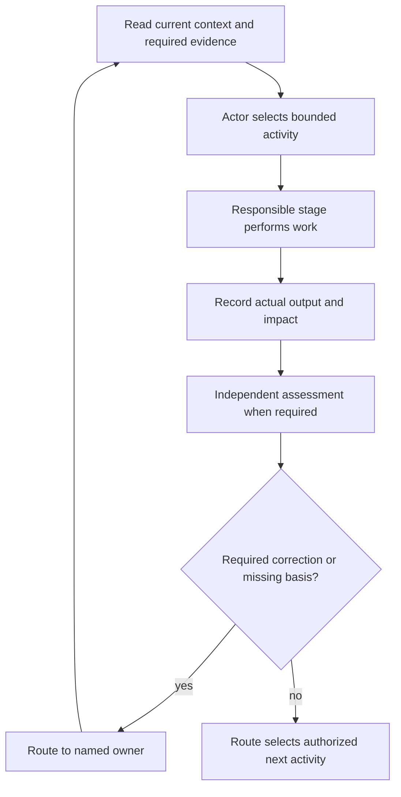

# Skill Workflow Model Design

Model validation contract: model-document-v1

Parent model: [Skill](skill.md#workflow).

This child owns published coordination and handoff behavior. Engineering Development applies that behavior to this repository without defining a second workflow. Original adoption and retirement sections below preserve their scoped provenance.

Owning change: [repository cleanup](../../changes/2026-09-13-current-design-repository-cleanup/change.json).

Prior refinement: [independent parallel tests](../../changes/2026-09-13-independent-parallel-tests/change.json).

Original composition adoption: [three-model reconciliation](../../changes/2026-09-12-unified-validation-model/change.json).

The current recording population is v3. [Retirement coordination](#retired-format-dependency-protection) preserves the dependency disposition and owning change; the operational guidance below no longer carries a v2 continuation profile.

For this repository’s [complete source retirement](../../changes/2026-09-14-retire-specs-and-stale-tests/source-disposition.md), current responsibilities are self-contained in the owning Designs. Original source-transfer inventories remain recoverable through [Historical provenance](#historical-provenance); their instructions to retain or amend legacy specs, architecture, activation state or retired engines are historical and superseded by this complete retirement. Source-qualified IDs and original judgments keep their original meaning; provenance is not a runtime input or current approval. Customer source documents retain their project-owned authority and historical meaning. Current RigorLoop output and format support follow Design; source interpretation does not authorize retired feature/proof operations or automatic conversion.

## Introduction and Goals

The Workflow model defines how responsible humans and agents coordinate a direction into reviewed design, delivery work and verified outcomes. It owns activity selection, work and correction allocation and continuation authority. The [Design model](authoring/design.md) owns the authoring method and model-document convention under the coordinated adoption boundary below. The [Review and Closeout model](assessment.md) owns shared assessment policy within this domain; Workflow applies its judgments and applicability conditions when coordinating work. The purpose remains durable, inspectable reasoning and resumable work without making a command-line transition engine the decision owner.

The [System model inventory](../system.md#responsibility-inventory) describes composition and declared current/unmigrated owners. Workflow coordinates Design, Review and Closeout, Validation, RigorLoop Record Format and CLI without copying their local contracts. Review and Closeout owns assessment policy. [System](../system.md#living-test-design-composition) owns shared proof-quality and maintenance rules. [Validation](../engineering/validation.md) owns check selection, execution and reporting; neither responsibility is a lifecycle stage. System owns the criteria; specialists assess actual plans, tests and evidence under Review and Closeout. Record Format owns durable structure and preservation; CLI owns the safe storage interface. The earlier retirement amendment changed Workflow, Record Format and CLI; this authoring-convention amendment changes Design, System and Workflow, with the other models retained as policy/mechanical dependencies. These models are defined by coherent responsibilities, not by features, classes or AI models.

### Unified authoring adoption boundary

This amendment follows the independently approved unified-authoring direction. Its Design/System ownership references take effect only with the coordinated governing and consumer adoption defined by [Design](authoring/design.md#coordinated-adoption-boundary). Before that adoption, prior effective governance and public entrypoints remain in force. The model-document contract is preserved while its owner moves; this draft grants no implementation, publication or customer-adoption authority. Historical retirement scope and records retain their meaning.

### Design at a glance

> Agents spend tokens understanding engineering meaning; the CLI spends computation on identities, selection, preservation, serialization, registration and persistence.

Workflow assigns responsible activities and consumes the assessment meanings and reliance conditions defined by Review and Closeout. Records retain those explicit decisions. The CLI is the recording mechanism; it does not become the decision owner.

| Reader question | Start here |
| --- | --- |
| Who owns each decision? | [Actor boundary](#context-and-scope) and [responsibility-specific updates](#responsibility-specific-updates) |
| What is stored, and how do records relate? | [Record model](#record-model) and [formal record fields](#explicit-record-schema) |
| How do actors use the CLI? | [Primary skill interaction](#primary-skill-interaction-and-decision-ownership) |
| What happens when Verify finds a defect after completion? | [Correction walkthrough](#correction-walkthrough-actor-decisions) |
| What supports independent review and downstream reliance? | [Review and Closeout](assessment.md#requirements), applied through [ownership references](#review-and-closeout-policy-ownership) |
| What must agree before adoption? | [Targeted-interface allocation](#recording-compatibility) and [historical compatibility](#historical-compatibility) |

## Architecture Overview

Workflow owns coordination within the boundary. The [actor and model boundaries](#context-and-scope), [responsibility-specific updates](#responsibility-specific-updates), and [Runtime View](#runtime-view) define context, routing and handoffs. The [record model](#record-model) maps coordination concepts to [Records](../cli/records.md); [CLI](../cli/cli.md) supplies inspection and safe writes. [Assessment](assessment.md) owns judgments and reliance conditions. These external contracts guide actor decisions; neither stored state nor routing manufactures approval.

### Supporting-view decisions

| View | Necessity and reason | Owning detail |
| --- | --- | --- |
| Context | Necessary: Coordination consumes external policy and recorded observations without acquiring assessor or CLI authority. | [Context view](#context-view) |
| Building Block | Necessary: Routing, stage decisions and their stored context have distinct owners despite sharing a workflow. | [Building Block view](#building-block-diagram) |
| Runtime | Necessary: Corrections, assessments and continuation have different decision owners and must not imply automatic approval. | [Runtime view](#runtime-diagram) |
| Deployment | No separate deployment view: Workflow supplies coordination policy. Skill owns invocation placement and CLI owns filesystem/process mechanics; actor labels are not authentication. | Existing deployment/context prose and the named external owner. |

## Context and Scope

| Actor or model | Owns | Does not own |
| --- | --- | --- |
| Human decision owner | Product direction, scope exceptions, external/destructive authority | Implicit approval through silence |
| Authoring agent | Its model content and explicit correction impact declaration | Approval of its own content |
| Review agent | Judgment, findings, exact reviewed subjects and their settlement | Editing the content it approves |
| Route agent | Selecting work, coordination, recorded current activity and correction responsibility | Manufacturing review or Verify results |
| Implementation agent | Approved implementation and execution evidence | Changing the approved design through code |
| Verify agent | Final coherence assessment and success-only completion evidence | Approving its own correction |
| Design model | Authoring method, model convention, decision preservation and assessment intent | Product direction, actual judgments or work allocation |
| System model | Assembled-system relationships and integrated obligations | Component contracts or governance precedence |
| Review and Closeout model | Shared assessment scope, independence, applicability, concern disposition and final closeout policy | Activity selection, storage shapes or execution permission |
| System test policy | Shared proof-quality, organization and maintenance criteria | Child-owned behavior, concrete execution or assessment judgments |
| Validation model | Check selection, execution, isolation and reporting under System policy | Behavioral authority, actual review judgments, evidence applicability or closeout consequences |
| Record Format model | Stored structure, versions, relationships and preservation invariants | Engineering judgments or persistence execution |
| CLI model | Mechanically validated persistence and observations | Any of the decisions above |

The CLI interface is a dependency, not a superior workflow authority. Local filesystem permissions and runtime controls remain the execution boundary; an actor label in a record is attribution, not authentication.

## Architecture Constraints

Workflow consumes the independence, reliance, compatibility, and environment obligations in RC-SR-02/04/05/16/18 of [Review and Closeout](assessment.md#requirements). Local coordination does not authenticate an actor or extend its authority.

The earlier retirement selected v2-only support and retained Workflow coordination and Review and Closeout/Test ownership. This later revision transfers the selected authoring/document convention to Design and system composition to System. It changes no release permission or automatic-progression authority; historical judgments retain their exact meaning.

## Solution Strategy

Use explicit decisions supported by evidence. Responsible actors read the current records and exact subject identities, decide their updates, and submit purpose-specific operations through the CLI, using batch only for related explicit decisions that require coherent publication. Workflow coordinates skills under the Review and Closeout assessment obligations; storage mechanics remain capable of recording a structurally sound correction regardless of the currently recorded stage.

Workflow keeps activity selection separate from the assessment and observation concepts defined by Review and Closeout and CLI. It consumes the RC-SR-04/05 distinction between a recorded judgment and current reliance rather than redefining that distinction here.

The arrows show evidence and decision flow, not automatic stage transitions. The receiving actor decides whether recorded evidence supports reliance; the CLI's successful save supplies no additional approval.

## Architectural supporting views

These views elaborate the overview at the owning model boundary. Existing detailed contracts, scenario tables and external owners retain their authority.

### Context View

Coordination consumes external policy and recorded observations without acquiring assessor or CLI authority. Detailed requirements and scenarios in this model remain authoritative.

### Building Block diagram

Routing, stage decisions and their stored context have distinct owners despite sharing a workflow. Detailed requirements and scenarios in this model remain authoritative.

### Runtime diagram

Corrections, assessments and continuation have different decision owners and must not imply automatic approval. Detailed requirements and scenarios in this model remain authoritative.

## Requirements

The following stable requirements define model behavior; the authoring-ownership amendment requires coordinated adoption before its replacement authority can be claimed. IDs are model-scoped and remain stable when later features revise this document.

| ID | Required behavior |
| --- | --- |
| WF-SR-01 | Responsible actors MUST explicitly decide activity, status, ownership and authorized continuation. Workflow MUST consume review applicability and closeout conclusions under RC-SR-04/05/13 rather than infer them from saves or reads. |
| WF-SR-02 | A change record MUST identify its contract, proposal, affected model documents, current activity, responsible owner and unresolved blockers. Each referenced review or proof MUST identify its exact subjects. Mutable progress belongs in change records, not model Design documents or plan bodies. |
| WF-SR-03 | Workflow MUST obtain the required independent judgment through Review and Closeout RC-SR-01–04 before relying on approval. This stable ID now references that policy owner; it does not redefine reviewer independence or judgment. |
| WF-SR-04 | Route MUST assess cross-model correction impacts and select the responsible owner without requiring that owner to appear in a previously derived pending set. Authors and receiving actors MUST apply RC-SR-05–07/10 to changed-subject impact, applicability and reassessment; uncertain impact is handled under that policy. |
| WF-SR-05 | Workflow MUST provide an owned recording and correction path for defects discovered by any responsible stage, including Verify, under RC-SR-08/10/14. Record Format and CLI retain representation and mechanical recording ownership. |
| WF-SR-06 | Workflow MUST allow explicit reopening of completed work and coordinate reassessment without a previous-stage prerequisite. Concern origin, disposition and the meaning of return-for-review are owned by RC-SR-08–10/14 and represented under the selected Record Format contract. |
| WF-SR-07 | Workflow MUST coordinate owning-model updates under Design DES-SR-01/02/07/08/11/12 and its scoped adoption boundary. This retained identity references Design for unified authorship, document convention and shared-contract ownership; Workflow MUST NOT maintain a second definition of that method. |
| WF-SR-08 | Workflow MUST preserve Design DES-SR-06/11/13 reference and decision continuity when coordinating revisions. Exact affected-model review and concurrent-change applicability MUST follow RC-SR-01/02/05/06/10; retaining a reference MUST NOT retarget an old approval. |
| WF-SR-09 | Workflow MUST condition continuation and completion coordination on the applicable assessments and closeout obligations owned by RC-SR-05/11–15. Missing readiness MUST NOT prevent recording owned blockers or corrections under RC-SR-14. Workflow coordinates Delivery allocation under Design DES-SR-10/16 and the Model validation and proof mapping reference below. |
| WF-SR-10 | Retirement MUST preserve historical bytes, identities and approval meaning while ending runtime support for the exact RF-SR-06 set. The owner-confirmed completed-work baseline MUST NOT be recast as an executed inventory result. No migration or speculative legacy continuation facility is required; concrete contradictory residue MUST receive a bounded owner disposition before the affected removal proceeds. |
| WF-SR-11 | Ordinary skills MUST use purpose-specific inspection and targeted recording, or batch for related explicit edits, without full-file reconstruction or historical eligibility checks. Actors MUST supply all intended decisions and explicitly select useful context. The CLI MUST perform mechanical selection, identity computation, registration, preservation, serialization and persistence; actors expand the engineering basis when their judgment requires it. |
| WF-SR-12 | A new supporting record MUST have an explicit actor-supplied record-level applicability declaration; CLI registry construction MUST NOT decide applicability. Updating a check or review alone MUST NOT change applicability, activity, finding disposition or completion. |
| WF-SR-13 | Workflow MUST keep the recorded correction owner distinct from the disposition owner defined by RC-SR-08–10/14. Review findings and change-level blockers use the selected Record Format targets; route coordinates their correction without manufacturing another actor’s disposition. |
| WF-SR-14 | Workflow actors MUST select and expand useful context for their decisions and apply RC-SR-04/05/18 before reliance. Diagnostic detail remains a CLI observation, not a storage prerequisite or a source of activity-selection authority. |
| WF-SR-15 | The complete successful Verify assessment and final explanation, and the shared material-decisions narrative, MUST be available through normal targeted reads with recorded applicability and identities. Retrieving a deliverable MUST NOT require advanced inspection of unrelated records or imply renewed verification. |
| WF-SR-16 | Workflow MUST preserve the final assessment dependency defined by RC-SR-11/12 in delivery and closeout coordination, including when later corrections affect a previously reviewed result. The plan and specialist assessments supply the basis; route MUST NOT fabricate a final-review judgment or treat a milestone result as a whole-change result. |
| WF-SR-17 | For work using the adopted TEST-SR criteria, Workflow MUST route missing intended behavior to Design, missing proof allocation to planning, and defective concrete tests to the responsible implementation or correction activity. Planning and specialist assessments MUST consume the shared criteria in System TEST-SR-01–13 without assigning that model judgment, applicability or closeout authority. |
| WF-SR-18 | V2 support removal MUST follow the explicit work, recovery and governance-dependency disposition in V2 retirement coordination. Canonical consumers and packages MUST agree at adoption. Remove v2-only tests while preserving applicable shared and v3 protection; this initiative MUST NOT add v2 retirement, rejection or archive-compatibility tests. |
| WF-SR-19 | Follow-ups MUST live with an action-owning artifact or explicit accepted cross-change register under Follow-up placement below. Orientation, a learning classification, historical plan text or a recorded route MUST NOT imply execution commitment or downstream completion. |

### Review and Closeout policy ownership

Dependency references to “Workflow-owned assessment policy” denote the broader Workflow domain. Within that domain they resolve through the ownership map below to Review and Closeout for judgments, independence, applicability, evidence adequacy, and justified reliance; Workflow retains coordination. This treatment intentionally retains the CLI model’s Context and Scope boundary descriptions and Record Format’s Context and Scope and stored-layout introduction descriptions. It grants Workflow no second assessment-policy definition. The retirement package includes Record Format and CLI for their separate stored-support and mechanical changes; their inclusion does not reopen assessment-policy ownership.

All RC-SR references in this file resolve to the [Review and Closeout requirements](assessment.md#requirements). The requirement table retains WF identities as coordination obligations or explicit references to the new owner. The following map states the proposed extraction; it does not claim that earlier reviewed revisions have changed meaning.

| Retained identity | Prior assessment responsibility | New policy owner | Workflow remainder |
| --- | --- | --- | --- |
| WF-SR-01 | Explicit applicability and readiness decisions | RC-SR-04/05/13 | Explicit activity, status, ownership and continuation |
| WF-SR-03 | Exact judgment, independence, and no self-approval | RC-SR-01–04 | Obtain the required specialist assessment |
| WF-SR-04 | Changed-subject impact and applicability | RC-SR-05–07/10 | Cross-model correction allocation |
| WF-SR-05 | Defect basis and success-only Verify failure behavior | RC-SR-08/10/14 | Maintain an owned recording/correction path |
| WF-SR-06 | Retained origin, disposition, and return-for-review meaning | RC-SR-08–10/14; Record Format for stored preservation | Reopen completed work and coordinate reassessment |
| WF-SR-08 | Exact design package review and concurrency applicability | RC-SR-01/02/05/06/10 | Coordinate reference continuity under Design DES-SR-06/11/13 |
| WF-SR-09 | Reliance and justified successful completion | RC-SR-05/11–15 | Apply those conditions to continuation and coordinate Design-owned proof-intent handoff |
| WF-SR-13 | Reporter-owned disposition distinct from repair | RC-SR-08–10/14 | Allocate the correction without assuming disposition authority |
| WF-SR-14 | Sufficient basis and no permission inferred from observations | RC-SR-04/05/18 | Select context and interpret CLI observations for coordination |

WF-SR-02/10–12/15 retain state, compatibility, targeted-interface, explicit-recording and retrieval responsibilities; WF-SR-07 now coordinates the Design-owned document method. WF-SR-16 makes consumption of the existing final-review dependency explicit. Historical policy mappings elsewhere in this file are reference history; assessment obligations they cite resolve through this table for the proposed revision. Runtime examples below illustrate application of the owning policy rather than define another policy source.

## Building Block View

Workflow has three conceptual parts, not three services or mandatory files: stage skills supply decisions; change-local records preserve those decisions and evidence; model Design documents supply the durable engineering contract. Delivery plans allocate model requirement IDs to work and proof. Independent reviews and Verify assess the resulting chain.

| Artifact responsibility | Proposed owner and placement |
| --- | --- |
| Model engineering truth | Owning model subject under [Design document convention](authoring/design.md#model-document-and-structural-contract) |
| Change intent | Existing proposal surface |
| Mutable work state and explicit decisions | Change-local manifest: change.json |
| Current judgment and open findings | Stable change-local review record for the applicable target; each v3 finding retains its immutable ID and current problem fields; change-level blockers separately retain their origin |
| New non-review-stage blocker, including Verify failure | Structured blocker entries in the change record, with evidence references; no fabricated review |
| Current proof and freshness subjects | Conditional change-local evidence.json |
| Resolved rationale that still constrains work | Conditional material-decisions.json |
| Stable delivery allocation | Existing plan surface |
| Successful final explanation | Success-only verify-report.json |

These placements express Workflow responsibilities through the [Record Format contract](../cli/records.md#explicit-record-schema): v3 uses the selected JSON paths. Historical placements are archival only after retirement. Concern ownership and closure follow RC-SR-08/09/14.

### Record model

The [RigorLoop Record Format model](../cli/records.md) owns stored record types, fields, relationships, versions and preservation invariants. Workflow owns coordination decisions; Review and Closeout owns assessment meaning and the evidence conditions for downstream reliance. CLI owns construction, inspection and safe publication.

The manifest carries current activity, work and change-level blockers, and registers reviews, evidence, material decisions and the success-only Verify report. These concepts represent Workflow obligations; their exact serialization has one owner in Record Format.

### Explicit record schema

See the [complete stored layouts and common types](../cli/records.md#explicit-record-schema). Workflow requirements WF-SR-02/03/05/06/10/12/13/15 are represented by RF-SR-01 through RF-SR-08; field changes must update that model and the consuming CLI together. Record Format RF-SR-06 owns the sole runtime format and exact retired set.

### Retained judgments for unresolved findings

WF-SR-06 references RC-SR-08/09 for retained concern meaning and disposition. The Record Format model owns immutable finding IDs and the [blocker-origin representation](../cli/records.md#retained-judgments-for-unresolved-findings). Workflow coordinates the named correction while preserving that separation.

### Plan navigation and historical disposition

For this repository, docs/plan.md links stable plan bodies and owning change records; mutable lifecycle state belongs to those records. Keep current links usable, recent history bounded to ten completed references, and older retained history reachable through docs/plan-archive.md. Preserve historical plan intent. Record replacement and disposition when a source is superseded; archive status alone implies neither replacement nor approval. Assessment owns stale-evidence reliance; the Constitution owns source retention.

### Responsibility-specific updates

[Project Foundations](project-foundations/project-foundations.md) supplies purpose, principles and observed orientation; [Discovery](discovery/discovery.md) supplies options or bounded facts; [Learning](learning.md) records confirmed lessons and owned follow-up; [Delivery Handoff](delivery-handoff.md) performs only the authorized PR operation. These owners retain their distinct invocation and output boundaries without introducing workflow stages.

[Authoring](authoring/authoring.md) composes the three authoring capabilities. [Proposal](authoring/proposal.md) owns direction authoring, [Design Method](authoring/design.md) owns engineering reconciliation, and [Plan](authoring/plan.md) owns delivery and verification allocation. Workflow selects and coordinates these owners; their decomposition changes no gate order or continuation authority.

The [Design model](authoring/design.md#runtime-view) owns unified authoring and exact package handoff; it is not a new permission principal. Workflow selects that responsibility and applies its adoption/compatibility boundary. The design capability handles scoped retained legacy documents under their declared contracts. Proposal, plan, implementation and Verify remain distinct responsibilities; review targets retain independent reviewers.

| Responsible actor | Allowed semantic edit under the workflow |
| --- | --- |
| Author | Engineering content, subject references and assigned work; assessment-impact actions under RC-SR-06/08 |
| Reviewer | Review, disposition and applicability actions under RC-SR-02–10 |
| Route | Activity, work and correction allocation; restrictions under RC-SR-06. Registry insertion remains CLI-owned |
| Evidence producer | Assigned proof production under RC-SR-05/15 and Record Format evidence representation |
| Verify | Assessment actions under RC-SR-09/13/14; separately explicit activity-completion decision |

Targeted recording mechanics are owned by CLI-SR-13: named edits preserve omitted entries, fields and narrative bytes. Workflow selects the responsible activities and may coordinate successive actor transactions. Applicability restriction/restoration and actor authority follow RC-SR-02/06/18; the table above is an assignment index, not an independent definition of those conditions.

Independent assessment and provenance are defined once by RC-SR-02. Workflow uses that evidence to select a valid receiving activity; it does not authenticate a reviewer through an actor label or restore approval through routing.

### Primary skill interaction and decision ownership

The CLI model owns exact commands, requests, output, selectors and serialization. Workflow owns how actors interpret them. The normal interaction is explicitly selected context with useful record content, subject inspect for mechanical identity computation and any requested subject content, actor judgment, and a targeted mutation or batch. A separate preview/check is optional; normal writes validate themselves. A skill does not repeat a full inspect/check/inspect/record cycle, manually hash subjects, reconstruct registries or collect many shallow summaries followed by mandatory show calls as routine ceremony.

| Actor task | Primary interaction | Explicit decision retained by actor |
| --- | --- | --- |
| Establish change intent | `change create` and `change link` | Exact proposal/model/plan subjects and initial activity; root creation requires user/runtime authority |
| Select correction activity | `activity set`, `work add` or `work set` | Stage, status, owner, reason and work allocation |
| Record independent assessment | `review record`, with `finding add/set` for individual findings | Assessment values under RC-SR-01–10, represented by Record Format |
| Report a defect outside review | `blocker add/set` | Concern values under RC-SR-08–10/14; Workflow allocates correction |
| Record proof | `evidence record` | Proof under RC-SR-15; recorded values follow Record Format |
| Declare usable scope | `applicability set`, or an explicit applicability decision supplied to a producer command | Applicability under RC-SR-05–07/15, at Record Format granularity |
| Preserve a material decision | `decision record` | Rationale, subjects and source references |
| Record successful final assessment | `verify record`, optionally batched with `activity set` | Assessment under RC-SR-13/14; activity completion remains a separate Workflow decision |
| Read the final explanation or shared decision rationale | `verify show`, `decisions show`, or their full context selectors | Retrieval under WF-SR-15; reliance under RC-SR-05/13 |

Finding/blocker addressing, coupled disposition fields, immutable finding IDs and blocker-origin preservation are defined by the [Record Format schema](../cli/records.md#explicit-record-schema); targeted construction and reference validation are defined by the [CLI primary interface](../cli/cli.md#primary-public-command-contract). Workflow allocates correction activities using the concern ownership defined in RC-SR-08–10/14.

Review replacement and changed-subject reliance apply RC-SR-05–07/10. Workflow coordinates the required author and reviewer activities under those conditions. Record Format owns immutable finding IDs and blocker origin; CLI change.link updates the declared subject reference without inferring an applicability decision. This paragraph adds no independent reassessment or restoration rule.

Record Format owns record-level applicability granularity; CLI owns the available update selectors. Workflow consumes the sufficient-proof and multi-check reliance policy in RC-SR-05/15. Assessment of an individual check and the containing declaration follows those requirements, not a separate Workflow algorithm.

The CLI context contract owns selector behavior, full selected entries, pagination, attribution and diagnostic completeness. Workflow actors use that interface under WF-SR-11/14 and the sufficient-basis requirements in RC-SR-05/18; Workflow does not define another evidence-reading threshold or infer permission from output completeness.

CLI-SR-20 owns receipt sizing, bounded observation summaries and diagnostic-detail retrieval. Workflow applies RC-SR-04/05/18 when interpreting that output for coordination. Diagnostic volume is not an activity-selection mechanism.

WF-SR-15 retains normal targeted retrieval of the final Verify explanation and shared material-decisions narrative. Record Format owns the selected representation and CLI owns verify show, decisions show and full context retrieval. RC-SR-05/13/14 owns their assessment meaning and reliance conditions.

Workflow can coordinate the separate activities in the correction example below using primary operations or batch. RC-SR-08–10/13/14 owns failure, reassessment, disposition and success conditions. Workflow retains the separately explicit activity-completion decision; saving multiple actors’ records does not allocate their work implicitly.

## Runtime View

### Correction walkthrough: actor decisions

A change's activity is recorded completed, but a later Verify attempt detects a defect. This walkthrough illustrates WF-SR-01/03/04/05/06/09/11–14. The [CLI walkthrough](../cli/cli.md#correction-walkthrough-recording-behavior) shows the matching commands and storage outcomes; this view explains who supplies each decision.

| Step | Responsible actor | Decision and basis | What remains separately owned |
| --- | --- | --- | --- |
| 1. Inspect the basis | Verify | Read the current requirements, recorded claims and relevant proof; expand scoped context as needed | The CLI does not decide whether that reading is sufficient |
| 2. Record failure | Verify | Record the observed failed check and a change-level blocker with evidence, required outcome and correction owner | The blocker is not a fabricated review finding; recorded activity does not change automatically |
| 3. Select correction | Route | Assess the reported defect and explicitly select correction activity and work ownership | Verify retains responsibility for its blocker's disposition |
| 4. Record correction proof | Implementation owner | Perform the authorized correction and record actual progress and proof | Supplying evidence does not resolve the blocker or establish independent approval |
| 5. Record reassessment | Independent reviewer | Assess the corrected subjects and record judgment, rationale and explicit applicability | A review approval does not close Verify's blocker |
| 6. Record disposition and success | Verify | Reassess its required outcome, explicitly resolve the blocker when justified, and record success only after final obligations pass | Activity completion is a separately explicit decision, even if saved with the success report |

Earlier failed evidence and unresolved concerns remain usable context until their owners make explicit updates. Different actors can save in successive transactions. A recorded completed activity does not prevent correction recording, and a safely saved decision does not itself justify downstream progression.

### Normal work

Route selects an authorized activity and records it explicitly. The author updates the affected model document, identifies impact and submits its recording changes. An independent reviewer assesses the exact content and records the judgment and applicability decision. Route separately records the next activity only when its basis is adequate. One actor does not impersonate another to bundle their decisions into a single save.

### Revising previously reviewed content

An engineering edit can temporarily leave the recorded review subject behind the actual file; record-only changes are assessed under RC-SR-07. The CLI reports the mismatch without changing the review. The author records the revised artifact identity, affected applicability and correction work; the retained review continues to identify the bytes actually reviewed. Route can choose the needed author directly, including a previously completed owner. Independent rereview supplies a new judgment before downstream reliance.

### A defect found at Verify

Verify records a blocker and failed evidence, not a success report. Route records a correction owner and activity even when the previous stage was terminal or no author was pending. The author fixes the owning model or implementation; affected reviewers independently reassess their subjects. Verify closes its blocker only after checking the correction and supporting evidence, then reruns the required final assessment.

### Concurrent edits or interrupted recording

An actor that loses a revision conflict rereads current records and reassesses its decisions; it must not replay an outdated approval against different content. Storage recovery is owned by the CLI model. Workflow consumers do not rely on a mixed or recovery-required snapshot and do not interpret mechanical recovery as a new decision.

### Milestone handoffs

Route reads current work, reviews and blockers before choosing the next activity. An applicable clean non-final milestone review with no required unresolved correction permits the next in-scope milestone. Findings remain attached until their required disposition and reassessment; inconclusive review does not establish progression. A scope change returns to its author and affected assessment owners, rather than silently omitting work to reach closeout. Assessment defines judgment and reliance; Workflow applies those conclusions to authorized continuation.

### Final assessment coordination

Workflow applies RC-SR-11/12 through the delivery plan's named closeout checkpoint. Completion of the final implementation milestone selects the required whole-change assessment, not a direct completion claim. Its result and any required corrections determine the next authorized activity; final Verify applies RC-SR-13. Triggered CI maintenance retains its own owner, with any resulting engineering change assessed under RC-SR-06/11 before final reliance. This is the existing lifecycle with explicit assessment dependencies, not a new gate or CLI readiness calculation.

## Deployment View

Workflow remains repository-local guidance and artifacts consumed by supported agent integrations. There is no new daemon, hosted coordinator or authenticated workflow service. Skill generation and public adapter packaging remain unchanged during drafting. Adoption later requires coherent guidance across the supported integrations; an old skill must not silently write the new contract.

## Crosscutting Concepts

### Model documentation and traceability

[Design DES-SR-02/06/08/11/13](authoring/design.md#requirements) owns single-model authority, stable requirement/decision references, shared-contract ownership and explicit replacement mappings. WF-SR-07/08 retain coordination obligations and source-reference continuity; they do not duplicate the method. Historical references to this heading now resolve to that owner. Current assessments and concurrent-change applicability remain governed by Review and Closeout.

### Model-centered layout and examples

[Design's document and structural contract](authoring/design.md#model-document-and-structural-contract) owns the retained model-centered layout, model/example distinction, supported historical flat inputs and validation-selection pairing. Its [model-owned example contract](authoring/design.md#model-owned-example-contract), under DES-SR-12/16, is the destination for the complete transferred example obligations and their review handoff; the [historical replacement mappings](authoring/design.md#historical-provenance) retain their source meaning. WF-SR-07/08 consume that convention. Earlier layout moves and their reviewed identities remain historical evidence; this ownership transfer does not replay their approvals or introduce another move.

### Examples

| Example | Scope | Requirement basis |
| --- | --- | --- |
| [Correction cycle](examples/workflow/correction-cycle.mmd) | Responsibility sequence after Verify detects a defect, including after recorded completion; this is a diagram, not a transition engine. | WF-SR-01/04/05/06/09/13 |

The diagram shows actor decisions only. Storage details are in the [CLI examples](../cli/cli.md#examples); exact finding fields and preserved blocker origin are in [Record Format](../cli/records.md#examples). No arrow means the CLI authorizes the next activity.

### Model validation and proof mapping

[Design DES-SR-09/10/11/12/16/19](authoring/design.md#model-document-and-structural-contract) owns the `model-document-v1` model-document mapping: requirement/scenario tables, closed values, path/reference checks, example pairing, source-authority preservation and unsupported feature/proof operations; the grandfathered-spec adoption handoff is retired. This anchor remains an explicit replacement reference for WF-SR-07/08/09 consumers, not a second normative definition.

Each model owns durable test-design intent and realization links; Delivery owns change-specific proof execution allocation. Workflow coordinates both in the review handoff and receiving activities. System TEST-SR-01–13 owns shared protective-value and maintenance criteria; specialists assess actual plans/tests/evidence under Review and Closeout. No marker, structural pass, selector result or saved review independently selects continuation or proves test adequacy.

### Boundary scan and acceptance scenarios

These rows are Workflow coordination outcomes using the Design-owned structural mapping referenced above. All eight dimensions apply. They define the review and verification scope, not a claim that validation or adoption has occurred.

| Dimension | Requirement basis | Distinct outcome to demonstrate |
| --- | --- | --- |
| Input domain | WF-SR-02, WF-SR-05, WF-SR-12, WF-SR-13 | New supporting records require explicit record-level applicability; findings and blockers retain separate targets and disposition/correction owners. |
| State/lifecycle | WF-SR-04, WF-SR-06, WF-SR-16 | Reopen completed work without a pending-owner prerequisite; preserve the planned final-assessment dependency after the last milestone and required corrections. |
| Identity/authority | WF-SR-03, WF-SR-08 | Reject reliance on self-approval or approval of another revision. |
| Composition/path | WF-SR-07, WF-SR-09, WF-SR-11, WF-SR-14, WF-SR-15, WF-SR-17, WF-SR-19 | The exact affected model package and relevant shared boundaries are assessed under RC-SR-01/05; ordinary skills retrieve final explanations and shared narratives through targeted reads and expand their basis without deriving authority from the CLI. A test-related gap selects Design, planning or implementation according to its faulty subject; Validation criteria do not become a separate assessment gate. Unified authoring and model-document references resolve to Design without changing Workflow activity ownership. An actionable map risk routes to its existing owner; an unowned accepted cross-change task may enter the optional register without being implemented. |
| Temporal/retry | WF-SR-06, WF-SR-08, WF-SR-09 | A later review preserves each unresolved finding’s immutable ID and explicitly assesses its current fields; change-level blockers retain origin. Concurrent model edits require fresh assessment rather than approval replay. |
| Failure/recovery | WF-SR-05, WF-SR-09 | A new Verify defect is durably recordable before correction, without a success report. |
| Compatibility/migration | WF-SR-10, WF-SR-18 | The responsible disposition settles work, recovery and active-governance dependencies before v2 support removal. Canonical consumers use v3 and current policy owners; historical bytes and judgments remain unchanged. V2-only tests are removed while shared protection survives, without new retirement tests. |
| External/environment | WF-SR-02, WF-SR-06, WF-SR-09, WF-SR-11 | Another agent understands an unresolved finding from its current fields and immutable ID, or a change-level blocker from its current fields and retained origin; it obtains subject identities from the CLI and resumes without prior review rounds, Git or chat. |

The material composed hazards are changed subject plus retained approval, completed owner plus new correction, and cross-model concurrent edits plus downstream reliance. WF-SR-03/04/06/08/09 own their outcomes; examples do not introduce new rules.

### Security, observability and usability

Decision provenance is inspectable, not cryptographically authenticated by actor text. Permissions remain with the surrounding runtime and human authority. Records should reference necessary evidence without copying credentials or raw sensitive output. Readers must see recorded decisions, unresolved blockers and observed drift separately. Text-based documents and CLI projections require no graphical UI or color interpretation. No numerical throughput target is introduced for human/agent judgment.

## Architecture Decisions

| ID | Decision and rationale | Alternative and consequence |
| --- | --- | --- |
| WF-DEC-01 | Skills and humans own workflow semantics; CLI records them. This removes stage eligibility as a prerequisite for recording repairs. | Extending the transition engine preserves automatic enforcement but recreates correction dependencies. Explicit decisions increase actor responsibility. |
| WF-DEC-02 | Retained decision identity: [Design DES-DEC-01/02/05](authoring/design.md#architecture-decisions) now owns the method for consolidation by coherent model and embedded rationale; Workflow coordinates its use. | The original alternative was feature-specific spec/architecture/ADR packages, which multiply sources. Disciplined ownership and concurrency handling remain necessary; historical approvals keep their original subjects. |
| WF-DEC-03 | Retain the identity/applicability distinction; assessment ownership is extracted to RC-SR-05–07 and RC-DEC-03. | Retargeting old approval misrepresents evidence; Workflow consumes applicability rather than defining a second policy. |
| WF-DEC-04 | Retain distinct non-review-stage defect recording; assessment/disposition ownership is extracted to RC-SR-08–10/14. | A review-only finding surface makes Verify correction depend on another stage recording its discovery. |
| WF-DEC-05 | Review and Closeout owns shared assessment policy within this domain; Workflow retains coordination and references that owner. | Keeping normative copies here and in every specialist obscures responsibility and allows closeout obligations to disappear in handoff. |
| WF-DEC-06 | System now owns shared test-quality and maintenance criteria under SYS-DEC-05; Workflow references that owner while specialists assess concrete subjects under Review and Closeout. | Treating test adequacy as a second suite-approval authority would duplicate specialist judgments; defining only creation criteria would leave unnecessary-test removal unowned. The owner transfer preserves those distinctions and keeps execution with Validation. |

No separate ADR is created: decisions stay in this owning model under the user-authorized model Design scope. WF-DEC-01 now uses purpose-specific commands for mechanical recording; its actor-owned semantics are retained. Current runtime requirements incorporate retirement; the original decisions and approvals retain their exact historical subjects.

## Quality Requirements

| Quality | Acceptance condition | Requirement coverage |
| --- | --- | --- |
| Correctability | Both a completed author and a newly failing Verify can record the necessary correction without engine-owned transitions. | WF-SR-01, WF-SR-04, WF-SR-05, WF-SR-06 |
| Trustworthiness | A save, self-approval or stale subject cannot be used as evidence of independent approval. | WF-SR-03, WF-SR-08, WF-SR-09 |
| Resumability | A fresh reader locates current work, owner, findings and exact evidence from repository records alone. | WF-SR-02, WF-SR-09 |
| Design coherence | Every affected requirement has one owning model and a trace into planned work and proof. | WF-SR-07, WF-SR-08 |
| Compatibility | Adoption accounts for every affected historical artifact without erasing unresolved obligations. | WF-SR-10 |

Delivery planning must allocate concrete proof to these requirements and composed hazards; this draft does not claim that proof exists.

## Risks and Technical Debt

Removing automatic ordering checks makes incomplete actor decisions easier to persist. Independent checks reduce that risk but do not guarantee correct agents. A single model file can become contentious or too broad; splitting must follow responsibility, not recreate one file per feature. Existing advanced recording schemas and validators do not establish targeted-interface correctness; the new request/result and preservation obligations require their own allocated proof.

The model-validation mapping checks document structure and references; it does not prove the new commands or completeness of guidance adoption. Exact adoption diffs and transitive resource coverage still require implementation and proof before activation. Any newly discovered requirement-level gap returns to Design. Adapter-specific independence evidence remains a Delivery obligation. No missing behavior is inherited implicitly from the current CLI.

## Glossary

Model: coherent system responsibility with owned concepts and rules. Judgment: an actor's substantive assessment. Applicability: whether that judgment may support current work. Observation: a mechanical fact about stored or actual data. Recording: safe persistence, not approval. Adoption: explicit establishment of a new governing contract and its compatibility boundary.

## Structured assessment coordination

The structured-assessment decision follows the [approved proposal](../../proposals/2026-09-10-structured-assessment-explanations.md), with current activity and evidence in its [owning change](../../changes/2026-09-10-structured-assessment-explanations/change.json). Record Format owns current v3 structure and historical preservation; CLI owns operations, projection and safe publication; Review and Closeout owns explanation-edit reliance and conditional external basis. Workflow coordinates their consumers without another Report model, lifecycle stage or approval status.

V3 Review findings are current problem accounts under RF-SR-13, with ID-only immutability and explicit correction/disposition. Review findings have no original snapshot; change-level blockers retain origin. Historical v2 records remain unchanged. Workflow routes by current finding ownership and reliance; it neither restores original wording nor treats a saved correction as resolution or approval. Review/Verify skill guidance, shared review-reliance resources, schemas, constructors, readers and package checks must preserve this finding/blocker distinction. The user's scoped direction revision supersedes the proposal's original finding-origin requirement for v3 only.

### Continuation and adoption disposition

WF-SR-10/11/15 consume RF-SR-12/14: current creation, recording and recovery use v3 only. The original structured-assessment initiative needed a v2 continuation disposition; its separate retirement superseded that operational guarantee after dependency settlement. Historical records remain unchanged, without body extraction, approval conversion or cross-version registration. Necessary new assessments use v3 and do not inherit historical approval.

Current local authority and original adoption provenance remain distinguishable. Model validation, package installation and source availability do not activate customer governance. The retirement coordination below owns the bounded dependency disposition; no permanent historical execution facility remains.

### Consumer interfaces

Review consumers supply v3 summary, scope, reasons and limitations with complete judgment, provenance, subjects and findings; they read omitted required basis before claiming a complete assessment. Verify supplies changes separately from rationale and evidence and includes the conditional basis only for applicable claims. Failure evidence and blocker handling remain available.

Recording consumers select the declared stored/transport contract and revision, reject retired inputs without fallback, and never infer complete context from a projection or applicability from save success. Shared resources use named actor inputs and derived presentation without a duplicated authoritative report. Schemas, readers and packages preserve negative, conflict and recovery behavior together. Canonical generation, customer activation and publication retain their separate owners and authority.

### Scoped displacement and acceptance intent

WF-SR-02/11/15 consume named explanations and explicit projection scope under the current v3 contract. WF-SR-10/18 incorporate retirement directly. Other authoring, assessment, Validation, Release, Packaging and Installation ownership boundaries retain their scope.

A fresh actor records/selects/edits named explanation in v3, publishes a substantive limitation with an explicitly decided applicability restriction when atomicity is required, and lets Route separately select correction activity. A consumer that sends body for Review/Verify or treats a projection as complete cannot support reliance. Failed evidence and its owned blocker remain recordable after completion; Verify itself remains success-only. Delivery allocates these integrated outcomes under the retained scenario dimensions.

## Retired-format dependency protection

V3-only operation does not declare unknown external work complete. Historical dependency dispositions remain attributable to their exact inventory and evidence. Source availability, generated packages and completed labels cannot establish settlement or customer activation. Current policy reads must not depend on operational v2 inspection, approval conversion or a permanent legacy reader.

Shared tests preserve stale revision/read-basis conflicts, lost-response retry, unsafe paths, writer exclusion, exact bytes, interruption and malicious-journal protection using current synthetic stores. Historical stores are not converted as test setup. Independent document and transport schema versions retain their own supported meaning. Test-count reduction and filename age do not prove that protection is unnecessary; System owns shared test-retirement criteria. The original v2 retirement's no-new-retirement-tests scope remains a historical constraint on that initiative, not a general waiver of current proof.

## Recording compatibility

V3 is the sole operational stored format. The lower-level v3 recorder remains available for advanced tooling and recovery; normal stage guidance uses purpose-specific commands. No normal skill path reconstructs complete files, computes hashes manually or builds registry entries. Current guidance and packages use the supported CLI catalogue, scoped factual context and targeted recording interfaces.

Required consumer and safety dependencies must be reconciled before adoption. Concrete edit and proof allocation belongs to Delivery; semantic ownership remains with the affected Designs. Retirement proof follows [Validation](../engineering/validation.md), including observed failures, retained protection and recoverable removal. This contract does not approve implementation or publication.

### Historical compatibility

WF-SR-10/18 consume Record Format's retired set and CLI's safe rejection/discovery contract. Current actors explicitly choose a valid v3 change and read status/context/show. Historical records preserve their original bytes and judgments; archive exclusion does not assess completeness, and malformed current stores or transaction attention cannot be hidden as archives.

The prerequisite local dependency disposition belongs to the owning retirement evidence. Unknown external work is outside that claim. Unexpected residue requires an explicit owner disposition and preservation of affected bytes; it does not authorize a bundled legacy engine or conversion. Current v3 recovery retains its exact-byte contract. Rollback is an explicitly authorized code/release decision that must preserve access to current v3 stores and recovery.

## Living coverage routing

Workflow consumes Design DES-SR-25/26 and System TEST-SR-21/22. A current Design package includes lasting coverage intent and explicit gaps; Plan allocates executable proof without becoming its sole historical home. Missing intended behavior, observation boundary or model ownership returns to Design; missing commands, timing or milestone allocation returns to Plan; faulty fixtures/assertions return to implementation. Assessment retains judgments and applicability, and CLI remains storage-only.

Current proposal/model/plan/record placement remains unchanged. The subsequent feature-format retirement withdraws feature/proof methods and the CLI spec location; Workflow must not route a retired-format operation as supported work. Coverage handoffs use existing activities and record formats; this refinement adds no workflow stage or execution authority.

## Historical provenance

Completed source-transfer mappings and original adoption handoffs are recoverable at `38a3042e63c7c2462ecf8ffed29f4ac0cbb8923f:docs/design/skill/workflow.md`. Their source-qualified IDs and judgments retain their original scope; they do not supply current approval or operational inputs. Current behavior and proof obligations are specified in this Design and its named owners.

## Follow-up placement

Current-change implementation remains in its owning change and stable plan allocation; material review findings remain with their assessment/correction owner; closeout follow-ups remain in current change evidence; release work remains Release-owned. New direction, policy, public behavior or ownership decisions return to Proposal; accepted direction needing delivery allocation goes to Plan. Learn owns reusable learning, not a general backlog, and Project Map owns orientation only.

Use optional `docs/follow-ups.md` only for accepted, real, cross-change work with no existing action-owning surface. Each entry needs a stable identity, durable source/rationale, owner stage, owner surface, concrete next action and current disposition. Do not create an empty register, duplicate already-owned work, convert vague suggestions into commitments, or turn every note into a new plan. Transferring ownership links the source and destination and avoids two competing active entries. Guides summarize this placement; they do not own another policy table. Existing evidence/record representation remains with Records and action authorization remains with the named owner.

The optional register uses fields equivalent to ID, Title, Source, Owner stage, Owner surface, Status and Next action, with nonempty values for open entries. Status is closed: open (accepted but not yet owned by an active artifact), planned (now owned by a linked action artifact), blocked (named missing dependency/decision), done (completed with closing artifact), superseded (linked replacement), or deferred (reason and revisit condition). Closed entries link to their closing artifact or decision. Unknown status rejects rather than silently becoming an open task. These are follow-up dispositions, not workflow stage or work-state values.
