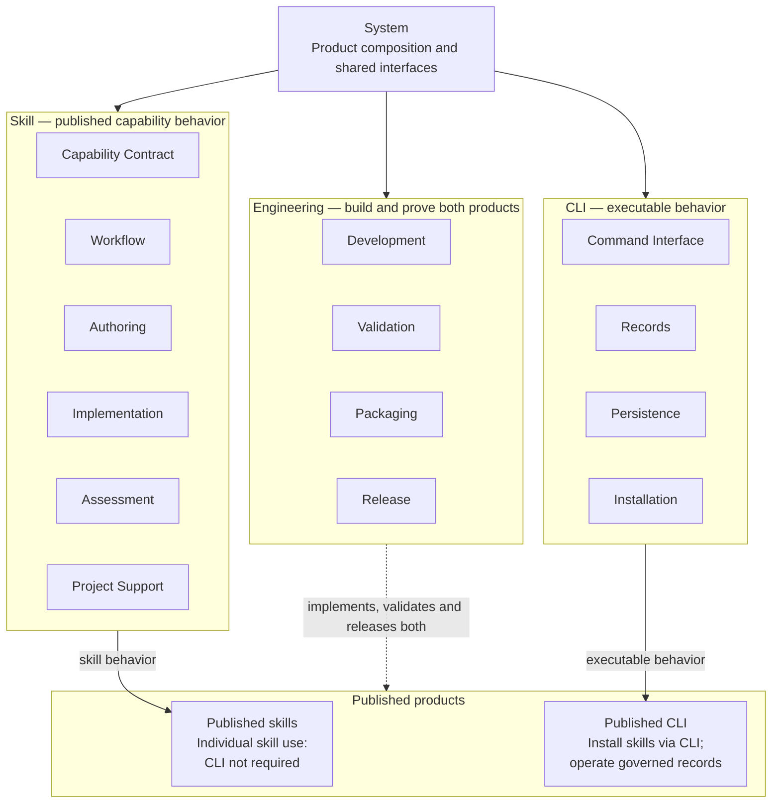
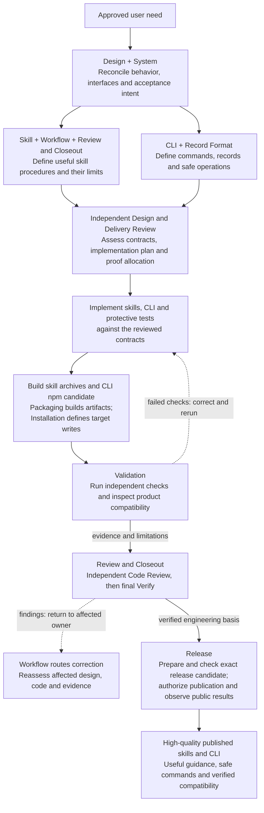

# RigorLoop System Model Design

Model validation contract: model-document-v1

Owning change: [three-model reconciliation](../changes/2026-09-12-unified-validation-model/change.json).

## Abstract

RigorLoop delivers published skills and a CLI for AI-assisted software engineering. Skills guide agents through useful, bounded activities; the CLI performs explicit inspection, record updates and skill installation. Individual skills can be used without the CLI. Current governed recording requires it, and CLI-based installation requires it only for that method. Engineering uses RigorLoop to build and independently prove both products. System owns their composition and shared interfaces.

## Model hierarchy

System has three main models: [Skill](skill/skill.md), [CLI](cli/cli.md) and [Engineering](engineering/engineering.md). Each parent owns its children's integration; each child owns its detailed contract once. Logical children may be named sections or stable separate documents. The project directory layout mirrors these three main owners; stable model and requirement IDs remain unchanged when a document moves.

Boxes express responsibility, not stage order. Product-contract arrows define the two delivered behaviors; Engineering implements, validates and releases them. Self-use of a skill or CLI is not proof of a candidate's correctness. The development tool basis, exact candidate and independent judgments remain distinguishable.

### Repository directory layout

This repository explicitly selects `docs/design/system.md` as its composition root. Main owners are `skill/skill.md`, `cli/cli.md` and `engineering/engineering.md` under `docs/design/`. Skill owns `workflow.md`, `assessment.md` and `authoring/design.md`; CLI owns `records.md` and `installation.md`; Engineering owns `validation.md`, `packaging.md` and `release.md`. Smaller logical children remain named sections in their parent. This project-specific layout does not change the portable Design skill default.

CLI examples remain under `cli/examples/`; Records examples have the distinct `cli/examples/records/` namespace. Workflow examples live under `skill/examples/workflow/`. Each namespace has one owning model and selection must validate that owner. Historical record subjects and example payload identities retain their original meaning; current registries and navigation follow the new paths without rewriting prior approval.

The [directory plan](../plans/2026-09-12-design-directory-layout.md) allocates the coordinated moves and actual-reader corrections. New model path exceptions are exact declared paths, not permission for arbitrary nested or example documents to become normative models. Missing or symlinked targets still fail validation.

### Responsibility inventory

| Parent | Submodel and authoritative contract | Contribution to the product |
| --- | --- | --- |
| Skill | [Capability Contract](skill/skill.md#capability-contract) | Common invocation, resources, outputs, portability, failures and limits. |
| Skill | [Workflow](skill/workflow.md) | Published activity coordination, handoffs and correction. |
| Skill | [Authoring](skill/skill.md#authoring), including the [Design method](skill/authoring/design.md) | Proposal, design and delivery-plan behavior. |
| Skill | [Implementation](skill/skill.md#implementation) | Scoped implementation, bugfix and CI-maintenance behavior. |
| Skill | [Assessment](skill/assessment.md) | Independent review, findings, evidence applicability and closeout behavior. |
| Skill | [Project Support](skill/skill.md#project-support) | Vision, governance, discovery, research, orientation, learning and authorized PR handoff. |
| CLI | [Command Interface](cli/cli.md#command-interface) | Commands, selectors, inputs, results and diagnostics. |
| CLI | [Records](cli/records.md) | Stored data, identities, versions and preservation invariants. |
| CLI | [Persistence](cli/cli.md#persistence) | Lossless updates, concurrency, atomic writes and recovery. |
| CLI | [Installation](cli/installation.md) | Trusted skill acquisition, destination conflicts and safe replacement. |
| Engineering | [Development](engineering/engineering.md#development) | Use the product to implement and independently assess this repository. |
| Engineering | [Validation](engineering/validation.md) | Useful proof and isolated, bounded parallel check execution without a cache. |
| Engineering | [Packaging](engineering/packaging.md) | Canonical sources to reproducible skill archives and CLI candidates. |
| Engineering | [Release](engineering/release.md) | Candidate qualification, authorization, publication and observed public results. |

The reusable proof criteria in Validation are referenced by Skill capabilities; repository executor details stay in Engineering. Assessment defines behavior we publish, while Development allocates and performs those assessments here. Packaging defines the archive/metadata representation; Installation consumes it and owns project writes. A shared executable or resource does not merge those contracts.

## Requirements

| ID | Required behavior |
| --- | --- |
| SYS-SR-01 | The system view MUST identify external actors/boundaries, component responsibility owners, significant dependencies and unmigrated current owners. A model inventory MUST NOT imply repository-wide consolidation or deployment boundaries that do not exist. |
| SYS-SR-02 | Each system interaction MUST reference its shared-contract owner and affected consumers. System prose MUST NOT duplicate local normative contracts or silently resolve a governance/component conflict by declaring itself superior. |
| SYS-SR-03 | A normal authored change MUST preserve a traceable chain from approved direction through affected Design requirements/decisions to Delivery allocation and implementation/evidence, with the independently assessed subjects identifiable. No handoff may require reconstructing a competing spec/architecture pair for a migrated obligation. |
| SYS-SR-04 | A shared authoring or interface change MUST reconcile producer and consumer behavior across the affected path before downstream reliance. Local checks alone MUST NOT establish the system-wide claim when a routing, review, planning, packaging or installation mismatch can violate it. |
| SYS-SR-05 | The assembled source/package/install path MUST preserve the one current authoring contract selected by Design DES-SR-01/15/17/18, alongside existing resource-integrity, installer-safety and separate adoption authorities. Packaging success MUST NOT imply Design approval, publication permission or customer adoption. |
| SYS-SR-06 | Current model truth, mutable work state, review judgments, proof and historical sources MUST remain distinguishable across composition. Identity/applicability checks and correction paths MUST consume Review and Closeout, Workflow, Record Format and CLI contracts without granting readiness through a save or reusing old approvals for new subjects. |
| SYS-SR-07 | The selected migration MUST retire the mapped current method/composition authority after coherent adoption, preserve the mixed architecture's unmigrated responsibilities and historical meaning, and leave named follow-up ownership. No unlisted source is a blanket deletion target. |
| SYS-SR-08 | The Design and System slice MUST include representative integrated acceptance outcomes and sufficient observation boundaries to distinguish coherent operation from a local-only success. Validation owns proof-quality criteria; Delivery and specialists retain concrete allocation and assessment. |
| SYS-SR-09 | Interruption, conflicting ownership, stale consumer basis or an incomplete candidate package MUST prevent reliance on the affected composed claim and retain a safe owned correction path. Recovery or rollback MUST preserve historical evidence and unrelated state under existing permissions. |

## Product and environment boundaries

Canonical skill sources are `skills/<name>/SKILL.md` and mapped resources; Distribution's generation contract now belongs to Engineering Packaging. `packages/rigorloop/` supplies the `@xiongxianfei/rigorloop` npm package and `rigorloop` executable. User/agent runtimes execute skill instructions; CLI commands execute explicit requests. Customer project artifacts, records, installed filesystem state and public release hosts are separate observation boundaries.

Skills can produce a portable scoped artifact or assessment without recording workflow state. For governed recording, skills instruct the agent to read scoped context and exact subjects, make its decision and submit the appropriate CLI request. CLI validates and preserves that explicit update; it does not infer the next activity or approve its caller's decision. Project governance and actual execution permissions always remain applicable.

## Shared interfaces

| Producer and consumer | Owning contract | Coherent observable outcome |
| --- | --- | --- |
| Published skills → agent → CLI | Skill behavior; CLI request/result contract | Documented commands accept the documented selectors and input; scope/diagnostics remain explicit and are interpreted before continuation. |
| Actor decisions → stored records → another actor | Workflow/Assessment for meaning; Records for representation; Persistence for writes | Current work, findings, evidence and closeout can be understood without prior chat; a successful save does not establish justified approval. |
| Package builder → installer | Packaging for descriptor/archive/metadata identity; Installation for trust and destination writes | Actual packed-CLI installation consumes verified candidates, preserves unrelated data and never adopts workflow governance. |
| Product contracts → validation and assessment | Product owner for intended behavior; Validation for proof; Assessment for judgment | Checks demonstrate meaningful protected outcomes, and specialists assess their adequacy against exact subjects. |
| Engineering candidates → public products | Packaging for artifacts; Release for public transaction | Candidate and published identities agree; local passes cannot substitute for public observations or authorization. |

An interface change identifies all actual producers and consumers. Unknown ownership is resolved before affected reliance. Local checks, matching hashes and a model inventory do not certify whole-product behavior. Shared methods stay at their named owner; neither Engineering nor System copies them as a competing policy.

## Building quality into the products

The graph follows how this repository establishes quality, from intended behavior to the exact products users receive. Workflow coordinates the activities and correction paths. Model names identify the contracts applied at each step; authors, implementers, reviewers and release tooling perform the work.

Quality has several distinct obligations. Skill and the specialist method owners make procedures useful and complete. CLI and Record Format make operations explicit and preserve state safely. Packaging preserves artifact content/resources; CLI Installation preserves the verified content during target writes. Validation supplies attributable observations, including negative cases and skill/CLI compatibility; independent assessors judge whether those observations establish the intended behavior. Release establishes the public identity and availability of the delivered artifacts. None of these obligations is satisfied by the existence of a model document alone.

The correction node returns work to its actual owner rather than treating every failure as an implementation bug. A contract gap changes the affected Design and its downstream basis; a defective implementation returns to implementation. Required milestone reviews and fresh whole-change Code Review precede distinct final Verify. The graph summarizes those repeated activities, not a replacement stage order or a permission to skip reviews. A verified engineering basis also does not authorize publication: Release prepares and checks the release candidate and obtains the separately required authorization.

Existing build/check entrypoints include `scripts/build-adapters.py`, `scripts/validate-adapters.py`, CLI tests under `packages/rigorloop/test/`, `scripts/select-validation.py`, `scripts/ci.sh` and `scripts/release-verify.sh`. Delivery and Release select their exact applicable composition under the owning contracts. Concrete integration outcomes below distinguish a product whose separate parts pass checks from skills and a CLI that work together.

## Integrated acceptance

Under SYS-SR-04/05/06/08/09, Delivery allocates proof at the actual generated-package and CLI boundaries. Static model validity alone cannot demonstrate these outcomes.

| Representative condition | Observable result and responsible boundary |
| --- | --- |
| A generated governed skill and candidate CLI are used together | The packaged resources resolve, documented commands accept their documented shapes, and scoped reads expose the expected records. Skill, Distribution, CLI and Record Format agree. |
| A skill's instruction assumes a retired command or incompatible response | Product compatibility assessment identifies the mismatch; a package-content-only pass cannot establish readiness. Correction belongs to the instruction owner or CLI contract owner according to the intended behavior. |
| Two actors record against the same prior basis | CLI reports the conflict without overwriting the other update. The skill procedure obtains a fresh basis and the actor reassesses the decision; a blind retry does not manufacture approval. |
| Skill installation encounters an existing conflicting destination | Distribution's default conflict behavior preserves it; explicit complete replacement follows its contract. Engineering records remain outside installer mutation. |
| Checks pass but required independent assessment is missing or rejects the change | Validation results remain factual evidence. Workflow and Review and Closeout prevent an unsupported closeout claim. |
| A candidate passes locally but public artifact identity or availability differs | Release reports the actual public outcome and applies its recovery contract; local validation cannot substitute for publication observation. |

This is a project-specific design allocation, not a claim that the generated artifacts or release have passed these scenarios. Independent Design Review assesses the affected models and interfaces; Delivery owns concrete verification allocation and implementation follows that reviewed package.

## Failure, concurrency and recovery

A validation failure returns to the responsible implementation or contract owner. An independent finding keeps its origin and is disposed by the responsible assessor. Concurrent or interrupted record writes retain the Records/Persistence invariants; restoration of storage does not restore semantic approval. A partial installation or publication retains its operation-specific safety and truthful result contract. No recovery path may delete historical engineering evidence or unrelated user files as routine cleanup.

## Adoption and source reconciliation

The [approved hierarchy proposal](../proposals/2026-09-12-skill-cli-engineering-model-hierarchy.md) extends the [unified Validation proposal](../proposals/2026-09-12-unified-validation-model.md), preserving no-cache, independent-case, bounded-concurrency and actual cleanup goals. The [reconciliation evidence (`design-preservation-delta`)](../changes/2026-09-12-unified-validation-model/evidence.json) assigns each source and records the exact prior basis. Original source IDs and judgments retain their historical meaning. Detailed source/consumer migration must be reviewed and implemented before runtime adoption is claimed; this Design is not a release or customer-activation record.

The earlier mixed-architecture and necessary-design consolidation maps below retain their scoped source dispositions. They do not introduce additional peer main models or unbounded file-deletion authority. Original lifecycle decisions live in their owning change records rather than another chronological narrative here.

### Exact mixed-architecture migration boundary

Source locations refer to the inspected baseline of `docs/architecture/system/architecture.md`; its subject identity is recorded with this change's authoring basis. Heading names and selected paragraph/bullet descriptions disambiguate ranges. Only the selected text is replaced in the adopting implementation. Unselected content, especially detailed Level 2 blocks and release/automation/CLI histories, is retained under its existing amended contracts.

| Selected source section and exact text boundary | Replacement owner | Disposition at adoption |
| --- | --- | --- |
| Introduction and Goals: opening system-description paragraph; following canonical-method paragraph; goal bullets for structure, architecture reasoning, canonical vs historical evidence, smallest surface and ADR rationale | SYS-SR-01/03 and Design DES-SR-02/05/06 | Replace composition/method claims with links here and to Design. Preserve unrelated product/release/CLI goals below these selected bullets. |
| Architecture Constraints: bullets naming architecture-method spec ownership, workflow's method role, canonical package/diagram path, architecture/ADR scaffolds, lowest sufficient surface and no normal deltas | Design DES-SR-01/02/05/06/13/14/18 | Replace those method constraints with declared Design ownership and conditional legacy treatment. Retain Constitution, source boundaries, independent state/installation/release/validation constraints and all unselected bullets. |
| Context and Scope: external repository actors, canonical included/excluded scope, target-agent interpretation boundary and context-diagram navigation | SYS-SR-01/05 and Context and Scope above | Replace the system-level explanation with this view; preserve old diagram access as historical/unmigrated evidence, not current composition authority. |
| Solution Strategy: first four paragraphs through architecture-review comparison of runtime/deployment/quality/decision history | SYS-SR-02/03 and Design method | Replace with references to current owners. Retain subsequent published-skill product-gate, state/CLI and release strategies under their existing owners. |
| Building Block View: opening system-level description and complete Level 1 White-Box table only, stopping before Level 2 White-Box: Project-Map Skill Package | SYS-SR-01/02 and responsibility inventory above | Replace high-level ownership catalogue with a System link. Retain all Level 2 blocks as unmigrated detail, including their applicable prior amendments. |
| Runtime View → Architecture update flow: all eight steps | Design Runtime View; SYS-SR-03/04 | Replace separate authoring/package handoff with the unified method link. Preserve every subsequent runtime subsection; their directly affected references still need scoped consumer reconciliation. |
| Crosscutting Concepts → Source of truth: both paragraphs | Design DES-SR-02/11/13/18; SYS-SR-02/06 | Remove duplicate model/method authority and outdated flat-model navigation; reference actual owners and the applicable adopted profile. |
| Crosscutting Concepts → Lowest sufficient architecture surface: opening and four bullets | Design DES-SR-02/04/05/06/14 | Replace old normal output selection with unified authoring and scoped legacy treatment. |
| Crosscutting Concepts → Diagram source policy: entire single paragraph | Design Technical reasoning and decisions | Replace fixed architecture diagram placement with one-owner text-source guidance; old diagrams retain their historical identity. |
| Crosscutting Concepts → Legacy architecture handling: entire paragraph | SYS-SR-07 and adoption boundary below | Retain the factual earlier eight-file normalization as historical evidence; explicitly distinguish it from incomplete Design consolidation. |
| Architecture Decisions: only entries for ADR-20260428-architecture-package-method and ADR-20260509-architecture-skill-surface-simplification, including their summaries in historical follow-on prose | Design Material decision preservation and DES-DEC-01–05 | Current index identifies replacement decision ownership. Preserve all other ADR references and historical follow-on narrative; do not rewrite old approval claims as new approvals. |

An opening notice in the mixed architecture must name this exact boundary and link to the surviving owners. Unmigrated sections remain distinguishable as current responsibility detail or explicit historical evidence under their existing amendments; the notice must not declare the whole file obsolete. The entire architecture file and its diagrams are not deletion targets.

### Necessary-design consolidation map

The [merged direction](../proposals/2026-09-09-consolidate-necessary-design-and-retire-superseded-sources.md) selects a bounded first source group. The affected Design package is Design DES-SR-13/18/21, Validation TEST-SR-08/10/12/14 and this composition under SYS-SR-02/04/06/07/08/09. Skill, Review and Closeout, Workflow, Record Format and CLI remain unchanged dependencies. No separate Validation model is needed: the new choices concern document disposition and protective-value criteria, while operational execution remains with its declared sources.

This map selects exact edits for Delivery, not completed removals. At coherent adoption, replace the selected duplicated authority with owner references and remove the named redundant sources. Preserve all unlisted source content. Until that adoption, existing source clauses govern with their already-adopted amendments. New Test procedural exceptions apply only to this cleanup; they do not silently change unrelated check-retirement policy.

| Selected source / exact boundary | Necessary meaning and destination | Adoption disposition |
| --- | --- | --- |
| `specs/published-skill-first-repository-simplification.md`: R14, R17–20 and R22 as applied to this selected cleanup; corresponding ledger, dual-proof and metrics instructions in Outputs, State and invariants, Error and boundary behavior, Compatibility and migration, Observability, Performance expectations and AC7/AC8/AC10 | Test's complete retained-contract table under TEST-SR-14 preserves protected failures, applicability, fixture distinctions, owned retirement, retained detection, uncertainty stops and recovery. It explicitly replaces compulsory second-ledger, repeated old-proof and measurement procedures for this slice. | Add one exact scoped amendment naming Test and its population; do not duplicate the replacement rules in the spec. Retain original R definitions for unselected work, subject to the already-adopted Workflow stored-format amendment. A reader can distinguish the populations without reconstructing archived prose. |
| Same spec: all other clauses, R1–13, R15/16, R21 and R23–29, including their applicable later amendments and related examples, boundaries and acceptance intent | Existing operational contract remains: canonical/package/release proof, deterministic-versus-semantic boundary, local filesystem proof, admission limits, CI composition and target support. Skill already owns common content invariants; current v3 recording uses CLI/Record Format under the stored-format supersession, not a restored lifecycle parser. | Retain as an explicitly mixed source. R26's exact historical-proof supersessions and R27/R29's remaining integrity and claim restrictions stay readable. This slice does not extract Distribution, Installation, Release, selection/cache, measurement or automation contracts merely to delete this file. |
| `docs/adr/ADR-20260810-published-skill-first-validation-architecture.md`: entire document | Its product-chain, target support, release composition, semantic boundary, local-materialization and admission decisions are already precise in retained spec R1–13/R15/16/R21/R24–29. Retirement meaning follows Test for this slice and the retained source/Workflow for other populations. Necessary alternatives and consequences are preserved in SYS-DEC-04 below. | Remove after these destinations and current consumers are adopted. No original-path stub or archive copy. Its original review remains about its historical identity, not these replacement models. |
| `docs/architecture/system/architecture.md`: complete subsections “Level 2 White-Box: Published-Skill Validation”, “Published-skill product-gate and retirement flow” and “Published-skill-first validation boundary” | Product/recording/semantic composition resolves to the responsibility inventory and interaction owners here; local invariants remain at Skill, CLI/Record Format and the retained operational spec. Validation preserves TEST-SR-14 for this cleanup's retirement criteria. | Remove these three redundant descriptions and their repeated ledger procedure. Retain the distinct Validation and Generation Scripts, Validation flow and Validation layering subsections with their current stored-format qualifications and separate selector/cache/output contracts. |
| Same architecture: the validation ADR and `component-published-skill-validation.mmd` navigation entries, inline diagram reference in Validation and Generation Scripts, and validation ADR summary in Architecture Decisions | Current navigation resolves to this composition map and the actual local owners, with no repeated normative summary. | Reconcile current references. The final historical follow-on sentence citing the original ADR records its original proposed decision and is not retargeted to a new assessed subject. An incidental historical citation does not restore current reliance. |
| `docs/architecture/system/diagrams/component-published-skill-validation.mmd`: entire diagram | Canonical→package→release dependency, separate semantic/record validation, and external target-runtime boundary are already expressed here and in retained R1–13. The old YAML/Markdown lifecycle label is not a supported current representation. | Remove with its current embedding/navigation; no new duplicate diagram is needed for this tabular composition. Preserve unrelated diagrams. |
| `specs/published-skill-first-repository-simplification.test.md`: selected cleanup applicability only; retain the remaining file and historical input-identity table | Existing T1/T10/T13/T14 ledger/measurement/dual-proof prescriptions do not override TEST-SR-14 for this slice. Other tests still describe unmigrated package, release and installer failure boundaries; historical review identities remain attributable. | Add a scoped current-use notice referencing the adopted source amendment and the owning Delivery allocation, without rewriting historical test outcomes or identifiers. Do not rerun historical commands merely because they appear here. Retain the file for its unmigrated proof intent; no new standalone test spec. |

There is no selected redundant copy of these two removal targets in `docs/archive/`; the Skill-resource archives are different subjects under their earlier retention policy. They are not cleanup targets. Historical `docs/changes/` records, input-identity tables, old plans and review citations remain unmodified. This change does not rely on their original ADR/diagram approval to establish current Design correctness; its own exact-subject review and evidence supply that basis. An actual reader or current reliance discovered during implementation must be reconciled or explicitly retained before removal, rather than dismissed as historical.

### Necessary-design consumer and acceptance boundary

| Consumer | Selected treatment and observation boundary |
| --- | --- |
| System Skill inventory and FU-012 | Correct the completed common Skill ownership from its original final review/Verify basis; no repeat of the pilot. Route updates FU-012's receiving direction to this consolidation and the named local owners, preserving any remaining validation work explicitly. FU-013/014 and FU-015–018 remain separate. |
| Source and navigation readers | Reconcile the exact current ADR/diagram references and scoped spec/test-spec notices above. Check current readers against destination sections and retained exceptions; historical citations remain historical and grant no current approval. |
| `scripts/test-retirement-ledger.py`, `scripts/retirement_ledger.py` and the earlier `retirement-ledger.json` | Retain unchanged: the regression suite reads the historical ledger as an operational fixture. TEST-SR-14 removes a new ledger obligation for this slice, not that consumer or its data. A ledger basename is not a deletion criterion. |
| `scripts/ci.sh`, validation selectors and check identifiers | Keep execution and public interface behavior unchanged. Gate A/B/C remain compatible command/result aliases; ordinary Design prose uses skill/package/release checks. No universal alias rewrite or CI redesign is selected. |
| Canonical skill resources, adapter builders and candidate metadata | No authored skill/resource change is selected. Confirm source/reader dependencies during allocation. If a necessary correction changes packaged inputs, trace archive bytes to current candidate metadata and dependent assertions; regenerate through existing builders and run directly dependent checks, or record an inspected unaffected disposition. Preserve historical releases and publication boundaries. |
| Design/Delivery/review/Verify | Assess the exact three changed models, this source map and retained source amendments. Allocate changed structural/reference checks and semantic preservation; add executable or package proof only for an affected boundary. RC-SR-15 owns reuse, and explicit current freshness rules still apply. |

For SYS-SR-02/04/06/07/08, demonstrate a removed ADR/diagram with complete current meaning and working current references, a mixed specification retaining its exact operational population, and an unchanged ledger fixture still usable without adding a new ledger. For SYS-SR-04/09, a newly discovered operational reader prevents its source's removal until correction or justified retention; a dependency-affecting edit invalidates any claim of source-only impact. These supplement Composition/path, Compatibility/migration and Failure/recovery scenarios. The accepted completion is actual justified cleanup and coherent owners, not an inventory-only audit or a new model file.

Coordinated adoption requires independently reviewed Design and Delivery, implemented source/consumer dispositions, milestone assessments, fresh whole-change Code Review and distinct successful Verify. A partial removal leaves its exact owner and need explicit; it cannot count as completed removal. Restore a failed source/consumer slice together if necessary, with current applicability assessed; no historical evidence is rewritten. No external installation, release or publication follows from these checks.

## Boundary conditions

### Boundary scan and acceptance scenarios

| Dimension | Requirement basis | Distinct outcome to demonstrate |
| --- | --- | --- |
| Input domain | SYS-SR-01, SYS-SR-02, SYS-SR-07 | A reader locates the owner of model authoring, recording and an unmigrated installer contract without treating the inventory as new approval of every historical source. Unknown ownership remains an explicit gap. |
| State/lifecycle | SYS-SR-03, SYS-SR-05, SYS-SR-06 | Proposal approval, model validation and generated archive success remain distinguishable from Design approval, implementation readiness, publication and customer adoption. |
| Identity/authority | SYS-SR-02, SYS-SR-06 | A System/component contradiction returns to its governing owner; system prose cannot overrule a component. A model revision cannot inherit the old exact-subject approval. |
| Composition/path | SYS-SR-03, SYS-SR-04, SYS-SR-05, SYS-SR-08 | The unified authoring path supplies one coherent affected-model package to review and usable local/integrated outcomes to planning, while generated/installed guidance contains design alone. A stale routing, review tuple or old entrypoint is visible despite a passing local skill check. |
| Temporal/retry | SYS-SR-04, SYS-SR-06, SYS-SR-09 | Concurrent shared-method and consumer edits trigger explicit applicability assessment before handoff; an interrupted recording or install retry cannot overwrite unrelated work or refresh an old judgment. |
| Failure/recovery | SYS-SR-05, SYS-SR-09 | Missing required package resources or an obsolete target entry stops the affected path with an owned repair and preserved files/state. Local success elsewhere does not erase that composed failure. |
| Compatibility/migration | SYS-SR-01, SYS-SR-05, SYS-SR-07 | The selected method/composition clauses resolve to one new owner, mixed architecture retains its named remainder, and historical ADR/review bytes keep their original meaning. Unrelated legacy work can proceed through scoped design authoring without full migration. |
| External/environment | SYS-SR-03, SYS-SR-05, SYS-SR-06, SYS-SR-08 | A new reader or clean target installation can use the declared artifact/package boundaries without internal Design checkout, old chat or a PR; no target-agent correctness or release authorization is inferred. |

The representative integrated outcomes are the actual authoring-method change above, a scoped unmigrated installer amendment, and interrupted package/record reconciliation. Material combined hazards are a new producer plus an old consumer, a replacement ownership map plus a still-current duplicate, and an unchanged filename plus changed assessment basis. SYS-SR-02/04/05/06/07/09 own their outcomes. Delivery must observe the composed boundary rather than substitute isolated parsing or helper-only proof.

## Architecture Decisions

| ID | Context and decision | Alternatives and consequences |
| --- | --- | --- |
| SYS-DEC-01 | The large architecture mixes current system relationships with detailed old contracts. Establish a bounded System owner for composition and retain declared local/unmigrated owners. | Rewriting the whole architecture delays the selected capability; using only component models hides integrated obligations. A bounded view requires explicit residual ownership and later consolidation. |
| SYS-DEC-02 | Shared authoring affects semantic and packaged consumers. Assess the end-to-end path using owner references and integrated outcomes. | Treating a generated package or a valid model as sufficient misses stale routing/review/installation consumers. Delivery must allocate real composed proof without inventing a new readiness service. |
| SYS-DEC-04 | Consolidate the validation-related duplicate source descriptions into existing owners, retaining necessary operational remainders. Preserve the original validation ADR's distinction between deterministic product proof, semantic assessment and external agent behavior, and its recoverable bounded-retirement reasoning. | Keeping all machinery perpetuates competing ownership; moving it elsewhere only relocates complexity. Codex-only or all-target runtime certification adds nondeterministic model/version/transcript obligations without proving package parity. Deleting all checks loses undocumented protection. Retain equivalent supported-target package proof, composed release checks and owned rollback; target-runtime defects remain legitimate issues without becoming routine certification. No new Validation model or automatic archive is needed for these responsibilities. |
| SYS-DEC-03 | Preserve historical system/ADR context and distinguish previous normalization from this consolidation. | Deleting the mixed file or rewriting historical approvals loses decision meaning. Current navigation becomes clearer while the remaining format diversity is explicit technical debt. |

No separate ADR is created for this model-profile draft. These decisions concern the selected system responsibility; source-method decisions remain owned by Design's preservation map.

The hierarchy replaces the former flat peer inventory. Skill owns published behavior, CLI owns executable behavior, and Engineering owns this repository's realization. Named child sections avoid a file for every small capability while separately maintained complex contracts remain individually reviewable. Packaging and Installation split the former Distribution ownership because producing artifacts and mutating customer files have different authority and failure boundaries.

## Next artifacts

Independent Design Review of the reconciled parents, children, retained legacy contracts and examples; Delivery then allocates implementation, source/consumer cleanup and proof. Required Code Reviews and distinct Verify establish the implemented result. Publication requires the Release-owned authorization.
