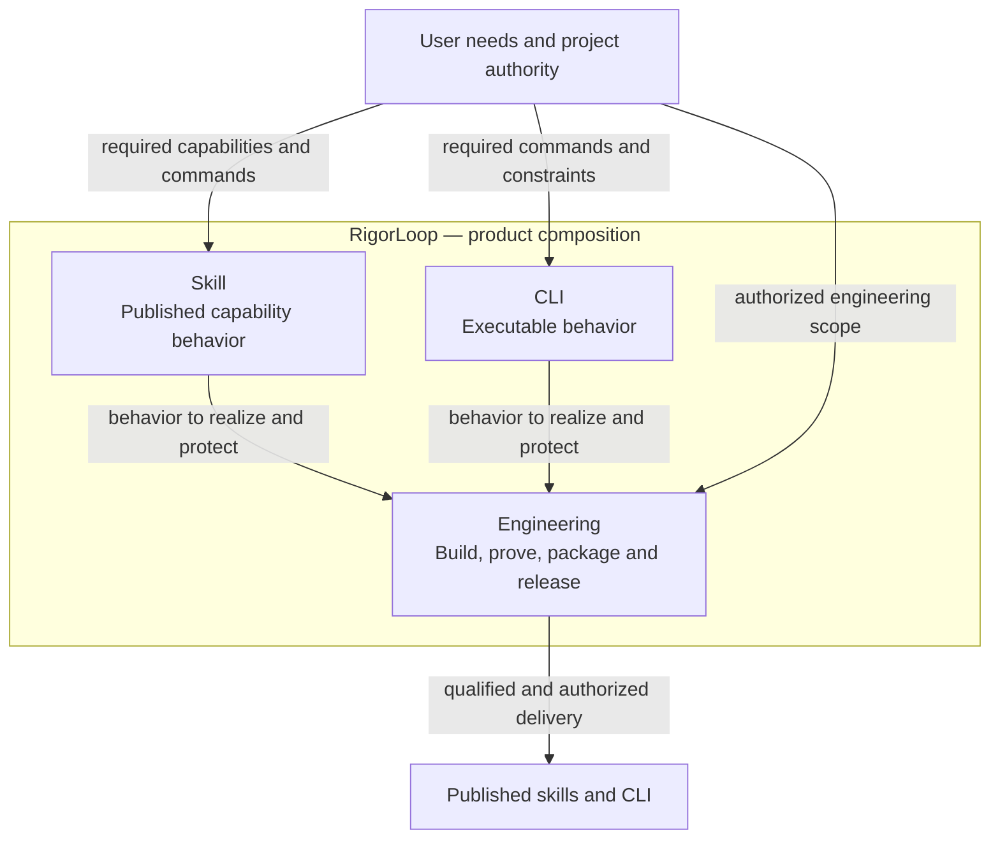
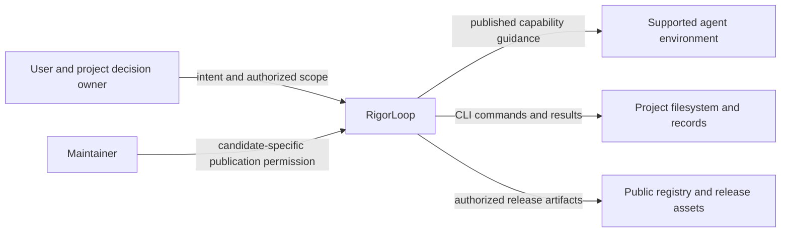
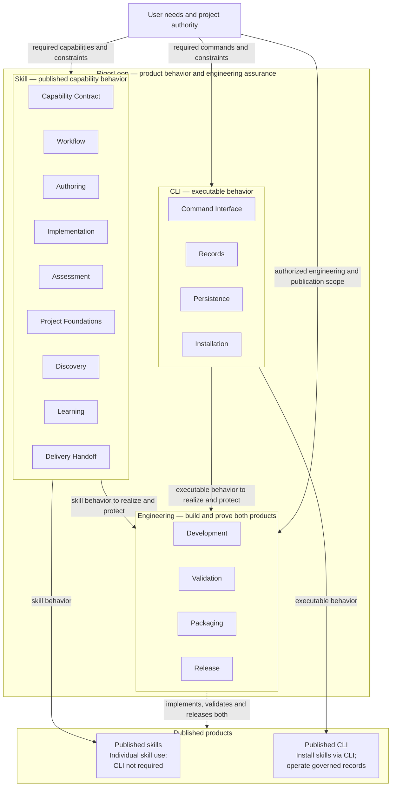
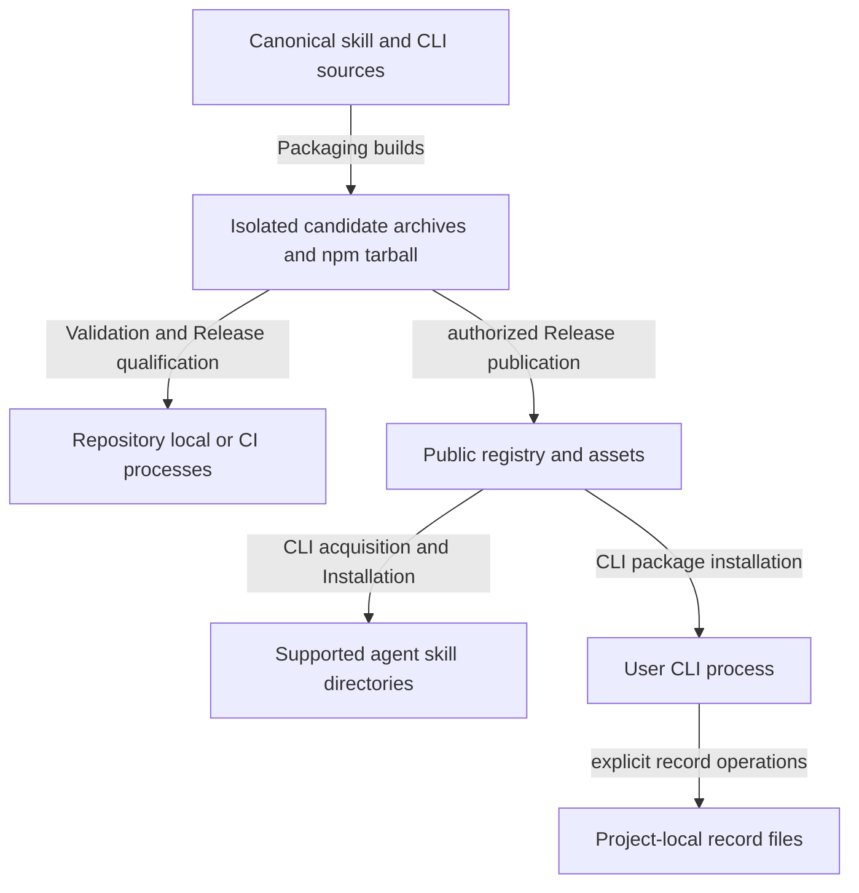
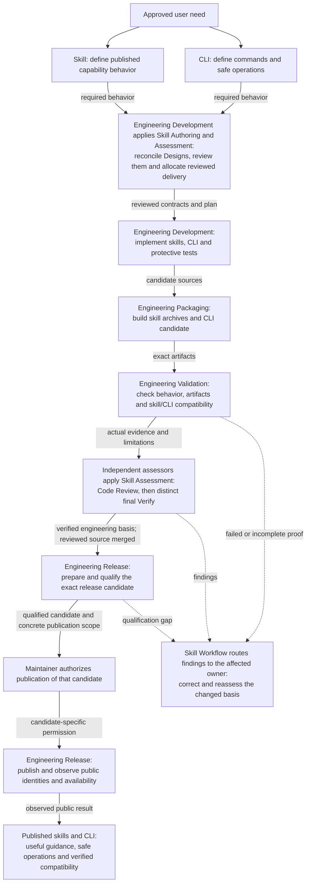

# RigorLoop System Model Design

Model validation contract: model-document-v1

Owning change: [current-design repository cleanup](../changes/2026-09-13-current-design-repository-cleanup/change.json).

Original composition adoption: [three-model reconciliation](../changes/2026-09-12-unified-validation-model/change.json).

Prior refinement: [independent parallel tests](../changes/2026-09-13-independent-parallel-tests/change.json); its selected behavior and evidence retain their own scope.

For this repository’s [complete source retirement](../changes/2026-09-14-retire-specs-and-stale-tests/source-disposition.md), current responsibilities are self-contained in the owning Designs. Original source-transfer inventories remain recoverable through [Historical provenance](#historical-provenance); their instructions to retain or amend legacy specs, architecture, activation state or retired engines are historical and superseded by this complete retirement. Source-qualified IDs and original judgments keep their original meaning; provenance is not a runtime input or current approval. Customer feature contracts and explicit portable resources remain supported under their own project authority. Supported output is bounded by the Design owner: standalone architecture/ADR authoring is retired, while source interpretation and customer feature-spec support remain.

## Abstract

RigorLoop delivers published skills and a CLI for AI-assisted software engineering. Skills guide agents through useful, bounded activities; the CLI performs explicit inspection, record updates and skill installation. Individual skills can be used without the CLI. Current governed recording requires it, and CLI-based installation requires it only for that method. Engineering uses RigorLoop to build and independently prove both products. System owns their composition and shared interfaces.

## Reading guide

Use the [responsibility inventory](#responsibility-inventory) to locate the existing owner, the [shared interfaces](#shared-interfaces) to identify its neighbors, and the [end-to-end flow](#end-to-end-system-design) to understand delivery. [Integrated acceptance](#integrated-acceptance) and [failure handling](#failure-concurrency-and-recovery) explain the composed outcomes.

[Current cleanup composition](#current-repository-cleanup-composition) and [complete spec retirement](#complete-repository-spec-retirement) identify today's source boundaries. [Historical provenance](#historical-provenance) identifies the recoverable source-transfer maps. The hierarchy and detailed ownership remain unchanged.

## Architecture Overview

### Model hierarchy

System has three main models: [Skill](skill/skill.md), [CLI](cli/cli.md) and [Engineering](engineering/engineering.md). Each parent owns its children's integration; each child owns its detailed contract once. Logical children may be named sections or stable separate documents. The project directory layout mirrors these three main owners; stable model and requirement IDs remain unchanged when a document moves.

This overview shows the three main owners and the delivered products. The [Building Block View](#building-block-view) retains the complete hierarchy and descendant orientation, with one authored source for that detail. Its invisible layout links carry no behavioral or execution-order meaning. The product arrows distinguish behavior definition from Engineering's implementation, validation and release responsibility. Individual skill use does not require the CLI; current governed recording does.

The [end-to-end system design](#end-to-end-system-design) below explains how these responsibilities cooperate to deliver the products. [Skill](skill/skill.md#subsystem-design-graph), [CLI](cli/cli.md#subsystem-design-graph) and [Engineering](engineering/engineering.md#subsystem-design-graph) own their detailed internal interaction graphs. The linked complete hierarchy provides descendant orientation without transferring ownership of those contracts.

### Architecture overview convention

[Design DES-SR-22](skill/authoring/design.md#architecture-overview-view-and-necessary-supporting-views) owns the overview and supporting-view method. System applies it to this product's composition; each parent applies it to its subsystem. A diagram summarizes its owning contract rather than introducing another policy source.

### Parent graph ownership

Each parent owns the integration of its named children; each child owns its detailed behavior. Cross-subsystem relationships belong to their nearest shared parent. System's overview and end-to-end flow link to those contracts, while parent-owned graphs explain internal interactions. Keep shared names and boundaries consistent and revise both ends of a changed relationship. Leaves need no artificial child graph. SYS-SR-10 owns this allocation; Design owns the reusable method.

### Repository directory layout

This repository explicitly selects `docs/design/system.md` as its composition root. Main owners are `skill/skill.md`, `cli/cli.md` and `engineering/engineering.md` under `docs/design/`. Skill owns `workflow.md`, `assessment.md`, `authoring/authoring.md`, `project-foundations/project-foundations.md`, `discovery/discovery.md`, `learning.md` and `delivery-handoff.md`; Project Foundations owns sibling `vision.md`, `constitution.md` and `project-map.md`; Discovery owns sibling `explore.md` and `research.md`; Authoring owns sibling `proposal.md`, `design.md` and `plan.md` in `skill/authoring/`; CLI owns `records.md` and `installation.md`; Engineering owns `validation.md`, `packaging.md` and `release.md`. A main model owns a directory and its same-named main document. A child with one document stays beside that main document. Create a child subfolder only when it has several cohesive documents or supporting resources with a clear owner; place its main document at `<child>/<child>.md`. Short responsibilities remain sections. Do not add a folder solely for a logical category or anticipated growth. These explicitly selected project paths take precedence over the portable Design skill default.

CLI examples remain under `cli/examples/`; Records examples have the distinct `cli/examples/records/` namespace. Workflow examples live under `skill/examples/workflow/`. Each namespace has one owning model and selection must validate that owner. Historical record subjects and example payload identities retain their original meaning; current registries and navigation follow the new paths without rewriting prior approval.

The [directory plan](../plans/2026-09-12-design-directory-layout.md) allocates the coordinated moves and actual-reader corrections. New model path exceptions are exact declared paths, not permission for arbitrary nested or example documents to become normative models. Missing or symlinked targets still fail validation.

### Validation source layout

Repository-level test sources belong under `tests/`, grouped by the owning Skill or Engineering capability; package-owned tests stay in `packages/<package>/test/`. `scripts/` retains supported runnable validation and maintenance commands. Internal implementation belongs under `scripts/lib/{validation,packaging,release}/`, and authored operational resources under `scripts/resources/`, according to [Engineering tooling organization](engineering/engineering.md#repository-tooling-organization). [Validation](engineering/validation.md#test-sources-groups-and-fixtures) owns the concrete test groups, fixture placement and protection-preserving migration contract. Directories follow actual cohesive responsibilities rather than mirroring every model leaf. Existing Python test paths remain supported until each coordinated source/caller migration is implemented and assessed; this layout decision does not itself move files or approve deletion.

### Responsibility inventory

| Parent | Submodel and authoritative contract | Contribution to the product |
| --- | --- | --- |
| Skill | [Capability Contract](skill/skill.md#capability-contract) | Common invocation, resources, outputs, portability, failures and limits. |
| Skill | [Workflow](skill/workflow.md) | Published activity coordination, handoffs and correction. |
| Skill | [Authoring](skill/authoring/authoring.md) | Proposal, design and delivery-plan behavior. |
| Authoring | [Proposal](skill/authoring/proposal.md) | Direction, scope, feasibility and proposal authoring. |
| Authoring | [Design Method](skill/authoring/design.md) | Required behavior, technical realization, decisions and acceptance intent. |
| Authoring | [Plan](skill/authoring/plan.md) | Milestone sequencing, verification allocation and approved-plan initialization. |
| Skill | [Implementation](skill/skill.md#implementation) | Scoped implementation, bugfix and CI-maintenance behavior. |
| Skill | [Assessment](skill/assessment.md) | Independent review, findings, evidence applicability and closeout behavior. |
| Skill | [Project Foundations](skill/project-foundations/project-foundations.md) | Purpose, governing principles and observed orientation. |
| Project Foundations | [Vision](skill/project-foundations/vision.md) | Canonical vision and derived README content. |
| Project Foundations | [Constitution](skill/project-foundations/constitution.md) | Governing engineering principles. |
| Project Foundations | [Project Map](skill/project-foundations/project-map.md) | Observed repository/area orientation. |
| Skill | [Discovery](skill/discovery/discovery.md) | Option-space and factual uncertainty support. |
| Discovery | [Explore](skill/discovery/explore.md) | Distinct options and trade-offs. |
| Discovery | [Research](skill/discovery/research.md) | Attributable facts, confidence and limits. |
| Skill | [Learning](skill/learning.md) | Confirmed lessons and route-result accountability. |
| Skill | [Delivery Handoff](skill/delivery-handoff.md) | Prepared and authorized PR handoff. |
| CLI | [Command Interface](cli/cli.md#command-interface) | Commands, selectors, inputs, results and diagnostics. |
| CLI | [Records](cli/records.md) | Stored data, identities, versions and preservation invariants. |
| CLI | [Persistence](cli/cli.md#persistence) | Lossless updates, concurrency, atomic writes and recovery. |
| CLI | [Installation](cli/installation.md) | Trusted skill acquisition, destination conflicts and safe replacement. |
| Engineering | [Development](engineering/engineering.md#development) | Use the product to implement and independently assess this repository. |
| Engineering | [Validation](engineering/validation.md) | Useful proof and isolated, bounded parallel check execution without a cache. |
| Engineering | [Packaging](engineering/packaging.md) | Canonical sources to reproducible skill archives and CLI candidates. |
| Engineering | [Release](engineering/release.md) | Candidate qualification, authorization, publication and observed public results. |

The reusable proof criteria in Validation are referenced by Skill capabilities; repository executor details stay in Engineering. Assessment defines behavior we publish, while Development allocates and performs those assessments here. Packaging defines the archive/metadata representation; Installation consumes it and owns project writes. A shared executable or resource does not merge those contracts.

### Supporting-view decisions

| View | Necessity and reason | Owning detail |
| --- | --- | --- |
| Context | Necessary: Product users, project decision owners and public delivery interfaces cross the system boundary. | [Context view](#context-view) |
| Building Block | Necessary: The three product/engineering owners and their children must remain visible without merging their contracts. | [Building Block view](#building-block-view) |
| Runtime | Necessary: Product delivery crosses authored behavior, implementation, independent proof and publication boundaries. | [Runtime view](#end-to-end-system-design) |
| Deployment | Necessary: Published skills, the executable and repository CI occupy different environments with different write authority. | [Deployment view](#deployment-view) |

## Architectural supporting views

These views elaborate the overview at the owning model boundary. Existing detailed contracts, scenario tables and external owners retain their authority.

### Context View

Product users, project decision owners and public delivery interfaces cross the system boundary. Detailed requirements and scenarios in this model remain authoritative.

### Building Block View

The three product/engineering owners and their children must remain visible without merging their contracts. Detailed requirements and scenarios in this model remain authoritative.

### Deployment View

Published skills, the executable and repository CI occupy different environments with different write authority. Detailed requirements and scenarios in this model remain authoritative.

## Requirements

| ID | Required behavior |
| --- | --- |
| SYS-SR-01 | The system view MUST identify external actors/boundaries, component responsibility owners, significant dependencies and unmigrated current owners. A model inventory MUST NOT imply repository-wide consolidation or deployment boundaries that do not exist. |
| SYS-SR-02 | Each system interaction MUST reference its shared-contract owner and affected consumers. System prose MUST NOT duplicate local normative contracts or silently resolve a governance/component conflict by declaring itself superior. |
| SYS-SR-03 | A normal authored change MUST preserve a traceable chain from approved direction through affected Design requirements/decisions to Delivery allocation and implementation/evidence, with the independently assessed subjects identifiable. No handoff may require reconstructing a competing spec/architecture pair for a migrated obligation. |
| SYS-SR-04 | A shared authoring or interface change MUST reconcile producer and consumer behavior across the affected path before downstream reliance. Local checks alone MUST NOT establish the system-wide claim when a routing, review, planning, packaging or installation mismatch can violate it. |
| SYS-SR-05 | The assembled source/package/install path MUST preserve the one current authoring contract selected by Design DES-SR-01/15/17/18, alongside existing resource-integrity, installer-safety and separate adoption authorities. Packaging success MUST NOT imply Design approval, publication permission or customer adoption. |
| SYS-SR-06 | Current model truth, mutable work state, review judgments, proof and historical sources MUST remain distinguishable across composition. Identity/applicability checks and correction paths MUST consume Review and Closeout, Workflow, Record Format and CLI contracts without granting readiness through a save or reusing old approvals for new subjects. |
| SYS-SR-07 | The selected migration MUST retire the mapped current method/composition authority after coherent adoption, preserve the mixed architecture's unmigrated responsibilities and historical meaning, and leave named follow-up ownership. No unlisted source is a blanket deletion target. |
| SYS-SR-08 | The Design and System slice MUST include representative integrated acceptance outcomes and sufficient observation boundaries to distinguish coherent operation from a local-only success. Validation owns proof-quality criteria; Delivery and specialists retain concrete allocation and assessment. |
| SYS-SR-09 | Interruption, conflicting ownership, stale consumer basis or an incomplete candidate package MUST prevent reliance on the affected composed claim and retain a safe owned correction path. Recovery or rollback MUST preserve historical evidence and unrelated state under existing permissions. |
| SYS-SR-10 | Every parent model in this repository MUST own the authoritative system design graph of its subsystem, including parents represented by named sections. The graph MUST identify immediate children, their responsibilities, significant relationships and relevant external boundaries, and link to child-owned detail. Detailed internal decomposition MUST remain with the nested parent; a structural overview MAY summarize descendants without taking ownership of their behavior. Cross-subsystem composition MUST remain with the nearest shared parent. System MUST retain both the full structural overview and the end-to-end design from intended product behavior through implementation, proof, independent assessment and authorized publication; links to subsystem graphs MUST NOT replace it. A graph change MUST remain consistent with affected contracts and receive their scoped assessment. |
| SYS-SR-11 | Each repository model MUST apply Design DES-SR-22 for its Architecture Overview View and evaluation of necessary Context, Building Block, Runtime and Deployment views. Parent overviews MUST identify their child models; leaf overviews MUST use actual owned concepts or responsibilities without inventing submodels or services. Views MUST preserve one detailed owner, consistent relationships and working links. |
| SYS-SR-12 | Repository cleanup MUST use the current responsibility inventory and the Constitution retention policy. Current navigation MUST identify current owners; historical provenance MAY resolve by recorded commit and path. Displaced clauses retain their meaning through explicit owner mappings, and unmapped current responsibilities MUST remain named retained contracts rather than be silently retired by directory deletion. |
| SYS-SR-13 | At complete repository spec retirement, every current responsibility formerly in specs/ MUST have a current model owner or explicit retirement disposition. The complete source and test population MUST be reconciled under Engineering; no unresolved family may be hidden in follow-up work. This repository layout MUST NOT prohibit customer feature documents or establish customer adoption. |

## Product and environment boundaries

Canonical skill sources are `skills/<name>/SKILL.md` and mapped resources; Distribution's generation contract now belongs to Engineering Packaging. `packages/rigorloop/` supplies the `@xiongxianfei/rigorloop` npm package and `rigorloop` executable. User/agent runtimes execute skill instructions; CLI commands execute explicit requests. Customer project artifacts, records, installed filesystem state and public release hosts are separate observation boundaries.

Skills can produce a portable scoped artifact or assessment without recording workflow state. For governed recording, skills instruct the agent to read scoped context and exact subjects, make its decision and submit the appropriate CLI request. CLI validates and preserves that explicit update; it does not infer the next activity or approve its caller's decision. Project governance and actual execution permissions always remain applicable.

## Shared interfaces

| Producer and consumer | Owning contract | Coherent observable outcome |
| --- | --- | --- |
| Published skills → agent → CLI | Skill behavior; CLI request/result contract | Documented commands accept the documented selectors and input; scope/diagnostics remain explicit and are interpreted before continuation. |
| Actor decisions → stored records → another actor | Workflow/Assessment for meaning; Records for representation; Persistence for writes | Current work, findings, evidence and closeout can be understood without prior chat; a successful save does not establish justified approval. |
| Package builder → installer | Packaging for descriptor/archive/metadata identity; Installation for trust and destination writes | Actual packed-CLI installation consumes verified candidates, preserves unrelated data and never adopts workflow governance. |
| Product contracts → validation and assessment | Product owner for intended behavior; Validation for proof; Assessment for judgment | Checks demonstrate meaningful protected outcomes, and specialists assess their adequacy against exact subjects. |
| Engineering candidates → public products | Packaging for artifacts; Release for public transaction | Candidate and published identities agree; local passes cannot substitute for public observations or authorization. |

An interface change identifies all actual producers and consumers. Unknown ownership is resolved before affected reliance. Local checks, matching hashes and a model inventory do not certify whole-product behavior. Shared methods stay at their named owner; neither Engineering nor System copies them as a competing policy.

### Engineering handoff boundaries

| Handoff | Producer supplies | Receiving owner decides |
| --- | --- | --- |
| Intent → direction | User need, project authority, constraints and proposal | Proposal Review assesses direction and feasibility. |
| Direction → Design | Approved direction or authorized correction | Design reconciles behavior, realization and acceptance intent; Design Review judges the exact affected package. |
| Design → delivery | Stable requirements, technical boundaries and local/integrated outcomes | Plan allocates work, checks and recovery; Delivery Review judges sequencing and proof adequacy. |
| Delivery → implementation | Reviewed allocation and authorized scope | Implementation produces the work and evidence; Code Review judges the actual contribution. |
| Reviewed work → closeout | Complete delivered change, current judgments, proof and concern dispositions | Verify judges final coherence and records the success-only explanation. Workflow records completion separately. |

Workflow coordinates these handoffs under Assessment's reliance rules. Records represents each actor's explicit decision; CLI persists it safely. Neither recording nor System's composition view supplies approval. Individual scoped invocations use their applicable boundaries without requiring an unrelated full lifecycle.

## Building quality into the products

### End-to-end system design

System owns the complete path from intended behavior to the products users receive. The hierarchy graph above explains responsibility ownership; this graph explains how those responsibilities cooperate to establish product quality. Labels identify the applied model contracts and the work performed under them.

The [Skill](skill/skill.md#subsystem-design-graph), [CLI](cli/cli.md#subsystem-design-graph) and [Engineering](engineering/engineering.md#subsystem-design-graph) graphs explain each subsystem internally. This view references their responsibilities without redefining them. In particular, [Development](engineering/engineering.md#development) uses the published authoring and assessment behaviors, [Validation](engineering/validation.md) supplies observations, and [Release](engineering/release.md) owns qualification and publication. Self-use or a passing check does not establish independent approval.

The flow summarizes required relationships, not a one-pass execution schedule. Implementation and Code Review repeat for bounded milestones; fresh whole-change Code Review precedes final Verify. Release qualifies its own exact candidate and obtains separate authorization. Corrections return to the affected contract, implementation or assessment owner and repeat the affected downstream work. An uncertain or failed public write follows Release recovery and cannot be reported as successful delivery.

Quality has several distinct obligations. Skill and the specialist method owners make procedures useful and complete. CLI and Record Format make operations explicit and preserve state safely. Packaging preserves artifact content/resources; CLI Installation preserves the verified content during target writes. Validation supplies attributable observations, including negative cases and skill/CLI compatibility; independent assessors judge whether those observations establish the intended behavior. Release establishes the public identity and availability of the delivered artifacts. None of these obligations is satisfied by the existence of a model document alone.

Correction returns work to its actual owner. A contract gap changes the affected Design and its downstream basis; a defective implementation returns to implementation. Required milestone reviews and fresh whole-change Code Review precede distinct final Verify. Engineering’s view summarizes its internal relationships without replacing stage order or permission boundaries. A verified engineering basis also does not authorize publication: Release prepares and checks the release candidate and obtains the separately required authorization.

Existing build/check entrypoints include `scripts/build-adapters.py`, `scripts/validate-adapters.py`, CLI tests under `packages/rigorloop/test/`, `scripts/select-validation.py`, `scripts/ci.sh` and `scripts/release-verify.sh`. Delivery and Release select their exact applicable composition under the owning contracts. Concrete integration outcomes below distinguish a product whose separate parts pass checks from skills and a CLI that work together.

The current [independent-parallel-test refinement](engineering/validation.md#select-each-check-once) keeps these three main models. Validation owns case independence, protective consolidation and canonical check composition; Development allocates and implements that contract, and Assessment judges retained protection. Packaging and Release still define candidate and freshness boundaries. Selecting a check once cannot erase an unsatisfied product, phase or release obligation. New adoption belongs to the current owning change; the original source maps remain scoped historical adoption decisions recoverable through [Historical provenance](#historical-provenance).

## Integrated acceptance

Under SYS-SR-04/05/06/08/09, Delivery allocates proof at the actual generated-package and CLI boundaries. Static model validity alone cannot demonstrate these outcomes.

| Representative condition | Observable result and responsible boundary |
| --- | --- |
| A generated governed skill and candidate CLI are used together | The packaged resources resolve, documented commands accept their documented shapes, and scoped reads expose the expected records. Skill, Packaging, CLI and Records agree. |
| A skill's instruction assumes a retired command or incompatible response | Product compatibility assessment identifies the mismatch; a package-content-only pass cannot establish readiness. Correction belongs to the instruction owner or CLI contract owner according to the intended behavior. |
| Two actors record against the same prior basis | CLI reports the conflict without overwriting the other update. The skill procedure obtains a fresh basis and the actor reassesses the decision; a blind retry does not manufacture approval. |
| Skill installation encounters an existing conflicting destination | CLI Installation's default conflict behavior preserves it; explicit complete replacement follows its contract. Engineering records remain outside installer mutation. |
| Checks pass but required independent assessment is missing or rejects the change | Validation results remain factual evidence. Workflow and Review and Closeout prevent an unsupported closeout claim. |
| A candidate passes locally but public artifact identity or availability differs | Release reports the actual public outcome and applies its recovery contract; local validation cannot substitute for publication observation. |

This is a project-specific design allocation, not a claim that the generated artifacts or release have passed these scenarios. Independent Design Review assesses the affected models and interfaces; Delivery owns concrete verification allocation and implementation follows that reviewed package.

## Failure, concurrency and recovery

A validation failure returns to the responsible implementation or contract owner. Review findings retain stable identities and current actionable accounts under [Records](cli/records.md#v3-finding-identity-and-correction). Change-level blockers retain immutable origin. The responsible assessor owns disposition and reliance. Concurrent or interrupted record writes retain the Records/Persistence invariants; restoration of storage does not restore semantic approval. A partial installation or publication retains its operation-specific safety and truthful result contract. No recovery path may delete historical engineering evidence or unrelated user files as routine cleanup.

## Boundary conditions

### Boundary scan and acceptance scenarios

| Dimension | Requirement basis | Distinct outcome to demonstrate |
| --- | --- | --- |
| Input domain | SYS-SR-01, SYS-SR-02, SYS-SR-07 | A reader locates the owner of model authoring, recording and an unmigrated installer contract without treating the inventory as new approval of every historical source. Unknown ownership remains an explicit gap. |
| State/lifecycle | SYS-SR-03, SYS-SR-05, SYS-SR-06 | Proposal approval, model validation and generated archive success remain distinguishable from Design approval, implementation readiness, publication and customer adoption. |
| Identity/authority | SYS-SR-02, SYS-SR-06 | A System/component contradiction returns to its governing owner; system prose cannot overrule a component. A model revision cannot inherit the old exact-subject approval. |
| Composition/path | SYS-SR-03, SYS-SR-04, SYS-SR-05, SYS-SR-08, SYS-SR-10, SYS-SR-11 | The unified authoring path supplies one coherent affected-model package to review and usable local/integrated outcomes to planning, while generated/installed guidance contains design alone. A stale routing, review tuple or old entrypoint is visible despite a passing local skill check. A reader can locate all three main models and their submodels in System’s structural overview, trace the whole product flow, and follow each parent-owned graph for internal detail. Links alone cannot substitute for the end-to-end view, and a changed interaction cannot remain documented only in a stale ancestor copy. |
| Temporal/retry | SYS-SR-04, SYS-SR-06, SYS-SR-09 | Concurrent shared-method and consumer edits trigger explicit applicability assessment before handoff; an interrupted recording or install retry cannot overwrite unrelated work or refresh an old judgment. |
| Failure/recovery | SYS-SR-05, SYS-SR-09 | Missing required package resources or an obsolete target entry stops the affected path with an owned repair and preserved files/state. Local success elsewhere does not erase that composed failure. |
| Compatibility/migration | SYS-SR-01, SYS-SR-05, SYS-SR-07, SYS-SR-12, SYS-SR-13 | The selected method/composition clauses resolve to one new owner, mixed architecture retains its named remainder, and historical ADR/review bytes keep their original meaning. Supported retained feature-spec work can proceed without full migration; architecture/ADR source interpretation does not authorize old-format output. A removed historical source resolves through current meaning or explicit historical provenance; an unmapped current obligation prevents its removal. A checkout without specs/ supports all current engineering paths; a customer feature-format input remains explicitly supported without importing repository governance. |
| External/environment | SYS-SR-03, SYS-SR-05, SYS-SR-06, SYS-SR-08 | A new reader or clean target installation can use the declared artifact/package boundaries without internal Design checkout, old chat or a PR; no target-agent correctness or release authorization is inferred. |

The representative integrated outcomes are the actual authoring-method change above, a scoped unmigrated installer amendment, and interrupted package/record reconciliation. Material combined hazards are a new producer plus an old consumer, a replacement ownership map plus a still-current duplicate, and an unchanged filename plus changed assessment basis. SYS-SR-02/04/05/06/07/09 own their outcomes. Delivery must observe the composed boundary rather than substitute isolated parsing or helper-only proof.

### Representative work and failure paths

These walkthroughs apply SYS-SR-02–06/09; they do not create additional stages or test inventories.

| Situation | Cross-owner path and observable outcome |
| --- | --- |
| Small scoped change | Design changes only the affected owner, with proportional delivery allocation where required. Review and proof address that scope; a small governed change still reaches whole-change Code Review before final Verify. |
| Multiple implementation milestones | Plan exposes dependencies and integrated proof. Workflow advances after each applicable milestone review, then selects final whole-change review and Verify. A clean local milestone cannot stand in for cross-milestone proof. |
| Review finds a defect | Assessment records the finding before fixes. Workflow returns it to its subject owner; changed requirements return to Design, allocation gaps to Plan, implementation defects to Implementation. The responsible assessor judges correction and renewed reliance. |
| Recording is interrupted or another actor edits | CLI reports conflict or recovery needs. The actor inspects the actual subjects and records before retry; Assessment judges whether earlier evidence still applies. Safe persistence cannot manufacture renewed approval or authorize an external action. |

## Architecture Decisions

| ID | Context and decision | Alternatives and consequences |
| --- | --- | --- |
| SYS-DEC-01 | The large architecture mixes current system relationships with detailed old contracts. Establish a bounded System owner for composition and retain declared local/unmigrated owners. | Rewriting the whole architecture delays the selected capability; using only component models hides integrated obligations. A bounded view requires explicit residual ownership and later consolidation. |
| SYS-DEC-02 | Shared authoring affects semantic and packaged consumers. Assess the end-to-end path using owner references and integrated outcomes. | Treating a generated package or a valid model as sufficient misses stale routing/review/installation consumers. Delivery must allocate real composed proof without inventing a new readiness service. |
| SYS-DEC-04 | Consolidate the validation-related duplicate source descriptions into existing owners, retaining necessary operational remainders. Preserve the original validation ADR's distinction between deterministic product proof, semantic assessment and external agent behavior, and its recoverable bounded-retirement reasoning. | Keeping all machinery perpetuates competing ownership; moving it elsewhere only relocates complexity. Codex-only or all-target runtime certification adds nondeterministic model/version/transcript obligations without proving package parity. Deleting all checks loses undocumented protection. Retain equivalent supported-target package proof, composed release checks and owned rollback; target-runtime defects remain legitimate issues without becoming routine certification. No new Validation model or automatic archive is needed for these responsibilities. |
| SYS-DEC-03 | Preserve historical system/ADR context and distinguish previous normalization from this consolidation. | Deleting the mixed file or rewriting historical approvals loses decision meaning. Current navigation becomes clearer while the remaining format diversity is explicit technical debt. |

No separate ADR is created for this model-profile draft. These decisions concern the selected system responsibility; source-method decisions remain owned by Design's preservation map.

The hierarchy replaces the former flat peer inventory. Skill owns published behavior, CLI owns executable behavior, and Engineering owns this repository's realization. Named child sections avoid a file for every small capability while separately maintained complex contracts remain individually reviewable. Packaging and Installation split the former Distribution ownership because producing artifacts and mutating customer files have different authority and failure boundaries.

## Current repository cleanup composition

[Engineering Development](engineering/engineering.md#repository-retirement) owns the bounded source disposition and current-reliance closure. [Validation](engineering/validation.md#historical-check-retirement) owns removal of obsolete checks while preserving required detection. [Packaging](engineering/packaging.md#generated-only-adapter-support) owns generated-only adapter metadata and [Release](engineering/release.md#current-qualification-and-retired-release-history) owns the end of historical release replay in current tooling. Skill, CLI Records and Installation retain their product contracts; no portable method, stored-record format or install permission is retired by this repository cleanup.

The original cleanup reconciled sources and consumers within the existing hierarchy without adding runtime components. Authoring’s subsequent decomposition follows the current responsibility inventory and its own composition view. The change-local [source disposition](../changes/2026-09-13-current-design-repository-cleanup/source-disposition.md) records selected removals and retained exceptions. It is bounded change evidence, not a second policy owner. Earlier source maps remain historical adoption explanations; this section and the current owners supersede their historical-only original-path retention requirements.

## Complete repository spec retirement

The [owning cleanup](../changes/2026-09-14-retire-specs-and-stale-tests/change.json) selects all remaining repository specs and repository-wide stale validation material. Its [source disposition](../changes/2026-09-14-retire-specs-and-stale-tests/source-disposition.md) supplements earlier clause maps; after reviewed coherent implementation and successful Verify, the existing Skill, CLI and Engineering hierarchy is the complete current product-contract entry point. Earlier maps describe their original adoption boundaries, not requirements to keep subsequently retired files at old paths. Until that adoption, the prior contracts still apply.

Skill's Implementation section and the Project Foundations, Discovery, Learning and Delivery Handoff models own the corresponding specialist behavior; Workflow owns follow-up placement; CLI owns local observability and generic command results; Packaging owns npm content and boundary-resource generation; Validation owns feature-format structural checks, selection and test maintenance. No new submodel is needed: these responsibilities already appear in the hierarchy and have the same producers and consumers. Existing Context, Building Block, Runtime and Deployment views remain applicable, with operational resource placement detailed by Packaging and diagnostic storage detailed by CLI.

Repository authoring uses living Designs and Delivery allocation, with no required specs directory, duplicate test-spec stage or feature-template copy. Portable feature-format methods remain available for a customer's explicitly selected contract. Specification removal neither enables retired lifecycle commands nor changes Records, Installation permissions or publication authorization. Source-qualified historical IDs remain attributable through the baseline commit and path; current readers use their receiving model.

## Historical provenance

Completed source-transfer mappings and original adoption handoffs are recoverable at `38a3042e63c7c2462ecf8ffed29f4ac0cbb8923f:docs/design/system.md`. Their source-qualified IDs and judgments retain their original scope; they do not supply current approval or operational inputs. Current behavior and proof obligations are specified in this Design and its named owners.
