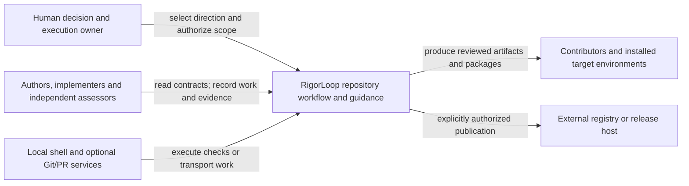

# RigorLoop System Model Design

Model validation contract: model-document-v1

## Introduction and Goals

RigorLoop turns engineering intent into durable, reviewable design, delivery allocation, implementation evidence and assessed outcomes. This model owns the assembled system's boundaries, responsibility relationships and integrated obligations. It uses the [Design method](../design/design.md) and references component contracts instead of becoming a higher-priority copy of them.

The first consolidation selected design authoring/model composition under the [approved proposal](../../proposals/2026-09-08-unified-design-authoring-and-bounded-model-consolidation.md); its [original execution evidence](../../changes/2026-09-08-unified-design-authoring-and-bounded-model-consolidation/change.json) retains its original subjects and judgments. It was not a complete migration of the system architecture.

The subsequent [Skill-model and proposal-family pilot direction](../../proposals/2026-09-08-skill-model-proposal-family-pilot.md) selects a bounded common-owner amendment. Current amendment activity, reviews and exact subjects belong to the [owning change](../../changes/2026-09-08-skill-model-proposal-family-pilot/change.json). The prospective Skill references below take effect only with that initiative's reviewed implementation and successful Verify; existing owners remain operational until then.

## Architecture Constraints

The Constitution governs the repository. Models do not demote governance, rewrite product direction, authenticate agents or grant permission through a stored label. Model validation, runtime record versions, installer state and release metadata are separately owned contracts. The CLI remains a mechanical interface; semantic dependency selection and readiness are actor judgments.

Git, pull requests, network access and supported agent runtimes can transport work or execute tools, but they are not universal prerequisites for understanding current engineering state. Public package acceptance ends at deterministic source, resource, archive and applicable installer-filesystem boundaries, not a guarantee that every target agent interprets prose correctly. Publishing a package does not adopt its policy in a customer project.

## Context and Scope

RigorLoop's external actors are the human direction/execution owner, authoring and implementation agents, independent reviewers and Verify, contributors running local validation, and consumers installing generated guidance. The repository contains authored governance and model/legacy contracts, stage skills, stored work/evidence, validation/generation tools and release support. External agent runtimes, shells, Git/PR hosts, package registries and customer repositories are environment boundaries rather than new internal models.

This view describes external interactions. The conceptual responsibility map below is not a claim that each model is a deployed service or that every invocation contacts a registry.

## Solution Strategy

Give each shared contract one owner and make consumers explicit. A system-wide invariant is stated here only when its composition across owners needs assessment; local requirements remain in their respective contracts. Use a scoped view for the changed responsibility, with references to declared unmigrated owners. The first slice demonstrates a feature crossing authoring, workflow, review, planning, validation and package boundaries without consolidating their unrelated contracts.

## Requirements

| ID | Required behavior |
| --- | --- |
| SYS-SR-01 | The system view MUST identify external actors/boundaries, component responsibility owners, significant dependencies and unmigrated current owners. A model inventory MUST NOT imply repository-wide consolidation or deployment boundaries that do not exist. |
| SYS-SR-02 | Each system interaction MUST reference its shared-contract owner and affected consumers. System prose MUST NOT duplicate local normative contracts or silently resolve a governance/component conflict by declaring itself superior. |
| SYS-SR-03 | A normal authored change MUST preserve a traceable chain from approved direction through affected Design requirements/decisions to Delivery allocation and implementation/evidence, with the independently assessed subjects identifiable. No handoff may require reconstructing a competing spec/architecture pair for a migrated obligation. |
| SYS-SR-04 | A shared authoring or interface change MUST reconcile producer and consumer behavior across the affected path before downstream reliance. Local checks alone MUST NOT establish the system-wide claim when a routing, review, planning, packaging or installation mismatch can violate it. |
| SYS-SR-05 | The assembled source/package/install path MUST preserve the one current authoring contract selected by Design DES-SR-01/15/17/18, alongside existing resource-integrity, installer-safety and separate adoption authorities. Packaging success MUST NOT imply Design approval, publication permission or customer adoption. |
| SYS-SR-06 | Current model truth, mutable work state, review judgments, proof and historical sources MUST remain distinguishable across composition. Identity/applicability checks and correction paths MUST consume Review and Closeout, Workflow, Record Format and CLI contracts without granting readiness through a save or reusing old approvals for new subjects. |
| SYS-SR-07 | The selected migration MUST retire the mapped current method/composition authority after coherent adoption, preserve the mixed architecture's unmigrated responsibilities and historical meaning, and leave named follow-up ownership. No unlisted source is a blanket deletion target. |
| SYS-SR-08 | The Design and System slice MUST include representative integrated acceptance outcomes and sufficient observation boundaries to distinguish coherent operation from a local-only success. Test owns proof-quality criteria; Delivery and specialists retain concrete allocation and assessment. |
| SYS-SR-09 | Interruption, conflicting ownership, stale consumer basis or an incomplete candidate package MUST prevent reliance on the affected composed claim and retain a safe owned correction path. Recovery or rollback MUST preserve historical evidence and unrelated state under existing permissions. |

## Building Block View

### Responsibility inventory

The model inventory distinguishes shared policy responsibilities from implementation boundaries. The first eight rows identify current or selected model owners; subsequent rows name unmigrated responsibilities. A source's inclusion here is not new approval of all its historical clauses. Existing adopted-profile amendments and Constitution precedence still apply.

| Responsibility | Current or selected Design owner | Significant consumers and boundary |
| --- | --- | --- |
| System composition | This model, at this slice's adoption | Contributors and all actors needing changed end-to-end relationships; local contracts remain below their named owners |
| Engineering authoring and model convention | [Design](../design/design.md), at this slice's adoption | Authors, Workflow, Design Review, Delivery, structural validators and published guidance |
| Activity/work/correction coordination | [Workflow](../workflow/workflow.md) | Stage actors; applies assessment policy and uses recording interfaces |
| Shared assessment and final closeout policy | [Review and Closeout](../review-closeout/review-closeout.md) | Specialist reviewers, Verify and Workflow; not storage or execution permissions |
| Shared test-purpose, derivation and maintenance criteria | [Test](../test/test.md) | Design, Delivery, implementation, reviewers and Verify; not a new gate |
| Durable recorded representation and preservation | [Record Format](../record-format/record-format.md) | CLI and workflow actors; only the supported runtime record contract |
| Primary inspection, construction and safe persistence | [CLI](../cli/cli.md) | All recording actors and mechanical validators; not semantic selection/readiness |
| Public skill structure and resource integrity | [Skill](../skill/skill.md), prospectively at its bounded adoption; [Skill Contract](../../../specs/skill-contract.md) remains operational until that adoption | Common obligation transfer preserves existing applicability; new improvements initially cover proposal and proposal-review only. Skill's displacement map retains plan/method-specific clauses and separate validation/installation owners. |
| Target installation, archive trust and project state | [Target-native init](../../../specs/target-native-init.md), [multi-adapter init](../../../specs/multi-adapter-init-and-proxy-aware-download.md), [lockfile contract](../../../specs/rigorloop-cli-lockfile.md) | CLI installer and supported target roots; consumes Design's retired-entry policy without moving transport/state ownership |
| Adapter generation and invocation surfaces | [Adapter invocation contract](../../../specs/skill-invocation-commands-for-adapters.md), [archive install surface](../../../specs/stop-tracking-generated-public-adapter-skill-bodies.md) | Canonical skills, manifest, adapter templates and release candidates; archive publication remains separately authorized |
| Validation selection and product gates | [Published-skill-first simplification](../../../specs/published-skill-first-repository-simplification.md) and retained System architecture validation sections; common content invariants resolve to [Skill](../skill/skill.md) at its adoption | Existing scripts and CI retain execution/proof policy. Pilot resource-selection checks cannot tighten other skills or remove existing protective checks. |
| Release/publication and release evidence | [Release process contract](../../../specs/release-process-contract.md); retained system architecture Release and adapter evidence and Public npm package boundary | Maintainer and release tools; this initiative has no release authority |
| Remaining historical feature contracts, automation, observability, measurement and support methods | Their named specs/ADRs and retained sections of [mixed system architecture](../../architecture/system/architecture.md) | Relevant feature owners; identify a precise owning contract before substantive changes, rather than infer current authority from an old status heading |

This document does not create a release model. The remaining-area row is a boundary against blind conversion, not an assertion that every historical file is current. Known component owners above are the starting inventory; a previously unclassified responsibility needs explicit ownership before reliance.

### Significant interaction ownership

| Interaction | Shared contract owner | Producer and consumer obligations at the boundary |
| --- | --- | --- |
| Approved direction to engineering design | Proposal for direction; Design DES-SR-03/04 for engineering reconciliation | Author preserves accepted intent, exposes a material feasibility conflict and returns it to the direction owner |
| Model identity, requirements, decisions and examples | Design DES-SR-02/06/11/12 | Models author once; reviewers, planners and selectors consume exact subjects and references |
| Shared-method change to affected models/consumers | Design DES-SR-08 and System SYS-SR-04 | Author identifies impacts; Workflow assigns correction; independent reviewers assess exact relevant interactions |
| Design to independent review | Review and Closeout RC-SR-01–07; Design DES-SR-16 supplies the subject | Author supplies package and assumptions; nonauthor reviewer records its judgment and applicability |
| Design to concrete proof allocation | Design DES-SR-10/16; Test TEST-SR-01–13 supplies adequacy criteria | Delivery allocates local and integrated proof; implementation provides fixtures/assertions and actual evidence |
| Semantic decisions to persistent records | Record Format and CLI, consumed by Workflow | Actors provide decisions/applicability; mechanical tools validate/preserve them without deriving approval |
| Authored skills to packaged and installed guidance | Skill/resource and installation owners; Design DES-SR-15/17 supplies the authoring inventory contract | Generation preserves selected resources; installer guards old/mixed inventory and applies the installation-owned, explicitly authorized managed replacement while preserving local edits and unrelated content; actors do not infer adoption from installation |
| Common Skill owner to bounded pilot and unchanged consumers | Skill SKL-SR-01/16–23; System SYS-SR-02/04/06/07 | Reconcile the pilot's complete conditional procedure, validator dispatch and archive references. Common transfer does not certify other skills; shared policy, installation and proof ownership remain separate. |

These rows identify ownership, not new priorities among the listed owners. If two owners appear to prescribe contradictory outcomes for the same obligation, the affected claim is unresolved until the owning Design activity reconciles the contract under governance.

## Runtime View

### Integrated authoring change

A maintainer approves a change to the authoring method. The author updates Design, identifies its System relationship and Workflow/review/planning/package consumers, and preserves the affected requirement/decision references. Independent Design Review considers the exact affected model set and interactions. Delivery maps intended local and integrated outcomes to checks, commands and evidence. Implementation changes the required consumers and packages under approved allocation; milestone reviews and final whole-change Code Review remain distinct from final Verify.

The counterexample is a `design` skill whose own document is coherent while `route` still directs authors to `spec`, Design Review insists on a separate ADR/spec tuple, or the installed target retains both old entrypoints. A single skill validation pass cannot establish SYS-SR-04/05. The observation boundary includes normal invocation guidance, exact review subject selection, plan derivation, generated inventory and the actual installer filesystem result.

### Scoped unmigrated-source change

The selected Skill pilot is a further composition example: a portable proposal path reads its classification and required artifact guidance before any governed recording procedure; an independent formal review still reaches the complete recording method. If moving that method causes a validator to return early when the old body heading disappears, the locally shorter skill is not a coherent improvement. Observe the entry file, selected reference, existing asset, profile/placement validator and supported candidate together under Skill SKL-SR-09/16–20. Unchanged skill consumers retain their current procedure and validation.

An unrelated feature changes an existing unmigrated contract. `design` reads its declared owner and format, authors only the justified amendment and identifies applicable structural/semantic review obligations. System references that owner without copying its feature requirements. Neither the new authoring name nor this System inventory migrates that feature into a new model or closes the deferred consolidation follow-up.

### Interruption and correction

A package check detects a retired authoring directory or missing required method. The producer's local success is insufficient; the affected composed result cannot be relied on. Existing correction/recording owners retain the defect and repair allocation. A stale or interrupted record write is reread/recovered through its existing owner; recovery cannot grant approval. The installation owner's TNI-DES-01–06 procedure checks the original managed hash before replacement and defines backup, rollback and interrupted-retry recovery; unmanaged cleanup cannot bypass that basis. Neither installation path deletes source contracts or authorizes publication. Historical approvals still refer to historical subjects after any correction.

## Deployment View

Authored Markdown/model/skill sources feed repository-owned validation and adapter generation; current support metadata and generated candidate archives feed supported target installers. CLI persistence uses the existing local record store. Independent assessors and user permissions remain external decisions throughout this flow. The new models add no hosted runtime, database or registry and do not change Record Format schemas.

The old system context/container diagram files remain historical or unmigrated source views at their existing paths. The inline views here are the new bounded System responsibility views, not copied diagram sources. Future edits to an unmigrated deployment/packaging responsibility continue to use its declared owner until separately consolidated.

## Crosscutting Concepts

### Exact mixed-architecture migration boundary

Source locations refer to the inspected baseline of `docs/architecture/system/architecture.md`; its subject identity is recorded with this change's authoring basis. Heading names and selected paragraph/bullet descriptions disambiguate ranges. Only the selected text is replaced in the adopting implementation. Unselected content, especially detailed Level 2 blocks and release/automation/CLI histories, is retained under its existing amended contracts.

| Selected source section and exact text boundary | Replacement owner | Disposition at adoption |
| --- | --- | --- |
| Introduction and Goals: opening system-description paragraph; following canonical-method paragraph; goal bullets for structure, architecture reasoning, canonical vs historical evidence, smallest surface and ADR rationale | SYS-SR-01/03 and Design DES-SR-02/05/06 | Replace composition/method claims with links here and to Design. Preserve unrelated product/release/CLI goals below these selected bullets. |
| Architecture Constraints: bullets naming architecture-method spec ownership, workflow's method role, canonical package/diagram path, architecture/ADR scaffolds, lowest sufficient surface and no normal deltas | Design DES-SR-01/02/05/06/13/14/18 | Replace those method constraints with declared Design ownership and conditional legacy treatment. Retain Constitution, source boundaries, independent state/installation/release/validation constraints and all unselected bullets. |
| Context and Scope: external repository actors, canonical included/excluded scope, target-agent interpretation boundary and context-diagram navigation | SYS-SR-01/05 and Context and Scope above | Replace the system-level explanation with this view; preserve old diagram access as historical/unmigrated evidence, not current composition authority. |
| Solution Strategy: first four paragraphs through architecture-review comparison of runtime/deployment/quality/decision history | SYS-SR-02/03 and Design method | Replace with references to current owners. Retain subsequent published-skill product-gate, state/CLI and release strategies under their existing owners. |
| Building Block View: opening system-level description and complete Level 1 White-Box table only, stopping before Level 2 White-Box: Project-Map Skill Package | SYS-SR-01/02 and responsibility inventory above | Replace high-level ownership catalogue with a System link. Retain all Level 2 blocks as unmigrated detail, including their applicable prior amendments. |
| Runtime View → Architecture update flow: all eight steps | Design Runtime View; SYS-SR-03/04 | Replace separate authoring/package handoff with the unified method link. Preserve every subsequent runtime subsection; their directly affected references still need scoped consumer reconciliation. |
| Crosscutting Concepts → Source of truth: both paragraphs | Design DES-SR-02/11/13/18; SYS-SR-02/06 | Remove duplicate model/method authority and outdated flat-model navigation; reference actual owners and the applicable adopted profile. |
| Crosscutting Concepts → Lowest sufficient architecture surface: opening and four bullets | Design DES-SR-02/04/05/06/14 | Replace old normal output selection with unified authoring and scoped legacy treatment. |
| Crosscutting Concepts → Diagram source policy: entire single paragraph | Design Technical reasoning and decisions | Replace fixed architecture diagram placement with one-owner text-source guidance; old diagrams retain their historical identity. |
| Crosscutting Concepts → Legacy architecture handling: entire paragraph | SYS-SR-07 and adoption boundary below | Retain the factual earlier eight-file normalization as historical evidence; explicitly distinguish it from incomplete Design consolidation. |
| Architecture Decisions: only entries for ADR-20260428-architecture-package-method and ADR-20260509-architecture-skill-surface-simplification, including their summaries in historical follow-on prose | Design Material decision preservation and DES-DEC-01–05 | Current index identifies replacement decision ownership. Preserve all other ADR references and historical follow-on narrative; do not rewrite old approval claims as new approvals. |

An opening notice in the mixed architecture must name this exact boundary and link to the surviving owners. Unmigrated sections remain distinguishable as current responsibility detail or explicit historical evidence under their existing amendments; the notice must not declare the whole file obsolete. The entire architecture file and its diagrams are not deletion targets.

### Adoption and follow-up ownership

This package's coordinated adoption uses Design DES-SR-13/18/20. It supersedes the selected system composition/method authorities only after the required reviewed implementation and Verify. New model drafts and structural validation do not activate that replacement. The exact source/consumer dispositions are reviewable here; Delivery allocates their concrete edits and protection. Governance amendments remain in governing artifacts, not under System priority.

| Remaining consolidation | Accountable direction owner | Receiving owner and durable follow-up destination | Completion boundary for this initiative |
| --- | --- | --- | --- |
| Public skill/resource and validation architecture models | Repository maintainer | The Skill-model owning change now receives common skill/resource extraction and the exact two-skill pilot; [follow-ups](../../follow-ups.md) retain separate validation extraction and remaining capability adoption | The original Design/System slice did not adopt these responsibilities. The Skill initiative must satisfy its own displacement and pilot proof; validation consolidation and other skill improvements remain later work. |
| Installer, distribution and release models | Repository maintainer | Route assigns a later bounded proposal, preserving installer/release owners; same existing follow-up surface when unowned | Retired-authoring-entry guard and package coherence are required now; broader consolidation/publication is not |
| Remaining feature specs, Level 2 architecture, ADRs, automation, observability and measurement responsibilities | Repository maintainer | Route assigns responsibility-specific proposals after inventory; existing follow-up surface for still-unowned work | Name retained owners and a follow-up to inventory remaining responsibilities; do not promise or execute full migration |

The follow-up register entry IDs are assigned by Route under its existing policy when Delivery establishes which items have an active owner. This table is stable scope/ownership intent; it does not contain mutable follow-up status or claim later work has been commissioned. Adoption closeout requires concrete durable assignments and must not leave the obligation only in chat. Existing unrelated follow-ups are untouched.

### Security, observability and usability

The composed system exposes source ownership, current subject identities, explicit assessments and historical boundaries through readable artifacts and existing scoped CLI views. It does not infer user permission from records. Shared interactions retain trust/data-exposure reasoning through their component owners; no secrets or host-specific debug data belong in published examples. No graphical tool, network service, numerical runtime target or token benchmark is introduced for this model.

### Boundary scan and acceptance scenarios

| Dimension | Requirement basis | Distinct outcome to demonstrate |
| --- | --- | --- |
| Input domain | SYS-SR-01, SYS-SR-02, SYS-SR-07 | A reader locates the owner of model authoring, recording and an unmigrated installer contract without treating the inventory as new approval of every historical source. Unknown ownership remains an explicit gap. |
| State/lifecycle | SYS-SR-03, SYS-SR-05, SYS-SR-06 | Proposal approval, model validation and generated archive success remain distinguishable from Design approval, implementation readiness, publication and customer adoption. |
| Identity/authority | SYS-SR-02, SYS-SR-06 | A System/component contradiction returns to its governing owner; system prose cannot overrule a component. A model revision cannot inherit the old exact-subject approval. |
| Composition/path | SYS-SR-03, SYS-SR-04, SYS-SR-05, SYS-SR-08 | The unified authoring path supplies one coherent affected-model package to review and usable local/integrated outcomes to planning, while generated/installed guidance contains design alone. A stale routing, review tuple or old entrypoint is visible despite a passing local skill check. |
| Temporal/retry | SYS-SR-04, SYS-SR-06, SYS-SR-09 | Concurrent shared-method and consumer edits trigger explicit applicability assessment before handoff; an interrupted recording or install retry cannot overwrite unrelated work or refresh an old judgment. |
| Failure/recovery | SYS-SR-05, SYS-SR-09 | Missing required package resources or an obsolete target entry stops the affected path with an owned repair and preserved files/state. Local success elsewhere does not erase that composed failure. |
| Compatibility/migration | SYS-SR-01, SYS-SR-05, SYS-SR-07 | The selected method/composition clauses resolve to one new owner, mixed architecture retains its named remainder, and historical ADR/review bytes keep their original meaning. Unrelated legacy work can proceed through scoped design authoring without full migration. |
| External/environment | SYS-SR-03, SYS-SR-05, SYS-SR-06, SYS-SR-08 | A new reader or clean target installation can use the declared artifact/package boundaries without internal Design checkout, old chat or a PR; no target-agent correctness or release authorization is inferred. |

The representative integrated outcomes are the actual authoring-method change above, a scoped unmigrated installer amendment, and interrupted package/record reconciliation. Material combined hazards are a new producer plus an old consumer, a replacement ownership map plus a still-current duplicate, and an unchanged filename plus changed assessment basis. SYS-SR-02/04/05/06/07/09 own their outcomes. Delivery must observe the composed boundary rather than substitute isolated parsing or helper-only proof.

## Architecture Decisions

| ID | Context and decision | Alternatives and consequences |
| --- | --- | --- |
| SYS-DEC-01 | The large architecture mixes current system relationships with detailed old contracts. Establish a bounded System owner for composition and retain declared local/unmigrated owners. | Rewriting the whole architecture delays the selected capability; using only component models hides integrated obligations. A bounded view requires explicit residual ownership and later consolidation. |
| SYS-DEC-02 | Shared authoring affects semantic and packaged consumers. Assess the end-to-end path using owner references and integrated outcomes. | Treating a generated package or a valid model as sufficient misses stale routing/review/installation consumers. Delivery must allocate real composed proof without inventing a new readiness service. |
| SYS-DEC-03 | Preserve historical system/ADR context and distinguish previous normalization from this consolidation. | Deleting the mixed file or rewriting historical approvals loses decision meaning. Current navigation becomes clearer while the remaining format diversity is explicit technical debt. |

No separate ADR is created for this model-profile draft. These decisions concern the selected system responsibility; source-method decisions remain owned by Design's preservation map.

## Quality Requirements

| Quality | Observable expected outcome | Basis |
| --- | --- | --- |
| Understandability | A reader can follow a representative change through named owners and boundaries without rebuilding current truth from historical review rounds. | SYS-SR-01, SYS-SR-02, SYS-SR-03 |
| Composition integrity | An obsolete consumer makes the affected integrated outcome fail even when individual producer checks pass. | SYS-SR-04, SYS-SR-05, SYS-SR-08 |
| Correctability | A failed or stale composed claim has an owned correction path and does not acquire approval through persistence or recovery. | SYS-SR-06, SYS-SR-09 |
| Bounded migration | Selected responsibilities have one replacement; remaining sources and follow-up ownership remain explicit without claiming completion. | SYS-SR-07 |

## Risks and Technical Debt

The inventory can become stale as later responsibilities migrate; each shared-contract change must reconcile its affected inventory/relationships. A mixed architecture requires careful notices so retained details are neither accidentally deactivated nor allowed to compete with transferred authority. Broad release and automation consolidation remain separate work. There is no assumption of measurable token savings or universal detection of manually retained old runtime instructions.

## Glossary

System obligation: an outcome that needs composition across responsibility owners. Component model: a coherent local contract, not necessarily a runtime component. Mixed architecture: the retained document containing selected displaced material, unmigrated details and historical evidence. Consumer: an actor, model, resource or implementation path relying on another owner's contract.

## Next artifacts

Independent Design Review of this System model, Design, the scoped Workflow amendment and Target-native init's TNI-DES-01–06 amendment, with referenced policy and legacy owners as necessary evidence. Delivery planning and adoption implementation require their later authorization and review gates.

## Follow-on artifacts

None yet.
