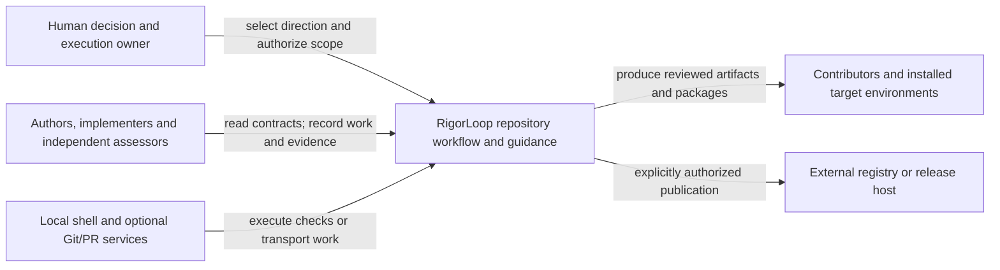

# RigorLoop System Model Design

Model validation contract: model-document-v1

Current composition uses v3-only operational storage. [Retirement provenance](#v2-retirement-composition) records the separate owning decision and historical boundary.

## Introduction and Goals

RigorLoop turns engineering intent into durable, reviewable design, delivery allocation, implementation evidence and assessed outcomes. This model owns the assembled system's boundaries, responsibility relationships and integrated obligations. It uses the [Design method](../design/design.md) and references component contracts instead of becoming a higher-priority copy of them.

The first consolidation selected design authoring/model composition under the [approved proposal](../../proposals/2026-09-08-unified-design-authoring-and-bounded-model-consolidation.md); its [original execution evidence](../../changes/2026-09-08-unified-design-authoring-and-bounded-model-consolidation/change.json) retains its original subjects and judgments. It was not a complete migration of the system architecture.

The subsequent [Skill-model and proposal-family pilot direction](../../proposals/2026-09-08-skill-model-proposal-family-pilot.md) selects a bounded common-owner amendment. Current amendment activity, reviews and exact subjects belong to the [owning change](../../changes/2026-09-08-skill-model-proposal-family-pilot/change.json). That initiative's recorded successful Verify and final whole-change Code Review establish completed common Skill adoption. Skill owns the transferred common contract now; the plan/boundary-method remainder and later capability adoption remain separately owned.

The [Release-model direction](../../proposals/2026-09-09-release-model-source-consolidation.md) selects [Release](../release/release.md) and its exact source/consumer dispositions under the [Release owning change](../../changes/2026-09-09-release-model-source-consolidation/change.json). That initiative's [successful final Verify](../../changes/2026-09-09-release-model-source-consolidation/verify-report.json) establishes coordinated Release adoption for its mapped scope. Release is the current owner of those obligations; Distribution and Installation retain their separate owners. Adoption does not authorize publication, and the original assessments retain their exact subjects.

The [Distribution direction](../../proposals/2026-09-10-distribution-model-and-opencode-retirement.md) selects [Distribution](../distribution/distribution.md) as the combined packaging and installation owner under its [owning change](../../changes/2026-09-10-distribution-model-and-opencode-retirement/change.json). Its source transfer, OpenCode withdrawal and local-mirror retirement remain prospective until reviewed implementation and successful Verify. This selection does not adopt a separate Installation model.

## Structured assessment composition

The [structured-explanation direction](../../proposals/2026-09-10-structured-assessment-explanations.md) and [owning change](../../changes/2026-09-10-structured-assessment-explanations/change.json) preserve the original composition decision under SYS-SR-01/04/06/08/09. The current relationship below integrates subsequent v2 retirement; it introduces no new model, service, report store or generic JSON editing system.

Record Format defines stored explanations, CLI exposes complete/named reads and safe explicit updates, Review and Closeout owns reliance, and Workflow coordinates actors and current consumers.

The smallest exact Design package is the amended [Record Format](../record-format/record-format.md#structured-assessment-explanations), [CLI](../cli/cli.md#structured-assessment-interface), [Review and Closeout](../review-closeout/review-closeout.md#structured-explanation-and-reliance-amendment), [Workflow](../workflow/workflow.md#structured-assessment-coordination), this composition amendment, and their indexed new examples. V2 examples remain historical illustrations only. The proposal's cited v2 baseline remains identifiable; its approval is not an approval of these new subjects.

| Shared boundary | Producer and consumer obligation | Owner |
| --- | --- | --- |
| Explanation structure and interpretation | Review/Verify supply the closed named values; readers retrieve them without duplicating facts already in judgments, findings and evidence. | Record Format RF-SR-09–11; Review and Closeout RC-SR-19/20 |
| Finding correction | V3 Review findings keep stable IDs and an editable current account, without origin snapshots. Targeted finding updates and advanced replacement agree; explanation edits preserve the collection. Change-level blockers retain origin; historical records remain unchanged. | RF-SR-13; CLI-SR-26; Review and Closeout correction policy |
| Field projection and editing | CLI exposes the exact selected values plus coherent identity/revision/applicability and honest omissions; actors explicitly reassess changes affecting reliance. | CLI-SR-24–26; RC-SR-05/19 |
| Stored/transport version separation | Only v3 stores are operational; independent transport/document versions retain accurate dispatch, compatible clients and recoverable writes. | RF-SR-12/14; CLI-SR-27/28; Workflow coordination |
| Packaged consumer adoption | Canonical skill instructions, shared resources, schemas and executable agree before adoption; generated packages do not adopt project policy. | Workflow consumer inventory; Skill, Distribution and Release retain their existing contracts |

Integrated acceptance requires a fresh actor to retrieve a rationale/limitations projection, recognize its omissions, make an authorized whole-field edit, and observe preserved neighbors/findings without interpreting save success as renewed approval. Also assess v3 interruption/recovery, unsupported client versions and historical preservation under Workflow’s scoped retirement-proof allocation; no v2 continuation scenario remains. Local schema validity cannot establish these composed properties. Delivery allocates exact checks and evidence under Test; independent Design Review assesses this whole subject set and interactions.

Design, Skill, Test, Distribution and Release need no new model requirements for this amendment: their method, content-quality, protective-value, package generation/installation and publication responsibilities remain unchanged. Their relevant consumers must still be reconciled through Workflow's inventory. Standalone legacy review-validator removal is outside this scope. This section changes the affected composition description only; the earlier source-transfer maps and historical judgments retain their original meaning.

## V2 retirement composition

Owning change: [retire-v2-record-format](../../changes/2026-09-11-retire-v2-record-format/change.json). Under SYS-SR-02/04/06/08/09, this separate initiative supplies the v3-only operational boundary integrated into Structured assessment composition. Its exact Design package consists of this section and the retirement amendments in [Record Format](../record-format/record-format.md#v2-stored-format-retirement), [CLI](../cli/cli.md#v2-runtime-retirement), [Workflow](../workflow/workflow.md#v2-retirement-coordination) and [Review and Closeout](../review-closeout/review-closeout.md#v2-retirement-and-assessment-reliance). Other composition and source-transfer maps retain their scope.

Record Format selects v3-only operational storage; CLI owns version dispatch, archival classification and safe recovery rejection; Workflow owns dependency disposition and coordinated consumer/test removal; Review and Closeout distinguishes historical provenance from current reliance. Test, Skill, Distribution and Release retain their existing responsibilities. No new Retirement, Report, archive-ledger or compatibility component is introduced.

The integrated condition is a fresh actor locating current policy through reconciled governance references, discovering v3 work, reading/editing its named explanation and handling conflicts/recovery through a package with no v2 operational dependency. Historical adoption links remain meaningful without a v2 validator; their original approvals do not cover the retirement Design or implementation. A remaining skill, validator or packaging import requiring v2 prevents the composed adoption claim even if a local v3 schema check passes. Workflow's explicit no-new-retirement-tests scope applies; Delivery allocates retained checks and dependency evidence rather than inventing a new retirement suite.

The existing SYS-SR-09 interruption rule includes known v2 transactions at the removal boundary: their required disposition precedes removal, while retained v3 recovery protects new work. Unknown external repositories are outside a local completion claim. Model approval, build availability, final Verify, release publication and customer activation remain distinct decisions.

## Architecture Constraints

The Constitution governs the repository. Models do not demote governance, rewrite product direction, authenticate agents or grant permission through a stored label. Model validation, runtime record versions, installer state and release metadata are separately owned contracts. The CLI remains a mechanical interface; semantic dependency selection and readiness are actor judgments.

Git, pull requests, network access and supported agent runtimes can transport work or execute tools, but they are not universal prerequisites for understanding current engineering state. Public package acceptance ends at deterministic source, resource, archive and applicable installer-filesystem boundaries, not a guarantee that every target agent interprets prose correctly. Publishing a package does not adopt its policy in a customer project.

## Context and Scope

RigorLoop's external actors are the human direction/execution owner, authoring and implementation agents, independent reviewers and Verify, contributors running local validation, and consumers installing generated guidance. The repository contains authored governance and model/legacy contracts, stage skills, stored work/evidence, validation/generation tools and release support. External agent runtimes, shells, Git/PR hosts, package registries and customer repositories are environment boundaries rather than new internal models.

This view describes external interactions. The conceptual responsibility map below is not a claim that each model is a deployed service or that every invocation contacts a registry.

## Solution Strategy

Give each shared contract one owner and make consumers explicit. A system-wide invariant is stated here only when its composition across owners needs assessment; local requirements remain in their respective contracts. Use a scoped view for the changed responsibility, with references to declared unmigrated owners. The first slice demonstrates a feature crossing authoring, workflow, review, planning, validation and package boundaries without consolidating their unrelated contracts.

## Requirements

| ID | Required behavior |
| --- | --- |
| SYS-SR-01 | The system view MUST identify external actors/boundaries, component responsibility owners, significant dependencies and unmigrated current owners. A model inventory MUST NOT imply repository-wide consolidation or deployment boundaries that do not exist. |
| SYS-SR-02 | Each system interaction MUST reference its shared-contract owner and affected consumers. System prose MUST NOT duplicate local normative contracts or silently resolve a governance/component conflict by declaring itself superior. |
| SYS-SR-03 | A normal authored change MUST preserve a traceable chain from approved direction through affected Design requirements/decisions to Delivery allocation and implementation/evidence, with the independently assessed subjects identifiable. No handoff may require reconstructing a competing spec/architecture pair for a migrated obligation. |
| SYS-SR-04 | A shared authoring or interface change MUST reconcile producer and consumer behavior across the affected path before downstream reliance. Local checks alone MUST NOT establish the system-wide claim when a routing, review, planning, packaging or installation mismatch can violate it. |
| SYS-SR-05 | The assembled source/package/install path MUST preserve the one current authoring contract selected by Design DES-SR-01/15/17/18, alongside existing resource-integrity, installer-safety and separate adoption authorities. Packaging success MUST NOT imply Design approval, publication permission or customer adoption. |
| SYS-SR-06 | Current model truth, mutable work state, review judgments, proof and historical sources MUST remain distinguishable across composition. Identity/applicability checks and correction paths MUST consume Review and Closeout, Workflow, Record Format and CLI contracts without granting readiness through a save or reusing old approvals for new subjects. |
| SYS-SR-07 | The selected migration MUST retire the mapped current method/composition authority after coherent adoption, preserve the mixed architecture's unmigrated responsibilities and historical meaning, and leave named follow-up ownership. No unlisted source is a blanket deletion target. |
| SYS-SR-08 | The Design and System slice MUST include representative integrated acceptance outcomes and sufficient observation boundaries to distinguish coherent operation from a local-only success. Test owns proof-quality criteria; Delivery and specialists retain concrete allocation and assessment. |
| SYS-SR-09 | Interruption, conflicting ownership, stale consumer basis or an incomplete candidate package MUST prevent reliance on the affected composed claim and retain a safe owned correction path. Recovery or rollback MUST preserve historical evidence and unrelated state under existing permissions. |

## Building Block View

### Responsibility inventory

The model inventory distinguishes shared policy responsibilities from implementation boundaries. The rows distinguish current or selected model owners from unmigrated responsibilities. A source's inclusion here is not new approval of all its historical clauses. Existing adopted-profile amendments and Constitution precedence still apply.

| Responsibility | Current or selected Design owner | Significant consumers and boundary |
| --- | --- | --- |
| System composition | This model, at this slice's adoption | Contributors and all actors needing changed end-to-end relationships; local contracts remain below their named owners |
| Engineering authoring and model convention | [Design](../design/design.md), at this slice's adoption | Authors, Workflow, Design Review, Delivery, structural validators and published guidance |
| Activity/work/correction coordination | [Workflow](../workflow/workflow.md) | Stage actors; applies assessment policy and uses recording interfaces |
| Shared assessment and final closeout policy | [Review and Closeout](../review-closeout/review-closeout.md) | Specialist reviewers, Verify and Workflow; not storage or execution permissions |
| Shared test-purpose, derivation and maintenance criteria | [Test](../test/test.md) | Design, Delivery, implementation, reviewers and Verify; not a new gate |
| Durable recorded representation and preservation | [Record Format](../record-format/record-format.md) | CLI and workflow actors; only the supported runtime record contract |
| Primary inspection, construction and safe persistence | [CLI](../cli/cli.md) | All recording actors and mechanical validators; not semantic selection/readiness |
| Public skill structure and resource integrity | [Skill](../skill/skill.md); [Skill Contract](../../../specs/skill-contract.md) retains its bounded plan/boundary-method remainder | Common obligation transfer preserves existing applicability; new improvements initially cover proposal and proposal-review only. Skill's displacement map retains plan/method-specific clauses and separate validation/installation owners. |
| Target installation, archive trust and project state | [Distribution](../distribution/distribution.md), selected for coordinated adoption; target-native init, multi-adapter init and lockfile sources retain authority until its mapped transfer | CLI installer and supported target roots; Distribution preserves Design's retired-entry replacement policy and separates current targets from historical state inspection |
| Adapter generation and invocation surfaces | [Distribution](../distribution/distribution.md), selected for coordinated adoption; existing invocation/archive sources retain authority until its mapped transfer | Skill supplies canonical content/resources; Distribution produces packages for retained targets; Release owns publication authority |
| Validation responsibilities | [Skill](../skill/skill.md) for common content invariants; [Test](../test/test.md) for protective-value criteria and the selected cleanup; [Review and Closeout](../review-closeout/review-closeout.md) for assessment/reuse; [CLI](../cli/cli.md) and Record Format for current recording validity. [Published-skill-first simplification](../../../specs/published-skill-first-repository-simplification.md) retains the operational clauses identified below. | No new Validation model. Existing runners, selectors and CI keep their contracts; new source-cleanup exceptions adopt only with this package and do not tighten non-pilot skills or remove runtime protection. |
| Release/publication and release evidence | [Release](../release/release.md), with coordinated adoption established by the owning change's successful final Verify; its displacement map records exact legacy-source dispositions | Maintainer, release tooling, package/installation proof and public evidence; local success grants no publication permission. Mixed package and historical release responsibilities retain their owners. |
| Remaining historical feature contracts, automation, observability, measurement and support methods | Their named specs/ADRs and retained sections of [mixed system architecture](../../architecture/system/architecture.md) | Relevant feature owners; identify a precise owning contract before substantive changes, rather than infer current authority from an old status heading |

Release is an adopted model; the candidates below remain prospective. The remaining-area row is a boundary against blind conversion, not an assertion that every historical file is current. Known component owners above are the starting inventory; a previously unclassified responsibility needs explicit ownership before reliance.

### Candidate models and legacy source ownership

These candidates outline potential responsibility boundaries before new model files are authored. They are not adopted owners, deployed components, or a mandatory final directory inventory. Existing models remain the first choice; Design may merge, split or reject a candidate after reconciling its actual obligations. The earlier necessary-design cleanup created no new model. Release is adopted within its exact displacement map. Distribution is now separately selected as one combined packaging/installation model; its map reconciles the earlier two candidates and FU-013 without claiming adoption. Both appear in the responsibility inventory above. The remaining candidate below is not selected by either initiative.

The following is a source-family map, not a conformance or deletion audit of every file in `specs/`. Source titles and original status headings do not override later amendments. Matching test specifications contribute proof intent to the same responsibility; operational manifests, fixtures and recovery inputs keep their real consumers.

| Candidate and potential model path | Responsibility and reason to consider a separate owner | Related legacy sources to reconcile | Relationships and next owning decision |
| --- | --- | --- | --- |
| Validation Execution — `docs/design/validation-execution/validation-execution.md` | Deterministic check selection, execution composition, preflight and result reporting. Consider a separate owner only if the remaining execution responsibility cannot fit existing owners coherently; it does not own the checked product invariants or semantic evidence sufficiency. | [Layered/change-scoped validation](../../../specs/test-layering-and-change-scoped-validation.md); [execution/preflight](../../../specs/validation-execution-performance-and-preflight.md); [idempotency/cache safety](../../../specs/validation-idempotency-and-cache-hit-safety.md); [cache ADR](../../adr/ADR-20260523-validation-idempotency-cache-hit-safety.md). Mixed architecture “Validation flow”, “Validation layering” and “Validation idempotency cache-hit flow”; operational remainders of published-skill-first. | Skill defines content invariants, Test protective-value criteria, Review and Closeout applicability, CLI/Record Format record validity, and Release its operation-specific checks. FU-012: assess only the remaining execution responsibility after this cleanup; preserve existing command/freshness contracts until their exact disposition. |

The referenced architecture subsections are in the [mixed system architecture](../../architecture/system/architecture.md). A shared source is split by responsibility: for example, distribution produces an archive identity, installation checks that identity before a write, and release records the identity of the artifact it publishes. These are different obligations across one interface, not three definitions of archive construction.

The unlisted specification families are not automatically orphaned. Method/convention sources may belong to Design; common skill sources to Skill; coordination to Workflow; judgment to Review and Closeout; record representation/mechanics to Record Format/CLI; test criteria to Test. Specialist capability and other remaining sources require the FU-014 inventory and their existing named owners. This paragraph does not assert that every legacy clause remains current or that its final owner has already been established.

### Disposition of a specification without a model

For every specification selected for inspection, record one outcome in the existing Design displacement map or owning change evidence:

| Inspected outcome | Required disposition |
| --- | --- |
| Necessary responsibility fits an existing model | Transfer precise meaning and applicability to that owner, reconcile consumers, and remove the fully superseded source under DES-SR-21. |
| Necessary responsibility is distinct and has no coherent existing owner | Define the candidate boundary here and obtain its owning Design decision. Retain the source as explicit current authority until the replacement and consumers are adopted; do not invent a model merely to retain an obsolete document. |
| No surviving engineering responsibility, necessary rationale/evidence or operational consumer remains | Select the source for deletion, record the inspected retirement basis, and reconcile current references. Do not create an archive copy or an artificial model to keep it. |
| Meaning, supported behavior or an actual reader is unresolved | Name the unresolved question and accountable owner; resolve it before deletion or a completion claim. Absence from this inventory alone is not evidence that the source is unnecessary. |

This implements source retirement by responsibility and remaining use. The source is removed when it has no necessary role, not merely because its receiving model file has not yet been created. No additional individual specification deletion is established by this candidate map; the already selected removal targets remain in the necessary-design consolidation map below.

### Significant interaction ownership

| Interaction | Shared contract owner | Producer and consumer obligations at the boundary |
| --- | --- | --- |
| Approved direction to engineering design | Proposal for direction; Design DES-SR-03/04 for engineering reconciliation | Author preserves accepted intent, exposes a material feasibility conflict and returns it to the direction owner |
| Model identity, requirements, decisions and examples | Design DES-SR-02/06/11/12 | Models author once; reviewers, planners and selectors consume exact subjects and references |
| Shared-method change to affected models/consumers | Design DES-SR-08 and System SYS-SR-04 | Author identifies impacts; Workflow assigns correction; independent reviewers assess exact relevant interactions |
| Design to independent review | Review and Closeout RC-SR-01–07; Design DES-SR-16 supplies the subject | Author supplies package and assumptions; nonauthor reviewer records its judgment and applicability |
| Design to concrete proof allocation | Design DES-SR-10/16; Test TEST-SR-01–13 supplies adequacy criteria | Delivery allocates local and integrated proof; implementation provides fixtures/assertions and actual evidence |
| Reviewed candidate to authorized release and public evidence | Release REL-SR-08–16/22–24; SYS-SR-02/04/06/09 | Package producers supply exact identities, installation supplies applicable proof, Release composes operation checks and records observed public results. A stale hosted tag, delayed registry or missing consumer stops the affected claim; no review or profile grants external permission. |
| Semantic decisions to persistent records | Record Format and CLI, consumed by Workflow | Actors provide decisions/applicability; mechanical tools validate/preserve them without deriving approval |
| Authored skills to packaged and installed guidance | Skill/resource and installation owners; Design DES-SR-15/17 supplies the authoring inventory contract | Generation preserves selected resources; installer guards old/mixed inventory and applies the installation-owned, explicitly authorized managed replacement while preserving local edits and unrelated content; actors do not infer adoption from installation |
| Common Skill owner to bounded pilot and unchanged consumers | Skill SKL-SR-01/16–23; System SYS-SR-02/04/06/07 | Reconcile the pilot's complete conditional procedure, validator dispatch and archive references. Common transfer does not certify other skills; shared policy, installation and proof ownership remain separate. |

These rows identify ownership, not new priorities among the listed owners. If two owners appear to prescribe contradictory outcomes for the same obligation, the affected claim is unresolved until the owning Design activity reconciles the contract under governance.

## Runtime View

### Integrated authoring change

A maintainer approves a change to the authoring method. The author updates Design, identifies its System relationship and Workflow/review/planning/package consumers, and preserves the affected requirement/decision references. Independent Design Review considers the exact affected model set and interactions. Delivery maps intended local and integrated outcomes to checks, commands and evidence. Implementation changes the required consumers and packages under approved allocation; milestone reviews and final whole-change Code Review remain distinct from final Verify.

The counterexample is a `design` skill whose own document is coherent while `route` still directs authors to `spec`, Design Review insists on a separate ADR/spec tuple, or the installed target retains both old entrypoints. A single skill validation pass cannot establish SYS-SR-04/05. The observation boundary includes normal invocation guidance, exact review subject selection, plan derivation, generated inventory and the actual installer filesystem result.

### Scoped unmigrated-source change

The selected Skill pilot is a further composition example: a portable proposal path reads its classification and required artifact guidance before any governed recording procedure; an independent formal review still reaches the complete recording method. If moving that method causes a validator to return early when the old body heading disappears, the locally shorter skill is not a coherent improvement. Observe the entry file, selected reference, existing asset, profile/placement validator and supported candidate together under Skill SKL-SR-09/16–20. Unchanged skill consumers retain their current procedure and validation.

An unrelated feature changes an existing unmigrated contract. `design` reads its declared owner and format, authors only the justified amendment and identifies applicable structural/semantic review obligations. System references that owner without copying its feature requirements. Neither the new authoring name nor this System inventory migrates that feature into a new model or closes the deferred consolidation follow-up.

### Reviewed work to public release

Release composes the existing package producers, installation proof and engineering assessments under REL-SR-08–16/22–24. Ordinary PR/main CI can prepare and check a disposable candidate from authored release intent; that candidate provides validation evidence and cannot authorize publication. After merge, hosted preparation builds and checks a fresh immutable candidate against established policy and observed public state. The maintainer approves that exact candidate once, and the protected executor publishes the retained artifacts, observes public identity and fresh installation smoke, and persists the actual outcome.

The observation boundary spans reviewed source, prepared source and artifact identities, applicable check results, provider approval, public GitHub/npm state and the separate durable evidence ref. A local package pass cannot establish public success. A changed candidate invalidates its approval; an uncertain or partial publication requires public-state inspection before any retry, and failed evidence persistence leaves incomplete closeout without authorizing republication. Release owns these outcomes and recovery decisions; Workflow and Review and Closeout continue to own engineering coordination and assessment.

### Interruption and correction

A package check detects a retired authoring directory or missing required method. The producer's local success is insufficient; the affected composed result cannot be relied on. Existing correction/recording owners retain the defect and repair allocation. A stale or interrupted record write is reread/recovered through its existing owner; recovery cannot grant approval. The installation owner's TNI-DES-01–06 procedure checks the original managed hash before replacement and defines backup, rollback and interrupted-retry recovery; unmanaged cleanup cannot bypass that basis. Neither installation path deletes source contracts or authorizes publication. Historical approvals still refer to historical subjects after any correction.

## Deployment View

Authored Markdown/model/skill sources feed repository-owned validation and adapter generation; current support metadata and generated candidate archives feed supported target installers. CLI persistence uses the existing local record store. Independent assessors and user permissions remain external decisions throughout this flow. Design and System introduce no deployed service or Record Format schema change. Release operates through local tools and existing CI jobs, with public GitHub/npm services as external boundaries. Its protected approval environment, publication credentials, retained artifacts and evidence-ref permissions are setup dependencies under Release; model adoption alone does not establish that remote setup is available.

The old system context/container diagram files remain historical or unmigrated source views at their existing paths. The inline views here are the new bounded System responsibility views, not copied diagram sources. Future edits to an unmigrated deployment/packaging responsibility continue to use its declared owner until separately consolidated.

## Crosscutting Concepts

### Exact mixed-architecture migration boundary

Source locations refer to the inspected baseline of `docs/architecture/system/architecture.md`; its subject identity is recorded with this change's authoring basis. Heading names and selected paragraph/bullet descriptions disambiguate ranges. Only the selected text is replaced in the adopting implementation. Unselected content, especially detailed Level 2 blocks and release/automation/CLI histories, is retained under its existing amended contracts.

| Selected source section and exact text boundary | Replacement owner | Disposition at adoption |
| --- | --- | --- |
| Introduction and Goals: opening system-description paragraph; following canonical-method paragraph; goal bullets for structure, architecture reasoning, canonical vs historical evidence, smallest surface and ADR rationale | SYS-SR-01/03 and Design DES-SR-02/05/06 | Replace composition/method claims with links here and to Design. Preserve unrelated product/release/CLI goals below these selected bullets. |
| Architecture Constraints: bullets naming architecture-method spec ownership, workflow's method role, canonical package/diagram path, architecture/ADR scaffolds, lowest sufficient surface and no normal deltas | Design DES-SR-01/02/05/06/13/14/18 | Replace those method constraints with declared Design ownership and conditional legacy treatment. Retain Constitution, source boundaries, independent state/installation/release/validation constraints and all unselected bullets. |
| Context and Scope: external repository actors, canonical included/excluded scope, target-agent interpretation boundary and context-diagram navigation | SYS-SR-01/05 and Context and Scope above | Replace the system-level explanation with this view; preserve old diagram access as historical/unmigrated evidence, not current composition authority. |
| Solution Strategy: first four paragraphs through architecture-review comparison of runtime/deployment/quality/decision history | SYS-SR-02/03 and Design method | Replace with references to current owners. Retain subsequent published-skill product-gate, state/CLI and release strategies under their existing owners. |
| Building Block View: opening system-level description and complete Level 1 White-Box table only, stopping before Level 2 White-Box: Project-Map Skill Package | SYS-SR-01/02 and responsibility inventory above | Replace high-level ownership catalogue with a System link. Retain all Level 2 blocks as unmigrated detail, including their applicable prior amendments. |
| Runtime View → Architecture update flow: all eight steps | Design Runtime View; SYS-SR-03/04 | Replace separate authoring/package handoff with the unified method link. Preserve every subsequent runtime subsection; their directly affected references still need scoped consumer reconciliation. |
| Crosscutting Concepts → Source of truth: both paragraphs | Design DES-SR-02/11/13/18; SYS-SR-02/06 | Remove duplicate model/method authority and outdated flat-model navigation; reference actual owners and the applicable adopted profile. |
| Crosscutting Concepts → Lowest sufficient architecture surface: opening and four bullets | Design DES-SR-02/04/05/06/14 | Replace old normal output selection with unified authoring and scoped legacy treatment. |
| Crosscutting Concepts → Diagram source policy: entire single paragraph | Design Technical reasoning and decisions | Replace fixed architecture diagram placement with one-owner text-source guidance; old diagrams retain their historical identity. |
| Crosscutting Concepts → Legacy architecture handling: entire paragraph | SYS-SR-07 and adoption boundary below | Retain the factual earlier eight-file normalization as historical evidence; explicitly distinguish it from incomplete Design consolidation. |
| Architecture Decisions: only entries for ADR-20260428-architecture-package-method and ADR-20260509-architecture-skill-surface-simplification, including their summaries in historical follow-on prose | Design Material decision preservation and DES-DEC-01–05 | Current index identifies replacement decision ownership. Preserve all other ADR references and historical follow-on narrative; do not rewrite old approval claims as new approvals. |

An opening notice in the mixed architecture must name this exact boundary and link to the surviving owners. Unmigrated sections remain distinguishable as current responsibility detail or explicit historical evidence under their existing amendments; the notice must not declare the whole file obsolete. The entire architecture file and its diagrams are not deletion targets.

### Adoption and follow-up ownership

This package's coordinated adoption uses Design DES-SR-13/18/20. It supersedes the selected system composition/method authorities only after the required reviewed implementation and Verify. New model drafts and structural validation do not activate that replacement. The exact source/consumer dispositions are reviewable here; Delivery allocates their concrete edits and protection. Governance amendments remain in governing artifacts, not under System priority.

| Remaining consolidation | Accountable direction owner | Receiving owner and durable follow-up destination | Completion boundary for this initiative |
| --- | --- | --- | --- |
| Public skill/resource and validation architecture models | Repository maintainer | The Skill-model owning change now receives common skill/resource extraction and the exact two-skill pilot; [follow-ups](../../follow-ups.md) retain separate validation extraction and remaining capability adoption | The original Design/System slice did not adopt these responsibilities. The Skill initiative completed its own displacement and pilot proof. The necessary-design consolidation map now selects the bounded validation-related source cleanup; other validation responsibilities and skill improvements remain separately owned. |
| Combined Distribution model | Repository maintainer | [Distribution owning change](../../changes/2026-09-10-distribution-model-and-opencode-retirement/change.json) receives FU-013's generation and installation scope | Complete its mapped sources, two-target consumers and protective proof before adoption; publication remains separate |
| Remaining feature specs, Level 2 architecture, ADRs, automation, observability and measurement responsibilities | Repository maintainer | Route assigns responsibility-specific proposals after inventory; existing follow-up surface for still-unowned work | Name retained owners and a follow-up to inventory remaining responsibilities; do not promise or execute full migration |

The follow-up register entry IDs are assigned by Route under its existing policy when Delivery establishes which items have an active owner. This table is stable scope/ownership intent; it does not contain mutable follow-up status or claim later work has been commissioned. Adoption closeout requires concrete durable assignments and must not leave the obligation only in chat. Existing unrelated follow-ups are untouched.

### Necessary-design consolidation map

The [merged direction](../../proposals/2026-09-09-consolidate-necessary-design-and-retire-superseded-sources.md) selects a bounded first source group. The affected Design package is Design DES-SR-13/18/21, Test TEST-SR-08/10/12/14 and this composition under SYS-SR-02/04/06/07/08/09. Skill, Review and Closeout, Workflow, Record Format and CLI remain unchanged dependencies. No separate Validation model is needed: the new choices concern document disposition and protective-value criteria, while operational execution remains with its declared sources.

This map selects exact edits for Delivery, not completed removals. At coherent adoption, replace the selected duplicated authority with owner references and remove the named redundant sources. Preserve all unlisted source content. Until that adoption, existing source clauses govern with their already-adopted amendments. New Test procedural exceptions apply only to this cleanup; they do not silently change unrelated check-retirement policy.

| Selected source / exact boundary | Necessary meaning and destination | Adoption disposition |
| --- | --- | --- |
| `specs/published-skill-first-repository-simplification.md`: R14, R17–20 and R22 as applied to this selected cleanup; corresponding ledger, dual-proof and metrics instructions in Outputs, State and invariants, Error and boundary behavior, Compatibility and migration, Observability, Performance expectations and AC7/AC8/AC10 | Test's complete retained-contract table under TEST-SR-14 preserves protected failures, applicability, fixture distinctions, owned retirement, retained detection, uncertainty stops and recovery. It explicitly replaces compulsory second-ledger, repeated old-proof and measurement procedures for this slice. | Add one exact scoped amendment naming Test and its population; do not duplicate the replacement rules in the spec. Retain original R definitions for unselected work, subject to the already-adopted Workflow stored-format amendment. A reader can distinguish the populations without reconstructing archived prose. |
| Same spec: all other clauses, R1–13, R15/16, R21 and R23–29, including their applicable later amendments and related examples, boundaries and acceptance intent | Existing operational contract remains: canonical/package/release proof, deterministic-versus-semantic boundary, local filesystem proof, admission limits, CI composition and target support. Skill already owns common content invariants; current v3 recording uses CLI/Record Format under the stored-format supersession, not a restored lifecycle parser. | Retain as an explicitly mixed source. R26's exact historical-proof supersessions and R27/R29's remaining integrity and claim restrictions stay readable. This slice does not extract Distribution, Installation, Release, selection/cache, measurement or automation contracts merely to delete this file. |
| `docs/adr/ADR-20260810-published-skill-first-validation-architecture.md`: entire document | Its product-chain, target support, release composition, semantic boundary, local-materialization and admission decisions are already precise in retained spec R1–13/R15/16/R21/R24–29. Retirement meaning follows Test for this slice and the retained source/Workflow for other populations. Necessary alternatives and consequences are preserved in SYS-DEC-04 below. | Remove after these destinations and current consumers are adopted. No original-path stub or archive copy. Its original review remains about its historical identity, not these replacement models. |
| `docs/architecture/system/architecture.md`: complete subsections “Level 2 White-Box: Published-Skill Validation”, “Published-skill product-gate and retirement flow” and “Published-skill-first validation boundary” | Product/recording/semantic composition resolves to the responsibility inventory and interaction owners here; local invariants remain at Skill, CLI/Record Format and the retained operational spec. Test owns this cleanup's retirement criteria. | Remove these three redundant descriptions and their repeated ledger procedure. Retain the distinct Validation and Generation Scripts, Validation flow and Validation layering subsections with their current stored-format qualifications and separate selector/cache/output contracts. |
| Same architecture: the validation ADR and `component-published-skill-validation.mmd` navigation entries, inline diagram reference in Validation and Generation Scripts, and validation ADR summary in Architecture Decisions | Current navigation resolves to this composition map and the actual local owners, with no repeated normative summary. | Reconcile current references. The final historical follow-on sentence citing the original ADR records its original proposed decision and is not retargeted to a new assessed subject. An incidental historical citation does not restore current reliance. |
| `docs/architecture/system/diagrams/component-published-skill-validation.mmd`: entire diagram | Canonical→package→release dependency, separate semantic/record validation, and external target-runtime boundary are already expressed here and in retained R1–13. The old YAML/Markdown lifecycle label is not a supported current representation. | Remove with its current embedding/navigation; no new duplicate diagram is needed for this tabular composition. Preserve unrelated diagrams. |
| `specs/published-skill-first-repository-simplification.test.md`: selected cleanup applicability only; retain the remaining file and historical input-identity table | Existing T1/T10/T13/T14 ledger/measurement/dual-proof prescriptions do not override TEST-SR-14 for this slice. Other tests still describe unmigrated package, release and installer failure boundaries; historical review identities remain attributable. | Add a scoped current-use notice referencing the adopted source amendment and the owning Delivery allocation, without rewriting historical test outcomes or identifiers. Do not rerun historical commands merely because they appear here. Retain the file for its unmigrated proof intent; no new standalone test spec. |

There is no selected redundant copy of these two removal targets in `docs/archive/`; the Skill-resource archives are different subjects under their earlier retention policy. They are not cleanup targets. Historical `docs/changes/` records, input-identity tables, old plans and review citations remain unmodified. This change does not rely on their original ADR/diagram approval to establish current Design correctness; its own exact-subject review and evidence supply that basis. An actual reader or current reliance discovered during implementation must be reconciled or explicitly retained before removal, rather than dismissed as historical.

### Necessary-design consumer and acceptance boundary

| Consumer | Selected treatment and observation boundary |
| --- | --- |
| System Skill inventory and FU-012 | Correct the completed common Skill ownership from its original final review/Verify basis; no repeat of the pilot. Route updates FU-012's receiving direction to this consolidation and the named local owners, preserving any remaining validation work explicitly. FU-013/014 and FU-015–018 remain separate. |
| Source and navigation readers | Reconcile the exact current ADR/diagram references and scoped spec/test-spec notices above. Check current readers against destination sections and retained exceptions; historical citations remain historical and grant no current approval. |
| `scripts/test-retirement-ledger.py`, `scripts/retirement_ledger.py` and the earlier `retirement-ledger.json` | Retain unchanged: the regression suite reads the historical ledger as an operational fixture. TEST-SR-14 removes a new ledger obligation for this slice, not that consumer or its data. A ledger basename is not a deletion criterion. |
| `scripts/ci.sh`, validation selectors and check identifiers | Keep execution and public interface behavior unchanged. Gate A/B/C remain compatible command/result aliases; ordinary Design prose uses skill/package/release checks. No universal alias rewrite or CI redesign is selected. |
| Canonical skill resources, adapter builders and candidate metadata | No authored skill/resource change is selected. Confirm source/reader dependencies during allocation. If a necessary correction changes packaged inputs, trace archive bytes to current candidate metadata and dependent assertions; regenerate through existing builders and run directly dependent checks, or record an inspected unaffected disposition. Preserve historical releases and publication boundaries. |
| Design/Delivery/review/Verify | Assess the exact three changed models, this source map and retained source amendments. Allocate changed structural/reference checks and semantic preservation; add executable or package proof only for an affected boundary. RC-SR-15 owns reuse, and explicit current freshness rules still apply. |

For SYS-SR-02/04/06/07/08, demonstrate a removed ADR/diagram with complete current meaning and working current references, a mixed specification retaining its exact operational population, and an unchanged ledger fixture still usable without adding a new ledger. For SYS-SR-04/09, a newly discovered operational reader prevents its source's removal until correction or justified retention; a dependency-affecting edit invalidates any claim of source-only impact. These supplement Composition/path, Compatibility/migration and Failure/recovery scenarios. The accepted completion is actual justified cleanup and coherent owners, not an inventory-only audit or a new model file.

Coordinated adoption requires independently reviewed Design and Delivery, implemented source/consumer dispositions, milestone assessments, fresh whole-change Code Review and distinct successful Verify. A partial removal leaves its exact owner and need explicit; it cannot count as completed removal. Restore a failed source/consumer slice together if necessary, with current applicability assessed; no historical evidence is rewritten. No external installation, release or publication follows from these checks.

### Release consolidation composition

Release is the adopted owner of the standing operation and its [exact source displacement](../release/release.md#source-displacement-and-retirement); Design owns the scoped DES-SR-21 retention extension. The mixed published-skill-first source transfers only R7/R8 through its reciprocal amendment. Shared generation, installation and release-specific contracts remain dependencies, not extra model migrations.

The adopted composition covers Release, System, Design's retention extension and the R7/R8 source amendment under SYS-SR-02/04/06/07/08/09. The original owning change records their implementation and assessment. Subsequent changes to this relationship require assessment of the affected exact subjects and continued proof of complete local meaning and current references after the six selected source removals, retained historical/operational baseline identity, and the complete one-approval routine operation: generated preparation, exact candidate-bound publication, public observation and durable reporting. Release consumers preserve the adopted orchestration and timing consequences together; missing diagnostic durations do not waive required operation facts. If a packaged dependency changes, trace its current candidate metadata and actual consumers; source-only proof cannot cover that change.

The composed failure examples are a changed candidate after approval, local package success with a mismatched hosted identity, a duplicate approval or uncertain public write requiring state inspection, failed public verification after publication, and source retirement with an unresolved reader. CLI/CI owns routine preparation and execution; the maintainer approves the exact prepared release once. New semantic recovery decisions remain exceptional. Candidate source, artifacts, required proof and approval must share one immutable basis, while later observations persist separately. Release owns their precise operation outcomes; System requires producer/consumer consistency without duplicating them. The owning change's final whole-change Code Review and distinct successful Verify establish the original adoption; they do not assess later edits or establish publication. FU-013 retains Distribution/Installation for a separately selected transfer.

### Distribution composition and adoption

For SYS-SR-02/04/05/06/07/08/09, [Distribution](../distribution/distribution.md) supplies one archive and installation contract. Skill produces canonical resources, Distribution generates and verifies packages and installs selected roots, and Release consumes artifact identities and actual packed/public installation proof. Generating a package does not authorize local installation; an installation does not authorize publication or customer governance adoption.

The selected population becomes Codex and Claude Code only at coordinated adoption. Reconcile current manifests, CLI dispatch, package metadata, Release candidates/smoke, source guidance and proof together. Historical OpenCode release metadata retains its original meaning without keeping installer state compatibility. For both targets, verified archive contents define the destination skill directories/files. Default installation lists all existing units as conflicts, including identical content, before any installed-file mutation. Explicit `--force` replaces complete conflicting units and installs absent ones; shared parents and unrelated content remain untouched. Project-root state paths receive no inspection or admission role. Observe complete conflict preflight, removed obsolete files under force, and continued archive/path/symlink safeguards in both modes. No `.codex/skills` mirror is generated by builds; transfer its useful package/resource checks before retiring the script.

Distribution's fifteen-source retirement map and two mirror-script dispositions replace only the selected contract. Its exact mixed-architecture boundaries supersede the overlapping earlier installer references after adoption, preserving old requirement IDs and judgments. Skill's resource integrity remains unchanged. Distribution explicitly supersedes the earlier TNI-DES-02–05 managed replacement/state-write dependency in this model's composition table and failure example. After adoption those interactions use destination-conflict preflight, inventory guards and explicit complete replacement under `--force`; no automatic authoring or workflow-to-route upgrade remains. Prior replacement/rollback procedures retain historical meaning only. Review the new model, reciprocal System/Skill/Design/Release amendments and scoped mixed-source notices as one affected package. Final reviewed implementation and Verify establish transfer; this draft does not close FU-013 or grant publication.

### Security, observability and usability

The composed system exposes source ownership, current subject identities, explicit assessments and historical boundaries through readable artifacts and existing scoped CLI views. It does not infer user permission from records. Shared interactions retain trust/data-exposure reasoning through their component owners; no secrets or host-specific debug data belong in published examples. No graphical tool, network service, numerical runtime target or token benchmark is introduced for this model.

### Boundary scan and acceptance scenarios

| Dimension | Requirement basis | Distinct outcome to demonstrate |
| --- | --- | --- |
| Input domain | SYS-SR-01, SYS-SR-02, SYS-SR-07 | A reader locates the owner of model authoring, recording and an unmigrated installer contract without treating the inventory as new approval of every historical source. Unknown ownership remains an explicit gap. |
| State/lifecycle | SYS-SR-03, SYS-SR-05, SYS-SR-06 | Proposal approval, model validation and generated archive success remain distinguishable from Design approval, implementation readiness, publication and customer adoption. |
| Identity/authority | SYS-SR-02, SYS-SR-06 | A System/component contradiction returns to its governing owner; system prose cannot overrule a component. A model revision cannot inherit the old exact-subject approval. |
| Composition/path | SYS-SR-03, SYS-SR-04, SYS-SR-05, SYS-SR-08 | The unified authoring path supplies one coherent affected-model package to review and usable local/integrated outcomes to planning, while generated/installed guidance contains design alone. A stale routing, review tuple or old entrypoint is visible despite a passing local skill check. |
| Temporal/retry | SYS-SR-04, SYS-SR-06, SYS-SR-09 | Concurrent shared-method and consumer edits trigger explicit applicability assessment before handoff; an interrupted recording or install retry cannot overwrite unrelated work or refresh an old judgment. |
| Failure/recovery | SYS-SR-05, SYS-SR-09 | Missing required package resources or an obsolete target entry stops the affected path with an owned repair and preserved files/state. Local success elsewhere does not erase that composed failure. |
| Compatibility/migration | SYS-SR-01, SYS-SR-05, SYS-SR-07 | The selected method/composition clauses resolve to one new owner, mixed architecture retains its named remainder, and historical ADR/review bytes keep their original meaning. Unrelated legacy work can proceed through scoped design authoring without full migration. |
| External/environment | SYS-SR-03, SYS-SR-05, SYS-SR-06, SYS-SR-08 | A new reader or clean target installation can use the declared artifact/package boundaries without internal Design checkout, old chat or a PR; no target-agent correctness or release authorization is inferred. |

The representative integrated outcomes are the actual authoring-method change above, a scoped unmigrated installer amendment, and interrupted package/record reconciliation. Material combined hazards are a new producer plus an old consumer, a replacement ownership map plus a still-current duplicate, and an unchanged filename plus changed assessment basis. SYS-SR-02/04/05/06/07/09 own their outcomes. Delivery must observe the composed boundary rather than substitute isolated parsing or helper-only proof.

## Architecture Decisions

| ID | Context and decision | Alternatives and consequences |
| --- | --- | --- |
| SYS-DEC-01 | The large architecture mixes current system relationships with detailed old contracts. Establish a bounded System owner for composition and retain declared local/unmigrated owners. | Rewriting the whole architecture delays the selected capability; using only component models hides integrated obligations. A bounded view requires explicit residual ownership and later consolidation. |
| SYS-DEC-02 | Shared authoring affects semantic and packaged consumers. Assess the end-to-end path using owner references and integrated outcomes. | Treating a generated package or a valid model as sufficient misses stale routing/review/installation consumers. Delivery must allocate real composed proof without inventing a new readiness service. |
| SYS-DEC-04 | Consolidate the validation-related duplicate source descriptions into existing owners, retaining necessary operational remainders. Preserve the original validation ADR's distinction between deterministic product proof, semantic assessment and external agent behavior, and its recoverable bounded-retirement reasoning. | Keeping all machinery perpetuates competing ownership; moving it elsewhere only relocates complexity. Codex-only or all-target runtime certification adds nondeterministic model/version/transcript obligations without proving package parity. Deleting all checks loses undocumented protection. Retain equivalent supported-target package proof, composed release checks and owned rollback; target-runtime defects remain legitimate issues without becoming routine certification. No new Validation model or automatic archive is needed for these responsibilities. |
| SYS-DEC-03 | Preserve historical system/ADR context and distinguish previous normalization from this consolidation. | Deleting the mixed file or rewriting historical approvals loses decision meaning. Current navigation becomes clearer while the remaining format diversity is explicit technical debt. |

No separate ADR is created for this model-profile draft. These decisions concern the selected system responsibility; source-method decisions remain owned by Design's preservation map.

## Quality Requirements

| Quality | Observable expected outcome | Basis |
| --- | --- | --- |
| Understandability | A reader can follow a representative change through named owners and boundaries without rebuilding current truth from historical review rounds. | SYS-SR-01, SYS-SR-02, SYS-SR-03 |
| Composition integrity | An obsolete consumer makes the affected integrated outcome fail even when individual producer checks pass. | SYS-SR-04, SYS-SR-05, SYS-SR-08 |
| Correctability | A failed or stale composed claim has an owned correction path and does not acquire approval through persistence or recovery. | SYS-SR-06, SYS-SR-09 |
| Bounded migration | Selected responsibilities have one replacement; remaining sources and follow-up ownership remain explicit without claiming completion. | SYS-SR-07 |

## Risks and Technical Debt

The inventory can become stale as later responsibilities migrate; each shared-contract change must reconcile its affected inventory/relationships. A mixed architecture requires careful notices so retained details are neither accidentally deactivated nor allowed to compete with transferred authority. The selected Release consolidation is bounded above; remaining distribution, installation and automation consolidation stay separate. There is no assumption of measurable token savings or universal detection of manually retained old runtime instructions.

## Glossary

System obligation: an outcome that needs composition across responsibility owners. Component model: a coherent local contract, not necessarily a runtime component. Mixed architecture: the retained document containing selected displaced material, unmigrated details and historical evidence. Consumer: an actor, model, resource or implementation path relying on another owner's contract.

## Next artifacts

Independent Design Review of this System model, Design, the scoped Workflow amendment and Target-native init's TNI-DES-01–06 amendment, with referenced policy and legacy owners as necessary evidence. Delivery planning and adoption implementation require their later authorization and review gates.

## Follow-on artifacts

None yet.
