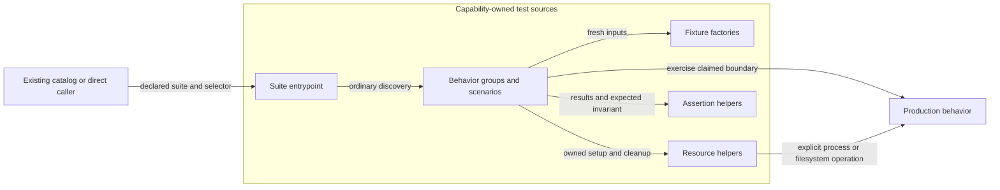

# Shared test-design rules

Owner: [System](../system.md#living-test-design-composition), with stable TEST-SR-01–22 requirements in [System’s Requirements](../system.md#requirements). These shared rules apply to CLI, Skill, Engineering and their children, including Validation. [Design](../skill/authoring/design.md#living-test-design) owns the authoring method; [Validation](../engineering/validation.md) owns check selection, execution and reporting. This document is supporting detail of System and carries no additional model ID. [README](README.md) provides navigation to model designs.

## Start from supported outcomes

State the model's current responsibility, supported population and important outcomes before examining the existing suite. Identify plausible defects and their impact, then select sufficient observations. If a supporting capability needs a large catalog, first reassess its responsibilities, overlap and operational complexity. A large suite is evidence to inspect, not the required size of its Design.

Keep temporary migration acceptance and implementation deferrals in their owning change or plan. Shared maintenance policy stays with System; Assessment owns judgments and evidence applicability. Release frequency, helper count and document length alone do not decide necessary protection; authority, irreversible writes and recovery can justify strong proof even for an infrequent operation.

Give each behavior and shared interaction one primary owner. Parents describe additional interactions that child checks cannot establish and reference child detail. State covered behavior and evidence limits; reference another model only where an observation relies on its contract or proof. Missing ownership is a gap. An intentional omission names the required outcome, reason and responsible owner's disposition.

## Choose and group scenarios

A new design scenario needs a distinct required outcome, material failure boundary, demonstrated regression or useful diagnostic contribution. Explain its contribution at the case or coherent group level. Use representative input partitions, real boundary values, decision tables, state transitions, properties and controlled faults as appropriate. The chosen technique and the observation boundary are separate decisions.

| Situation | Design treatment |
| --- | --- |
| Related invalid values with the same rule, fixture shape and rejection boundary | Group named variations within one scenario. Preserve defining conditions and expected observations in the Design; keep runnable parameter rows and assertions in the tests. |
| Different authority, persistence, temporal or recovery boundary | Keep a separately understandable scenario when the required observation differs. Rejected approval before any write and revoked approval between writes protect different states. |
| Another private helper, serialized field, package version or discovered test method | Add a scenario only if it introduces distinct required protection. Native discovery owns the method inventory. |
| Expensive interaction already exercised by one composed test | Reference that realization from the relevant obligations; several links do not require duplicate execution or create several independent results. |
| Guidance requiring engineering judgment | Use a concrete independent review or walkthrough with named subjects and limits. Structural wording checks cannot prove semantic adequacy. |

Keep defining conditions, the actual action and independently expected values, diagnostics, preserved state or prohibited side effects concrete enough to implement. "Invalid input fails" is insufficient if an unrelated setup defect could satisfy it. Identify the plausible incorrect behavior the observation would expose. Several assertions can establish one outcome, such as rejection with an unchanged destination.

Consolidation retains relevant input distinctions, expected observations, meaningful realization links and unresolved gaps. Do not merge different failure mechanisms merely to reach a smaller count or compress many unrelated scenarios into one vague entry. A smaller JSON catalog does not establish a smaller or better executable suite. Additional justified regression and property tests need not each have a permanent catalog entry.

## Layout and responsibility

| Artifact | Information it owns |
| --- | --- |
| Shared rules in this directory | Common selection, organization, assertion, fixture and maintenance criteria. |
| A model's test-design section or directory | Its supported outcomes, requirement references, risks, concrete scenarios, observation boundaries, representative fixtures, realization links and known gaps. |
| Test scripts and fixtures | Runnable setup, parameter rows, actions, assertions and resource cleanup. Keep actual expected-behavior decisions consistent with the Design. |
| Delivery plan and evidence | Change-specific sequencing, commands and execution points; actual observed results and applicability belong in evidence. |

Small models keep a proportionate section in their main Design. When cohesive detail warrants files, use the model's `test-design/test-design.md`, an explicitly selected `test-cases.json` index and `cases/<group>.json`. Directory creation follows actual content. JSON is optional unless explicitly selected. Requirements and acceptance outcomes remain in the main model; reference their identities rather than duplicate their normative text. A model is a responsibility, not a requirement for a test file, class or suite.

For a selected catalog, strategy owns the coverage rationale, JSON owns the scenario definitions, and the declared field contract owns formats, stable case/variant IDs, explicit group membership, references, closed values and realization-gap meaning. Several methods may realize one scenario, and one composed method may support several obligations. No per-function quota or complete permanent method mapping is required. Existing, partial and proposed realization must be honest about assertions and missing proof; links and counts never establish a passing result.

Use the exact locally selected catalog contract. Release, Skill and Authoring currently use provisional scoped drafts with their own bindings, indexed from [README](README.md#model-test-designs); this shared directory creates no universal JSON schema or case CLI. Their owners define the exact fields and scope; gaps remain with case realization. Author checks assess shape, containment, references and native discovery. Independent review assesses scope, concrete expectations and detection value. Catalog text has no command-execution authority.

## Observation boundaries

| Boundary description | Protection and representative observation |
| --- | --- |
| Contract | A bounded rule or decision: invalid profile fields reject, a hash matches an independently known value, or a field update preserves unrelated data. Use only the state needed to expose that violation. |
| Public boundary | The interface actually used by a caller: arguments, result shape, diagnostics, exit status and required absence of filesystem/network side effects. A parser-only assertion cannot prove command dispatch or persistence. |
| Composition | Agreement between owners: canonical Skill resources become the correct package inventory, or a verified archive is consumed correctly by Installation. Execute the cooperating code where their agreement is claimed. |
| Product/release proof | The actual artifact or operational environment where identity matters: a packed CLI, generated candidate, real Git persistence or Release-required public smoke. A simulated environment cannot prove a public publication observation. |

These descriptions can overlap: a public-boundary case can also prove composition. Contract-centered reasoning applies to every row; “contract” here describes a bounded rule, not exclusive ownership of contractual correctness. Cost depends on setup and execution, not the row name. They are independent of the executor’s focused/boundary phases and create no new catalog vocabulary, test directories, lifecycle gates or prescribed proportions.

Choose broader proof only when it contributes a required observation beyond narrower evidence, or an existing governing obligation explicitly requires that execution. Do not automatically retain both levels: deliberate overlap needs distinct failure detection or useful diagnosis under TEST-SR-03/04/08. For example, hash edge cases can use small independent vectors, canonical archive completeness needs real generated-member inspection, and archive consumption needs the actual packed installer. Repeating full installations for each hash input adds no necessary protection when the narrower cases and composed path already expose the relevant defects.

## Fixtures, expectations and failure scenarios

Exercise the code whose correctness is claimed; simulate an external dependency only outside that boundary and state the resulting limits. Release orchestration can use controlled provider responses while retaining real retry decisions and evidence recording. Such a case does not establish the provider's actual behavior or replace required public smoke. A builder mocked to success cannot prove archive contents.

Expected results must be independent of the potentially faulty logic under assessment. Independently inspect canonical inputs and emitted members, or use contract-derived values and counterexamples; do not generate both expected and actual results through the same defective inventory or hash calculation. Shared setup helpers are acceptable when they do not become the oracle for the claimed behavior.

Use the smallest realistic fixture that preserves the failure mechanism. Each independently runnable case owns mutable state. Shared immutable inputs may be independently copied or materialized; a required ordered operation sequence belongs inside one coherent scenario, not across dependent tests. For expensive groups, first examine repeated fixture construction and unnecessary product setup. Preserve realistic Git, filesystem, archive or process behavior wherever a smaller substitute would hide the defect.

A case normally has one coherent reason to fail, which can require several assertions: a rejected command may need a nonzero exit, actionable diagnostic and unchanged destination. Consider valid/invalid input, conflict, interruption, retry, partial success, stale basis and environment differences where they change the required outcome; do not require every combination for every operation. A lost publication response followed by retry must observe external state without a second immutable-version write at the real orchestration boundary. A pure retry helper cannot establish that composed claim.

## Test script structure

TEST-SR-19/20 refine authoring within the existing capability layout. Keep Python `unittest` and native Node tests. A test file is a cohesive behavior group, not automatically one production file, historical milestone or observation level. Group, for example, resource-map validation separately from record persistence or release recovery. A public-command group may exercise several production modules when their composition is its protected behavior.

| Source responsibility | Contents and dependency rule |
| --- | --- |
| Behavior module | Related scenarios and their governing obligation or group-level rationale. Keep the conditions and expected outcomes near the actions they explain. |
| Test class or named group | Related scenarios sharing a small, relevant setup contract. Python normally uses direct `unittest.TestCase` subclasses; Node normally uses test functions and optional native grouping. Neither class count nor symmetry between languages is a target. |
| Fixture factory | Fresh valid data or a small owned input tree with explicit variation points. It may use production utilities outside the claimed observation boundary, but cannot derive that boundary's expected result from the same potentially faulty logic. |
| Resource helper | A cohesive lifecycle for an owned temporary repository, archive workspace or child process. Creation, operations, cleanup and externally significant options are explicit. |
| Assertion helper | A repeated contract invariant with useful actual-versus-expected diagnostics. It receives observable results and independently justified expectations; it does not quietly perform the tested operation or recover it into success. |
| Suite entrypoint | Existing argument/filter handling and ordinary collection of its declared groups, including supported hooks and reporting. Move scenario bodies into their owners when responsibilities diverge; retain a complete direct invocation. |

These responsibilities may share a small module when each remains clear; the table does not require a separate file, class or helper for every row. A simple directly runnable test module needs no additional aggregate entrypoint. Extract support when its actual reuse or lifecycle responsibility makes the scenarios easier to understand.

The graph describes dependencies within one capability's authored tests. It supplies System-owned detail for authored test-source organization and adds no runner, catalog or independently deployed component.



Use composition for ordinary reuse: a test calls a fixture function or owns a resource helper. A resource class is justified when related state and cleanup belong together; a static input dictionary does not require a builder hierarchy. Never instantiate another test class or call its `setUp`/test method to borrow a fixture. Production modules must not depend on test-only support. Shared assertion and fixture helpers must not import their consuming test classes or suite entrypoints; this preserves ordinary loading and avoids circular discovery.

Prefer direct test classes over layered inheritance. Existing mixins can preserve selectors during a move, and a shared contract group can test several actual implementations, but either needs explicit consumers, hook ownership and case-discovery evidence. Inherited test methods must not accidentally run twice or disappear under a case filter. A compatibility technique is not a requirement to spread every behavior through mixins. Preserve a supported case selector where feasible; an intentional identity change needs the before/after mapping and consumer reconciliation below, rather than duplicate aliases.

Split a module when its groups have independently explainable contracts, substantially different fixture/resource needs, or changes repeatedly require navigating unrelated scenarios. Keep small related variants together. Keep support local until actual consumers justify sharing it; do not introduce a generic `utils` module to collect unrelated operations. There is no maximum line count, mandatory one-class-per-file rule, or automated style gate for these judgments.

Name modules and classes after protected behavior, and cases after the relevant condition and outcome, such as `ResourceMapTests.test_missing_declared_resource_is_rejected`. Avoid introducing names that only identify a former milestone or implementation helper. Existing identifiers may remain when their compatibility value exceeds renaming value; a descriptive rationale can explain them. Python importable support modules use valid module identifiers and Node modules follow package conventions. Preserve existing hyphenated direct entrypoint filenames until their actual command consumers are deliberately reconciled; standard filesystem discovery must not be assumed to find them.

## Scenarios, fixtures and variations

Read a case as arrange, act and assert: the relevant initial state, the real operation at the selected boundary, and the expected observation. These parts need not have literal comments or a fixed assertion count. Keep the defining invalid value, missing resource, conflict or interruption visible in the case. A helper with flags for many unrelated scenarios obscures those differences and should be separated into smaller operations. Some repeated local setup is preferable to a shared abstraction that hides why a test should fail.

Factories return fresh nested mutable values, not shallow copies of shared mutable defaults. Register cleanup as soon as a resource is acquired so later setup or assertion failures still release it. Resource helpers own only their temporary roots, subprocesses and allocated resources; they must not delete caller-owned paths or restore an entire developer worktree. Working directory and relevant environment are explicit. When process-global state is itself under test, keep the observation in its isolated process under VAL-SR-01/17 rather than leaking changes to other cases.

Class/module setup is not a persistent shared cache: the existing per-case worker model may rerun it for each case. Share only immutable prepared inputs with a justified owner and lifetime, and materialize private copies before mutation. A fixture can be realistic without copying the complete product; actual archive, Git, CLI or filesystem behavior remains required where reducing it would hide the protected defect. Generic setup validity may be checked, but the assertion of the claimed behavior still needs its independent oracle under TEST-SR-05.

Use named parameter rows or subtests when the same behavior and fixture shape vary by meaningful input. Keep distinct recovery or authority transitions in separately understandable scenarios. Do not create Cartesian combinations without distinct protection. Every parameter that mutates state starts from a fresh fixture unless the ordered steps deliberately form one scenario. Register generated Node cases deterministically through the native runner and include their named population in the discovery basis. Python subtests remain observations within their containing `Class.test_method`; do not claim that each row is independently scheduled. Randomized properties retain counterexample and environment information under TEST-SR-06.

Assertions must fail for the intended violation. For rejection, observe the intended error and any required absence of side effects, not merely a nonzero status that could come from a broken fixture. Match stable error codes or diagnostic meaning where available; exact wording is appropriate only when that wording is part of the contract. A mutation of a string fixture must establish that the intended input actually changed. Snapshots need inspected contractual expectations; blindly replacing a golden file after failure cannot establish correctness.

## Worked authoring examples

These are illustrative excerpts owned by System under TEST-SR-04/05/19/20, applying Validation’s VAL-SR-01/14/17 execution constraints. They are not executable fixtures, new helper APIs or evidence that the product passed. The Python example assumes `write_valid_skill` creates a private valid skill declaring `references/guide.md`, and `run_validator` invokes the actual validator command with explicit working directory/environment and returns its captured process result. Their implementations and imports are omitted. The helper names explain roles; Delivery and implementation select concrete reuse.

```python
class ResourceMapTests(unittest.TestCase):
    def setUp(self):
        temporary = tempfile.TemporaryDirectory()
        self.addCleanup(temporary.cleanup)
        self.root = Path(temporary.name)

    def test_missing_declared_resource_is_rejected(self):
        skill = write_valid_skill(self.root)
        resource = skill / "references" / "guide.md"
        resource.unlink()

        result = run_validator(skill)

        self.assertNotEqual(result.returncode, 0)
        self.assertIn(
            "mapped resource 'references/guide.md' does not exist in canonical skill source",
            result.stderr,
        )
        self.assertFalse(resource.exists())
```

The defining fault and outcome are visible, while setup and command mechanics can be reused. The diagnostic fragment follows the current mapped-resource validator and distinguishes this failure from an unrelated exception mentioning the path; an implementation with a stable error code can assert that code instead. The last assertion observes only absence of a recreated resource, not general filesystem preservation. If the claimed contract requires no writes anywhere in the supplied tree, compare its relevant paths and bytes before and after instead. Replacing the real command with a stub that returns failure would lose public-boundary proof even if every assertion still passed.

For Node, keep an analogous test function: acquire a private root, immediately register cleanup with the native test context, build a fresh valid request, apply the visible fault, invoke the selected real boundary and assert its error and preservation outcome. Classes add value only for a reused resource lifecycle; wrapping every native test in an object adds no protection. Register related generated cases with unique condition names before execution and keep each case's mutable request independent.

| Scenario contrast | Required observation and authoring consequence |
| --- | --- |
| Unknown value in an otherwise valid closed vocabulary | Assert the owning rejection before consistency work; do not combine unrelated invalid fields whose earlier failure masks the intended check. |
| Rejected record update | Observe the actual command/result contract and unchanged relevant stored bytes; an assertion of failure alone misses partial mutation. |
| Archive completeness | Compare real emitted members with independently justified canonical inputs; importing the producer's inventory as both expected and actual hides omitted resources. |
| Release interruption followed by recovery | Keep the ordered steps in one isolated scenario with explicit persisted state; a separate test must not depend on the first test's leftovers. |
| Two generated invalid-input variants | Preserve both named observations and fresh setup; losing one registration cannot be described as a successful file split. |
| Equivalent instruction wording | Structural tests claim only their explicit structural obligation. Semantic adequacy remains with independent review; phrase changes alone do not establish a product defect. |

## Ownership and maintenance

Capability Designs own behavior and material risks. Delivery allocates concrete proof, commands and execution points; implementation supplies fixtures and assertions. The selector and scheduler determine when and how admitted checks run, not which behavior counts as sufficient protection. System owns these shared rules; Validation applies them while owning the execution machinery. The method adds no execution component or trust boundary.

Under TEST-SR-07–10, assess an expensive group by its detection value, execution cost and maintenance burden. Identify its distinct protected failures and existing proof before retaining, strengthening, consolidating, replacing or removing cases. Establish and independently assess adequate retained/replacement protection before reducing the suite. Slow execution, inability to parallelize or repeated setup alone cannot justify deletion or a change in the behavior the test claims to establish. Existing validation-result caching prohibitions and required fresh execution remain in force. Optimize execution without weakening protection; test count and coverage percentages are not the objective.

Update the owning Design when behavior, responsibility, scenarios, fixture strategy, referenced sources or execution reachability changes. Preserve stable IDs across moves; deliberate consolidation records the before/after obligation mapping in the owning change and reconciles actual consumers. Retire an obligation's exclusive cases and fixtures only after current reliance is resolved. Preserve uncertain protection while investigating; a missing catalog row, historical-looking literal or shorter suite cannot justify deletion. Compatibility needs a current consumer or supported contract; synthetic versions alone establish no historical support promise.

Review changes by distinct risks covered, assertion quality, useful diagnosis, execution cost and maintenance burden. Code coverage and case counts support investigation, not quotas. Preserve independent regression detection, required freshness and meaningful local/integrated distinctions. Record assessment and run results through their existing owners; keep this document and model designs free of transient pass/fail state.
