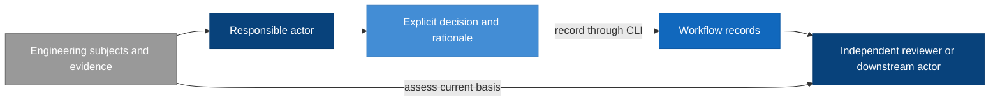
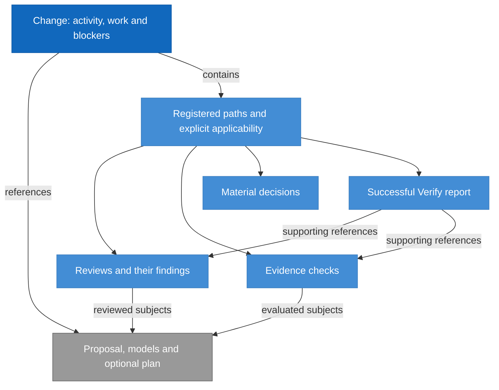
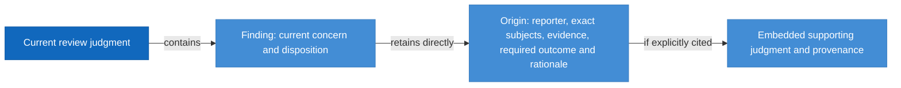

# Workflow Model Design

Model validation contract: explicit-recording-v1

## Introduction and Goals

The Workflow model defines how responsible humans and agents turn a direction into reviewed design, delivery work and verified outcomes. It owns the meaning of recorded status, responsibilities, review applicability, correction and readiness. Its purpose is durable, inspectable reasoning and resumable work without making a command-line transition engine the decision owner.

The initial model inventory for this change has two members: Workflow and CLI. Workflow owns the engineering process and the model-document convention; CLI owns the safe storage interface. Neither is defined by a feature, class or AI model. Other system models can be identified later without forcing unrelated contracts into either file.

### Design at a glance

> Agents spend tokens understanding engineering meaning; the CLI spends computation on identities, selection, preservation, serialization, registration and persistence.

Workflow defines who makes each engineering decision, what that decision means, and what evidence another actor needs before relying on it. Records retain those explicit decisions. The CLI is the recording mechanism; it does not become the decision owner.

| Reader question | Start here |
| --- | --- |
| Who owns each decision? | [Actor boundary](#context-and-scope) and [responsibility-specific updates](#responsibility-specific-updates) |
| What is stored, and how do records relate? | [Record model](#record-model) and [formal record fields](#explicit-record-schema) |
| How do actors use the CLI? | [Primary skill interaction](#primary-skill-interaction-and-decision-ownership) |
| What happens when Verify finds a defect after completion? | [Correction walkthrough](#correction-walkthrough-actor-decisions) |
| What supports independent review and downstream reliance? | [Requirements](#requirements) and [model traceability](#model-documentation-and-traceability) |
| What must agree before adoption? | [Targeted-interface allocation](#targeted-interface-adoption-allocation) and [historical compatibility](#adoption-and-historical-compatibility) |

## Context and Scope

| Actor or model | Owns | Does not own |
| --- | --- | --- |
| Human decision owner | Product direction, scope exceptions, external/destructive authority | Implicit approval through silence |
| Authoring agent | Its model content and explicit correction impact declaration | Approval of its own content |
| Review agent | Judgment, findings, exact reviewed subjects and their settlement | Editing the content it approves |
| Route agent | Selecting work, coordination, recorded current activity and correction responsibility | Manufacturing review or Verify results |
| Implementation agent | Approved implementation and execution evidence | Changing the approved design through code |
| Verify agent | Final coherence assessment and success-only completion evidence | Approving its own correction |
| CLI model | Mechanically validated persistence and observations | Any of the decisions above |

The CLI interface is a dependency, not a superior workflow authority. Local filesystem permissions and runtime controls remain the execution boundary; an actor label in a record is attribution, not authentication.

## Architecture Constraints

Current state must remain understandable without Git history, PR access, a network service or a previous chat. Reviewers must remain independent of the work they approve. Saving a decision does not prove it correct. Existing approvals and findings cannot acquire new meaning through a document rename.

This draft deliberately changes the proposed ownership of lifecycle decisions and design documentation. It does not remove final Code Review, change release permissions or authorize automatic progression. Those concerns retain their existing owners.

## Solution Strategy

Use explicit decisions supported by evidence. Responsible actors read the current records and exact subject identities, decide their updates, and submit purpose-specific operations through the CLI, using batch only for related explicit decisions that require coherent publication. The workflow remains governed by skills and independent assessment, but storage accepts a structurally sound correction regardless of the currently recorded stage.

Avoid duplicated readiness fields where one explicit decision suffices. A stored decision and an observation about its supporting evidence are separate: a recorded approval may remain visible while a diagnostic reports that its subject has changed. Consumers must not mistake the visible historical judgment for current permission to proceed.

The arrows show evidence and decision flow, not automatic stage transitions. The receiving actor decides whether recorded evidence supports reliance; the CLI's successful save supplies no additional approval.

## Requirements

The following stable requirements define model behavior; the targeted-command amendments require coordinated adoption before being claimed as implemented. IDs are model-scoped and remain stable when later features revise this document.

| ID | Required behavior |
| --- | --- |
| WF-SR-01 | Responsible actors MUST explicitly decide stage, status, ownership, review applicability and readiness. Neither saving another record nor a read operation may supply those decisions automatically. |
| WF-SR-02 | A change record MUST identify its contract, proposal, affected model documents, current activity, responsible owner and unresolved blockers. Each referenced review or proof MUST identify its exact subjects. Mutable progress belongs in change records, not model Design documents or plan bodies. |
| WF-SR-03 | A formal reviewer MUST record a judgment against the exact reviewed subjects and its basis before approval is relied on. An author MUST NOT approve its own contribution. CLI persistence success or a caller-supplied reviewer label is not independent-review evidence. |
| WF-SR-04 | Before relying on changed work, its author MUST identify affected approvals and evidence, explicitly mark applicability changes, and record outstanding correction work. Route MUST assess cross-model impacts and select the next responsible owner without requiring that owner to appear in a previously derived pending set. Uncertain impact remains an explicit blocker. |
| WF-SR-05 | Any responsible stage, including Verify, MUST be able to record a newly discovered defect with stable finding or blocker identity, affected subjects, evidence, required outcome and correction owner. Failed Verify MUST NOT create a success report. Route records the correction destination; the finding does not need to originate in a prior review stage. |
| WF-SR-06 | Each unresolved finding MUST retain self-contained origin basis: who reported it, the exact subjects, the observed evidence, the required outcome and the rationale, including any explicitly cited supporting judgment. A later review MUST NOT overwrite that basis or require prior review rounds, Git history or chat to reconstruct it; change-level blockers retain disposition responsibility with their reporter, including Verify. Returning work for rereview is not approval. Completed work may be explicitly reopened; a former completion or current stage MUST NOT prevent recording that decision. |
| WF-SR-07 | Each model MUST have one authoritative living Design file combining requirements, structure, decisions, boundaries, compatibility and acceptance. Features update affected models; cross-model contracts have one named owner and references from consumers. Mandatory separate specifications, architecture files and ADRs for the same model are removed only upon approved adoption. |
| WF-SR-08 | Requirement and decision references MUST survive normal document revisions. A changed or retired obligation retains its identity and rationale or an explicit replacement mapping. Design Review MUST assess the exact affected model revisions and relevant relationships; approval of one change does not approve another change's concurrent edits. |
| WF-SR-09 | A downstream actor MUST check the current decision basis before reliance. Missing, changed or contradictory required evidence blocks progression and is recorded explicitly; it does not prevent safely recording the blocker or correction. Only successful Verify may record lifecycle completion with exact evidence supporting the required design and delivery obligations. |
| WF-SR-10 | Historical contracts MUST remain explicitly identified and must not be silently reinterpreted. Adoption MUST preserve findings, decisions and proof provenance, identify replacement ownership and provide a supported recovery or rollback boundary. This amendment performs no adoption. |
| WF-SR-11 | Ordinary skills MUST use purpose-specific inspection and targeted recording, or batch for related explicit edits, without full-file reconstruction or historical eligibility checks. Actors MUST supply all intended decisions and explicitly select useful context. The CLI MUST perform mechanical selection, identity computation, registration, preservation, serialization and persistence; actors expand the engineering basis when their judgment requires it. |
| WF-SR-12 | A new supporting record MUST have an explicit actor-supplied record-level applicability declaration; CLI registry construction MUST NOT decide applicability. Updating a check or review alone MUST NOT change applicability, activity, finding disposition or completion. |
| WF-SR-13 | Findings MUST remain review-scoped and change-level blockers MUST remain distinct. The reporter owns disposition assessment, while the recorded owner identifies correction responsibility; neither a later review nor a correction agent may silently close a Verify-owned blocker. |
| WF-SR-14 | A receiving actor MUST treat status, scoped context, preview and successful saves as recorded information, not permission or sufficient engineering context. Bounded omissions and stale identities require explicit further inspection or reassessment before reliance. |

## Building Block View

Workflow has three conceptual parts, not three services or mandatory files: stage skills supply decisions; change-local records preserve those decisions and evidence; model Design documents supply the durable engineering contract. Delivery plans allocate model requirement IDs to work and proof. Independent reviews and Verify assess the resulting chain.

| Artifact responsibility | Proposed owner and placement |
| --- | --- |
| Model engineering truth | One `docs/design/<model>.md` per model |
| Change intent | Existing proposal surface |
| Mutable work state and explicit decisions | Change-local `change.yaml` |
| Current judgment and open findings | Stable change-local review record for the applicable target; each finding carries its own retained origin basis |
| New non-review-stage blocker, including Verify failure | Structured blocker entries in the change record, with evidence references; no fabricated review |
| Current proof and freshness subjects | Conditional change-local `evidence.yaml` |
| Resolved rationale that still constrains work | Conditional `material-decisions.md` |
| Stable delivery allocation | Existing plan surface |
| Successful final explanation | Success-only `verify-report.md` |

These placements preserve distinct responsibilities under the `explicit-recording-v1` contract defined below; they do not claim compatibility with existing compact schemas. A blocker originating in Verify remains owned there for closure even when a subsequent review supplies supporting judgment. Review findings remain reviewer-owned.

### Record model

**RigorLoop Record Format** is the public name used here for the stored-record contract. The existing `explicit-recording-v1` discriminator and schema_version 1 remain the compatibility format. The selected prospective v2 refinement below adds retained concern origin under its own discriminator; a clearer document name alone changes no serialized values.

The change record is the registry and coordination entry point. It contains activity, work and change-level blockers; it references the proposal, affected models and optional plan. Its registry identifies supporting records, each with an explicitly declared applicability entry. Review findings belong to their containing review. Reviews and evidence name exact engineering subjects; those subject identities do not become automatically current when files change.

This conceptual view illustrates WF-SR-02/03/05/08/12/13; it is not a second schema. Subjects may also include implementation and other proof inputs admitted by the exact Subject type. Supporting records are conditional, and their arrows do not imply that every record must exist before a correction can be saved.

| Stored record | Semantic responsibility | Definition in the [existing JSON Schema](../../schemas/explicit-recording-v1.schema.json) |
| --- | --- | --- |
| Change | Recorded coordination, work, blockers, registry and applicability | `$defs.change` |
| Review | Independent judgment, exact subjects and review-scoped findings | `$defs.review` |
| Evidence | Supplied procedures, results and evaluated subjects | `$defs.evidence` |
| Material decisions | Rationale and source references that constrain work | `$defs.decisions` |
| Verify report | Successful final assessment and supporting references | `$defs.verify` |

Workflow owns the field meanings and cross-record obligations below. The JSON Schema expresses structural shapes; the [CLI model](cli.md#advanced-candidate-update-contract) owns byte encoding, containment, identity computation and persistence. The schema file also contains advanced request/result definitions, which are transport contracts rather than additional stored record kinds. Markdown bodies provide actor-authored reasoning alongside structured metadata; metadata retains the declared status and identity meaning. Structural validity does not establish workflow readiness.

### Explicit record schema

WF-SR-02/03/05/08 own this schema. Every object is closed: only listed fields are admitted, all fields are required unless marked optional, and duplicate keys or IDs are invalid. Empty arrays represent no entries; there are no inferred defaults. IDs use lowercase letters, digits and hyphens, start with a letter or digit, and contain 1–80 characters. Change IDs follow the same grammar. Paths are repository-relative and subject to CLI containment rules. A digest is `sha256:` followed by 64 lowercase hexadecimal digits.

Common types are `Subject = {path, identity}` and `Actor = {id, role}`. `identity` is a digest of exact file bytes; `role` is one of `human`, `proposal`, `design`, `plan`, `review`, `route`, `implement`, `verify`, `support`. A reference to a record entry is `{path, id}`; it identifies the entry, not a claim about freshness. Narrative fields are nonempty strings. IDs are unique within their containing array. Referenced subject files may have changed or disappeared; those are observations, unlike a dangling reference to an entry inside the candidate record set.

| Record | Exact structured fields |
| --- | --- |
| `change.yaml` | `schema_version: 1`, `contract: explicit-recording-v1`, `change_id`, `proposal: Subject`, `models: [{id, subject: Subject}]`, `activity: {stage, status, owner: Actor, reason}`, `plan: Subject or null`, `work: [{id, status, owner: Actor, requirement_refs: [string]}]`, `records: [{path, kind}]`, `applicability: [{path, value, actor: Actor, reason}]`, `blockers: [Blocker]` |
| `reviews/<review-id>.md` metadata | `schema_version: 1`, `change_id`, `id`, `target`, `reviewer: Actor`, `contributors: [Actor]`, `independence_basis`, `subjects: [Subject]`, `judgment`, `findings: [Blocker]` |
| `evidence.yaml` | `schema_version: 1`, `change_id`, `checks: [{id, actor: Actor, subjects: [Subject], result, procedure, summary}]` |
| `material-decisions.md` metadata | `schema_version: 1`, `change_id`, `decisions: [{id, actor: Actor, subjects: [Subject], rationale, source_refs: [EntryRef]}]` |
| `verify-report.md` metadata | `schema_version: 1`, `change_id`, `verifier: Actor`, `subjects: [Subject]`, `evidence_refs: [EntryRef]`, `review_refs: [EntryRef]`, `outcome: success` |

`Blocker` has exactly `{id, reporter: Actor, owner: Actor, subjects: [Subject], evidence, required_outcome, state, resolution}`. `reporter` identifies the actor responsible for disposition assessment and `owner` identifies who must perform correction; these are deliberately distinct. `state` is `open`, `resolved` or `deferred`; `resolution` is null for open work or `{actor: Actor, rationale, evidence_refs: [EntryRef]}` otherwise. The CLI checks this representation, not whether the resolution is justified. An empty evidence-reference array is valid for a reasoned disposition but does not prove the disposition adequate. Review-record blockers are findings; change-record blockers allow any stage to record a defect without inventing a review.

`stage` is `proposal`, `proposal-review`, `design`, `design-review`, `plan`, `delivery-review`, `implement`, `code-review`, `verify` or `support`. `status` is `pending`, `in-progress`, `blocked`, `ready`, `completed` or `cancelled`. These are labels, not a transition graph: any well-formed old/new label pair is recordable. `target` is `proposal`, `design`, `delivery` or `code`; `judgment` is `approved`, `changes-requested`, `blocked` or `inconclusive`. Evidence `result` is `passed`, `failed` or `inconclusive`. Applicability `value` is `current`, `stale` or `not-applicable`. Record `kind` is `review`, `evidence`, `decisions` or `verify`.

The `records` array declares every supporting authoritative record for this change; `change.yaml` is implicit. Each declared record must exist in the candidate set and have the matching kind and change identity. Each supporting record has exactly one explicit applicability entry in `change.yaml`. Extra physical files are not discovered as authority. A new supporting record and its registry/applicability entries are published together. The targeted command constructs registry bookkeeping, but the requesting actor explicitly supplies applicability value, actor and reason. Applicability remains at supporting-record level; individual checks or findings do not acquire a separate applicability field. These are referential checks, not review prerequisites.

The CLI model owns bytes and encoding. Markdown record bodies carry nonempty human-readable reasoning, while their structured metadata owns IDs and enumerated judgments. Body text cannot override metadata. Subject and evidence arrays may be empty while recording incomplete work; Workflow actors must not use incomplete records to justify approval or completion. A Verify report's metadata admits only success, but the CLI does not establish that its assertion is true.

### Retained judgments for unresolved findings

The finding itself retains enough origin basis for the next actor to understand the concern. It does not depend on a chain of prior review rounds, an assessment archive, Git history or chat. This replaces the earlier proposed named-assessment collection and current-assessment pointer; neither becomes part of the selected stored representation. A current review judgment can change while its unresolved findings keep the original basis that made them actionable.

#### Selected record-format revision

The prospective successor is **RigorLoop Record Format v2**, identified by `contract: rigorloop-records-v2` in the change record and `schema_version: 2` in each stored record. The v1 record table above remains the compatibility definition. In v2 every record retains that table's fields and meanings, except its schema version and the change contract, and every review finding or change-level blocker uses `Concern` in place of `Blocker`. No review assessment array or current pointer is added. The existing published v1 schema and implementation remain unchanged until this revision is implemented and adopted.

| Type | Exact shape |
| --- | --- |
| Concern | All existing Blocker fields plus `origin: Origin` |
| Origin | `{reporter: Actor, subjects: [Subject], evidence, required_outcome, rationale, supporting_judgment: JudgmentBasis or null}` |
| JudgmentBasis | `{reviewer: Actor, contributors: [Actor], independence_basis, subjects: [Subject], judgment, rationale}` |

Objects are closed, listed fields are required, and the existing Actor, Subject, text and judgment types apply. The origin rationale is a concise, actor-supplied explanation of why the observed evidence matters for the required outcome. Supporting judgment is an optional fact represented by explicit null when none is cited; a concern does not need a fabricated overall review judgment to be recorded. When supplied, that judgment's complete relevant rationale and provenance are embedded, not represented solely by a mutable link or hash. The finding's original observed evidence and required outcome are retained even if its current fields later evolve.

At creation the CLI copies reporter, subjects, evidence and required_outcome from the actor's concern values into origin. The actor supplies the rationale and explicitly chooses whether a supporting judgment is absent, supplied directly, or constructed from the provenance/outcome of an exact selected review plus actor-supplied finding-specific rationale. Copying the selected content is mechanical preservation; selecting its significance is the actor's decision. No actor is required to retype another review or assemble serialized metadata to retain it. The [CLI contract](cli.md#finding-origin-construction) defines those input forms.

#### Preservation and reliance

Origin is immutable for the lifetime of a concern ID in v2, including after an explicit disposition. New reviews preserve the complete origin along with the finding. They may update their current judgment and narrative without carrying every prior review round. A correction to the concern's current subjects, evidence or required outcome leaves origin intact. A mistaken original report is addressed through current explanation and explicit disposition, not by falsifying its history; a distinct concern receives a distinct ID.

Supporting judgment can be null while the origin remains useful: the reporter, exact subjects, evidence, rationale and required outcome explain the original defect. If a formal reviewer cites an actual supporting assessment, it preserves that assessment's relevant content within the origin. No automatic inference supplies a judgment, independence basis, applicability value or disposition. Later judgment does not become new origin simply because hashes match or a review is approved.

The current state and resolution fields say what the responsible actor now concluded. A resolved/deferred disposition retains the actor, rationale and explicit evidence references under the existing resolution type. That outcome does not overwrite origin or automatically close another actor's concern. Origin preservation applies to targeted and advanced writers and exact-byte recovery; attempts to mutate/remove it under an existing ID are structural preservation errors. This invariant applies regardless of open/resolved state, so it does not create a readiness prerequisite for correction recording.

A normal finding read returns current fields and origin together. This is sufficient to understand the reported concern and its origin without replaying review history, but it does not replace reading the current engineering subjects needed to assess a fix. The existing size limits apply to embedded basis; a limit error does not permit silently truncating rationale or dropping provenance. Actors provide the relevant finding-specific basis, not a dump of all earlier records.

#### Example: a later approval does not erase a concern

| Moment | Current review | Finding f1 | Origin available in f1 |
| --- | --- | --- | --- |
| Original report | changes-requested | Open, with actionable evidence and required outcome | Original reporter, subject identities, evidence, rationale and explicitly cited judgment |
| Later review | approved | Still open until its responsible reviewer decides otherwise | The same origin, without reading the old review body |
| Explicit reassessment | approved | Resolved with the reviewer's current rationale and evidence references | The original basis remains alongside the current disposition |

The middle row is recordable but does not establish justified progression. This example illustrates WF-SR-03/06/08/13; a saved later approval never disposes the finding automatically.

#### Compatibility and adoption

New roots explicitly select either the retained v1 contract or rigorloop-records-v2; no command guesses the version. V2 records all carry schema_version 2, and mixed record versions inside one change reject structurally. An existing v1 root stays v1 and is never upgraded by recording a finding. V1 concern reads identify that retained origin is unavailable rather than synthesizing it from a current review. No v2 retention guarantee is claimed for v1 data. V1 fields and operations remain available under their unchanged compatibility rules.

Adoption requires versioned schema/validator dispatch, CLI origin construction and immutable-origin checks, context/show mappings, generated templates and consuming skills to agree. Migration is outside this amendment; missing historical basis must not be guessed. Exact representation and its integration are Design decisions here; Delivery allocates implementation and proof. The previously recorded Design Review does not approve this revised interaction or stored format.

### Responsibility-specific updates

The unified `design` responsibility combines architecture and specification authorship; it is not a new permission principal. Existing architecture/spec skills can supply portions during adoption, but one reconciled model document is the reviewed subject. Proposal, plan, implementation and Verify remain distinct responsibilities; review targets retain independent reviewers.

| Responsible actor | Allowed semantic edit under the workflow |
| --- | --- |
| Author | Its engineering content and recorded subject references; its work item; new blocker; marking affected applicability stale with rationale |
| Reviewer | Its review, finding dispositions and declaration of current review applicability after exact assessment |
| Route | Activity, work allocation, correction owner and justified applicability restrictions; never a fabricated judgment. Registry insertion is mechanical CLI work, not a Route prerequisite. |
| Evidence producer | Its evidence checks and their applicability declaration |
| Verify | Its blockers/dispositions, final report and explicit completion decision after checking all obligations |

Targeted recording does not transfer ownership of neighboring fields. The actor names its exact object and edits; the CLI preserves omitted entries, fields and narrative bytes under CLI-SR-13. Advanced full-file replacement retains the same semantic preservation obligation, but ordinary skills must not depend on that path. Anyone responsible for affected work may conservatively mark evidence stale, but cannot restore another actor's approval merely because hashes match. Different actor decisions may be recorded in successive transactions; no single transaction requires every responsible agent to be simultaneously available. Semantic ownership is enforced by skills, review and runtime authority, not by trusting request labels.

For independence, the reviewer records the actual contributor identities and a concrete basis: a separately conducted review by an agent or human who did not author the reviewed contribution. Changing a role label or starting another turn of the same author is insufficient. The receiving actor inspects the review output and available execution provenance; if provenance cannot establish separation, it records a blocker or requests an independent human review. This contract introduces neither authentication tokens nor a new attestation service.

### Primary skill interaction and decision ownership

The CLI model owns exact commands, requests, output, selectors and serialization. Workflow owns how actors interpret them. The normal interaction is explicitly selected context with useful record content, subject inspect for mechanical identity computation and any requested subject content, actor judgment, and a targeted mutation or batch. A separate preview/check is optional; normal writes validate themselves. A skill does not repeat a full inspect/check/inspect/record cycle, manually hash subjects, reconstruct registries or collect many shallow summaries followed by mandatory show calls as routine ceremony.

| Actor task | Primary interaction | Explicit decision retained by actor |
| --- | --- | --- |
| Establish change intent | `change create` and `change link` | Exact proposal/model/plan subjects and initial activity; root creation requires user/runtime authority |
| Select correction activity | `activity set`, `work add` or `work set` | Stage, status, owner, reason and work allocation |
| Record independent assessment | `review record`, with `finding add/set` for individual findings | Reviewed subjects, contributors, actual independence, judgment, rationale and any dispositions |
| Report a defect outside review | `blocker add/set` | Reporter, correction owner, evidence, required outcome and explicit disposition |
| Record proof | `evidence record` | Observed result, subjects, procedure and summary; no automatically completed work |
| Declare usable scope | `applicability set`, or an explicit applicability decision supplied to a producer command | Record-level applicability value, responsible actor and reason |
| Preserve a material decision | `decision record` | Rationale, subjects and source references |
| Record successful final assessment | `verify record`, optionally batched with `activity set` | Successful assessment/explanation and separately explicit completion decision |

A finding uses `(review ID, finding ID)` and remains inside that review. A blocker uses a change-level ID even if Verify discovered it; Verify never needs to invent a review. A resolved/deferred state and its resolution travel together as an explicit actor decision. An implementation owner can supply correction evidence but cannot impersonate the reporter's disposition. The CLI validates representation and references, while skills/review/execution authority assess whether the supplied actor actually had responsibility.

A review record's new assessment may replace its current assessment only after actual independent rereview of the supplied subjects. In v2, each retained finding carries [its own origin basis](#retained-judgments-for-unresolved-findings), which the replacement cannot change. Finding operations never implicitly retarget those subjects or rewrite judgment. Linking a revised model changes only the link and its declared identity. It neither restores nor invalidates applicability automatically. The responsible author separately declares the impact, and a reviewer alone restores reliance on its assessment after checking the current basis. A matching hash is not a substitute for that assessment.

Evidence applicability applies to the whole evidence record. If one changed check makes the record unreliable, the responsible actor explicitly restricts applicability and explains the affected scope; consumers inspect individual results/subjects as well. This interface does not add per-check stale/current commands. Record-level current is a supplied assertion, never a CLI conclusion that all checks passed.

`context` applies explicit actor-supplied record selectors and returns complete selected entries by default, including concern origin, evidence and rationale; an optional `--for` label attributes the activity but selects no records. It is not a proof map or dependency resolver. Review/Verify actors inspect all governing model requirements, relevant narrative, prior unresolved findings and current proof necessary for their assessment, even when they fall outside its explicit context selection. Every receiving actor checks current subject identity and the declared scope; a complete page means complete only within that selection. They may use targeted show, continuation pages, direct reads of named engineering subjects, or explicitly requested advanced inspection. A clean observation list and a saved claim do not waive these duties.

A failed Verify can batch failed evidence and a new blocker after activity is recorded completed. It supplies initial applicability if it creates the evidence file; no Route decision is invented. Route later sets correction activity/ownership. After correction evidence and independent review, Verify explicitly resolves its blocker following reassessment and records success only when all obligations pass. Completing activity is another explicit decision, which Verify may include in the same batch as its report. No stage's structurally sound correction waits for all actors to decide simultaneously.

## Runtime View

### Correction walkthrough: actor decisions

A change's activity is recorded completed, but a later Verify attempt detects a defect. This walkthrough illustrates WF-SR-01/03/04/05/06/09/11–14. The [CLI walkthrough](cli.md#correction-walkthrough-recording-behavior) shows the matching commands and storage outcomes; this view explains who supplies each decision.

| Step | Responsible actor | Decision and basis | What remains separately owned |
| --- | --- | --- | --- |
| 1. Inspect the basis | Verify | Read the current requirements, recorded claims and relevant proof; expand scoped context as needed | The CLI does not decide whether that reading is sufficient |
| 2. Record failure | Verify | Record the observed failed check and a change-level blocker with evidence, required outcome and correction owner | The blocker is not a fabricated review finding; recorded activity does not change automatically |
| 3. Select correction | Route | Assess the reported defect and explicitly select correction activity and work ownership | Verify retains responsibility for its blocker's disposition |
| 4. Record correction proof | Implementation owner | Perform the authorized correction and record actual progress and proof | Supplying evidence does not resolve the blocker or establish independent approval |
| 5. Record reassessment | Independent reviewer | Assess the corrected subjects and record judgment, rationale and explicit applicability | A review approval does not close Verify's blocker |
| 6. Record disposition and success | Verify | Reassess its required outcome, explicitly resolve the blocker when justified, and record success only after final obligations pass | Activity completion is a separately explicit decision, even if saved with the success report |

Earlier failed evidence and unresolved concerns remain usable context until their owners make explicit updates. Different actors can save in successive transactions. A recorded completed activity does not prevent correction recording, and a safely saved decision does not itself justify downstream progression.

### Normal work

Route selects an authorized activity and records it explicitly. The author updates the affected model document, identifies impact and submits its recording changes. An independent reviewer assesses the exact content and records the judgment and applicability decision. Route separately records the next activity only when its basis is adequate. One actor does not impersonate another to bundle their decisions into a single save.

### Revising previously reviewed content

An edit can temporarily leave the recorded review subject behind the actual file. The CLI reports the mismatch without changing the review. The author records the revised artifact identity, affected applicability and correction work; the retained review continues to identify the bytes actually reviewed. Route can choose the needed author directly, including a previously completed owner. Independent rereview supplies a new judgment before downstream reliance.

### A defect found at Verify

Verify records a blocker and failed evidence, not a success report. Route records a correction owner and activity even when the previous stage was terminal or no author was pending. The author fixes the owning model or implementation; affected reviewers independently reassess their subjects. Verify closes its blocker only after checking the correction and supporting evidence, then reruns the required final assessment.

### Concurrent edits or interrupted recording

An actor that loses a revision conflict rereads current records and reassesses its decisions; it must not replay an outdated approval against different content. Storage recovery is owned by the CLI model. Workflow consumers do not rely on a mixed or recovery-required snapshot and do not interpret mechanical recovery as a new decision.

## Deployment View

Workflow remains repository-local guidance and artifacts consumed by supported agent integrations. There is no new daemon, hosted coordinator or authenticated workflow service. Skill generation and public adapter packaging remain unchanged during drafting. Adoption later requires coherent guidance across the supported integrations; an old skill must not silently write the new contract.

### Targeted-interface adoption allocation

The v1 compatibility schema remains unchanged. The explicitly selected v2 schema adds self-contained concern origin; targeted commands do not implicitly migrate existing records. The lower-level recorder remains available for advanced tooling and recovery; supported stage guidance uses the primary commands after coherent adoption. No normal skill path may retain full-file reconstruction, manual hashing or registry construction, or call a historical eligibility engine before saving. The earlier replacement inventories remain historical impact mappings; the following table owns this amendment's remaining adoption scope.

| Surface family | Required action before primary-interface adoption | Owning responsibility |
| --- | --- | --- |
| CLI model and Workflow model | Keep request construction, semantic ownership, batch/preview/scope, record-level applicability and compatibility mutually consistent | Design and independent Design Review |
| Canonical stage skills and their transitive references/assets | Replace normal full-file procedure with purpose-specific commands; bound per-operation help, retain sufficient-basis reading, actor ownership and independent review; keep advanced recovery conditional | Workflow Design defines behavior; Delivery allocates exact files; implementation updates authored sources |
| Route and Verify guidance | Use recorded status and scoped context without next-stage inference; distinguish findings/blockers and keep final assessment/completion explicit | Workflow Design, then corresponding guidance implementation |
| Governance, workflow/skill contracts and system architecture | Amend only interface/adoption descriptions affected by this change; retain historical-contract handlers and one-file model authority | Design identifies affected clauses; Delivery supplies concrete diffs or justified unaffected dispositions |
| CLI dispatcher, shared record engine, public help and package examples | Implement the CLI model catalogue and shared pipeline; per-command help avoids unrelated schemas | CLI implementation after reviewed Delivery allocation |
| Targeted request/result schemas, validators, model checks and focused regression coverage | Fail closed on unknown values and conflicting operations; prove preservation, safety parity, scoped output and correction availability | CLI/Workflow requirements, then Delivery proof allocation |
| Supported Codex, Claude and OpenCode adapter packages and examples | Generate from authored skills and verify parity using existing build/release validation; do not hand-edit distributed bodies | Delivery allocation and adapter implementation |
| Complete-interaction token evaluation | Measure guidance, reads, requests, results and follow-up with adequate identical decision basis; do not claim savings from payload-only comparisons | Delivery allocation and Verify evidence |

Required consumer/safety dependencies cannot be deferred beyond adoption; Delivery may sequence them into reviewable milestones. The existing installation/release mechanisms, OS assumptions, historical contract schemas, old review records and unrelated logging behavior remain unchanged. No new plan or implementation is approved by this authoring step. The active user request ends with independent Design Review; it does not publish the primary commands or automatically start Delivery.

### Adoption and historical compatibility

WF-SR-10 selects new changes only for the first version. No in-place migration, contract-field rewrite or bulk document deletion is supported. Existing changes continue through their exact historical handlers; defects in those handlers remain separately owned. Neither earlier proposal is automatically closed or superseded.

Coherent adoption requires approved governing amendments, the matching model documents, recording schemas and CLI, stage guidance, validators, templates and supported adapter output to agree. The adopting delivery package must enumerate these surfaces and evidence of their agreement. A new root is created only by an explicitly requested `explicit-recording-v1` record operation after that adoption; there is no background conversion or silently changed default for historical roots. Drafting these files does not satisfy adoption.

Consolidation is incremental by model. Before a model document becomes authoritative for new work, its adoption decision must identify each displaced normative section, its replacement requirement/decision IDs and any deliberately retained external model contract. Earlier specs, architecture documents and ADRs remain readable under their historical contracts. New approvals cover the consolidated content; old approvals are not retargeted to it. Mixed historical/new references identify which contract owns each obligation, and conflicting authority blocks reliance until resolved.

Rollback before any new-contract writes restores the prior distribution and guidance without changing records. After new-contract records exist, reverting to an old writer is not a rollback strategy: retain a compatible reader, stop new writes and fix forward, or obtain a separately approved conversion. Persisted new records are never deleted to make an old client work. Copying obligations from an old change into a new one requires explicit owner disposition under the old contract and preserved source references; it is not offered as a way around unresolved findings.

### Replacement inventory for adoption

This inventory implements WF-SR-07/10 at the level of governing rules and affected surfaces. It is a proposed scope map, not a supersession receipt, migration script or implementation file count. `Replace for new contract` means the identified rule ceases to govern `explicit-recording-v1` only after coherent adoption; historical contracts retain it. `Amend shared guidance` means contract selection must be explicit rather than globally replacing old behavior. All unlisted unrelated behavior remains outside the proposed replacement.

| ID | Existing source and exact rule area | Treatment and destination | Preservation or adoption obligation |
| --- | --- | --- | --- |
| WF-MAP-01 | [Constitution](../../CONSTITUTION.md), Source of truth order, Architecture rules and Review rules: separate specification/architecture authority and authorship; Design Review's architecture/specification/ADR package | Amend shared guidance: WF-SR-07/08 and WF-DEC-02 establish one model document and one exact affected-model review basis. | Retain independent approval, traceability, source precedence, plan ownership and pre-implementation review. Do not demote governance itself into a model file. |
| WF-MAP-02 | [Workflow specification](../../specs/rigorloop-workflow.md), opening compact-current-state clauses and historical lifecycle chains: architecture then spec and compact semantic-operation progression | Replace for new contract: WF-SR-01/04/07/09 and Responsibility-specific updates. | Preserve old chains under their discriminators. Support skills, delivery review, code review and Verify remain obligations; this proposal does not remove final Code Review. |
| WF-MAP-03 | [Compact record contract](../../specs/compact-current-state-change-record.md), SR-02/03: artifact package and coordinator with derived permitted operations | Replace for new contract: WF-SR-02/07 and Explicit record schema. | Preserve distinct proposal, plan, review and proof surfaces. The new `activity`, `work`, registry and applicability entries are explicit actor decisions, not a renamed derived coordinator. |
| WF-MAP-04 | Compact record contract, SR-07–13 and SR-47: stable reviews, judgment/disposition vocabularies, material decisions and invalidation | Replace for new contract: WF-SR-03–06/08 and the review/blocker/decision schema. | Preserve finding identity, unresolved obligations and rationale. Do not translate old vocabulary or retarget reviewed hashes in place. New non-review blockers must not fabricate reviewer evidence. |
| WF-MAP-05 | Compact record contract, SR-14–18: proof freshness, success-only Verify and invalidating later edits | Split ownership: WF-SR-04/05/09 owns explicit applicability, downstream reliance and completion; CLI-SR-04/07 owns identity checks and observations. | Preserve failed evidence and prevent stale completion claims from authorizing work. Saving a contradictory assertion is possible under the new contract; treating it as valid is not. |
| WF-MAP-06 | Compact record contract, SR-32/34–36/48: responsibility, compatibility, coherent activation, rollback and exact-change bootstrap | Replace for new contract: WF-SR-01/03/10 and Adoption and historical compatibility. | Retain external execution authority and historical handlers. Do not generalize or reuse the compact implementing change's special bootstrap for these drafts. |
| WF-MAP-07 | [System architecture](../architecture/system/architecture.md), Crosscutting Concepts → Source of truth, Lowest sufficient architecture surface and Lifecycle status | Amend shared guidance: this model owns unified design truth and explicit workflow decisions for new work. | Keep unrelated system architecture, prior ADR rationale and historical ownership readable. No whole-file replacement of the system architecture is proposed. |
| WF-MAP-08 | [Architecture skill](../../skills/architecture/SKILL.md), [spec skill](../../skills/spec/SKILL.md), [Design Review skill](../../skills/design-review/SKILL.md): separate authoring output and exact package inputs | Amend shared guidance: unified `design` responsibility and review of affected model files under WF-SR-07/08. | Preserve engineering coverage and reviewer independence. Adapter invocation names need not be removed to combine the authored output; any public skill retirement needs an explicit compatibility decision. |
| WF-MAP-09 | [Route skill](../../skills/route/SKILL.md) and [Verify skill](../../skills/verify/SKILL.md): permitted-operation context, routing, correction and final completion | Amend shared guidance: WF-SR-01/04/05/06/09 supplies decision ownership; consume CLI storage observations without delegated eligibility judgment. | Keep author/reviewer write boundaries, isolated invocation limits and external permissions. No new automatic progression is introduced. |
| WF-MAP-10 | [AGENTS.md](../../AGENTS.md), Artifact lifecycle defaults, Planning and workflow, Required reading before implementation | Amend shared guidance to select model-file authority and explicit recording only for the new contract. | Preserve canonical source paths, user changes, historical continuation, small diffs and validation obligations. |

The CLI model owns the companion storage/schema/runtime inventory; these rows do not duplicate its normative interface. Prior [closeout simplification](../proposals/2026-09-04-remove-final-code-review-and-simplify-cli.md) and [correction lifecycle](../proposals/2026-09-05-compact-correction-lifecycle-amendment.md) initiatives, their design artifacts and findings are retained as separately owned work. This inventory neither establishes their current lifecycle state nor closes their obligations.

### Adoption support surfaces and completion check

| Surface | Required adoption action | Owner |
| --- | --- | --- |
| [Skill contract](../../specs/skill-contract.md), canonical skill references/assets and [skill validator](../../scripts/skill_validation.py) | Reconcile contract-sensitive artifact placement and claim boundaries; retain source ownership and published-skill quality requirements. Resource changes must be traced from the modified canonical skills, not installed copies. | Workflow Design, then Delivery allocation |
| [Boundary method](../../specs/references/boundary-first-method-v1.md), [feature authoring format](../../specs/references/boundary-first-feature-authoring-v1.md), [boundary validator](../../scripts/validate-boundary-first.py) | Implement the Model validation and proof mapping below for explicitly marked model files; preserve existing feature-format validation for historical documents. | Workflow owns the mapping; Delivery implements and proves recognition before adoption |
| [Adapter builder](../../scripts/build-adapters.py), [adapter validator](../../scripts/validate-adapters.py), [adapter support manifest](../../dist/adapters/manifest.yaml) | Regenerate and validate supported public outputs from canonical sources when the changed guidance is adopted. Do not hand-edit generated packages. | Delivery allocation |
| Model adoption decisions and affected plan/verification references | Enumerate displaced requirement IDs and retained outside-model references for each actual consolidated model revision; validate links and exact reviewed identities. | Model author and independent Design Review |

The inventory identifies the principal replacement sites, but is not evidence that every transitive skill resource or normative clause has been reconciled. Before adoption, each row must have an exact reviewed diff or an explicit unaffected/deferred disposition, with no required dependency left deferred. Delivery must expand affected source resources into a concrete file list; it must not treat a directory-level inventory row as proof of completion. Existing change records and review evidence are not bulk-edit targets. No governing surface named above is changed by this drafting step.

## Crosscutting Concepts

### Model documentation and traceability

This file owns the one-file-per-model convention. `cli.md` consumes it rather than restating that contract. Model documents contain stable intent, including meaningful decisions and rejected alternatives. Change records identify affected model paths and exact content identities; requirement references combine model identity and stable local ID. A shared contract belongs to one existing model or a deliberately justified shared model, never duplicate normative prose.

Two features changing the same model use the same document. They must reconcile overlapping requirements before either treats a review as applicable to the combined content. Splitting or renaming a model requires an explicit responsibility and reference mapping, not just a size threshold.

### Model validation and proof mapping

WF-SR-07/08/09 own this model-document validation mapping, identified by explicit-recording-v1. That marker versions document structure independently of the v1/v2 stored-record discriminators. A model file uses the existing `Requirements` table and `Boundary scan and acceptance scenarios` table; it does not need a separate feature spec, test spec or four-table boundary record. This is a model-specific replacement of that document format, not a claim of historical `boundary-first-v1` serialization conformance. The boundary reasoning and independent assessment obligations remain.

Model validation accepts an explicitly selected, repository-contained regular file at `docs/design/<model>.md`, where the filename stem follows the model ID grammar. Symlinked paths are rejected. Each file declares exactly once `Model validation contract: explicit-recording-v1`. Missing or unknown contract markers reject; they never fall back to feature validation. Historical `specs/` documents retain their feature-format and activation rules, with the semantic-review handoff clarified below. Validating a model draft does not activate it or require a registered change record.

The `Requirements` table has columns `ID` and `Required behavior`, with unique stable IDs and nonempty requirement text. Requirement IDs begin with a letter and contain only letters, digits and hyphens; existing WF-SR and CLI-SR IDs stay unchanged. The scenario table has exactly `Dimension`, `Requirement basis` and `Distinct outcome to demonstrate`. It contains each of the eight dimension labels shown below exactly once. An applicable row lists unique IDs declared in that model's Requirements table, separated by comma and space, plus a nonempty outcome. A non-applicable row uses `-` as its requirement basis and an outcome beginning `Not applicable:` followed by a reason. Unknown labels, duplicate or missing rows, malformed tables and undeclared requirement references reject. Each required table and its heading occurs once.

References use the model path plus its existing requirement ID, or the model path plus the exact dimension label for a scenario row; review and evidence subjects also retain exact file identities. Consumers link to the owning model rather than duplicate its rule. Material combined hazards remain concise requirement-linked prose alongside the scenario table; examples illustrate those requirements, never add behavior. No new boundary or proof ID series is required.

Delivery plans map every affected requirement, scenario row and material combined hazard to a verification group, concrete checks and expected evidence. Execution evidence records actual results and exact subjects. Validators check structure and reference resolution, not coverage adequacy, reviewer independence, approval or completion; independent Design and Delivery reviews assess those meanings. This is document tooling, not another responsibility for `record-store`.

For changed grandfathered specs without a boundary marker, structural validation MUST report a separate `review_required` observation naming each path and Design Review as owner. With no structural errors, the result is `review-required` with exit zero: structural checks passed, semantic approval is not established. Structural errors still produce failure and nonzero exit, including when review observations are also present. A missing or unknown marker on a non-grandfathered spec, or malformed existing boundary content, is never converted to a review observation.

Before downstream reliance, independent Design Review MUST classify each reported amendment against its exact reviewed subjects in the existing review record. A non-substantive historical amendment retains grandfathering; a substantive historical behavior change requires the existing feature-format adoption. A new-profile-only amendment is assessed against its owning model and must explicitly preserve the historical remainder. Missing, uncertain or stale classification blocks progression and Verify, even when structural CI passes. The validator neither infers nor authenticates this decision; no extra classification file, receipt or CLI state transition is introduced. This clarifies the handoff in PBF-R049b/PBF-R055a/PBF-R056 and replaces the retired `spec-review` owner with Design Review, without changing historical behavior or waiving semantic review.

### Boundary scan and acceptance scenarios

These rows are the Workflow model's boundary allocations under Model validation and proof mapping above. All eight dimensions apply. They define the review and verification scope, not a claim that validation or adoption has occurred.

| Dimension | Requirement basis | Distinct outcome to demonstrate |
| --- | --- | --- |
| Input domain | WF-SR-02, WF-SR-05, WF-SR-12, WF-SR-13 | New supporting records require explicit record-level applicability; findings and blockers retain separate targets and disposition/correction owners. |
| State/lifecycle | WF-SR-04, WF-SR-06 | Reopen completed work explicitly without a pending-owner or previous-stage prerequisite. |
| Identity/authority | WF-SR-03, WF-SR-08 | Reject reliance on self-approval or approval of another revision. |
| Composition/path | WF-SR-07, WF-SR-09, WF-SR-11, WF-SR-14 | Both exact models are reviewed together; ordinary skills use targeted commands and expand bounded reading without deriving authority from the CLI. |
| Temporal/retry | WF-SR-06, WF-SR-08, WF-SR-09 | A later review preserves each unresolved finding's origin; concurrent model edits require fresh assessment rather than approval replay. |
| Failure/recovery | WF-SR-05, WF-SR-09 | A new Verify defect is durably recordable before correction, without a success report. |
| Compatibility/migration | WF-SR-10 | An old approval is preserved but not silently converted to a new-contract approval. |
| External/environment | WF-SR-02, WF-SR-06, WF-SR-09, WF-SR-11 | Another agent understands an unresolved concern from its current fields and origin, obtains subject identities from the CLI and resumes without prior review rounds, Git or chat. |

The material composed hazards are changed subject plus retained approval, completed owner plus new correction, and cross-model concurrent edits plus downstream reliance. WF-SR-03/04/06/08/09 own their outcomes; examples do not introduce new rules.

### Security, observability and usability

Decision provenance is inspectable, not cryptographically authenticated by actor text. Permissions remain with the surrounding runtime and human authority. Records should reference necessary evidence without copying credentials or raw sensitive output. Readers must see recorded decisions, unresolved blockers and observed drift separately. Text-based documents and CLI projections require no graphical UI or color interpretation. No numerical throughput target is introduced for human/agent judgment.

## Architecture Decisions

| ID | Decision and rationale | Alternative and consequence |
| --- | --- | --- |
| WF-DEC-01 | Skills and humans own workflow semantics; CLI records them. This removes stage eligibility as a prerequisite for recording repairs. | Extending the transition engine preserves automatic enforcement but recreates correction dependencies. Explicit decisions increase actor responsibility. |
| WF-DEC-02 | Consolidate normative design by coherent model, with embedded decision rationale. | Feature-specific spec/architecture/ADR packages multiply sources for the same model. Unified documents need disciplined ownership and concurrency handling. |
| WF-DEC-03 | Retain exact reviewed identities when subjects change; explicitly change applicability instead of rewriting what was reviewed. | Retargeting an old approval would misrepresent evidence. Preserved identities require readers to distinguish recorded judgment from usable approval. |
| WF-DEC-04 | Non-review-stage defects use change-local blockers, not synthetic review judgments or failure-shaped Verify reports. | A review-only finding surface makes Verify correction depend on another stage recording its discovery. |

No separate ADR is created: decisions stay in this owning model under the user-authorized model Design scope. WF-DEC-01 now uses purpose-specific commands for mechanical recording; its actor-owned semantics are retained. The targeted amendment does not retarget old approvals or settle historical replacements.

## Quality Requirements

| Quality | Acceptance condition | Requirement coverage |
| --- | --- | --- |
| Correctability | Both a completed author and a newly failing Verify can record the necessary correction without engine-owned transitions. | WF-SR-01, WF-SR-04, WF-SR-05, WF-SR-06 |
| Trustworthiness | A save, self-approval or stale subject cannot be used as evidence of independent approval. | WF-SR-03, WF-SR-08, WF-SR-09 |
| Resumability | A fresh reader locates current work, owner, findings and exact evidence from repository records alone. | WF-SR-02, WF-SR-09 |
| Design coherence | Every affected requirement has one owning model and a trace into planned work and proof. | WF-SR-07, WF-SR-08 |
| Compatibility | Adoption accounts for every affected historical artifact without erasing unresolved obligations. | WF-SR-10 |

Delivery planning must allocate concrete proof to these requirements and composed hazards; this draft does not claim that proof exists.

## Risks and Technical Debt

Removing automatic ordering checks makes incomplete actor decisions easier to persist. Independent checks reduce that risk but do not guarantee correct agents. A single model file can become contentious or too broad; splitting must follow responsibility, not recreate one file per feature. Existing advanced recording schemas and validators do not establish targeted-interface correctness; the new request/result and preservation obligations require their own allocated proof.

The model-validation mapping checks document structure and references; it does not prove the new commands or completeness of guidance adoption. Exact adoption diffs and transitive resource coverage still require implementation and proof before activation. Any newly discovered requirement-level gap returns to Design. Adapter-specific independence evidence remains a Delivery obligation. No missing behavior is inherited implicitly from the current CLI.

## Glossary

Model: coherent system responsibility with owned concepts and rules. Judgment: an actor's substantive assessment. Applicability: whether that judgment may support current work. Observation: a mechanical fact about stored or actual data. Recording: safe persistence, not approval. Adoption: explicit establishment of a new governing contract and its compatibility boundary.

## Drafting basis and authority

This living model combines behavioral requirements, architecture and decision rationale. The targeted-interface amendment is authored under the user's explicit request to finish the CLI/Workflow Design and obtain independent Design Review. The exact package is this file (`workflow`) and `cli.md` (`cli`); no separate specification or ADR sibling is created. The current Constitution permits explicitly selected explicit-recording-v1 work; the new purpose-specific interface remains prospective. This drafting step changes no executable behavior, persisted contract or historical lifecycle record.

Current direction: [Make Targeted Recording the Primary CLI Interface](../proposals/2026-09-07-targeted-recording-primary-cli.md), its [independent Proposal Review](../changes/2026-09-07-targeted-recording-primary-cli-review-recording/reviews/proposal-review-r1.md), and the user-supplied command boundary. Earlier direction: [Explicit Workflow Recording and Model-Centered Design](../proposals/2026-09-05-explicit-recording-and-model-centered-design.md). Related model: [CLI](cli.md). Current [Constitution](../../CONSTITUTION.md) and contract-selected [workflow specification](../../specs/rigorloop-workflow.md) retain their authority; this amendment does not claim historical lifecycle settlement. The architectural and specification authoring methods are combined here rather than producing mandatory sidecars. This is not yet a complete replacement for all existing workflow contracts.

## Next artifacts

Refine these two model designs and their adoption contract before an explicitly authorized independent Design Review. Delivery planning follows approved Design, not this draft.

## Follow-on artifacts

None yet.
