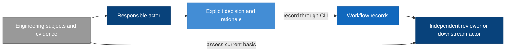

# Workflow Model Design

Model validation contract: explicit-recording-v1

## Introduction and Goals

The Workflow model defines how responsible humans and agents coordinate a direction into reviewed design, delivery work and verified outcomes. It owns activity selection, work and correction allocation and continuation authority. The [Design model](../design/design.md) owns the authoring method and model-document convention under the coordinated adoption boundary below. The [Review and Closeout model](../review-closeout/review-closeout.md) owns shared assessment policy within this domain; Workflow applies its judgments and applicability conditions when coordinating work. The purpose remains durable, inspectable reasoning and resumable work without making a command-line transition engine the decision owner.

The [System model inventory](../system/system.md#responsibility-inventory) describes composition and declared current/unmigrated owners. Workflow coordinates Design, Review and Closeout, Test, RigorLoop Record Format and CLI without copying their local contracts. Review and Closeout and [Test](../test/test.md) are bounded policy responsibilities within the Workflow domain, not new stages or runtime components. Test owns shared test-quality and maintenance criteria; specialists assess actual plans, tests and evidence under Review and Closeout. Record Format owns durable structure and preservation; CLI owns the safe storage interface. The earlier retirement amendment changed Workflow, Record Format and CLI; this authoring-convention amendment changes Design, System and Workflow, with the other models retained as policy/mechanical dependencies. These models are defined by coherent responsibilities, not by features, classes or AI models.

### Unified authoring adoption boundary

This amendment follows the independently approved unified-authoring direction. Its Design/System ownership references take effect only with the coordinated governing and consumer adoption defined by [Design](../design/design.md#coordinated-adoption-boundary). Before that adoption, prior effective governance and public entrypoints remain in force. The model-document contract is preserved while its owner moves; this draft grants no implementation, publication or customer-adoption authority. Historical retirement scope and records retain their meaning.

### Design at a glance

> Agents spend tokens understanding engineering meaning; the CLI spends computation on identities, selection, preservation, serialization, registration and persistence.

Workflow assigns responsible activities and consumes the assessment meanings and reliance conditions defined by Review and Closeout. Records retain those explicit decisions. The CLI is the recording mechanism; it does not become the decision owner.

| Reader question | Start here |
| --- | --- |
| Who owns each decision? | [Actor boundary](#context-and-scope) and [responsibility-specific updates](#responsibility-specific-updates) |
| What is stored, and how do records relate? | [Record model](#record-model) and [formal record fields](#explicit-record-schema) |
| How do actors use the CLI? | [Primary skill interaction](#primary-skill-interaction-and-decision-ownership) |
| What happens when Verify finds a defect after completion? | [Correction walkthrough](#correction-walkthrough-actor-decisions) |
| What supports independent review and downstream reliance? | [Review and Closeout](../review-closeout/review-closeout.md#requirements), applied through [ownership references](#review-and-closeout-policy-ownership) |
| What must agree before adoption? | [Targeted-interface allocation](#targeted-interface-adoption-allocation) and [historical compatibility](#adoption-and-historical-compatibility) |

## Context and Scope

| Actor or model | Owns | Does not own |
| --- | --- | --- |
| Human decision owner | Product direction, scope exceptions, external/destructive authority | Implicit approval through silence |
| Authoring agent | Its model content and explicit correction impact declaration | Approval of its own content |
| Review agent | Judgment, findings, exact reviewed subjects and their settlement | Editing the content it approves |
| Route agent | Selecting work, coordination, recorded current activity and correction responsibility | Manufacturing review or Verify results |
| Implementation agent | Approved implementation and execution evidence | Changing the approved design through code |
| Verify agent | Final coherence assessment and success-only completion evidence | Approving its own correction |
| Design model | Authoring method, model convention, decision preservation and assessment intent | Product direction, actual judgments or work allocation |
| System model | Assembled-system relationships and integrated obligations | Component contracts or governance precedence |
| Review and Closeout model | Shared assessment scope, independence, applicability, concern disposition and final closeout policy | Activity selection, storage shapes or execution permission |
| Test model | Shared test-purpose, derivation, protective-value and maintenance criteria | Behavioral authority, actual review judgments, evidence applicability or closeout consequences |
| Record Format model | Stored structure, versions, relationships and preservation invariants | Engineering judgments or persistence execution |
| CLI model | Mechanically validated persistence and observations | Any of the decisions above |

The CLI interface is a dependency, not a superior workflow authority. Local filesystem permissions and runtime controls remain the execution boundary; an actor label in a record is attribution, not authentication.

## Architecture Constraints

Workflow consumes the independence, reliance, compatibility, and environment obligations in RC-SR-02/04/05/16/18 of [Review and Closeout](../review-closeout/review-closeout.md#requirements). Local coordination does not authenticate an actor or extend its authority.

The earlier retirement selected v2-only support and retained Workflow coordination and Review and Closeout/Test ownership. This later revision transfers the selected authoring/document convention to Design and system composition to System. It changes no release permission or automatic-progression authority; historical judgments retain their exact meaning.

## Solution Strategy

Use explicit decisions supported by evidence. Responsible actors read the current records and exact subject identities, decide their updates, and submit purpose-specific operations through the CLI, using batch only for related explicit decisions that require coherent publication. Workflow coordinates skills under the Review and Closeout assessment obligations; storage mechanics remain capable of recording a structurally sound correction regardless of the currently recorded stage.

Workflow keeps activity selection separate from the assessment and observation concepts defined by Review and Closeout and CLI. It consumes the RC-SR-04/05 distinction between a recorded judgment and current reliance rather than redefining that distinction here.

The arrows show evidence and decision flow, not automatic stage transitions. The receiving actor decides whether recorded evidence supports reliance; the CLI's successful save supplies no additional approval.

## Requirements

The following stable requirements define model behavior; the authoring-ownership amendment requires coordinated adoption before its replacement authority can be claimed. IDs are model-scoped and remain stable when later features revise this document.

| ID | Required behavior |
| --- | --- |
| WF-SR-01 | Responsible actors MUST explicitly decide activity, status, ownership and authorized continuation. Workflow MUST consume review applicability and closeout conclusions under RC-SR-04/05/13 rather than infer them from saves or reads. |
| WF-SR-02 | A change record MUST identify its contract, proposal, affected model documents, current activity, responsible owner and unresolved blockers. Each referenced review or proof MUST identify its exact subjects. Mutable progress belongs in change records, not model Design documents or plan bodies. |
| WF-SR-03 | Workflow MUST obtain the required independent judgment through Review and Closeout RC-SR-01–04 before relying on approval. This stable ID now references that policy owner; it does not redefine reviewer independence or judgment. |
| WF-SR-04 | Route MUST assess cross-model correction impacts and select the responsible owner without requiring that owner to appear in a previously derived pending set. Authors and receiving actors MUST apply RC-SR-05–07/10 to changed-subject impact, applicability and reassessment; uncertain impact is handled under that policy. |
| WF-SR-05 | Workflow MUST provide an owned recording and correction path for defects discovered by any responsible stage, including Verify, under RC-SR-08/10/14. Record Format and CLI retain representation and mechanical recording ownership. |
| WF-SR-06 | Workflow MUST allow explicit reopening of completed work and coordinate reassessment without a previous-stage prerequisite. Concern origin, disposition and the meaning of return-for-review are owned by RC-SR-08–10/14 and represented under the selected Record Format contract. |
| WF-SR-07 | Workflow MUST coordinate owning-model updates under Design DES-SR-01/02/07/08/11/12 and its scoped adoption boundary. This retained identity references Design for unified authorship, document convention and shared-contract ownership; Workflow MUST NOT maintain a second definition of that method. |
| WF-SR-08 | Workflow MUST preserve Design DES-SR-06/11/13 reference and decision continuity when coordinating revisions. Exact affected-model review and concurrent-change applicability MUST follow RC-SR-01/02/05/06/10; retaining a reference MUST NOT retarget an old approval. |
| WF-SR-09 | Workflow MUST condition continuation and completion coordination on the applicable assessments and closeout obligations owned by RC-SR-05/11–15. Missing readiness MUST NOT prevent recording owned blockers or corrections under RC-SR-14. Workflow coordinates Delivery allocation under Design DES-SR-10/16 and the Model validation and proof mapping reference below. |
| WF-SR-10 | Retirement MUST preserve historical bytes, identities and approval meaning while ending runtime support for the exact RF-SR-06 set. The owner-confirmed completed-work baseline MUST NOT be recast as an executed inventory result. No migration or speculative legacy continuation facility is required; concrete contradictory residue MUST receive a bounded owner disposition before the affected removal proceeds. |
| WF-SR-11 | Ordinary skills MUST use purpose-specific inspection and targeted recording, or batch for related explicit edits, without full-file reconstruction or historical eligibility checks. Actors MUST supply all intended decisions and explicitly select useful context. The CLI MUST perform mechanical selection, identity computation, registration, preservation, serialization and persistence; actors expand the engineering basis when their judgment requires it. |
| WF-SR-12 | A new supporting record MUST have an explicit actor-supplied record-level applicability declaration; CLI registry construction MUST NOT decide applicability. Updating a check or review alone MUST NOT change applicability, activity, finding disposition or completion. |
| WF-SR-13 | Workflow MUST keep the recorded correction owner distinct from the disposition owner defined by RC-SR-08–10/14. Review findings and change-level blockers use the selected Record Format targets; route coordinates their correction without manufacturing another actor’s disposition. |
| WF-SR-14 | Workflow actors MUST select and expand useful context for their decisions and apply RC-SR-04/05/18 before reliance. Diagnostic detail remains a CLI observation, not a storage prerequisite or a source of activity-selection authority. |
| WF-SR-15 | The complete successful Verify assessment and final explanation, and the shared material-decisions narrative, MUST be available through normal targeted reads with recorded applicability and identities. Retrieving a deliverable MUST NOT require advanced inspection of unrelated records or imply renewed verification. |
| WF-SR-16 | Workflow MUST preserve the final assessment dependency defined by RC-SR-11/12 in delivery and closeout coordination, including when later corrections affect a previously reviewed result. The plan and specialist assessments supply the basis; route MUST NOT fabricate a final-review judgment or treat a milestone result as a whole-change result. |
| WF-SR-17 | For adopted Test-model work, Workflow MUST route missing intended behavior to Design, missing proof allocation to planning, and defective concrete tests to the responsible implementation or correction activity. Planning and specialist assessments MUST consume the shared criteria in Test TEST-SR-01–13 without assigning that model judgment, applicability or closeout authority. |

### Review and Closeout policy ownership

Dependency references to “Workflow-owned assessment policy” denote the broader Workflow domain. Within that domain they resolve through the ownership map below to Review and Closeout for judgments, independence, applicability, evidence adequacy, and justified reliance; Workflow retains coordination. This treatment intentionally retains the CLI model’s Context and Scope boundary descriptions and Record Format’s Context and Scope and stored-layout introduction descriptions. It grants Workflow no second assessment-policy definition. The retirement package includes Record Format and CLI for their separate stored-support and mechanical changes; their inclusion does not reopen assessment-policy ownership.

All RC-SR references in this file resolve to the [Review and Closeout requirements](../review-closeout/review-closeout.md#requirements). The requirement table retains WF identities as coordination obligations or explicit references to the new owner. The following map states the proposed extraction; it does not claim that earlier reviewed revisions have changed meaning.

| Retained identity | Prior assessment responsibility | New policy owner | Workflow remainder |
| --- | --- | --- | --- |
| WF-SR-01 | Explicit applicability and readiness decisions | RC-SR-04/05/13 | Explicit activity, status, ownership and continuation |
| WF-SR-03 | Exact judgment, independence, and no self-approval | RC-SR-01–04 | Obtain the required specialist assessment |
| WF-SR-04 | Changed-subject impact and applicability | RC-SR-05–07/10 | Cross-model correction allocation |
| WF-SR-05 | Defect basis and success-only Verify failure behavior | RC-SR-08/10/14 | Maintain an owned recording/correction path |
| WF-SR-06 | Retained origin, disposition, and return-for-review meaning | RC-SR-08–10/14; Record Format for stored preservation | Reopen completed work and coordinate reassessment |
| WF-SR-08 | Exact design package review and concurrency applicability | RC-SR-01/02/05/06/10 | Coordinate reference continuity under Design DES-SR-06/11/13 |
| WF-SR-09 | Reliance and justified successful completion | RC-SR-05/11–15 | Apply those conditions to continuation and coordinate Design-owned proof-intent handoff |
| WF-SR-13 | Reporter-owned disposition distinct from repair | RC-SR-08–10/14 | Allocate the correction without assuming disposition authority |
| WF-SR-14 | Sufficient basis and no permission inferred from observations | RC-SR-04/05/18 | Select context and interpret CLI observations for coordination |

WF-SR-02/10–12/15 retain state, compatibility, targeted-interface, explicit-recording and retrieval responsibilities; WF-SR-07 now coordinates the Design-owned document method. WF-SR-16 makes consumption of the existing final-review dependency explicit. Historical policy mappings elsewhere in this file are reference history; assessment obligations they cite resolve through this table for the proposed revision. Runtime examples below illustrate application of the owning policy rather than define another policy source.

## Building Block View

Workflow has three conceptual parts, not three services or mandatory files: stage skills supply decisions; change-local records preserve those decisions and evidence; model Design documents supply the durable engineering contract. Delivery plans allocate model requirement IDs to work and proof. Independent reviews and Verify assess the resulting chain.

| Artifact responsibility | Proposed owner and placement |
| --- | --- |
| Model engineering truth | Owning model subject under [Design document convention](../design/design.md#model-document-and-structural-contract) |
| Change intent | Existing proposal surface |
| Mutable work state and explicit decisions | Change-local manifest: change.json |
| Current judgment and open findings | Stable change-local review record for the applicable target; each finding carries its own retained origin basis |
| New non-review-stage blocker, including Verify failure | Structured blocker entries in the change record, with evidence references; no fabricated review |
| Current proof and freshness subjects | Conditional change-local evidence.json |
| Resolved rationale that still constrains work | Conditional material-decisions.json |
| Stable delivery allocation | Existing plan surface |
| Successful final explanation | Success-only verify-report.json |

These placements express Workflow responsibilities through the [Record Format contract](../record-format/record-format.md#explicit-record-schema): v2 uses the selected JSON paths. Historical placements are archival only after retirement. Concern ownership and closure follow RC-SR-08/09/14.

### Record model

The [RigorLoop Record Format model](../record-format/record-format.md) owns stored record types, fields, relationships, versions and preservation invariants. Workflow owns coordination decisions; Review and Closeout owns assessment meaning and the evidence conditions for downstream reliance. CLI owns construction, inspection and safe publication.

The manifest carries current activity, work and change-level blockers, and registers reviews, evidence, material decisions and the success-only Verify report. These concepts represent Workflow obligations; their exact serialization has one owner in Record Format.

### Explicit record schema

See the [complete stored layouts and common types](../record-format/record-format.md#explicit-record-schema). Workflow requirements WF-SR-02/03/05/06/10/12/13/15 are represented by RF-SR-01 through RF-SR-08; field changes must update that model and the consuming CLI together. Record Format RF-SR-06 owns the sole runtime format and exact retired set.

### Retained judgments for unresolved findings

WF-SR-06 references RC-SR-08/09 for retained concern meaning and disposition. The Record Format model owns the [immutable origin representation](../record-format/record-format.md#retained-judgments-for-unresolved-findings). Workflow coordinates the named correction while preserving that separation.

### Responsibility-specific updates

The [Design model](../design/design.md#runtime-view) owns unified authoring and exact package handoff; it is not a new permission principal. Workflow selects that responsibility and applies its adoption/compatibility boundary. Existing architecture/spec skills can supply portions before coordinated adoption. Proposal, plan, implementation and Verify remain distinct responsibilities; review targets retain independent reviewers.

| Responsible actor | Allowed semantic edit under the workflow |
| --- | --- |
| Author | Engineering content, subject references and assigned work; assessment-impact actions under RC-SR-06/08 |
| Reviewer | Review, disposition and applicability actions under RC-SR-02–10 |
| Route | Activity, work and correction allocation; restrictions under RC-SR-06. Registry insertion remains CLI-owned |
| Evidence producer | Assigned proof production under RC-SR-05/15 and Record Format evidence representation |
| Verify | Assessment actions under RC-SR-09/13/14; separately explicit activity-completion decision |

Targeted recording mechanics are owned by CLI-SR-13: named edits preserve omitted entries, fields and narrative bytes. Workflow selects the responsible activities and may coordinate successive actor transactions. Applicability restriction/restoration and actor authority follow RC-SR-02/06/18; the table above is an assignment index, not an independent definition of those conditions.

Independent assessment and provenance are defined once by RC-SR-02. Workflow uses that evidence to select a valid receiving activity; it does not authenticate a reviewer through an actor label or restore approval through routing.

### Primary skill interaction and decision ownership

The CLI model owns exact commands, requests, output, selectors and serialization. Workflow owns how actors interpret them. The normal interaction is explicitly selected context with useful record content, subject inspect for mechanical identity computation and any requested subject content, actor judgment, and a targeted mutation or batch. A separate preview/check is optional; normal writes validate themselves. A skill does not repeat a full inspect/check/inspect/record cycle, manually hash subjects, reconstruct registries or collect many shallow summaries followed by mandatory show calls as routine ceremony.

| Actor task | Primary interaction | Explicit decision retained by actor |
| --- | --- | --- |
| Establish change intent | `change create` and `change link` | Exact proposal/model/plan subjects and initial activity; root creation requires user/runtime authority |
| Select correction activity | `activity set`, `work add` or `work set` | Stage, status, owner, reason and work allocation |
| Record independent assessment | `review record`, with `finding add/set` for individual findings | Assessment values under RC-SR-01–10, represented by Record Format |
| Report a defect outside review | `blocker add/set` | Concern values under RC-SR-08–10/14; Workflow allocates correction |
| Record proof | `evidence record` | Proof under RC-SR-15; recorded values follow Record Format |
| Declare usable scope | `applicability set`, or an explicit applicability decision supplied to a producer command | Applicability under RC-SR-05–07/15, at Record Format granularity |
| Preserve a material decision | `decision record` | Rationale, subjects and source references |
| Record successful final assessment | `verify record`, optionally batched with `activity set` | Assessment under RC-SR-13/14; activity completion remains a separate Workflow decision |
| Read the final explanation or shared decision rationale | `verify show`, `decisions show`, or their full context selectors | Retrieval under WF-SR-15; reliance under RC-SR-05/13 |

Finding/blocker addressing, coupled disposition fields and v2 origin preservation are defined by the [Record Format schema](../record-format/record-format.md#explicit-record-schema); targeted construction and reference validation are defined by the [CLI primary interface](../cli/cli.md#primary-public-command-contract). Workflow allocates correction activities using the concern ownership defined in RC-SR-08–10/14.

Review replacement and changed-subject reliance apply RC-SR-05–07/10. Workflow coordinates the required author and reviewer activities under those conditions. Record Format owns immutable finding origin; CLI change.link updates the declared subject reference without inferring an applicability decision. This paragraph adds no independent reassessment or restoration rule.

Record Format owns record-level applicability granularity; CLI owns the available update selectors. Workflow consumes the sufficient-proof and multi-check reliance policy in RC-SR-05/15. Assessment of an individual check and the containing declaration follows those requirements, not a separate Workflow algorithm.

The CLI context contract owns selector behavior, full selected entries, pagination, attribution and diagnostic completeness. Workflow actors use that interface under WF-SR-11/14 and the sufficient-basis requirements in RC-SR-05/18; Workflow does not define another evidence-reading threshold or infer permission from output completeness.

CLI-SR-20 owns receipt sizing, bounded observation summaries and diagnostic-detail retrieval. Workflow applies RC-SR-04/05/18 when interpreting that output for coordination. Diagnostic volume is not an activity-selection mechanism.

WF-SR-15 retains normal targeted retrieval of the final Verify explanation and shared material-decisions narrative. Record Format owns the selected representation and CLI owns verify show, decisions show and full context retrieval. RC-SR-05/13/14 owns their assessment meaning and reliance conditions.

Workflow can coordinate the separate activities in the correction example below using primary operations or batch. RC-SR-08–10/13/14 owns failure, reassessment, disposition and success conditions. Workflow retains the separately explicit activity-completion decision; saving multiple actors’ records does not allocate their work implicitly.

## Runtime View

### Correction walkthrough: actor decisions

A change's activity is recorded completed, but a later Verify attempt detects a defect. This walkthrough illustrates WF-SR-01/03/04/05/06/09/11–14. The [CLI walkthrough](../cli/cli.md#correction-walkthrough-recording-behavior) shows the matching commands and storage outcomes; this view explains who supplies each decision.

| Step | Responsible actor | Decision and basis | What remains separately owned |
| --- | --- | --- | --- |
| 1. Inspect the basis | Verify | Read the current requirements, recorded claims and relevant proof; expand scoped context as needed | The CLI does not decide whether that reading is sufficient |
| 2. Record failure | Verify | Record the observed failed check and a change-level blocker with evidence, required outcome and correction owner | The blocker is not a fabricated review finding; recorded activity does not change automatically |
| 3. Select correction | Route | Assess the reported defect and explicitly select correction activity and work ownership | Verify retains responsibility for its blocker's disposition |
| 4. Record correction proof | Implementation owner | Perform the authorized correction and record actual progress and proof | Supplying evidence does not resolve the blocker or establish independent approval |
| 5. Record reassessment | Independent reviewer | Assess the corrected subjects and record judgment, rationale and explicit applicability | A review approval does not close Verify's blocker |
| 6. Record disposition and success | Verify | Reassess its required outcome, explicitly resolve the blocker when justified, and record success only after final obligations pass | Activity completion is a separately explicit decision, even if saved with the success report |

Earlier failed evidence and unresolved concerns remain usable context until their owners make explicit updates. Different actors can save in successive transactions. A recorded completed activity does not prevent correction recording, and a safely saved decision does not itself justify downstream progression.

### Normal work

Route selects an authorized activity and records it explicitly. The author updates the affected model document, identifies impact and submits its recording changes. An independent reviewer assesses the exact content and records the judgment and applicability decision. Route separately records the next activity only when its basis is adequate. One actor does not impersonate another to bundle their decisions into a single save.

### Revising previously reviewed content

An engineering edit can temporarily leave the recorded review subject behind the actual file; record-only changes are assessed under RC-SR-07. The CLI reports the mismatch without changing the review. The author records the revised artifact identity, affected applicability and correction work; the retained review continues to identify the bytes actually reviewed. Route can choose the needed author directly, including a previously completed owner. Independent rereview supplies a new judgment before downstream reliance.

### A defect found at Verify

Verify records a blocker and failed evidence, not a success report. Route records a correction owner and activity even when the previous stage was terminal or no author was pending. The author fixes the owning model or implementation; affected reviewers independently reassess their subjects. Verify closes its blocker only after checking the correction and supporting evidence, then reruns the required final assessment.

### Concurrent edits or interrupted recording

An actor that loses a revision conflict rereads current records and reassesses its decisions; it must not replay an outdated approval against different content. Storage recovery is owned by the CLI model. Workflow consumers do not rely on a mixed or recovery-required snapshot and do not interpret mechanical recovery as a new decision.

### Final assessment coordination

Workflow applies RC-SR-11/12 through the delivery plan's named closeout checkpoint. Completion of the final implementation milestone selects the required whole-change assessment, not a direct completion claim. Its result and any required corrections determine the next authorized activity; final Verify applies RC-SR-13. Triggered CI maintenance retains its own owner, with any resulting engineering change assessed under RC-SR-06/11 before final reliance. This is the existing lifecycle with explicit assessment dependencies, not a new gate or CLI readiness calculation.

## Deployment View

Workflow remains repository-local guidance and artifacts consumed by supported agent integrations. There is no new daemon, hosted coordinator or authenticated workflow service. Skill generation and public adapter packaging remain unchanged during drafting. Adoption later requires coherent guidance across the supported integrations; an old skill must not silently write the new contract.

### Targeted-interface adoption allocation

V2 remains the sole runtime record format after coordinated retirement. Remove legacy compatibility instructions and historical eligibility calls from current guidance and packages. The lower-level v2 recorder remains available for advanced tooling and recovery; normal stage guidance uses purpose-specific commands. No normal skill path reconstructs complete files, computes hashes manually or builds registry entries. The following allocation and stable replacement map now apply to this removal; earlier retention dispositions are explicitly superseded.

| Surface family | Required action for retirement adoption | Owning responsibility |
| --- | --- | --- |
| CLI, Workflow and Record Format models | Keep request construction, semantic ownership, batch/preview/scope, record-level applicability and compatibility mutually consistent | Design and independent Design Review |
| Canonical stage skills and their transitive references/assets | Remove retired format profiles and their transitive legacy command/resources; retain existing targeted v2 procedures, sufficient-basis reading, actor ownership and independent review. No separate authoring-skill refactor is required | Workflow Design defines behavior; Delivery allocates exact files; implementation updates authored sources |
| Route and Verify guidance | Use recorded status and scoped context without next-stage inference; distinguish findings/blockers and keep final assessment/completion explicit | Workflow Design, then corresponding guidance implementation |
| Governance, workflow/skill contracts and system architecture | Amend only interface/adoption descriptions affected by this change; remove retired runtime profiles and retain one-file model authority | Design identifies affected clauses; Delivery supplies concrete diffs or justified unaffected dispositions |
| CLI dispatcher, shared record engine, public help and package examples | Remove retired command dispatch/help/resources; preserve existing v2 catalogue/shared pipeline and adopt the bounded factual workflow-context interface | CLI implementation after reviewed Delivery allocation |
| Targeted request/result schemas, validators, model checks and focused regression coverage | Fail closed on unknown values and conflicting operations; prove preservation, safety parity, scoped output and correction availability | CLI, Workflow and Record Format requirements, then Delivery proof allocation |
| Supported Codex, Claude and OpenCode adapter packages and examples | Generate from authored skills and verify parity using existing build/release validation; do not hand-edit distributed bodies | Delivery allocation and adapter implementation |
| Retirement outcomes | Record observed removals and retained owners; identify unavailable measurements explicitly. Earlier complete-interaction token evaluation is not a prerequisite for this slice | Delivery evidence under the scoped governance mapping below |

Required consumer/safety dependencies cannot be deferred beyond adoption. Delivery expands the dependencies to exact reviewed changes, including directly affected callers in otherwise deferred automation or release areas. Existing installation/release mechanisms and unrelated logging remain separately owned. This Design does not approve implementation, a release or a new transition facility.

### Adoption and historical compatibility

WF-SR-10 consumes Record Format's exact retirement set and CLI's safe rejection/discovery contract. The owner confirms that legacy work is complete and v2 operational. This amendment therefore selects complete removal of superseded runtime support, with no temporary readers, legacy recovery writes, migration/export mechanism or permanent historical validator. The earlier failed workflow-context query remains a failed historical observation; successfully running that old engine is not a prerequisite for removing it.

Historical records remain unchanged and carry no new approval or current-work authority. Current discovery uses CLI-SR-23; actors explicitly choose a valid v2 change and read its recorded state through primary context/status/show. A yaml-only archive is not an active candidate, and an invalid v2 candidate cannot be hidden as an archive. No archive index or service is introduced.

Concrete unfinished transactions, shared callers or other contrary residue encountered in the selected paths receive a specific disposition from the owning activity. Preserve affected bytes and stop that removal slice until resolved; independent work can continue. This is not authorization to revive a legacy engine or reinterpret historical approval. V2 recovery retains the existing supported byte-level contract. Rollback of this retirement's implementation is an explicit code/release decision under its normal authority, never automatic conversion of v2 data or a normal legacy-writing path.

Coherent adoption revises the applicable Constitution/AGENTS compatibility clauses, current specs/architecture, CLI dispatch/configuration, validators, canonical skills and their transitive resources, templates, selectors and generated packages. Remove obsolete compact activation metadata and exclusive lifecycle handlers, not just their enabled flag. Stable requirement IDs and historical reviewed subjects remain identifiable. This package selects the replacement obligations below; Delivery supplies concrete files and proof, and independent review assesses the exact result. No old approval is retargeted to changed content.

### Replacement inventory for adoption

This inventory implements WF-SR-07/10. Its stable IDs preserve traceability to displaced sections, while the selected dispositions now retire the named legacy runtime support. Historical source references remain evidence of what is replaced, not current acceptance obligations. Unlisted unrelated behavior remains outside scope; a directly affected caller cannot be left dangling merely because its broader subsystem is deferred.

| ID | Existing source and exact rule area | Treatment and destination | Preservation or adoption obligation |
| --- | --- | --- | --- |
| WF-MAP-01 | [Constitution](../../../CONSTITUTION.md), Source of truth order, Architecture rules and Review rules: separate specification/architecture authority and authorship; Design Review's architecture/specification/ADR package | Retain established model authority and independent review; amend only the retirement-related compatibility/procedure clauses. No new authoring consolidation is selected. | Retain independent approval, traceability, source precedence, plan ownership and pre-implementation review. Do not demote governance itself into a model file. |
| WF-MAP-02 | [Workflow specification](../../../specs/rigorloop-workflow.md), opening compact-current-state clauses and historical lifecycle chains: architecture then spec and compact semantic-operation progression | Replace for new contract: WF-SR-01/04/07/09 and Responsibility-specific updates. | Retire old executable chains under the RF-SR-06 discriminators; preserve their historical evidence. Support skills, delivery review, code review and Verify remain obligations; this proposal does not remove final Code Review. |
| WF-MAP-03 | [Compact record contract](../../../specs/compact-current-state-change-record.md), SR-02/03: artifact package and coordinator with derived permitted operations | Replace for new contract: WF-SR-02/07 and Explicit record schema. | Preserve distinct proposal, plan, review and proof surfaces. The new `activity`, `work`, registry and applicability entries are explicit actor decisions, not a renamed derived coordinator. |
| WF-MAP-04 | Compact record contract, SR-07–13 and SR-47: stable reviews, judgment/disposition vocabularies, material decisions and invalidation | Replace for new contract: WF-SR-03–06/08 and the review/blocker/decision schema. | Preserve finding identity, unresolved obligations and rationale. Do not translate old vocabulary or retarget reviewed hashes in place. New non-review blockers must not fabricate reviewer evidence. |
| WF-MAP-05 | Compact record contract, SR-14–18: proof freshness, success-only Verify and invalidating later edits | Split ownership: WF-SR-04/05/09 owns explicit applicability, downstream reliance and completion; CLI-SR-04/07 owns identity checks and observations. | Preserve failed evidence and prevent stale completion claims from authorizing work. Saving a contradictory assertion is possible under the new contract; treating it as valid is not. |
| WF-MAP-06 | Compact record contract, SR-32/34–36/48: responsibility, compatibility, coherent activation, rollback and exact-change bootstrap | Replace for new contract: WF-SR-01/03/10 and Adoption and historical compatibility. | Retain external execution authority; remove historical handlers and compact activation machinery. Do not generalize or reuse the compact implementing change's special bootstrap for these drafts. |
| WF-MAP-07 | [System architecture](../../architecture/system/architecture.md), Crosscutting Concepts → Source of truth, Lowest sufficient architecture surface and Lifecycle status | Amend shared guidance: this model owns unified design truth and explicit workflow decisions for new work. | Keep unrelated system architecture, prior ADR rationale and historical ownership readable. No whole-file replacement of the system architecture is proposed. |
| WF-MAP-08 | [Architecture skill](../../../skills/architecture/SKILL.md), [spec skill](../../../skills/spec/SKILL.md), [Design Review skill](../../../skills/design-review/SKILL.md): separate authoring output and exact package inputs | Remove retired recording profiles and command/resource references; preserve existing authoring outputs, invocation names and exact-package review. The separate spec/architecture-to-design skill refactor is outside this retirement. | Preserve engineering coverage and reviewer independence. Adapter invocation names need not be removed to combine the authored output; any public skill retirement needs an explicit compatibility decision. |
| WF-MAP-09 | [Route skill](../../../skills/route/SKILL.md) and [Verify skill](../../../skills/verify/SKILL.md): permitted-operation context, routing, correction and final completion | Amend shared guidance: WF-SR-01/04/05/06/09 supplies decision ownership; consume CLI storage observations without delegated eligibility judgment. | Keep author/reviewer write boundaries, isolated invocation limits and external permissions. No new automatic progression is introduced. |
| WF-MAP-10 | [AGENTS.md](../../../AGENTS.md), Artifact lifecycle defaults, Planning and workflow, Required reading before implementation | Amend shared guidance to select model-file authority and v2-only runtime recording and safe archive separation. | Preserve canonical source paths, user changes, archival identities, small diffs and validation obligations. |

CLI owns the companion command, encoding and runtime inventory; Record Format owns stored schemas, reference interpretation and preservation; these rows do not duplicate its normative interface. The earlier source cited `docs/proposals/2026-09-04-remove-final-code-review-and-simplify-cli.md` and `docs/proposals/2026-09-05-compact-correction-lifecycle-amendment.md`; those files are absent from this checkout. These retained historical citations are not usable current authority or evidence that corresponding work remains active. This inventory neither reconstructs those artifacts nor establishes or closes any historical obligation.

### Existing retirement governance: scoped replacement

WF-SR-10 owns this slice's disposition of the [existing simplification contract](../../../specs/published-skill-first-repository-simplification.md). Its check-retirement obligations remain relevant, but their earlier operational ledger and dual-proof procedure must not silently require continued support for deliberately retired capabilities. The table selects exact replacements for this named stored-format retirement only; unrelated checks retain their existing contract. It creates no new lifecycle gate, ledger schema or review authority.

| Existing clause | Selected treatment for this retirement | Durable basis and downstream consequence |
| --- | --- | --- |
| R14: script/check ownership and retirement-ledger entry | Retain concrete protected failure, deterministic-check rationale, owner, invocation, actionable repair and retirement condition. For this slice, existing v2 evidence/material-decision records carry the mapping; no second ledger and no rewrite of the earlier change's archival ledger. | Reuse existing ledger entries as attributable prior inventory where applicable; current records name selected check IDs/files and their actual changed disposition. Delivery reconciles affected validation consumers with this exact scoped replacement. |
| R17/R18: fixture inventory and unknown ownership | Retain inventory of representative accepted/rejected fixtures and each protected failure's current owner or explicit de-contracting basis. Unknown or contradictory behavior pauses only its affected removal until the owner resolves it. | Group-level mappings are sufficient when they retain distinct protective contributions under Test. Static test names/counts alone are not deletion evidence. |
| R19: old/replacement representative proof and rollback | Replace behavior-parity proof for explicitly de-contracted legacy acceptance with an honest before/after support comparison: prior mechanism/fixture behavior where available, exact retired obligation, and executed retained-v2 plus safe-rejection/no-mutation proof. For shared retained obligations, run available old and replacement representative proof before removal and explain differences. | No requirement to make v2 reproduce retired positive behavior or restore the 13 previously deleted historical suites wholesale. Identify missing/unexecuted earlier proof explicitly and obtain the particular surviving-boundary proof needed. Record actual coverage differences, removal decision and recoverable code/release rollback point; archival data is not converted for rollback. |
| R20: all contractual failures protected or de-contracted | Retain. RF-SR-06 and the CLI/Workflow replacement maps supply the exact selected support change after independent Design approval. Shared v2 integrity, origin, references, concurrency, recovery, diagnostics and safe rejection remain contractual. | Delivery distinguishes dedicated legacy acceptance, shared protection, continuing-absence/rejection guards and completed rollout assertions before deletion. No universal suite-deletion or v1-name rule. |
| R22: simplification measurements | For this slice record actual command removals, changed lines and maintenance-owner changes; report executed-case/runtime/token comparisons only when measured. Mark unavailable measurements and their limits explicitly. No new token benchmark or old-engine execution is required merely to produce a savings number. | Code size, discovered/executed cases, runtime and agent context are different outcomes; none substitutes for protection/disposition evidence. This narrows the earlier mandatory-measurement procedure explicitly. |
| R23/R24/R25: behavior boundaries, historical evidence and exact amendments | Retain independent review, stage order, archival evidence and unrelated target-runtime/selector/cache/scheduler contracts. Replace only the exact retired support obligations and directly affected caller/selector edges mapped in this package. | Broad automation, calibration/receipt and old release procedures remain separate initiatives. A directly affected caller needs removal, valid storage-only adaptation or explicit unsupported rejection; deferred scope cannot leave broken imports or hidden fallback. |

Delivery must include the corresponding reference/consumer amendments to these named clauses in its reviewed implementation scope. Their archival inventory is not relabeled as current evidence. Available representative checks need not all pass before a capability can be retired: record real failures and distinguish the retired expectation from retained protection. Required current-v2 and rejection proof must support the reviewed removal. Prior deletions remain honestly reported earlier actions, not retroactively approved retirement implementation or replacement proof.

### Adoption support surfaces and completion check

| Surface | Required adoption action | Owner |
| --- | --- | --- |
| [Skill contract](../../../specs/skill-contract.md), canonical skill references/assets and [skill validator](../../../scripts/skill_validation.py) | Reconcile contract-sensitive artifact placement and claim boundaries; retain source ownership and published-skill quality requirements. Resource changes must be traced from the modified canonical skills, not installed copies. | Workflow Design, then Delivery allocation |
| [Boundary method](../../../specs/references/boundary-first-method-v1.md), [feature authoring format](../../../specs/references/boundary-first-feature-authoring-v1.md), [boundary validator](../../../scripts/validate-boundary-first.py) | Retain existing model/feature-document validation and independently versioned markers. Reconcile only callers affected by stored-format retirement; do not require a new authoring-format adoption. | Design owns the retained mapping; Workflow consumes it for coordination; Delivery verifies affected consumers |
| [Adapter builder](../../../scripts/build-adapters.py), [adapter validator](../../../scripts/validate-adapters.py), [adapter support manifest](../../../dist/adapters/manifest.yaml) | Regenerate and validate supported public outputs from canonical sources when the changed guidance is adopted. Do not hand-edit generated packages. | Delivery allocation |
| Model adoption decisions and affected plan/verification references | Enumerate displaced requirement IDs and retained outside-model references for each actual consolidated model revision; validate links and exact reviewed identities. | Model author and independent Design Review |

The inventory identifies the principal replacement sites, but is not evidence that every transitive skill resource or normative clause has been reconciled. Before adoption, each row must have an exact reviewed diff or an explicit unaffected/deferred disposition, with no required dependency left deferred. Delivery must expand affected source resources into a concrete file list; it must not treat a directory-level inventory row as proof of completion. Historical change records and review evidence are not bulk-edit targets. No governing surface named above is changed by this drafting step.

## Crosscutting Concepts

### Model documentation and traceability

[Design DES-SR-02/06/08/11/13](../design/design.md#requirements) owns single-model authority, stable requirement/decision references, shared-contract ownership and explicit replacement mappings. WF-SR-07/08 retain coordination obligations and source-reference continuity; they do not duplicate the method. Historical references to this heading now resolve to that owner. Current assessments and concurrent-change applicability remain governed by Review and Closeout.

### Model-centered layout and examples

[Design's document and structural contract](../design/design.md#model-document-and-structural-contract) owns the retained model-centered layout, model/example distinction, supported historical flat inputs and validation-selection pairing. Its [model-owned example contract](../design/design.md#model-owned-example-contract), under DES-SR-12/16, is the destination for the complete transferred example obligations and their review handoff; the [individual replacement mappings](../design/design.md#selected-replacement-map) retain their source meaning. WF-SR-07/08 consume that convention. Earlier layout moves and their reviewed identities remain historical evidence; this ownership transfer does not replay their approvals or introduce another move.

### Examples

| Example | Scope | Requirement basis |
| --- | --- | --- |
| [Correction cycle](examples/correction-cycle.mmd) | Responsibility sequence after Verify detects a defect, including after recorded completion; this is a diagram, not a transition engine. | WF-SR-01/04/05/06/09/13 |

The diagram shows actor decisions only. Storage details are in the [CLI examples](../cli/cli.md#examples); exact fields and preserved origin are in [Record Format](../record-format/record-format.md#examples). No arrow means the CLI authorizes the next activity.

### Model validation and proof mapping

[Design DES-SR-09/10/11/12/16/19](../design/design.md#model-document-and-structural-contract) owns the unchanged `explicit-recording-v1` model-document mapping: requirement/scenario tables, closed values, path/reference checks, example pairing, historical feature-format preservation and the grandfathered-spec semantic-review handoff. This anchor remains an explicit replacement reference for WF-SR-07/08/09 consumers, not a second normative definition.

Delivery owns concrete proof allocation; Workflow coordinates that handoff and the receiving activities. Test TEST-SR-01–13 owns shared protective-value and maintenance criteria; specialists assess actual plans/tests/evidence under Review and Closeout. No marker, structural pass, selector result or saved review independently selects continuation or proves test adequacy.

### Boundary scan and acceptance scenarios

These rows are Workflow coordination outcomes using the Design-owned structural mapping referenced above. All eight dimensions apply. They define the review and verification scope, not a claim that validation or adoption has occurred.

| Dimension | Requirement basis | Distinct outcome to demonstrate |
| --- | --- | --- |
| Input domain | WF-SR-02, WF-SR-05, WF-SR-12, WF-SR-13 | New supporting records require explicit record-level applicability; findings and blockers retain separate targets and disposition/correction owners. |
| State/lifecycle | WF-SR-04, WF-SR-06, WF-SR-16 | Reopen completed work without a pending-owner prerequisite; preserve the planned final-assessment dependency after the last milestone and required corrections. |
| Identity/authority | WF-SR-03, WF-SR-08 | Reject reliance on self-approval or approval of another revision. |
| Composition/path | WF-SR-07, WF-SR-09, WF-SR-11, WF-SR-14, WF-SR-15, WF-SR-17 | The exact affected model package and relevant shared boundaries are assessed under RC-SR-01/05; ordinary skills retrieve final explanations and shared narratives through targeted reads and expand their basis without deriving authority from the CLI. A test-related gap selects Design, planning or implementation according to its faulty subject; Test criteria do not become a separate assessment gate. Unified authoring and model-document references resolve to Design without changing Workflow activity ownership. |
| Temporal/retry | WF-SR-06, WF-SR-08, WF-SR-09 | A later review preserves each unresolved finding's origin; concurrent model edits require fresh assessment rather than approval replay. |
| Failure/recovery | WF-SR-05, WF-SR-09 | A new Verify defect is durably recordable before correction, without a success report. |
| Compatibility/migration | WF-SR-10 | Historical bytes and approvals remain unchanged while current tooling supports only v2. Normal discovery excludes archives without running old validators; malformed v2 remains visible. Concrete contradictory residue receives a bounded disposition without a speculative continuation facility. |
| External/environment | WF-SR-02, WF-SR-06, WF-SR-09, WF-SR-11 | Another agent understands an unresolved concern from its current fields and origin, obtains subject identities from the CLI and resumes without prior review rounds, Git or chat. |

The material composed hazards are changed subject plus retained approval, completed owner plus new correction, and cross-model concurrent edits plus downstream reliance. WF-SR-03/04/06/08/09 own their outcomes; examples do not introduce new rules.

### Security, observability and usability

Decision provenance is inspectable, not cryptographically authenticated by actor text. Permissions remain with the surrounding runtime and human authority. Records should reference necessary evidence without copying credentials or raw sensitive output. Readers must see recorded decisions, unresolved blockers and observed drift separately. Text-based documents and CLI projections require no graphical UI or color interpretation. No numerical throughput target is introduced for human/agent judgment.

## Architecture Decisions

| ID | Decision and rationale | Alternative and consequence |
| --- | --- | --- |
| WF-DEC-01 | Skills and humans own workflow semantics; CLI records them. This removes stage eligibility as a prerequisite for recording repairs. | Extending the transition engine preserves automatic enforcement but recreates correction dependencies. Explicit decisions increase actor responsibility. |
| WF-DEC-02 | Retained decision identity: [Design DES-DEC-01/02/05](../design/design.md#architecture-decisions) now owns the method for consolidation by coherent model and embedded rationale; Workflow coordinates its use. | The original alternative was feature-specific spec/architecture/ADR packages, which multiply sources. Disciplined ownership and concurrency handling remain necessary; historical approvals keep their original subjects. |
| WF-DEC-03 | Retain the identity/applicability distinction; assessment ownership is extracted to RC-SR-05–07 and RC-DEC-03. | Retargeting old approval misrepresents evidence; Workflow consumes applicability rather than defining a second policy. |
| WF-DEC-04 | Retain distinct non-review-stage defect recording; assessment/disposition ownership is extracted to RC-SR-08–10/14. | A review-only finding surface makes Verify correction depend on another stage recording its discovery. |
| WF-DEC-05 | Review and Closeout owns shared assessment policy within this domain; Workflow retains coordination and references that owner. | Keeping normative copies here and in every specialist obscures responsibility and allows closeout obligations to disappear in handoff. |
| WF-DEC-06 | Test owns shared test-quality and maintenance criteria; Workflow references that owner while specialists assess concrete subjects under Review and Closeout. | Treating test adequacy as a second suite-approval authority would duplicate specialist judgments; defining only creation criteria would leave unnecessary-test removal unowned. |

No separate ADR is created: decisions stay in this owning model under the user-authorized model Design scope. WF-DEC-01 now uses purpose-specific commands for mechanical recording; its actor-owned semantics are retained. This retirement amendment replaces earlier runtime-retention clauses prospectively without retargeting old approvals.

## Quality Requirements

| Quality | Acceptance condition | Requirement coverage |
| --- | --- | --- |
| Correctability | Both a completed author and a newly failing Verify can record the necessary correction without engine-owned transitions. | WF-SR-01, WF-SR-04, WF-SR-05, WF-SR-06 |
| Trustworthiness | A save, self-approval or stale subject cannot be used as evidence of independent approval. | WF-SR-03, WF-SR-08, WF-SR-09 |
| Resumability | A fresh reader locates current work, owner, findings and exact evidence from repository records alone. | WF-SR-02, WF-SR-09 |
| Design coherence | Every affected requirement has one owning model and a trace into planned work and proof. | WF-SR-07, WF-SR-08 |
| Compatibility | Adoption accounts for every affected historical artifact without erasing unresolved obligations. | WF-SR-10 |

Delivery planning must allocate concrete proof to these requirements and composed hazards; this draft does not claim that proof exists.

## Risks and Technical Debt

Removing automatic ordering checks makes incomplete actor decisions easier to persist. Independent checks reduce that risk but do not guarantee correct agents. A single model file can become contentious or too broad; splitting must follow responsibility, not recreate one file per feature. Existing advanced recording schemas and validators do not establish targeted-interface correctness; the new request/result and preservation obligations require their own allocated proof.

The model-validation mapping checks document structure and references; it does not prove the new commands or completeness of guidance adoption. Exact adoption diffs and transitive resource coverage still require implementation and proof before activation. Any newly discovered requirement-level gap returns to Design. Adapter-specific independence evidence remains a Delivery obligation. No missing behavior is inherited implicitly from the current CLI.

## Glossary

Model: coherent system responsibility with owned concepts and rules. Judgment: an actor's substantive assessment. Applicability: whether that judgment may support current work. Observation: a mechanical fact about stored or actual data. Recording: safe persistence, not approval. Adoption: explicit establishment of a new governing contract and its compatibility boundary.

## Drafting basis and authority

This revision follows the [approved unified-authoring direction](../../proposals/2026-09-08-unified-design-authoring-and-bounded-model-consolidation.md), its independent Proposal Review and the user's continuation into Design. Owning record: [change.json](../../changes/2026-09-08-unified-design-authoring-and-bounded-model-consolidation/change.json). The exact authored package comprises Design, System, this scoped Workflow amendment and the [Target-native init](../../../specs/target-native-init.md#scoped-design-amendment-managed-authoring-replacement) amendment TNI-DES-01–06 under the retained installation owner. Review and Closeout, Test, Record Format and CLI remain unchanged policy/mechanical dependencies.

The earlier [retirement direction](../../proposals/2026-09-08-retire-compact-workflow-mutations.md) and its model revision remain historical basis for retained v2-only behavior. Its exclusion of a separate authoring-skill refactor described that earlier initiative, not this separately approved direction. Earlier targeted-recording and policy amendments, record bytes and reviewed identities keep their exact meaning; no earlier approval is retargeted to this changed Workflow subject.

The exact transfer is mapped in [Design's replacement inventory](../design/design.md#selected-replacement-map). Workflow coordination requirements outside WF-SR-07/08 and the document/proof-reference clause of WF-SR-09 retain their behavior. No governing consumer, installer, public skill or release is changed by this drafting step.

## Next artifacts

Independent Design Review assesses the exact Design, System, Workflow and scoped Target-native init package, including responsibility transfer, retained historical mapping, public invocation compatibility and local/integrated acceptance intent. Delivery planning follows package approval and authorized continuation; implementation and final closeout retain their normal independent assessments.

## Follow-on artifacts

None yet.
