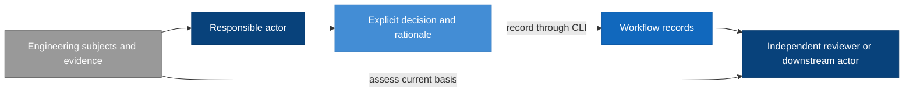

# Workflow Model Design

Model validation contract: explicit-recording-v1

## Introduction and Goals

The Workflow model defines how responsible humans and agents coordinate a direction into reviewed design, delivery work and verified outcomes. It owns activity selection, work and correction allocation, continuation authority, and the model-document convention. The [Review and Closeout model](../review-closeout/review-closeout.md) owns shared assessment policy within this domain; Workflow applies its judgments and applicability conditions when coordinating work. The purpose remains durable, inspectable reasoning and resumable work without making a command-line transition engine the decision owner.

The model inventory contains Workflow, Review and Closeout, Test, RigorLoop Record Format, and CLI. Review and Closeout and [Test](../test/test.md) are bounded policy responsibilities within the Workflow domain, not new stages or runtime components. Test owns shared test-quality and maintenance criteria; specialists assess actual plans, tests and evidence under Review and Closeout. Record Format owns durable structure and preservation; CLI owns the safe storage interface. The Test-model amendment changes only Workflow and Test; the other three remain referenced dependencies. These models are defined by coherent responsibilities, not by features, classes or AI models.

### Design at a glance

> Agents spend tokens understanding engineering meaning; the CLI spends computation on identities, selection, preservation, serialization, registration and persistence.

Workflow assigns responsible activities and consumes the assessment meanings and reliance conditions defined by Review and Closeout. Records retain those explicit decisions. The CLI is the recording mechanism; it does not become the decision owner.

| Reader question | Start here |
| --- | --- |
| Who owns each decision? | [Actor boundary](#context-and-scope) and [responsibility-specific updates](#responsibility-specific-updates) |
| What is stored, and how do records relate? | [Record model](#record-model) and [formal record fields](#explicit-record-schema) |
| How do actors use the CLI? | [Primary skill interaction](#primary-skill-interaction-and-decision-ownership) |
| What happens when Verify finds a defect after completion? | [Correction walkthrough](#correction-walkthrough-actor-decisions) |
| What supports independent review and downstream reliance? | [Review and Closeout](../review-closeout/review-closeout.md#requirements), applied through [ownership references](#review-and-closeout-policy-ownership) |
| What must agree before adoption? | [Targeted-interface allocation](#targeted-interface-adoption-allocation) and [historical compatibility](#adoption-and-historical-compatibility) |

## Context and Scope

| Actor or model | Owns | Does not own |
| --- | --- | --- |
| Human decision owner | Product direction, scope exceptions, external/destructive authority | Implicit approval through silence |
| Authoring agent | Its model content and explicit correction impact declaration | Approval of its own content |
| Review agent | Judgment, findings, exact reviewed subjects and their settlement | Editing the content it approves |
| Route agent | Selecting work, coordination, recorded current activity and correction responsibility | Manufacturing review or Verify results |
| Implementation agent | Approved implementation and execution evidence | Changing the approved design through code |
| Verify agent | Final coherence assessment and success-only completion evidence | Approving its own correction |
| Review and Closeout model | Shared assessment scope, independence, applicability, concern disposition and final closeout policy | Activity selection, storage shapes or execution permission |
| Test model | Shared test-purpose, derivation, protective-value and maintenance criteria | Behavioral authority, actual review judgments, evidence applicability or closeout consequences |
| Record Format model | Stored structure, versions, relationships and preservation invariants | Engineering judgments or persistence execution |
| CLI model | Mechanically validated persistence and observations | Any of the decisions above |

The CLI interface is a dependency, not a superior workflow authority. Local filesystem permissions and runtime controls remain the execution boundary; an actor label in a record is attribution, not authentication.

## Architecture Constraints

Workflow consumes the independence, reliance, compatibility, and environment obligations in RC-SR-02/04/05/16/18 of [Review and Closeout](../review-closeout/review-closeout.md#requirements). Local coordination does not authenticate an actor or extend its authority.

This draft extracts shared assessment policy while retaining Workflow coordination and model-document responsibilities. It neither activates the extraction nor changes release permissions or existing automatic-progression authority. Historical contracts retain their exact rules until explicitly adopted replacements apply.

## Solution Strategy

Use explicit decisions supported by evidence. Responsible actors read the current records and exact subject identities, decide their updates, and submit purpose-specific operations through the CLI, using batch only for related explicit decisions that require coherent publication. Workflow coordinates skills under the Review and Closeout assessment obligations; storage mechanics remain capable of recording a structurally sound correction regardless of the currently recorded stage.

Workflow keeps activity selection separate from the assessment and observation concepts defined by Review and Closeout and CLI. It consumes the RC-SR-04/05 distinction between a recorded judgment and current reliance rather than redefining that distinction here.



The arrows show evidence and decision flow, not automatic stage transitions. The receiving actor decides whether recorded evidence supports reliance; the CLI's successful save supplies no additional approval.

## Requirements

The following stable requirements define model behavior; the targeted-command amendments require coordinated adoption before being claimed as implemented. IDs are model-scoped and remain stable when later features revise this document.

| ID | Required behavior |
| --- | --- |
| WF-SR-01 | Responsible actors MUST explicitly decide activity, status, ownership and authorized continuation. Workflow MUST consume review applicability and closeout conclusions under RC-SR-04/05/13 rather than infer them from saves or reads. |
| WF-SR-02 | A change record MUST identify its contract, proposal, affected model documents, current activity, responsible owner and unresolved blockers. Each referenced review or proof MUST identify its exact subjects. Mutable progress belongs in change records, not model Design documents or plan bodies. |
| WF-SR-03 | Workflow MUST obtain the required independent judgment through Review and Closeout RC-SR-01–04 before relying on approval. This stable ID now references that policy owner; it does not redefine reviewer independence or judgment. |
| WF-SR-04 | Route MUST assess cross-model correction impacts and select the responsible owner without requiring that owner to appear in a previously derived pending set. Authors and receiving actors MUST apply RC-SR-05–07/10 to changed-subject impact, applicability and reassessment; uncertain impact is handled under that policy. |
| WF-SR-05 | Workflow MUST provide an owned recording and correction path for defects discovered by any responsible stage, including Verify, under RC-SR-08/10/14. Record Format and CLI retain representation and mechanical recording ownership. |
| WF-SR-06 | Workflow MUST allow explicit reopening of completed work and coordinate reassessment without a previous-stage prerequisite. Concern origin, disposition and the meaning of return-for-review are owned by RC-SR-08–10/14 and represented under the selected Record Format contract. |
| WF-SR-07 | Each model MUST have one authoritative living Design file combining requirements, structure, decisions, boundaries, compatibility and acceptance. Features update affected models; cross-model contracts have one named owner and references from consumers. Mandatory separate specifications, architecture files and ADRs for the same model are removed only upon approved adoption. |
| WF-SR-08 | Requirement and decision references MUST survive normal document revisions. A changed or retired obligation retains its identity and rationale or an explicit replacement mapping. Exact affected-model review and concurrent-change applicability MUST follow RC-SR-01/02/05/06/10; retaining a reference MUST NOT retarget an old approval. |
| WF-SR-09 | Workflow MUST condition continuation and completion coordination on the applicable assessments and closeout obligations owned by RC-SR-05/11–15. Missing readiness MUST NOT prevent recording owned blockers or corrections under RC-SR-14. Model verification allocation remains governed by the Model validation and proof mapping below. |
| WF-SR-10 | Historical contracts MUST remain explicitly identified and must not be silently reinterpreted. Adoption MUST preserve findings, decisions and proof provenance, identify replacement ownership and provide a supported recovery or rollback boundary. This amendment performs no adoption. |
| WF-SR-11 | Ordinary skills MUST use purpose-specific inspection and targeted recording, or batch for related explicit edits, without full-file reconstruction or historical eligibility checks. Actors MUST supply all intended decisions and explicitly select useful context. The CLI MUST perform mechanical selection, identity computation, registration, preservation, serialization and persistence; actors expand the engineering basis when their judgment requires it. |
| WF-SR-12 | A new supporting record MUST have an explicit actor-supplied record-level applicability declaration; CLI registry construction MUST NOT decide applicability. Updating a check or review alone MUST NOT change applicability, activity, finding disposition or completion. |
| WF-SR-13 | Workflow MUST keep the recorded correction owner distinct from the disposition owner defined by RC-SR-08–10/14. Review findings and change-level blockers use the selected Record Format targets; route coordinates their correction without manufacturing another actor’s disposition. |
| WF-SR-14 | Workflow actors MUST select and expand useful context for their decisions and apply RC-SR-04/05/18 before reliance. Diagnostic detail remains a CLI observation, not a storage prerequisite or a source of activity-selection authority. |
| WF-SR-15 | The complete successful Verify assessment and final explanation, and the shared material-decisions narrative, MUST be available through normal targeted reads with recorded applicability and identities. Retrieving a deliverable MUST NOT require advanced inspection of unrelated records or imply renewed verification. |
| WF-SR-16 | Workflow MUST preserve the final assessment dependency defined by RC-SR-11/12 in delivery and closeout coordination, including when later corrections affect a previously reviewed result. The plan and specialist assessments supply the basis; route MUST NOT fabricate a final-review judgment or treat a milestone result as a whole-change result. |
| WF-SR-17 | For adopted Test-model work, Workflow MUST route missing intended behavior to Design, missing proof allocation to planning, and defective concrete tests to the responsible implementation or correction activity. Planning and specialist assessments MUST consume the shared criteria in Test TEST-SR-01–13 without assigning that model judgment, applicability or closeout authority. |

### Review and Closeout policy ownership

Dependency references to “Workflow-owned assessment policy” denote the broader Workflow domain. Within that domain they resolve through the ownership map below to Review and Closeout for judgments, independence, applicability, evidence adequacy, and justified reliance; Workflow retains coordination. This treatment intentionally retains the CLI model’s Context and Scope boundary descriptions and Record Format’s Context and Scope and stored-layout introduction descriptions. It grants Workflow no second assessment-policy definition. Record Format and CLI model files remain unchanged dependencies, not additional members of this review package; no representation or runtime change is selected.

All RC-SR references in this file resolve to the [Review and Closeout requirements](../review-closeout/review-closeout.md#requirements). The requirement table retains WF identities as coordination obligations or explicit references to the new owner. The following map states the proposed extraction; it does not claim that earlier reviewed revisions have changed meaning.

| Retained identity | Prior assessment responsibility | New policy owner | Workflow remainder |
| --- | --- | --- | --- |
| WF-SR-01 | Explicit applicability and readiness decisions | RC-SR-04/05/13 | Explicit activity, status, ownership and continuation |
| WF-SR-03 | Exact judgment, independence, and no self-approval | RC-SR-01–04 | Obtain the required specialist assessment |
| WF-SR-04 | Changed-subject impact and applicability | RC-SR-05–07/10 | Cross-model correction allocation |
| WF-SR-05 | Defect basis and success-only Verify failure behavior | RC-SR-08/10/14 | Maintain an owned recording/correction path |
| WF-SR-06 | Retained origin, disposition, and return-for-review meaning | RC-SR-08–10/14; Record Format for stored preservation | Reopen completed work and coordinate reassessment |
| WF-SR-08 | Exact design package review and concurrency applicability | RC-SR-01/02/05/06/10 | Stable requirements, decisions, and replacement mappings |
| WF-SR-09 | Reliance and justified successful completion | RC-SR-05/11–15 | Apply those conditions to continuation; retain model proof-allocation convention |
| WF-SR-13 | Reporter-owned disposition distinct from repair | RC-SR-08–10/14 | Allocate the correction without assuming disposition authority |
| WF-SR-14 | Sufficient basis and no permission inferred from observations | RC-SR-04/05/18 | Select context and interpret CLI observations for coordination |

WF-SR-02/07/10–12/15 retain state, document, compatibility, targeted-interface, explicit-recording and retrieval responsibilities. WF-SR-16 makes consumption of the existing final-review dependency explicit. Historical policy mappings elsewhere in this file are reference history; assessment obligations they cite resolve through this table for the proposed revision. Runtime examples below illustrate application of the owning policy rather than define another policy source.

## Building Block View

Workflow has three conceptual parts, not three services or mandatory files: stage skills supply decisions; change-local records preserve those decisions and evidence; model Design documents supply the durable engineering contract. Delivery plans allocate model requirement IDs to work and proof. Independent reviews and Verify assess the resulting chain.

| Artifact responsibility | Proposed owner and placement |
| --- | --- |
| Model engineering truth | One `docs/design/<model>/<model>.md` per model |
| Change intent | Existing proposal surface |
| Mutable work state and explicit decisions | Change-local manifest: v2 change.json; v1 change.yaml |
| Current judgment and open findings | Stable change-local review record for the applicable target; each finding carries its own retained origin basis |
| New non-review-stage blocker, including Verify failure | Structured blocker entries in the change record, with evidence references; no fabricated review |
| Current proof and freshness subjects | Conditional change-local evidence.json in v2; evidence.yaml in v1 compatibility |
| Resolved rationale that still constrains work | Conditional material-decisions.json in v2; material-decisions.md in v1 |
| Stable delivery allocation | Existing plan surface |
| Successful final explanation | Success-only verify-report.json in v2; verify-report.md in v1 |

These placements express Workflow responsibilities through the [Record Format contract](../record-format/record-format.md#explicit-record-schema): v2 uses the selected JSON paths and v1 retains its compatibility paths. They do not claim compatibility with compact schemas. Concern ownership and closure follow RC-SR-08/09/14.

### Record model

The [RigorLoop Record Format model](../record-format/record-format.md) owns stored record types, fields, relationships, versions and preservation invariants. Workflow owns coordination decisions; Review and Closeout owns assessment meaning and the evidence conditions for downstream reliance. CLI owns construction, inspection and safe publication.

The manifest carries current activity, work and change-level blockers, and registers reviews, evidence, material decisions and the success-only Verify report. These concepts represent Workflow obligations; their exact serialization has one owner in Record Format.

### Explicit record schema

See the [complete stored layouts and common types](../record-format/record-format.md#explicit-record-schema). Workflow requirements WF-SR-02/03/05/06/10/12/13/15 are represented by RF-SR-01 through RF-SR-08; field changes must update that model and the consuming CLI together. The existing v1 schema is a compatibility definition, not the selected v2 design.

### Retained judgments for unresolved findings

WF-SR-06 references RC-SR-08/09 for retained concern meaning and disposition. The Record Format model owns the [immutable origin representation](../record-format/record-format.md#retained-judgments-for-unresolved-findings). Workflow coordinates the named correction while preserving that separation.

### Responsibility-specific updates

The unified `design` responsibility combines architecture and specification authorship; it is not a new permission principal. Existing architecture/spec skills can supply portions during adoption, but one reconciled model document is the reviewed subject. Proposal, plan, implementation and Verify remain distinct responsibilities; review targets retain independent reviewers.

| Responsible actor | Allowed semantic edit under the workflow |
| --- | --- |
| Author | Engineering content, subject references and assigned work; assessment-impact actions under RC-SR-06/08 |
| Reviewer | Review, disposition and applicability actions under RC-SR-02–10 |
| Route | Activity, work and correction allocation; restrictions under RC-SR-06. Registry insertion remains CLI-owned |
| Evidence producer | Assigned proof production under RC-SR-05/15 and Record Format evidence representation |
| Verify | Assessment actions under RC-SR-09/13/14; separately explicit activity-completion decision |

Targeted recording mechanics are owned by CLI-SR-13: named edits preserve omitted entries, fields and narrative bytes. Workflow selects the responsible activities and may coordinate successive actor transactions. Applicability restriction/restoration and actor authority follow RC-SR-02/06/18; the table above is an assignment index, not an independent definition of those conditions.

Independent assessment and provenance are defined once by RC-SR-02. Workflow uses that evidence to select a valid receiving activity; it does not authenticate a reviewer through an actor label or restore approval through routing.

### Primary skill interaction and decision ownership

The CLI model owns exact commands, requests, output, selectors and serialization. Workflow owns how actors interpret them. The normal interaction is explicitly selected context with useful record content, subject inspect for mechanical identity computation and any requested subject content, actor judgment, and a targeted mutation or batch. A separate preview/check is optional; normal writes validate themselves. A skill does not repeat a full inspect/check/inspect/record cycle, manually hash subjects, reconstruct registries or collect many shallow summaries followed by mandatory show calls as routine ceremony.

| Actor task | Primary interaction | Explicit decision retained by actor |
| --- | --- | --- |
| Establish change intent | `change create` and `change link` | Exact proposal/model/plan subjects and initial activity; root creation requires user/runtime authority |
| Select correction activity | `activity set`, `work add` or `work set` | Stage, status, owner, reason and work allocation |
| Record independent assessment | `review record`, with `finding add/set` for individual findings | Assessment values under RC-SR-01–10, represented by Record Format |
| Report a defect outside review | `blocker add/set` | Concern values under RC-SR-08–10/14; Workflow allocates correction |
| Record proof | `evidence record` | Proof under RC-SR-15; recorded values follow Record Format |
| Declare usable scope | `applicability set`, or an explicit applicability decision supplied to a producer command | Applicability under RC-SR-05–07/15, at Record Format granularity |
| Preserve a material decision | `decision record` | Rationale, subjects and source references |
| Record successful final assessment | `verify record`, optionally batched with `activity set` | Assessment under RC-SR-13/14; activity completion remains a separate Workflow decision |
| Read the final explanation or shared decision rationale | `verify show`, `decisions show`, or their full context selectors | Retrieval under WF-SR-15; reliance under RC-SR-05/13 |

Finding/blocker addressing, coupled disposition fields and v2 origin preservation are defined by the [Record Format schema](../record-format/record-format.md#explicit-record-schema); targeted construction and reference validation are defined by the [CLI primary interface](../cli/cli.md#primary-public-command-contract). Workflow allocates correction activities using the concern ownership defined in RC-SR-08–10/14.

Review replacement and changed-subject reliance apply RC-SR-05–07/10. Workflow coordinates the required author and reviewer activities under those conditions. Record Format owns immutable finding origin; CLI change.link updates the declared subject reference without inferring an applicability decision. This paragraph adds no independent reassessment or restoration rule.

Record Format owns record-level applicability granularity; CLI owns the available update selectors. Workflow consumes the sufficient-proof and multi-check reliance policy in RC-SR-05/15. Assessment of an individual check and the containing declaration follows those requirements, not a separate Workflow algorithm.

The CLI context contract owns selector behavior, full selected entries, pagination, attribution and diagnostic completeness. Workflow actors use that interface under WF-SR-11/14 and the sufficient-basis requirements in RC-SR-05/18; Workflow does not define another evidence-reading threshold or infer permission from output completeness.

CLI-SR-20 owns receipt sizing, bounded observation summaries and diagnostic-detail retrieval. Workflow applies RC-SR-04/05/18 when interpreting that output for coordination. Diagnostic volume is not an activity-selection mechanism.

WF-SR-15 retains normal targeted retrieval of the final Verify explanation and shared material-decisions narrative. Record Format owns the selected representation and CLI owns verify show, decisions show and full context retrieval. RC-SR-05/13/14 owns their assessment meaning and reliance conditions.

Workflow can coordinate the separate activities in the correction example below using primary operations or batch. RC-SR-08–10/13/14 owns failure, reassessment, disposition and success conditions. Workflow retains the separately explicit activity-completion decision; saving multiple actors’ records does not allocate their work implicitly.

## Runtime View

### Correction walkthrough: actor decisions

A change's activity is recorded completed, but a later Verify attempt detects a defect. This walkthrough illustrates WF-SR-01/03/04/05/06/09/11–14. The [CLI walkthrough](../cli/cli.md#correction-walkthrough-recording-behavior) shows the matching commands and storage outcomes; this view explains who supplies each decision.

| Step | Responsible actor | Decision and basis | What remains separately owned |
| --- | --- | --- | --- |
| 1. Inspect the basis | Verify | Read the current requirements, recorded claims and relevant proof; expand scoped context as needed | The CLI does not decide whether that reading is sufficient |
| 2. Record failure | Verify | Record the observed failed check and a change-level blocker with evidence, required outcome and correction owner | The blocker is not a fabricated review finding; recorded activity does not change automatically |
| 3. Select correction | Route | Assess the reported defect and explicitly select correction activity and work ownership | Verify retains responsibility for its blocker's disposition |
| 4. Record correction proof | Implementation owner | Perform the authorized correction and record actual progress and proof | Supplying evidence does not resolve the blocker or establish independent approval |
| 5. Record reassessment | Independent reviewer | Assess the corrected subjects and record judgment, rationale and explicit applicability | A review approval does not close Verify's blocker |
| 6. Record disposition and success | Verify | Reassess its required outcome, explicitly resolve the blocker when justified, and record success only after final obligations pass | Activity completion is a separately explicit decision, even if saved with the success report |

Earlier failed evidence and unresolved concerns remain usable context until their owners make explicit updates. Different actors can save in successive transactions. A recorded completed activity does not prevent correction recording, and a safely saved decision does not itself justify downstream progression.

### Normal work

Route selects an authorized activity and records it explicitly. The author updates the affected model document, identifies impact and submits its recording changes. An independent reviewer assesses the exact content and records the judgment and applicability decision. Route separately records the next activity only when its basis is adequate. One actor does not impersonate another to bundle their decisions into a single save.

### Revising previously reviewed content

An engineering edit can temporarily leave the recorded review subject behind the actual file; record-only changes are assessed under RC-SR-07. The CLI reports the mismatch without changing the review. The author records the revised artifact identity, affected applicability and correction work; the retained review continues to identify the bytes actually reviewed. Route can choose the needed author directly, including a previously completed owner. Independent rereview supplies a new judgment before downstream reliance.

### A defect found at Verify

Verify records a blocker and failed evidence, not a success report. Route records a correction owner and activity even when the previous stage was terminal or no author was pending. The author fixes the owning model or implementation; affected reviewers independently reassess their subjects. Verify closes its blocker only after checking the correction and supporting evidence, then reruns the required final assessment.

### Concurrent edits or interrupted recording

An actor that loses a revision conflict rereads current records and reassesses its decisions; it must not replay an outdated approval against different content. Storage recovery is owned by the CLI model. Workflow consumers do not rely on a mixed or recovery-required snapshot and do not interpret mechanical recovery as a new decision.

### Final assessment coordination

Workflow applies RC-SR-11/12 through the delivery plan's named closeout checkpoint. Completion of the final implementation milestone selects the required whole-change assessment, not a direct completion claim. Its result and any required corrections determine the next authorized activity; final Verify applies RC-SR-13. Triggered CI maintenance retains its own owner, with any resulting engineering change assessed under RC-SR-06/11 before final reliance. This is the existing lifecycle with explicit assessment dependencies, not a new gate or CLI readiness calculation.

## Deployment View

Workflow remains repository-local guidance and artifacts consumed by supported agent integrations. There is no new daemon, hosted coordinator or authenticated workflow service. Skill generation and public adapter packaging remain unchanged during drafting. Adoption later requires coherent guidance across the supported integrations; an old skill must not silently write the new contract.

### Targeted-interface adoption allocation

The v1 compatibility schema and YAML/Markdown paths remain unchanged. The explicitly selected v2 schema uses plain JSON files with narrative string fields and adds self-contained concern origin; targeted commands do not implicitly migrate existing records. The lower-level recorder remains available for advanced tooling and recovery; supported stage guidance uses the primary commands after coherent adoption. No normal skill path may retain full-file reconstruction, manual hashing or registry construction, or call a historical eligibility engine before saving. The earlier replacement inventories remain historical impact mappings; the following table owns this amendment's remaining adoption scope.

| Surface family | Required action before primary-interface adoption | Owning responsibility |
| --- | --- | --- |
| CLI, Workflow and Record Format models | Keep request construction, semantic ownership, batch/preview/scope, record-level applicability and compatibility mutually consistent | Design and independent Design Review |
| Canonical stage skills and their transitive references/assets | Replace normal full-file procedure with purpose-specific commands; bound per-operation help, retain sufficient-basis reading, actor ownership and independent review; keep advanced recovery conditional | Workflow Design defines behavior; Delivery allocates exact files; implementation updates authored sources |
| Route and Verify guidance | Use recorded status and scoped context without next-stage inference; distinguish findings/blockers and keep final assessment/completion explicit | Workflow Design, then corresponding guidance implementation |
| Governance, workflow/skill contracts and system architecture | Amend only interface/adoption descriptions affected by this change; retain historical-contract handlers and one-file model authority | Design identifies affected clauses; Delivery supplies concrete diffs or justified unaffected dispositions |
| CLI dispatcher, shared record engine, public help and package examples | Implement the CLI model catalogue and shared pipeline; per-command help avoids unrelated schemas | CLI implementation after reviewed Delivery allocation |
| Targeted request/result schemas, validators, model checks and focused regression coverage | Fail closed on unknown values and conflicting operations; prove preservation, safety parity, scoped output and correction availability | CLI, Workflow and Record Format requirements, then Delivery proof allocation |
| Supported Codex, Claude and OpenCode adapter packages and examples | Generate from authored skills and verify parity using existing build/release validation; do not hand-edit distributed bodies | Delivery allocation and adapter implementation |
| Complete-interaction token evaluation | Measure guidance, reads, requests, results and follow-up with adequate identical decision basis; do not claim savings from payload-only comparisons | Delivery allocation and Verify evidence |

Required consumer/safety dependencies cannot be deferred beyond adoption; Delivery may sequence them into reviewable milestones. The existing installation/release mechanisms, OS assumptions, historical contract schemas, old review records and unrelated logging behavior remain unchanged. No new plan or implementation is approved by this authoring step. The active user request ends with independent Design Review; it does not publish the primary commands or automatically start Delivery.

### Adoption and historical compatibility

WF-SR-10 confines adoption of the new stored format to explicitly created new changes; it does not restrict adoption to the older v1 discriminator. No in-place migration, contract-field rewrite or bulk document deletion is supported. Existing changes continue through their exact historical handlers; defects in those handlers remain separately owned. Neither earlier proposal is automatically closed or superseded.

Coherent adoption requires approved governing amendments, the matching model documents, recording schemas and CLI, stage guidance, validators, templates and supported adapter output to agree. The adopting delivery package must enumerate these surfaces and evidence of their agreement. After coordinated activation, ordinary skills create new roots through primary change.create with explicit rigorloop-records-v2. Existing v1 roots retain compatible reads and updates, and explicitly selected advanced v1 creation remains a compatibility facility rather than an ordinary skill path; there is no background conversion or silently changed default for historical roots. Drafting these files does not satisfy adoption. The current Constitution and installed skill instructions still authorize only their stated executable profiles. Delivery must supply reviewed amendments explicitly enabling v2, together with matching schemas, runtime dispatch, guidance and adapter output. Until that coordinated activation, v2 creation is a prospective design rule, not an available runtime capability. The model-document validation marker remains independent and need not be renamed to enable stored v2.

Consolidation is incremental by model. Before a model document becomes authoritative for new work, its adoption decision must identify each displaced normative section, its replacement requirement/decision IDs and any deliberately retained external model contract. Earlier specs, architecture documents and ADRs remain readable under their historical contracts. New approvals cover the consolidated content; old approvals are not retargeted to it. Mixed historical/new references identify which contract owns each obligation, and conflicting authority blocks reliance until resolved.

Rollback before any new-contract writes restores the prior distribution and guidance without changing records. After new-contract records exist, reverting to an old writer is not a rollback strategy: retain a compatible reader, stop new writes and fix forward, or obtain a separately approved conversion. Persisted new records are never deleted to make an old client work. Copying obligations from an old change into a new one requires explicit owner disposition under the old contract and preserved source references; it is not offered as a way around unresolved findings.

### Replacement inventory for adoption

This inventory implements WF-SR-07/10 at the level of governing rules and affected surfaces. It is a proposed scope map, not a supersession receipt, migration script or implementation file count. `Replace for new contract` identifies a proposed replacement under the adopted actor-owned recording profile, including rigorloop-records-v2; it does not mean v1-only adoption. Each exact adoption diff must identify its contract scope. Historical contracts retain their rules except for explicitly reviewed compatible interface additions; no inventory row reinterprets existing data. `Amend shared guidance` means contract selection must be explicit rather than globally replacing old behavior. All unlisted unrelated behavior remains outside the proposed replacement.

| ID | Existing source and exact rule area | Treatment and destination | Preservation or adoption obligation |
| --- | --- | --- | --- |
| WF-MAP-01 | [Constitution](../../../CONSTITUTION.md), Source of truth order, Architecture rules and Review rules: separate specification/architecture authority and authorship; Design Review's architecture/specification/ADR package | Amend shared guidance: WF-SR-07/08 and WF-DEC-02 establish one model document and one exact affected-model review basis. | Retain independent approval, traceability, source precedence, plan ownership and pre-implementation review. Do not demote governance itself into a model file. |
| WF-MAP-02 | [Workflow specification](../../../specs/rigorloop-workflow.md), opening compact-current-state clauses and historical lifecycle chains: architecture then spec and compact semantic-operation progression | Replace for new contract: WF-SR-01/04/07/09 and Responsibility-specific updates. | Preserve old chains under their discriminators. Support skills, delivery review, code review and Verify remain obligations; this proposal does not remove final Code Review. |
| WF-MAP-03 | [Compact record contract](../../../specs/compact-current-state-change-record.md), SR-02/03: artifact package and coordinator with derived permitted operations | Replace for new contract: WF-SR-02/07 and Explicit record schema. | Preserve distinct proposal, plan, review and proof surfaces. The new `activity`, `work`, registry and applicability entries are explicit actor decisions, not a renamed derived coordinator. |
| WF-MAP-04 | Compact record contract, SR-07–13 and SR-47: stable reviews, judgment/disposition vocabularies, material decisions and invalidation | Replace for new contract: WF-SR-03–06/08 and the review/blocker/decision schema. | Preserve finding identity, unresolved obligations and rationale. Do not translate old vocabulary or retarget reviewed hashes in place. New non-review blockers must not fabricate reviewer evidence. |
| WF-MAP-05 | Compact record contract, SR-14–18: proof freshness, success-only Verify and invalidating later edits | Split ownership: WF-SR-04/05/09 owns explicit applicability, downstream reliance and completion; CLI-SR-04/07 owns identity checks and observations. | Preserve failed evidence and prevent stale completion claims from authorizing work. Saving a contradictory assertion is possible under the new contract; treating it as valid is not. |
| WF-MAP-06 | Compact record contract, SR-32/34–36/48: responsibility, compatibility, coherent activation, rollback and exact-change bootstrap | Replace for new contract: WF-SR-01/03/10 and Adoption and historical compatibility. | Retain external execution authority and historical handlers. Do not generalize or reuse the compact implementing change's special bootstrap for these drafts. |
| WF-MAP-07 | [System architecture](../../architecture/system/architecture.md), Crosscutting Concepts → Source of truth, Lowest sufficient architecture surface and Lifecycle status | Amend shared guidance: this model owns unified design truth and explicit workflow decisions for new work. | Keep unrelated system architecture, prior ADR rationale and historical ownership readable. No whole-file replacement of the system architecture is proposed. |
| WF-MAP-08 | [Architecture skill](../../../skills/architecture/SKILL.md), [spec skill](../../../skills/spec/SKILL.md), [Design Review skill](../../../skills/design-review/SKILL.md): separate authoring output and exact package inputs | Amend shared guidance: unified `design` responsibility and review of affected model files under WF-SR-07/08. | Preserve engineering coverage and reviewer independence. Adapter invocation names need not be removed to combine the authored output; any public skill retirement needs an explicit compatibility decision. |
| WF-MAP-09 | [Route skill](../../../skills/route/SKILL.md) and [Verify skill](../../../skills/verify/SKILL.md): permitted-operation context, routing, correction and final completion | Amend shared guidance: WF-SR-01/04/05/06/09 supplies decision ownership; consume CLI storage observations without delegated eligibility judgment. | Keep author/reviewer write boundaries, isolated invocation limits and external permissions. No new automatic progression is introduced. |
| WF-MAP-10 | [AGENTS.md](../../../AGENTS.md), Artifact lifecycle defaults, Planning and workflow, Required reading before implementation | Amend shared guidance to select model-file authority and explicit recording only for the new contract. | Preserve canonical source paths, user changes, historical continuation, small diffs and validation obligations. |

CLI owns the companion command, encoding and runtime inventory; Record Format owns stored schemas, reference interpretation and preservation; these rows do not duplicate its normative interface. Prior [closeout simplification](../../proposals/2026-09-04-remove-final-code-review-and-simplify-cli.md) and [correction lifecycle](../../proposals/2026-09-05-compact-correction-lifecycle-amendment.md) initiatives, their design artifacts and findings are retained as separately owned work. This inventory neither establishes their current lifecycle state nor closes their obligations.

### Adoption support surfaces and completion check

| Surface | Required adoption action | Owner |
| --- | --- | --- |
| [Skill contract](../../../specs/skill-contract.md), canonical skill references/assets and [skill validator](../../../scripts/skill_validation.py) | Reconcile contract-sensitive artifact placement and claim boundaries; retain source ownership and published-skill quality requirements. Resource changes must be traced from the modified canonical skills, not installed copies. | Workflow Design, then Delivery allocation |
| [Boundary method](../../../specs/references/boundary-first-method-v1.md), [feature authoring format](../../../specs/references/boundary-first-feature-authoring-v1.md), [boundary validator](../../../scripts/validate-boundary-first.py) | Implement the Model validation and proof mapping below for explicitly marked model files; preserve existing feature-format validation for historical documents. | Workflow owns the mapping; Delivery implements and proves recognition before adoption |
| [Adapter builder](../../../scripts/build-adapters.py), [adapter validator](../../../scripts/validate-adapters.py), [adapter support manifest](../../../dist/adapters/manifest.yaml) | Regenerate and validate supported public outputs from canonical sources when the changed guidance is adopted. Do not hand-edit generated packages. | Delivery allocation |
| Model adoption decisions and affected plan/verification references | Enumerate displaced requirement IDs and retained outside-model references for each actual consolidated model revision; validate links and exact reviewed identities. | Model author and independent Design Review |

The inventory identifies the principal replacement sites, but is not evidence that every transitive skill resource or normative clause has been reconciled. Before adoption, each row must have an exact reviewed diff or an explicit unaffected/deferred disposition, with no required dependency left deferred. Delivery must expand affected source resources into a concrete file list; it must not treat a directory-level inventory row as proof of completion. Existing change records and review evidence are not bulk-edit targets. No governing surface named above is changed by this drafting step.

## Crosscutting Concepts

### Model documentation and traceability

This file owns the one-file-per-model convention. CLI and Record Format consume it rather than restating that contract. Model documents contain stable intent, including meaningful decisions and rejected alternatives. Change records identify affected model paths and exact content identities; requirement references combine model identity and stable local ID. A shared contract belongs to one existing model or a deliberately justified shared model, never duplicate normative prose.

Two features changing the same model use the same document; their assessment applicability follows RC-SR-05/06/10. Splitting or renaming a model requires an explicit responsibility and reference mapping, not just a size threshold.

### Model-centered layout and examples

WF-SR-07/08 select the following model-centered layout:

```text
docs/design/
  record-format/
    record-format.md
    examples/
      minimal-change.json
      incomplete-review.json
      finding-reassessment/
        before.json
        after.json
  cli/
    cli.md
    examples/
      work-set/
        request.json
        response.json
  review-closeout/
    review-closeout.md
  workflow/
    workflow.md
    examples/
      correction-cycle.mmd
```

Each docs/design/<model>/<model>.md is the single normative document for that model. Its filename matches the directory's stable model ID. Examples belong only under that model's examples directory and may use JSON, Mermaid, Markdown or another format suited to the demonstrated content. No common cross-model example directory or mandatory Markdown wrapper is introduced. Review and Closeout uses this same placement convention for its justified policy responsibility.

The owning document indexes each example with its purpose, governing requirements, complete-artifact or excerpt scope, and any synthetic identities or starting assumptions. Examples illustrate existing requirements and cannot introduce additional rules. JSON examples must parse without explanatory extra keys; complete records must conform to their selected schema when that schema is available. Before/after pairs must preserve the invariants they demonstrate. Mermaid illustrates responsibility and ordering rather than executable eligibility.

Examples are read on demand, not mandatory context for every invocation. When an example changes, validation selection must check it and its owning model; it must not treat every file under docs/design as a normative Markdown model. Independent review covers the affected examples alongside their owner and includes their exact identities when relied upon.

The model documents now occupy the matching directories shown above. The move updates current references, model-path validation and validation selection together under explicit user authority. Historical reviewed paths and identities remain unchanged; they are not rewritten to claim review of relocated files. Explicitly selected historical flat files remain valid inputs when present, but no flat copy is maintained as a competing current source. A model move changes its subject identity and requires independent review applicability reassessment. This layout change does not activate v2 recording or approve any design package.

### Examples

| Example | Scope | Requirement basis |
| --- | --- | --- |
| [Correction cycle](examples/correction-cycle.mmd) | Responsibility sequence after Verify detects a defect, including after recorded completion; this is a diagram, not a transition engine. | WF-SR-01/04/05/06/09/13 |

The diagram shows actor decisions only. Storage details are in the [CLI examples](../cli/cli.md#examples); exact fields and preserved origin are in [Record Format](../record-format/record-format.md#examples). No arrow means the CLI authorizes the next activity.

### Model validation and proof mapping

WF-SR-07/08/09 own this model-document validation mapping, identified by explicit-recording-v1. That marker versions document structure independently of the v1/v2 stored-record discriminators. A model file uses the existing `Requirements` table and `Boundary scan and acceptance scenarios` table; it does not need a separate feature spec, test spec or four-table boundary record. This is a model-specific replacement of that document format, not a claim of historical `boundary-first-v1` serialization conformance. The boundary reasoning and independent assessment obligations remain.

Model validation accepts an explicitly selected, repository-contained regular file at docs/design/<model>/<model>.md with equal directory and filename IDs following the model ID grammar. Explicit historical flat paths at docs/design/<model>.md remain accepted when present. Mismatched IDs, example paths submitted as models and extra nesting reject. Historical subjects are not silently mapped to a different file. Validation selection maps model-owned example changes to their owning model and a known flat-path deletion to its current model, without changing any stored subject reference. Symlinked paths are rejected. Each file declares exactly once `Model validation contract: explicit-recording-v1`. Missing or unknown contract markers reject; they never fall back to feature validation. Historical `specs/` documents retain their feature-format and activation rules, with the semantic-review handoff clarified below. Validating a model draft does not activate it or require a registered change record.

The `Requirements` table has columns `ID` and `Required behavior`, with unique stable IDs and nonempty requirement text. Requirement IDs begin with a letter and contain only letters, digits and hyphens; existing WF-SR and CLI-SR IDs stay unchanged. The scenario table has exactly `Dimension`, `Requirement basis` and `Distinct outcome to demonstrate`. It contains each of the eight dimension labels shown below exactly once. An applicable row lists unique IDs declared in that model's Requirements table, separated by comma and space, plus a nonempty outcome. A non-applicable row uses `-` as its requirement basis and an outcome beginning `Not applicable:` followed by a reason. Unknown labels, duplicate or missing rows, malformed tables and undeclared requirement references reject. Each required table and its heading occurs once.

References use the model path plus its existing requirement ID, or the model path plus the exact dimension label for a scenario row; review and evidence subjects also retain exact file identities. Consumers link to the owning model rather than duplicate its rule. Material combined hazards remain concise requirement-linked prose alongside the scenario table; examples illustrate those requirements, never add behavior. No new boundary or proof ID series is required.

Delivery plans map every affected requirement, scenario row and material combined hazard to a verification group, concrete checks and expected evidence. Execution evidence records actual results and exact subjects. Validators check structure and reference resolution, not coverage adequacy, reviewer independence, approval or completion; independent Design and Delivery reviews assess those meanings. This is document tooling, not another responsibility for `record-store`.

For adopted Test-model work, [Test requirements](../test/test.md#requirements) define shared criteria for the protective value, derivation and maintenance of that proof. This section retains document structure and allocation conventions; Delivery retains concrete allocation, and specialists retain actual assessments under Review and Closeout. The [Test adoption inventory](../test/test.md#consumer-ownership-and-adoption-inventory) owns the affected criterion mapping and coordinated consumer scope. It does not replace historical contract formats or authorize test removal through a structural check.

For changed grandfathered specs without a boundary marker, structural validation MUST report a separate `review_required` observation naming each path and Design Review as owner. With no structural errors, the result is `review-required` with exit zero: structural checks passed, semantic approval is not established. Structural errors still produce failure and nonzero exit, including when review observations are also present. A missing or unknown marker on a non-grandfathered spec, or malformed existing boundary content, is never converted to a review observation.

Before downstream reliance, independent Design Review MUST classify each reported amendment against its exact reviewed subjects in the existing review record. A non-substantive historical amendment retains grandfathering; a substantive historical behavior change requires the existing feature-format adoption. A new-profile-only amendment is assessed against its owning model and must explicitly preserve the historical remainder. Missing, uncertain or stale classification blocks progression and Verify, even when structural CI passes. The validator neither infers nor authenticates this decision; no extra classification file, receipt or CLI state transition is introduced. This clarifies the handoff in PBF-R049b/PBF-R055a/PBF-R056 and replaces the retired `spec-review` owner with Design Review, without changing historical behavior or waiving semantic review.

### Boundary scan and acceptance scenarios

These rows are the Workflow model's boundary allocations under Model validation and proof mapping above. All eight dimensions apply. They define the review and verification scope, not a claim that validation or adoption has occurred.

| Dimension | Requirement basis | Distinct outcome to demonstrate |
| --- | --- | --- |
| Input domain | WF-SR-02, WF-SR-05, WF-SR-12, WF-SR-13 | New supporting records require explicit record-level applicability; findings and blockers retain separate targets and disposition/correction owners. |
| State/lifecycle | WF-SR-04, WF-SR-06, WF-SR-16 | Reopen completed work without a pending-owner prerequisite; preserve the planned final-assessment dependency after the last milestone and required corrections. |
| Identity/authority | WF-SR-03, WF-SR-08 | Reject reliance on self-approval or approval of another revision. |
| Composition/path | WF-SR-07, WF-SR-09, WF-SR-11, WF-SR-14, WF-SR-15, WF-SR-17 | The exact affected model package and relevant shared boundaries are assessed under RC-SR-01/05; ordinary skills retrieve final explanations and shared narratives through targeted reads and expand their basis without deriving authority from the CLI. A test-related gap selects Design, planning or implementation according to its faulty subject; Test criteria do not become a separate assessment gate. |
| Temporal/retry | WF-SR-06, WF-SR-08, WF-SR-09 | A later review preserves each unresolved finding's origin; concurrent model edits require fresh assessment rather than approval replay. |
| Failure/recovery | WF-SR-05, WF-SR-09 | A new Verify defect is durably recordable before correction, without a success report. |
| Compatibility/migration | WF-SR-10 | An old approval is preserved but not silently converted to a new-contract approval. |
| External/environment | WF-SR-02, WF-SR-06, WF-SR-09, WF-SR-11 | Another agent understands an unresolved concern from its current fields and origin, obtains subject identities from the CLI and resumes without prior review rounds, Git or chat. |

The material composed hazards are changed subject plus retained approval, completed owner plus new correction, and cross-model concurrent edits plus downstream reliance. WF-SR-03/04/06/08/09 own their outcomes; examples do not introduce new rules.

### Security, observability and usability

Decision provenance is inspectable, not cryptographically authenticated by actor text. Permissions remain with the surrounding runtime and human authority. Records should reference necessary evidence without copying credentials or raw sensitive output. Readers must see recorded decisions, unresolved blockers and observed drift separately. Text-based documents and CLI projections require no graphical UI or color interpretation. No numerical throughput target is introduced for human/agent judgment.

## Architecture Decisions

| ID | Decision and rationale | Alternative and consequence |
| --- | --- | --- |
| WF-DEC-01 | Skills and humans own workflow semantics; CLI records them. This removes stage eligibility as a prerequisite for recording repairs. | Extending the transition engine preserves automatic enforcement but recreates correction dependencies. Explicit decisions increase actor responsibility. |
| WF-DEC-02 | Consolidate normative design by coherent model, with embedded decision rationale. | Feature-specific spec/architecture/ADR packages multiply sources for the same model. Unified documents need disciplined ownership and concurrency handling. |
| WF-DEC-03 | Retain the identity/applicability distinction; assessment ownership is extracted to RC-SR-05–07 and RC-DEC-03. | Retargeting old approval misrepresents evidence; Workflow consumes applicability rather than defining a second policy. |
| WF-DEC-04 | Retain distinct non-review-stage defect recording; assessment/disposition ownership is extracted to RC-SR-08–10/14. | A review-only finding surface makes Verify correction depend on another stage recording its discovery. |
| WF-DEC-05 | Review and Closeout owns shared assessment policy within this domain; Workflow retains coordination and references that owner. | Keeping normative copies here and in every specialist obscures responsibility and allows closeout obligations to disappear in handoff. |
| WF-DEC-06 | Test owns shared test-quality and maintenance criteria; Workflow references that owner while specialists assess concrete subjects under Review and Closeout. | Treating test adequacy as a second suite-approval authority would duplicate specialist judgments; defining only creation criteria would leave unnecessary-test removal unowned. |

No separate ADR is created: decisions stay in this owning model under the user-authorized model Design scope. WF-DEC-01 now uses purpose-specific commands for mechanical recording; its actor-owned semantics are retained. The targeted amendment does not retarget old approvals or settle historical replacements.

## Quality Requirements

| Quality | Acceptance condition | Requirement coverage |
| --- | --- | --- |
| Correctability | Both a completed author and a newly failing Verify can record the necessary correction without engine-owned transitions. | WF-SR-01, WF-SR-04, WF-SR-05, WF-SR-06 |
| Trustworthiness | A save, self-approval or stale subject cannot be used as evidence of independent approval. | WF-SR-03, WF-SR-08, WF-SR-09 |
| Resumability | A fresh reader locates current work, owner, findings and exact evidence from repository records alone. | WF-SR-02, WF-SR-09 |
| Design coherence | Every affected requirement has one owning model and a trace into planned work and proof. | WF-SR-07, WF-SR-08 |
| Compatibility | Adoption accounts for every affected historical artifact without erasing unresolved obligations. | WF-SR-10 |

Delivery planning must allocate concrete proof to these requirements and composed hazards; this draft does not claim that proof exists.

## Risks and Technical Debt

Removing automatic ordering checks makes incomplete actor decisions easier to persist. Independent checks reduce that risk but do not guarantee correct agents. A single model file can become contentious or too broad; splitting must follow responsibility, not recreate one file per feature. Existing advanced recording schemas and validators do not establish targeted-interface correctness; the new request/result and preservation obligations require their own allocated proof.

The model-validation mapping checks document structure and references; it does not prove the new commands or completeness of guidance adoption. Exact adoption diffs and transitive resource coverage still require implementation and proof before activation. Any newly discovered requirement-level gap returns to Design. Adapter-specific independence evidence remains a Delivery obligation. No missing behavior is inherited implicitly from the current CLI.

## Glossary

Model: coherent system responsibility with owned concepts and rules. Judgment: an actor's substantive assessment. Applicability: whether that judgment may support current work. Observation: a mechanical fact about stored or actual data. Recording: safe persistence, not approval. Adoption: explicit establishment of a new governing contract and its compatibility boundary.

## Drafting basis and authority

The Test-model amendment follows the [Design-Derived Test Model proposal](../../proposals/2026-09-08-design-derived-test-model.md), its [independent direction review](../../changes/2026-09-08-design-derived-test-model/reviews/proposal-review.json), and the user's continuation into Design. Its owning record is [change.json](../../changes/2026-09-08-design-derived-test-model/change.json) under rigorloop-records-v2. Its exact package is Workflow and Test; Review and Closeout, Record Format and CLI remain unchanged dependencies. Earlier paragraphs and inventories describing adoption of prior amendments retain that historical scope. This amendment neither retargets earlier approvals nor activates Test policy, implements consumer changes or approves test deletions.

The Review and Closeout extraction is authored under the user's explicit request to start model design after the [proposal](../../proposals/2026-09-07-unify-review-closeout-policy.md) and its [independent direction review](../../changes/2026-09-07-unify-review-closeout-policy/reviews/proposal-review.json). The exact amended package is this Workflow file and [Review and Closeout](../review-closeout/review-closeout.md). Record Format and CLI are retained dependencies with no identified representation or mechanical gap. The user explicitly selected `rigorloop-records-v2` for this initiative; its owning record is [change.json](../../changes/2026-09-07-unify-review-closeout-policy/change.json). The model-validation marker remains independently versioned. The user request supplies authority to draft and use v2 storage, not Design Review approval, implementation, policy activation, automatic downstream handoff, or retirement of historical v1 roots. Earlier review records remain attached to their original subjects.

The following paragraphs retain the earlier targeted-interface amendment's drafting basis. Their package references and prospective implementation statements describe that earlier amendment, not approval or lifecycle state of this extraction.

This living model combines behavioral requirements, architecture and decision rationale. The targeted-interface amendment is authored under the user's explicit request to finish the CLI/Workflow Design and obtain independent Design Review. The exact package is docs/design/workflow/workflow.md (`workflow`), docs/design/record-format/record-format.md (`record-format`) and docs/design/cli/cli.md (`cli`); no separate specification or ADR sibling is created. The current Constitution permits explicitly selected explicit-recording-v1 work; the new purpose-specific interface remains prospective. This drafting step changes no executable behavior, persisted contract or historical lifecycle record.

Current direction: [Make Targeted Recording the Primary CLI Interface](../../proposals/2026-09-07-targeted-recording-primary-cli.md), its [independent Proposal Review](../../changes/2026-09-07-targeted-recording-primary-cli/reviews/proposal-review-r1.md), and the user-supplied command boundary. Earlier direction: [Explicit Workflow Recording and Model-Centered Design](../../proposals/2026-09-05-explicit-recording-and-model-centered-design.md). Related model: [CLI](../cli/cli.md). Current [Constitution](../../../CONSTITUTION.md) and contract-selected [workflow specification](../../../specs/rigorloop-workflow.md) retain their authority; this amendment does not claim historical lifecycle settlement. The architectural and specification authoring methods are combined here rather than producing mandatory sidecars. This is not yet a complete replacement for all existing workflow contracts.

## Next artifacts

For the Test-model amendment, independently review the exact Test and Workflow revisions, their ownership boundary, consumer inventory and acceptance scenarios. Delivery then allocates coordinated consumers and bounded existing-suite cleanup after Design approval and authorized continuation.

Review the affected Workflow and Review and Closeout revisions together through independent Design Review, including their policy ownership mapping and retained Record Format/CLI boundaries. Delivery planning follows an approved exact Design package and separately authorized continuation.

Earlier targeted-interface planning intent retained: refine the three Workflow, Record Format, and CLI model designs and their adoption contract before an explicitly authorized independent Design Review. Delivery planning follows approved Design, not the draft.

## Follow-on artifacts

None yet.
