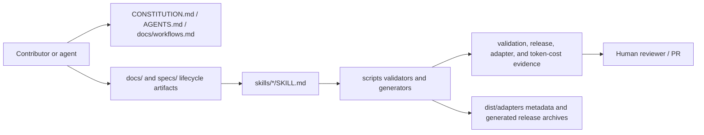
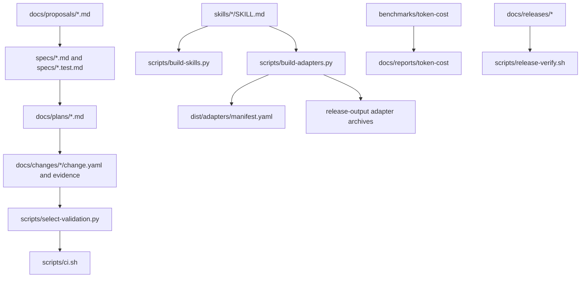

# RigorLoop Project Map

## Purpose and Scope

This map describes the current repository shape for contributors and agents who need orientation before architecture, planning, implementation, or review work. It covers the RigorLoop repository as a workflow, validation, skill, adapter, release-evidence, and documentation system.

It does not replace the normative source-of-truth order in `CONSTITUTION.md`, the workflow contract in `specs/rigorloop-workflow.md`, the canonical architecture package in `docs/architecture/system/architecture.md`, or change-specific artifacts under `docs/changes/`.

This map orients readers to repository structure and boundaries. It does not own workflow stage order, exact lifecycle artifact placement, or current milestone state.

Observed basis: direct inspection of `README.md`, `CONSTITUTION.md`, `AGENTS.md`, `docs/workflows.md`, `docs/architecture/system/architecture.md`, selected specs, schemas, scripts, workflows, tests, adapter support files, and repository layout.

## Map Metadata

- Last updated: 2026-05-14
- Observed basis: repository state through `681fb27` plus this project-map/selector update.
- Covered areas: repository layout, governance and workflow surfaces, lifecycle artifacts, canonical skills, validation and generation scripts, adapter support, release evidence, token-cost evidence, tests, CI, and known architecture-orientation risks.
- Known gaps: this map summarizes the canonical architecture package but does not duplicate it; narrow changes still need the governing spec, active plan, matching test spec, and touched files.
- Refresh trigger: refresh or bypass this map with a no-map rationale when the relied-on area is absent, contradicted by current repository paths, or materially affected by recent changes.

## System Overview

RigorLoop is a repository-local workflow kit, not a deployed service. Its main product is a spec-driven, test-driven, review-recording workflow for AI-assisted software delivery. `README.md` describes the system as a workflow that turns product intent into traceable proposals, specs, plans, tests, reviews, verification evidence, and PR handoff.

Observed major containers:

- Governance and workflow guidance: `CONSTITUTION.md`, `AGENTS.md`, and `docs/workflows.md`.
- Lifecycle artifacts: proposals, specs, test specs, architecture, ADRs, plans, review records, change metadata, explain-change records, and verify reports under `docs/` and `specs/`.
- Canonical skills: stage and support skills under `skills/<skill>/SKILL.md`.
- Validation and generation scripts: Python and shell tooling under `scripts/`.
- Adapter support surface: tracked install guidance and manifest under `dist/adapters/`; generated adapter bodies are release output for `v0.1.3` and later.
- Release and measurement evidence: `docs/releases/`, `docs/reports/adapter-artifacts/`, `docs/reports/token-cost/`, and `benchmarks/token-cost/`.
- Fixtures and regression tests: `tests/fixtures/`, `benchmarks/token-cost/fixtures/`, and `scripts/test-*.py`.



## Repository Layout

| Path | Responsibility |
| --- | --- |
| `CONSTITUTION.md` | Highest-priority repository governance below external runtime instructions; defines source-of-truth order and cross-cutting rules. |
| `AGENTS.md` | Concise agent operating guide that points to governing artifacts and repository defaults. |
| `README.md` | Public project overview, quick start, adapter-install summary, and validation-command orientation. |
| `VISION.md` | Canonical project vision used by proposals and README generated vision block. |
| `docs/workflows.md` | Short operational workflow summary, artifact-location map, follow-up ownership table, and validation guidance. |
| `docs/project-map.md` | Living repository orientation map. It orients; it does not own deferred execution. |
| `docs/proposals/` | Date-prefixed proposal artifacts. |
| `specs/` | Behavior contracts and matching `.test.md` test specs. `specs/README.md` states that specs are for behavior-changing work that benefits from explicit contracts. |
| `docs/architecture/system/` | Canonical current architecture package and C4 Mermaid diagrams. |
| `docs/architecture/*.md` | Historical or legacy architecture records retained after normalization. |
| `docs/adr/` | Durable architecture decision records. |
| `docs/plans/` and `docs/plan.md` | Concrete execution plan bodies and the active/blocked/done/superseded plan index. |
| `docs/changes/<change-id>/` | Change-local metadata, durable reasoning, review records, review logs, review-resolution, explain-change, and verify evidence. |
| `docs/examples/` | Non-normative examples, including the example plan scaffold path referenced by governance. |
| `docs/learn/` | Learn sessions and durable topic notes. |
| `docs/follow-ups.md` | Optional unowned cross-change follow-up surface when routing rules require it. |
| `docs/releases/<version>/` | Authored release metadata and release notes. |
| `docs/reports/` | Adapter artifact metadata, token-cost release reports, run evidence, and optimization reports. |
| `skills/` | Only authored skill source. There are 23 skill directories at this map revision. |
| `.codex/skills/` | Ignored local runtime state; not an authored source. |
| `scripts/` | Repository-owned validators, selectors, generators, release checks, benchmark tooling, and tests. |
| `scripts/adapter_templates/` | Thin adapter entrypoint templates for Codex, Claude Code, and opencode. |
| `schemas/` | JSON schemas for change metadata and skill metadata. |
| `dist/adapters/` | Tracked adapter install README and support manifest; no generated skill bodies for `v0.1.3` and later. |
| `benchmarks/token-cost/` | Token-cost benchmark manifest, prompts, and clean downstream fixtures. |
| `.github/workflows/` | Thin GitHub Actions wrappers for CI and release. |
| `tests/fixtures/` | Fixture trees used by Python regression tests. |
| `templates/` | Authored templates for architecture, ADRs, diagrams, review-resolution, and shared skill policy blocks. |

## Runtime Flow

RigorLoop has no long-running server, request router, database worker, or deployed runtime in this repository. Runtime behavior is command-driven:

1. Contributors and agents read governing artifacts using the source-of-truth order in `CONSTITUTION.md`.
2. Non-trivial changes move through the workflow chain documented in `docs/workflows.md` and `specs/rigorloop-workflow.md`.
3. Canonical stage skills under `skills/` guide individual lifecycle actions.
4. Repository-owned scripts validate artifacts, select checks, generate adapter output, measure token cost, and verify release evidence.
5. GitHub Actions call repository scripts instead of duplicating validation logic.

Important command entry points:

- `bash scripts/ci.sh`: selected-check wrapper for local, explicit, PR, main, release, and broad-smoke modes.
- `python scripts/select-validation.py`: CLI around `scripts/validation_selection.py` for changed-path classification and stable check selection.
- `python scripts/validate-skills.py` and `python scripts/test-skill-validator.py`: canonical skill validation and regression checks.
- `python scripts/build-skills.py --check`: validates generated local Codex mirror output from `skills/` using temporary output by default.
- `python scripts/build-adapters.py`: generates or checks public adapter output and release archives.
- `bash scripts/release-verify.sh <tag>`: release gate that runs skill, adapter, token-cost, release metadata, and security checks for supported release tags.
- `python scripts/run-token-cost-benchmarks.py`: token-cost runtime benchmark runner for prompt fixtures.
- `python scripts/analyze-codex-jsonl.py`: analyzer for Codex JSONL session evidence.

## Data Flow

The repository data model is artifact-based:

- Governance data: Markdown in `CONSTITUTION.md`, `AGENTS.md`, `VISION.md`, and `docs/workflows.md`.
- Lifecycle state: Markdown status sections in proposals, specs, test specs, architecture records, ADRs, and plan bodies.
- Plan state: `docs/plan.md` indexes plan lifecycle state; concrete `docs/plans/*.md` files carry active plan handoff state and milestone detail.
- Change metadata: YAML-like `docs/changes/<change-id>/change.yaml`, validated against `schemas/change.schema.json` plus semantic checks in `scripts/change_metadata_semantics.py`.
- Review data: `docs/changes/<change-id>/reviews/*.md`, `review-log.md`, and conditional `review-resolution.md`, parsed by `scripts/review_artifact_validation.py`.
- Skill metadata and bodies: frontmatter plus Markdown in `skills/*/SKILL.md`, validated against `schemas/skill.schema.json` by `scripts/skill_validation.py`.
- Adapter metadata: `dist/adapters/manifest.yaml` records portable skill support and opencode command aliases; adapter artifact metadata is under `docs/reports/adapter-artifacts/releases/`.
- Release metadata: `docs/releases/<version>/release.yaml` and tracked `release-notes.md`.
- Token-cost data: benchmark manifests, prompts, JSONL run evidence, analyzer summaries, and release report YAML/Markdown under `benchmarks/token-cost/` and `docs/reports/token-cost/`.

Serialization boundaries are intentionally simple: Markdown, YAML-like repository files parsed by local scripts, JSON Schema files, JSON output from the validation selector, JSONL benchmark/session evidence, and ZIP archives generated for adapter release assets.



## External Boundaries

Observed external boundaries:

- Git and GitHub: pull requests, push/tag workflows, GitHub Releases, and `gh release create` in `.github/workflows/release.yml`.
- Python 3.11 in hosted CI: `.github/workflows/ci.yml` installs Python 3.11 and runs `scripts/ci.sh`.
- Agent runtimes: Codex, Claude Code, and opencode adapter packages are generated from canonical skills and adapter templates.
- Codex CLI/runtime evidence: token-cost benchmarks can execute Codex prompts and analyze JSONL output.
- Shell tools: validation scripts use Git, Bash, Python standard library, and archive tooling through local scripts.

No database, network service API, hosted telemetry service, package registry dependency, or application framework is present in the inspected repository. There is no `pyproject.toml`, `package.json`, requirements file, Makefile, or setup file at the repository root.

## Test Map

Regression tests are Python `unittest`-style scripts under `scripts/test-*.py`:

- Skill validation: `scripts/test-skill-validator.py`, `scripts/test-build-skills.py`, and fixtures under `tests/fixtures/skills/`.
- Adapter generation, validation, release archive behavior, and portability: `scripts/test-adapter-distribution.py` plus fixtures under `tests/fixtures/adapters/`.
- Validation selector and CI wrapper behavior: `scripts/test-select-validation.py`.
- Artifact lifecycle validation: `scripts/test-artifact-lifecycle-validator.py` plus `tests/fixtures/artifact-lifecycle/`.
- Review artifact validation: `scripts/test-review-artifact-validator.py` plus `tests/fixtures/review-artifacts/`.
- Change metadata validation: `scripts/test-change-metadata-validator.py` plus `tests/fixtures/change-metadata/`.
- Token-cost measurement and report validation: `scripts/test-token-cost-measurement.py`, `scripts/test-token-cost-report-validation.py`, and fixtures under `tests/fixtures/token-cost/`.

Test specs live beside feature specs as `specs/<feature>.test.md`; the repository currently has many historical and active specs under `specs/`. Benchmark fixtures for public-skill token cost live under `benchmarks/token-cost/fixtures/`.

No application unit/integration/e2e test tree exists because there is no deployed application. Smoke-style proof is repository validation and release smoke evidence rather than browser or service smoke tests.

## CI / Release Map

CI is thin by design:

- `.github/workflows/ci.yml` runs on pull requests and pushes to `main`, installs Python 3.11, and delegates to `bash scripts/ci.sh --mode pr` or `--mode main`.
- `scripts/ci.sh` defaults to broad smoke for legacy compatibility but supports `local`, `explicit`, `pr`, `main`, `release`, and `broad-smoke` modes.
- `scripts/validation_selection.py` owns stable check IDs such as `skills.validate`, `artifact_lifecycle.validate`, `review_artifacts.validate`, `change_metadata.validate`, `release.validate`, `token_cost.report_validate`, and `broad_smoke.repo`.
- `.github/workflows/release.yml` runs on `v*` tags, delegates release readiness to `scripts/release-verify.sh`, then creates a GitHub release from tracked release notes and files under `release-output/`.

Common local verification commands:

```bash
python scripts/validate-skills.py
python scripts/test-skill-validator.py
python scripts/build-skills.py --check
python scripts/select-validation.py --mode explicit --path <path>
bash scripts/ci.sh --mode explicit --path <path>
python scripts/validate-artifact-lifecycle.py --mode explicit-paths --path <path>
python scripts/validate-change-metadata.py docs/changes/<change-id>/change.yaml
python scripts/validate-review-artifacts.py --mode closeout docs/changes/<change-id>
```

Release-oriented commands:

```bash
bash scripts/release-verify.sh <tag>
python scripts/build-adapters.py --version <tag> --output-dir <release-output-dir>
python scripts/validate-release.py --version <tag> --release-output-dir <release-output-dir>
python scripts/validate-token-cost-report.py docs/reports/token-cost/releases/<tag>.yaml
```

## Architecture Rules Observed

- Source-of-truth order is explicit and starts with `CONSTITUTION.md`.
- Canonical authored workflow content lives in `docs/`, `specs/`, `skills/`, `schemas/`, `scripts/`, and `templates/`.
- `skills/` is the only authored skill source; generated `.codex/skills/` is local runtime state.
- For `v0.1.3` and later, generated public adapter skill bodies are release archives, not tracked source under `dist/adapters/`.
- GitHub Actions stay thin and delegate validation to repository-owned scripts.
- Lifecycle-managed artifacts carry status in the artifact, not in PR state or chat.
- Concrete plan bodies live under `docs/plans/`; `docs/plan.md` is only the lifecycle index.
- Formal lifecycle reviews create durable change-local review evidence.
- `review-resolution.md` is conditional and reserved for material findings or blocking outcomes that require dispositions.
- `docs/workflows.md` owns the artifact-location map and follow-up routing summary.
- `project-map` orients and may record risks/open questions, but it does not own deferred execution or act as a backlog.
- Architecture work uses the canonical architecture package and ADRs for durable design decisions.
- Validation output should be selected and bounded; broad smoke runs only when an authoritative trigger requires it.

## Decision Notes

- Architecture orientation index: do not add another broad architecture summary by default. Add a thin index, preferably `docs/architecture/system/README.md` or a short top section in `docs/architecture/system/architecture.md`, only if contributors repeatedly need faster lookup.
- Project-map freshness: this map uses minimal metadata and contradiction-based refresh triggers. Calendar thresholds, mandatory periodic refresh, a formal project-map review stage, and a full project-map lifecycle state machine remain deferred.
- Selector coverage: `docs/project-map.md` and `docs/project-map/**.md` are intended to route as `living-reference/project-map`, not as active lifecycle artifacts.
- Release evidence: keep release evidence in existing roots. `docs/releases/<version>/` owns release metadata and notes, `docs/reports/adapter-artifacts/releases/<version>.yaml` owns generated archive metadata and checksums, and `docs/reports/token-cost/` plus `benchmarks/token-cost/` own token-cost evidence.

## Risk Areas

- Many workflow concepts are distributed across `CONSTITUTION.md`, `docs/workflows.md`, `specs/rigorloop-workflow.md`, stage skills, and historical change artifacts. The source-of-truth order reduces conflict risk, but stale lower-priority guidance remains possible.
- Active plan state is split between `docs/plan.md` and concrete plan bodies. The repository has validators and workflow rules for synchronization, but reviewers still need to inspect both surfaces when lifecycle state changes.
- Adapter release behavior has moved across compatibility windows (`v0.1.1`, `v0.1.2`, `v0.1.3`). Current rules are documented, but older plans and historical artifacts may describe prior tracked adapter package behavior.
- Some validators use lightweight custom parsers for Markdown or YAML-like files. This keeps dependencies low but raises maintenance risk when artifact shapes grow.
- Token-cost benchmark evidence depends on external Codex runtime behavior when dynamic benchmarks are run. The repository records local evidence and validates report shape, but hosted or tool-version variance can still affect results.
- The canonical architecture package is broad and historical. It is useful for orientation, but narrow changes should still read the current governing spec, plan, and touched files instead of relying only on architecture prose.
- `docs/project-map.md` was absent before this map. Future users must refresh or bypass this map with a no-map rationale if it becomes stale, contradicted, or missing the relied-on area.

## Open Questions

- Which parts of the broad canonical architecture package, if any, repeatedly need a thin orientation index?
- What evidence would justify calendar freshness thresholds or a formal project-map revision workflow later?
- Does a future release spec need to sharpen the split between maintainer smoke and generated archive metadata, or are the existing paths plus clearer ownership enough?
