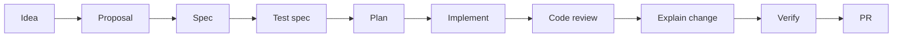

# Public Discovery and Developer Adoption Surface

## Status

accepted

## Problem

RigorLoop is rigorous internally but under-optimized for first-contact adoption.

The repository already has substantial internal structure: workflow artifacts,
skills, specs, validation scripts, release assets, contribution files, and an
npm-delivered CLI. The product vision is also clear: RigorLoop is a Git-first
delivery methodology for coding agents and human reviewers that turns
AI-assisted work into small, traceable, test-backed changes.

The external discovery surface does not yet match that internal maturity. As of
May 23, 2026, the public GitHub repository page still says:

```text
No description, website, or topics provided.
```

It also shows 2 stars, 0 forks, and the latest release as `v0.2.0` on May 23,
2026. [GitHub][1]

That means a visitor can land on the repository, see a mature internal artifact
system, but still fail to understand within a few seconds:

```text
What is this?
Who is it for?
Why should I try it?
How do I start?
What proof exists that it works?
How do I contribute or report feedback?
```

The adoption analysis behind this proposal names the same gap directly: the repo
is rigorous inside but invisible outside, and the fastest adoption win is to set
a keyword-rich GitHub description and topics, then sharpen the first few seconds
of the README.

This is not an internal lifecycle-rigor problem. It is a positioning,
discoverability, and developer-experience problem.

## Goals

- Make RigorLoop easier to discover on GitHub and search engines.
- Make the repository understandable within the first few seconds of a visit.
- Make the README more scannable without weakening technical accuracy.
- Add a visual first-contact explanation with a static lifecycle diagram.
- Make the Quick Start current, copy-pasteable, and version-consistent.
- Add repository metadata: description, topics, and optional website link.
- Improve npm-package discoverability and trust signals.
- Route interested visitors toward the right next action: try it, read the
  workflow, inspect examples, contribute, or report feedback.
- Preserve RigorLoop's positioning as a rigorous, Git-native artifact workflow
  rather than overselling it as an autonomous agent platform.
- Measure adoption-surface quality with lightweight, repeatable checks.

## Non-goals

- Do not change core RigorLoop workflow semantics.
- Do not change skill behavior, adapter behavior, CLI behavior, release archive
  trust boundaries, or validation semantics.
- Do not turn the README into a full product manual.
- Do not add vanity metrics as primary proof.
- Do not over-market RigorLoop as a hosted control plane, agent runtime, or
  autonomous code-merging system.
- Do not remove the honest when-not-to-use guidance.
- Do not replace detailed docs, specs, or examples with README prose.
- Do not use paid growth tactics, artificial stars, or engagement manipulation.
- Do not make off-platform promotion block the first on-repo adoption
  improvements.
- Do not claim broad adoption before evidence exists.

## Vision fit

fits the current vision

RigorLoop's vision is to make AI-assisted changes easier to inspect, reason
about, validate, and maintain in Git.

Improving the public discovery and README surface supports that vision by
helping the right users understand the tool quickly. The proposal does not
weaken rigor; it makes the rigorous model easier to evaluate and try.

This proposal is falsified if:

```text
- the README becomes more promotional but less accurate;
- quick-start commands become stale or unverified;
- topics attract the wrong audience;
- new diagrams or demos oversimplify lifecycle gates;
- visitors still cannot tell what RigorLoop does within a few seconds;
- contributors cannot find the right issue or contribution path;
- adoption metrics improve only by sacrificing positioning accuracy.
```

## Initial intent preservation

| Initial user goal | Proposal treatment | Where recorded |
|---|---|---|
| Improve adoption | in scope | Goals, Recommended Direction |
| Improve positioning | in scope | Problem, Recommended Direction |
| Improve developer experience | in scope | Goals, README landing-page contract |
| Improve GitHub discoverability | in scope | Repository metadata contract |
| Use best practices | in scope | Testing and Verification Strategy, Acceptance Criteria |
| Keep internal rigor intact | in scope | Non-goals, Vision fit |
| Avoid broad product behavior changes | in scope | Non-goals |
| Optimize README / repo landing page | in scope | README landing-page contract |
| Promote through developer channels | deferred follow-up | Deferred follow-up candidates |

## Scope budget

| Work item | Treatment | Reason |
|---|---|---|
| GitHub repository description | core to this proposal | Current repo metadata has no description. |
| GitHub topics | core to this proposal | Topics help people find and contribute to projects, and GitHub topics are visible and searchable. [GitHub Docs][2] |
| README first-screen rewrite | core to this proposal | The first few seconds determine whether a visitor keeps reading. |
| README Quick Start sync | core to this proposal | Quick Start still shows pinned command examples that must match the current release. |
| Visual lifecycle diagram | core to this proposal | The workflow is easier to understand visually than as a long lifecycle list. |
| Short CLI/demo GIF | deferable follow-up | High adoption value, but recording assets add maintenance and can drift from CLI behavior. |
| npm package README polish | same-slice dependency | npm is a key install surface for CLI adoption. |
| Contribution path surfacing | same-slice dependency | Interested users need a clear feedback path. |
| Security/trust signal audit | same-slice dependency | Existing files should be surfaced, not recreated. |
| Dev.to / HN / Reddit launch post | separate proposal | Off-repo promotion should happen after the landing page is ready. |
| Product website | separate proposal | Larger commitment than repo metadata and README polish. |
| SEO measurement dashboard | deferable follow-up | Useful after baseline metadata exists. |

## Context

The uploaded guidance identifies the highest-leverage quick win as setting
repository description and topics because the public repo currently lacks them.
GitHub's topic documentation says topics help people find and contribute to
projects, appear on the repository main page, and can be used for browsing
related repositories. It also says repository admins can add topics related to
purpose, subject area, community, or language, with at most 20 topics and
lowercase/hyphen constraints. [GitHub Docs][2]

The current README is substantive and already includes explanation, Quick Start,
npm usage, adapter packages, source-of-truth boundaries, and contribution links.
The repository page shows the README opening explains that RigorLoop turns
product intent into traceable proposals, requirements, tests, architecture,
plans, implementation, validation evidence, and review decisions. [GitHub][1]

The adoption gap is therefore not lack of substance. It is that the repository's
public metadata and first-contact shape do not yet package that substance into a
fast, visitor-friendly decision path.

## Options Considered

### Option 1: Do nothing

Keep the current README and repository metadata unchanged.

Pros:

- No risk of weakening technical accuracy.
- No implementation cost.
- Internal artifacts remain the same.

Cons:

- Repository remains less discoverable.
- GitHub still shows no description, website, or topics.
- First-contact friction remains high.
- Potential users must read deeply before understanding the value.

### Option 2: Only set repository description and topics

Add a description and up to 20 topics.

Pros:

- Fastest improvement.
- Directly fixes the current metadata gap.
- Improves discoverability without code changes.
- Low risk.

Cons:

- README first-screen still carries most of the adoption burden.
- No visual demo.
- No improvement to the visitor's post-click path.

### Option 3: Only rewrite the README

Improve the hook, Quick Start, and information architecture.

Pros:

- Improves conversion after a visitor lands.
- Can preserve deep docs by linking out.
- Helps GitHub, npm, and search indexing.

Cons:

- Does not fix missing GitHub metadata.
- Repository remains harder to find.
- Higher effort if done without a clear first-slice boundary.

### Option 4: Metadata plus landing-page README pass

Set repository metadata, sharpen the README first screen, sync Quick Start, add
visual explanation, and surface contribution paths.

Pros:

- Fixes discoverability and first-contact comprehension together.
- Keeps scope to documentation/metadata.
- Does not change product behavior.
- Creates a strong base before off-platform promotion.

Cons:

- Requires review for accuracy and positioning.
- Requires maintaining README generated/owned sections carefully.

### Option 5: Full public launch campaign

Do metadata, README, diagrams, website, blog posts, social posts, HN/Reddit,
product screenshots, and contributor onboarding.

Pros:

- Largest adoption upside.
- Creates multi-channel awareness.

Cons:

- Too broad before the repository landing page is ready.
- Promotion can waste attention if Quick Start or positioning is not polished.
- Harder to review and measure.

## Recommended Direction

Choose Option 4.

First make the repository discoverable and understandable. Then promote it.

The principle:

```text
Fix the landing surface before sending traffic to it.
```

The first slice should change:

```text
GitHub metadata
README first-screen content
README Quick Start / npm usage consistency
visual lifecycle/demo assets
contribution and feedback entry points
npm package README alignment if needed
```

It should not change runtime behavior, workflow semantics, skills, adapters,
validators, or release mechanics.

## Repository Metadata Contract

### Description

Set a short, keyword-rich description.

Recommended:

```text
Git-first workflow for AI coding agents: proposals, specs, tests, review gates, and durable validation evidence from idea to PR.
```

Alternative, shorter:

```text
Traceable Git-first workflow for AI coding agents, from proposal to verified PR.
```

Avoid:

```text
A tool for AI agents.
```

because it is too vague.

### Topics

Use no more than 20 topics, following GitHub's constraints. GitHub says topic
names use lowercase letters, numbers, and hyphens, must be 50 characters or
less, and repositories can have no more than 20 topics. [GitHub Docs][2]

Recommended first set:

```text
ai-agents
ai-coding
coding-agent
agentic-workflow
llm
developer-tools
software-engineering
code-review
git-workflow
cli
npm-package
claude-code
codex
opencode
workflow
testing
validation
pull-requests
```

If topic count should be smaller, prioritize:

```text
ai-agents
ai-coding
coding-agent
developer-tools
code-review
git-workflow
cli
npm-package
claude-code
codex
opencode
```

### Website

If no stable website exists, do not invent one.

Acceptable interim website targets:

```text
GitHub README
GitHub Pages docs site, if already maintained
latest release page, if release-first adoption matters
npm package page, if npm landing quality is strong
```

Recommended first-slice decision:

```text
Leave website blank unless a stable docs landing page exists.
```

Do not point the website field at a temporary release page, raw README anchor, or
npm page unless that surface is approved as the public landing page.

## README Landing-Page Contract

### First screen

The README should answer these questions before the reader scrolls far:

```text
What is RigorLoop?
Who is it for?
Why should I care?
How do I try it?
Where do I see proof?
```

Recommended first screen:

````md
# RigorLoop

RigorLoop is a Git-first workflow for AI coding agents and human reviewers.
It turns AI-assisted work into small, traceable, test-backed changes that move
from idea to proposal, spec, test plan, implementation, validation, review, and PR.

Use it when you want agent work to stay reviewable after the chat is gone.

```bash
npx @xiongxianfei/rigorloop@latest init --adapter codex
```

[Quick Start](#quick-start) . [Workflow at a glance](#workflow-at-a-glance) .
[Proof-of-value example](docs/changes/0001-skill-validator/) .
[Contribute](#learn-more--contribute)
````

This keeps the core differentiator visible: RigorLoop is about durable
reviewability, not faster agent output alone.

### Visual

Add a static Mermaid lifecycle diagram in `README.md` for the first slice.

| Visual | Recommended? | Reason |
|---|---:|---|
| Mermaid lifecycle diagram | yes | Diffable, text-owned, easy to review, low maintenance. |
| PNG diagram | optional generated artifact | Useful if the repo later wants image assets, but harder to review than Mermaid. |
| Short CLI GIF | follow-up | Useful, but recording assets add maintenance and can drift from CLI behavior. |
| Long product video | no | Too heavy for first slice. |
| Marketing screenshot gallery | no | Not needed yet. |

Recommended first visual:

````md

````

Add this caption near the diagram:

```text
RigorLoop recommends the full chain for complete AI-assisted delivery. Manual
skill invocations may use only the relevant stage and do not imply full workflow
completion.
```

Keep the diagram honest: do not imply all manual invocations run the full
workflow.

### Quick Start

The Quick Start should stay current with the latest stable release.

Current repo page shows latest release `v0.2.0` on May 23, 2026, while README
examples still include pinned `0.1.5` commands. [GitHub][1]

Recommended Quick Start shape:

````md
## Quick Start

Try the latest published CLI:

```bash
npx @xiongxianfei/rigorloop@latest --help
npx @xiongxianfei/rigorloop@latest init --adapter codex
```

For reproducible onboarding, pin a release:

```bash
npx @xiongxianfei/rigorloop@0.2.0 init --adapter codex
```

For project-local usage:

```bash
npm install --save-dev @xiongxianfei/rigorloop
npx rigorloop --help
```
````

The exact pinned version should be reviewed during implementation against the
latest stable release source so it does not drift.

### README length and links

Keep the README as a landing page, not the full manual.

Move deep material behind links when possible:

| README should keep | Link out to |
|---|---|
| What it is | Full workflow docs |
| Why it exists | Vision |
| Quick Start | CLI docs / npm usage |
| Workflow diagram | Full workflow contract |
| Proof-of-value example | Example change record |
| Supported adapters | Adapter README |
| Contribution entry points | CONTRIBUTING, issue templates, PR template |

The current README already contains contribution and learning links near the end,
including workflow detail, artifact and skill docs, issue templates, and PR
expectations. The first slice should move or summarize those links so
contributors see them earlier.

## npm Landing Contract

The npm package is part of the adoption surface.

The README already states the package name `@xiongxianfei/rigorloop`, binary
`rigorloop`, and supported commands such as `--help`, `version`,
`init --adapter codex`, and `new-change`.

First-slice npm-facing requirements:

```text
- package README content should match GitHub README Quick Start;
- pinned version examples should match current stable release;
- package description should match or closely mirror GitHub description;
- npm keywords should mirror GitHub topics where appropriate;
- npm package should not claim behavior unsupported by the current CLI;
- npm remains a delivery channel, not canonical source for workflow rules.
```

This aligns with the repository's current source-of-truth statement that
canonical workflow content lives in repository docs, specs, skills, schemas, and
scripts, and npm is not the canonical source for workflow rules, skills,
schemas, templates, or adapter archives.

## Contribution and Feedback Entry Points

The repo already exposes contribution and trust files such as `CONTRIBUTING.md`,
`CODE_OF_CONDUCT.md`, `SECURITY.md`, and issue templates on the public page.
[GitHub][1]

The landing surface should route visitors explicitly:

```md
## Learn More / Contribute

- Try it: `npx @xiongxianfei/rigorloop@latest init --adapter codex`
- Read the workflow: `docs/workflows.md`
- Inspect a real change: `docs/changes/0001-skill-validator/`
- Report a bug: `.github/ISSUE_TEMPLATE/bug.yml`
- Request a feature: `.github/ISSUE_TEMPLATE/feature.yml`
- Contribute: `CONTRIBUTING.md`
- Security: `SECURITY.md`
```

Do not bury these paths after long internal architecture material.

## Expected Behavior Changes

- GitHub repository search/discovery metadata improves through description and
  topics.
- A new visitor can understand RigorLoop's purpose from the first README screen.
- Quick Start commands are current and copy-pasteable.
- A visual explains the lifecycle before readers enter detailed docs.
- README becomes more landing-page-like and less manual-like.
- Contributors can quickly find issue templates, contribution expectations, and
  proof examples.
- No runtime behavior changes.

## Architecture Impact

| Surface | Impact |
|---|---|
| GitHub repository metadata | Add description, topics, maybe website. |
| `README.md` | Rework first screen, Quick Start, visual placement, contribution paths. |
| README Mermaid diagram | Add first-slice lifecycle visual without a generated image asset. |
| `package.json` | May update `description` and `keywords`; no runtime behavior change. |
| npm package README | May need sync if package README is generated or copied from root README. |
| Release notes / docs index | May link to proof-of-value example. |
| CI | May add README/link validation if already available or easy. |
| Skills/specs/adapters | No intended change. |
| CLI behavior | No intended change. |

## Repository Metadata Proof

GitHub description, topics, and website are external repository settings rather
than tracked files. Implementation should record before/after metadata proof at:

```text
docs/changes/<change-id>/repository-metadata-proof.md
```

The proof should include:

- approved description;
- approved topic list;
- website field value or explicit blank decision;
- command or UI evidence used to set the values;
- before/after metadata evidence;
- owner or account with permission to update repository metadata;
- confirmation that no runtime/package behavior changed.

Suggested proof command:

```bash
gh repo view xiongxianfei/rigorloop --json description,homepageUrl,repositoryTopics
```

Do not record tokens, cookies, or browser session details.

## Quick Start Version Source

Pinned examples use the latest stable GitHub release tag at implementation time,
cross-checked against npm package version when npm metadata is available. The
current implementation baseline is `@0.2.0`.

If GitHub latest release and npm package version disagree, implementation blocks
for owner decision instead of guessing.

Implementation should update every README, package, or current documentation
example that pins an older public CLI version unless the older version is
intentionally historical.

Suggested evidence commands:

```bash
gh release view --repo xiongxianfei/rigorloop --json tagName,isLatest
npm view @xiongxianfei/rigorloop version
grep -R "@xiongxianfei/rigorloop@0\\.1\\.5" README.md package.json docs/ packages/ || true
```

If `npm view` is unavailable locally, record the release-page proof and package
metadata proof available to the maintainer.

## README Ownership Boundary

Implementation should identify whether the README first-screen content is inside
or outside generated/owned regions.

If the target text is inside a generated region, update the owning source
artifact or generator, not only `README.md`.

If the target text is outside generated regions, update `README.md` directly and
verify it does not contradict `VISION.md` or source-of-truth sections.

## Cold-Read and Link-Check Evidence

Implementation should record adoption-surface review evidence at:

```text
docs/changes/<change-id>/adoption-surface-review.md
```

Required fields:

- cold-read reviewer or role;
- first command identified;
- one-sentence value proposition identified;
- target audience identified;
- links checked;
- Quick Start commands checked;
- unsupported-claim sweep result;
- stale-version sweep result;
- visual accuracy check result.

## Testing and Verification Strategy

| Check ID | What is verified |
|---|---|
| `DXA-001` | GitHub description is present and matches approved positioning. |
| `DXA-002` | GitHub topics are present, within GitHub constraints, and relevant. |
| `DXA-003` | README first screen answers what, who, why, and how to try. |
| `DXA-004` | Quick Start commands use `@latest` and a current pinned stable version. |
| `DXA-005` | README does not claim unsupported CLI, adapter, or workflow behavior. |
| `DXA-006` | Mermaid lifecycle diagram exists and does not imply false automation. |
| `DXA-007` | npm package description/keywords align with repo metadata. |
| `DXA-008` | Contribution and feedback paths are visible from README. |
| `DXA-009` | Existing trust files remain linked or discoverable: license, contributing, code of conduct, security. |
| `DXA-010` | Link checks pass for README-local links and key docs. |
| `DXA-011` | No skills, adapters, validators, release archives, or runtime package behavior change. |
| `DXA-012` | A cold-read reviewer can explain RigorLoop's value and first command in under two minutes. |
| `DXA-013` | Repository metadata proof records approved description, topics, website value, and before/after evidence. |
| `DXA-014` | Version-sync proof records the current stable release source and confirms no stale pinned CLI examples remain in current Quick Start or npm landing surfaces. |
| `DXA-015` | README ownership proof confirms no generated README region was hand-edited, or identifies the owning source artifact that was changed. |
| `DXA-016` | Cold-read evidence records the reviewer's identified value proposition, audience, first command, and checked links. |

Suggested validation commands:

```bash
npm test --prefix packages/rigorloop
python scripts/test-select-validation.py
python scripts/validate-artifact-lifecycle.py --mode explicit-paths \
  --path README.md \
  --path package.json \
  --path docs/changes/<change-id>/change.yaml \
  --path docs/plans/<plan>.md \
  --path docs/plan.md
git diff --check --
```

If a link checker exists, run it. If not, use manual link review for the first
slice and record the checked links.

## Behavior-Preservation Proof

Create:

```text
docs/changes/<change-id>/behavior-preservation.md
```

Required matrix:

| Surface | Baseline | New proof | Preservation result |
|---|---|---|---|
| CLI behavior | package tests / smoke | same tests pass | unchanged |
| Adapter behavior | no adapter changes | diff proof | unchanged |
| Skill behavior | no skill changes | diff proof | unchanged |
| README Quick Start | current commands | commands verified or release-matched | improved |
| Repository metadata | no description/topics | description/topics set | improved |
| npm metadata | existing package metadata | description/keywords aligned | improved |
| Contribution routing | existing files | links surfaced | improved |

A documentation improvement is not allowed to introduce unsupported CLI claims.

## Rollout and Rollback

Rollout:

1. Approve proposal.
2. Decide exact GitHub description and topic list.
3. Decide exact README first-screen wording.
4. Add the approved Mermaid lifecycle diagram.
5. Update README and package metadata.
6. Verify the visual caption preserves manual-invocation boundaries.
7. Verify Quick Start commands and version examples.
8. Validate links and lifecycle artifacts.
9. Code-review adoption-surface changes.
10. After landing page is ready, prepare optional off-platform promotion.

Rollback:

- Revert README wording if it creates confusion or unsupported claims.
- Remove or replace visual asset if it misleads users.
- Restore previous package metadata if npm publish checks fail.
- Remove topics only if they attract clearly wrong discovery traffic.
- Do not roll back unrelated runtime behavior because no runtime behavior should
  change.

## Risks and Mitigations

| Risk | Mitigation |
|---|---|
| README becomes too promotional | Keep when-not-to-use guidance and source-of-truth boundaries. |
| Topics attract the wrong audience | Use precise developer-tool and AI-coding topics, not broad hype terms only. |
| Quick Start drifts again | Add release/version sync check or explicit manual validation step. |
| Diagram oversimplifies lifecycle | Label full workflow as recommended for complete delivery, not mandatory for every manual invocation. |
| npm metadata claims unsupported behavior | Compare against current CLI supported commands before publish. |
| README remains too long | Keep first screen concise and link to deeper docs. |
| Off-platform promotion sends traffic too early | Promote only after metadata and README pass cold-read review. |
| Existing users are confused by changed positioning | Preserve source-of-truth and non-goal sections. |

## First-Slice Boundary

First implementation slice:

```text
GitHub repository description
GitHub repository topics
README first-screen rewrite
README Quick Start sync
README Mermaid lifecycle diagram
README contribution / feedback links
package.json description and keywords, if package metadata is in scope
repository metadata proof
version-sync proof
README ownership proof
link/cold-read validation evidence
```

Out of scope for first slice:

```text
website
blog campaign
Dev.to / HN / Reddit launch
runtime CLI behavior
skills/adapters/validators
release process
new examples beyond linking existing proof-of-value example
new issue template types
analytics dashboard
CLI/demo GIF
```

## Acceptance Criteria

| ID | Criterion |
|---|---|
| `AC-DXA-001` | GitHub repository description is set and matches approved positioning. |
| `AC-DXA-002` | GitHub topics are set, relevant, lowercase/hyphenated, and no more than 20. |
| `AC-DXA-003` | README first screen explains what RigorLoop is, who it is for, why it matters, and how to try it. |
| `AC-DXA-004` | README Quick Start includes `@latest` and a current pinned stable version. |
| `AC-DXA-005` | README includes the approved Mermaid lifecycle diagram and caption. |
| `AC-DXA-006` | README links to workflow docs, proof-of-value example, contribution guide, issue templates, and security policy. |
| `AC-DXA-007` | Package metadata description/keywords align with repository positioning if package metadata is touched. |
| `AC-DXA-008` | Documentation changes do not claim unsupported CLI, adapter, workflow, or release behavior. |
| `AC-DXA-009` | No runtime behavior, skill behavior, adapter output, validator behavior, or release process changes occur in this slice. |
| `AC-DXA-010` | Cold-read reviewer can identify the project value proposition and first command without reading deep specs. |
| `AC-DXA-011` | Link and command validation evidence is recorded. |
| `AC-DXA-012` | Repository metadata proof records approved description, topics, website value, and before/after evidence. |
| `AC-DXA-013` | Version-sync proof confirms current pinned version and no stale current Quick Start examples remain. |
| `AC-DXA-014` | README ownership proof confirms generated regions were not hand-edited, or identifies the owning source artifact that was changed. |
| `AC-DXA-015` | Cold-read and link-check evidence records value proposition, target audience, first command, checked links, and unsupported-claim sweep. |

## Open Questions

None blocking proposal-review after the requested revision.

Resolved decisions from proposal-review:

| Question | Decision |
|---|---|
| Exact GitHub description | Use `Git-first workflow for AI coding agents: proposals, specs, tests, review gates, and durable validation evidence from idea to PR.` unless implementation shows GitHub UI display truncation is poor. |
| Website field | Leave blank unless a stable docs landing page already exists and is approved as the public landing page. |
| First visual | Use a static Mermaid lifecycle diagram in README first; defer GIF. |
| README pinned examples | Use `@latest` plus latest stable pinned version; current release baseline is `@0.2.0`. |
| Off-platform promotion | Follow-up only after landing page polish and cold-read review. |

## Decision Log

| Date | Decision | Reason | Alternatives rejected |
|---|---|---|---|
| 2026-05-23 | Treat adoption as a public-surface problem, not an internal rigor problem. | Internal rigor is strong; the binding constraint is first-contact comprehension and discovery. | More internal workflow optimization first. |
| 2026-05-23 | Prioritize GitHub description and topics. | Current repo metadata has no description, website, or topics. [GitHub][1] | Start with off-platform promotion. |
| 2026-05-23 | Make README first screen the main adoption surface. | README is the landing page most visitors inspect after discovery. | Metadata-only change. |
| 2026-05-23 | Add visual explanation before broad promotion. | The lifecycle is easier to understand visually. | Promotion without visual context. |
| 2026-05-23 | Keep runtime behavior out of scope. | Adoption-surface polish should not reopen product behavior. | Bundle docs polish with runtime changes. |
| 2026-05-23 | Resolve proposal-review findings by adding metadata, version-sync, README ownership, and cold-read proof shapes. | External settings and subjective validation need durable evidence before planning. | Proceed to plan with proof gaps open. |
| 2026-05-23 | Use Mermaid for the first visual and defer GIF. | Mermaid is diffable, text-owned, and less likely to drift from CLI behavior. | PNG/GIF as first-slice requirement. |
| 2026-05-23 | Treat `@0.2.0` as the current pinned implementation baseline. | GitHub shows `v0.2.0` as latest on May 23, 2026; implementation must still cross-check npm metadata when available. | Leave pinned examples unspecified. |

## Next Artifacts

```text
proposal-review
spec only if repository metadata / README ownership contract is missing
test-spec only if automated README/metadata validation is added
plan
plan-review
implementation
code-review
explain-change
verify
pr
```

Recommended proof route:

```text
proposal-review -> plan -> plan-review -> implementation -> code-review -> verify -> pr
```

A separate spec is needed only if review decides that README ownership,
generated README sections, npm metadata sync, or GitHub metadata governance lacks
a governing contract.

## Deferred Follow-up Candidates

- Proposal for Dev.to / Hacker News / Reddit launch post.
- Proposal for docs landing page or GitHub Pages site.
- Proposal for README/npx demo GIF automation.
- Proposal for adoption metrics and repository traffic review.
- Proposal for npm package-page optimization if npm metadata is not synced in
  this slice.
- Proposal for contributor onboarding polish after first external issue/PR
  feedback.

## Follow-on Artifacts

- Proposal review: [docs/changes/2026-05-23-public-discovery-and-developer-adoption-surface/reviews/proposal-review-r1.md](../changes/2026-05-23-public-discovery-and-developer-adoption-surface/reviews/proposal-review-r1.md)
- Spec: [specs/public-discovery-and-developer-adoption-surface.md](../../specs/public-discovery-and-developer-adoption-surface.md)

## Readiness

Accepted after clean `proposal-review`. Downstream spec drafting has begun.

## Core Invariant

```text
RigorLoop should be as easy to understand from the outside as it is rigorous on the inside.

This proposal improves the public adoption surface - repository metadata,
README, Quick Start, visuals, and contribution entry points - without changing
runtime behavior, workflow semantics, skills, adapters, validators, or release
trust boundaries.
```

[1]: https://github.com/xiongxianfei/rigorloop "GitHub - xiongxianfei/rigorloop"
[2]: https://docs.github.com/en/repositories/managing-your-repositorys-settings-and-features/customizing-your-repository/classifying-your-repository-with-topics "Classifying your repository with topics - GitHub Docs"
