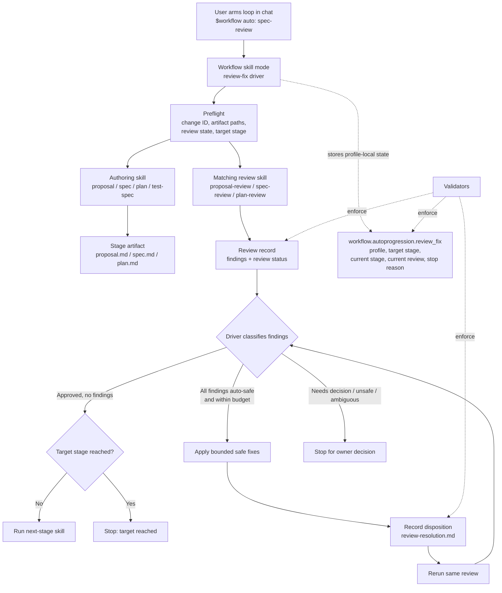

# Bounded Review-Fix Autoprogression in Chat

## Status

accepted

## Problem

RigorLoop's manual lifecycle loop is safe but repetitive. A typical proposal-side workflow often requires a user to repeatedly invoke the same pattern:

```text
author stage artifact
-> manually inspect or refine
-> run matching review skill
-> read safe resolution paths
-> manually apply deterministic fixes
-> rerun the review
-> manually start the next stage
```

That manual routing protects review gates, but it creates unnecessary human attention cost when review findings are simple, deterministic, and already include safe resolution paths.

The current review-family contract correctly treats direct review requests as isolated. A direct `proposal-review`, `spec-review`, `architecture-review`, `plan-review`, `test-spec-review`, or `code-review` request should not silently continue into downstream stages. That isolation rule is right for one-off reviews, but too restrictive for an explicitly workflow-managed session where the user has already authorized the agent to continue the lifecycle loop, apply easy safe fixes, rerun the same review, and stop on judgment.

The missing contract is an optimized autoprogression mode: a separately armed chat-mode driver that can run stage pairs, apply only mechanically bounded fixes, rerun review, and continue until a requested target stage is complete.

## Goals

- Reduce repeated manual triggering for proposal-side lifecycle loops.
- Preserve isolated direct review behavior by default.
- Add an explicit opt-in workflow-managed mode for bounded review-fix autoprogression.
- Let the agent apply easy, safe review-resolution edits automatically.
- Require review evidence to be recorded before automated fixes or downstream routing proceed.
- Rerun the same review after every automated fix.
- Continue to the next stage only after the current review is clean, current, and recorded.
- Stop on owner decisions, ambiguous safe paths, scope expansion, product judgment, architecture judgment, validation ownership changes, missing evidence, or unsafe edits.
- Preserve ownership boundaries across proposal, spec, architecture, plan, test-spec, implementation, code-review, verify, and PR stages.
- Make every automated edit visible, reversible, and reviewable.
- Keep autoprogression synchronous in the active chat session rather than hidden background work.

## Non-goals

- Do not make all direct review invocations auto-continue.
- Do not let a review skill rewrite its target artifact during the review pass.
- Do not auto-apply changes that require owner judgment.
- Do not auto-change product direction, scope, requirements, architecture decisions, milestone boundaries, validation command ownership, or release policy.
- Do not skip rereview after applying fixes.
- Do not proceed to the next stage with unresolved material findings.
- Do not claim implementation readiness, verification, branch readiness, or PR readiness from upstream review success.
- Do not allow cache-only or stale review evidence to authorize downstream work.
- Do not run network, publication, destructive, or external state-mutating commands without a separately approved stage contract.
- Do not hand-edit generated or marker-owned artifacts unless the owning contract explicitly permits it.
- Do not replace existing `authoring-through-plan-review` or `implementation-through-verify` profiles by widening them silently.

## Vision fit

fits the current vision

RigorLoop exists to make AI-assisted work traceable, resumable, and reviewable in Git. This proposal reduces low-value chat ceremony while preserving the high-value artifacts and review gates that make the work inspectable.

The proposal is falsified if direct review requests start auto-continuing without explicit arming, material findings are fixed without durable recording, owner-decision findings are auto-applied, next-stage skills run before a clean review, users cannot see what changed and why, or review artifacts drift from actual loop state.

## Initial intent preservation

| Initial user goal | Proposal treatment | Where recorded |
| --- | --- | --- |
| Automate the manual proposal/spec/architecture/plan/test-spec lifecycle loop | in scope | Goals, Recommended direction |
| Preserve manual direct skill invocation behavior | in scope | Non-goals, Expected behavior changes |
| Let the agent solve easy safe review findings | in scope | Recommended direction, Safe auto-fix policy |
| Let the agent rerun the review after safe fixes | in scope | Goals, Expected behavior changes |
| Let the agent trigger the next-stage skill in chat after clean review | in scope | Expected behavior changes |
| Stop when a finding needs owner judgment | in scope | Non-goals, Risks and mitigations |
| Support short commands such as `$workflow auto: <target-stage>` | in scope | Recommended direction |
| Deliver one complete proposal-side feature instead of partial user-visible slices | in scope | Integrated proposal-side scope, Rollout and rollback |
| Include implementation and code-review loops eventually | separate proposal | Scope budget, Rollout and rollback |
| Avoid hidden background work | in scope | Non-goals, Expected behavior changes |

## Scope budget

| Work item | Treatment | Reason |
| --- | --- | --- |
| Explicitly armed chat-mode lifecycle driver | core to this proposal | The user needs bounded opt-in automation without changing direct review defaults. |
| Integrated proposal-side loop through test-spec-review | core to this proposal | The owner direction is to ship one complete proposal-side capability rather than several partial user-visible slices. |
| Safe auto-fix classification | core to this proposal | Automation needs a closed rule for what can be changed without owner judgment. |
| Review-resolution recording for auto-applied fixes | same-slice dependency | Material findings need durable dispositions before downstream routing. |
| Rereview after every auto-fix | core to this proposal | Review approval must apply to the changed artifact. |
| Bounded target-stage command surface | core to this proposal | The user must choose which lifecycle stage completes before automation stops. |
| Architecture, plan, and test-spec stages | same-slice dependency | A complete proposal-side feature should support the standard artifact path through `test-spec-review`. |
| Implementation milestone loop | separate proposal | Existing implementation automation has different authority and risk surfaces. |
| Verify and PR behavior | out of scope | Existing verify and PR ownership boundaries should remain governed by current profiles. |
| Background or asynchronous automation | out of scope | RigorLoop should stay chat-visible and artifact-visible. |

## Context

The accepted workflow already distinguishes workflow-managed completion flows from isolated manual stage requests. Current autoprogression profiles are explicitly armed and change-local:

- `authoring-through-plan-review` routes from a clean proposal gate through spec, spec-review, architecture assessment, required architecture stages, plan, and plan-review, then stops.
- `implementation-through-verify` is separately authorized, phase-gated, and owns implementation-side progression where enabled.

This proposal introduces a missing layer between fully manual review-resolution and broad implementation automation: a review-fix autoprogression driver that can apply deterministic review fixes and repeat the same review before continuing toward an armed target stage.

The driver should not make review skills self-editing. The review pass records findings. The driver, acting after review, classifies whether the finding is auto-safe, applies eligible fixes, records disposition, and reruns review independently.

## Options considered

### Option 1: Keep the workflow fully manual

Pros:

- Maximum human control.
- No new automation risk.

Cons:

- Repetitive for deterministic review fixes.
- Encourages skipped rereview when users are tired.
- Keeps humans as routers for already-known transitions.

### Option 2: Make review skills auto-fix and auto-continue by default

Pros:

- Simple user experience.

Cons:

- Violates direct-review isolation.
- Blurs reviewer and editor roles.
- Risks hidden scope or requirement changes.
- Conflicts with existing handoff rules.

Rejected.

### Option 3: Add one global continue-until-done mode

Pros:

- Very convenient.

Cons:

- Too broad for workflow, architecture, implementation, verify, and PR boundaries.
- Hard to validate and hard to stop safely.
- Encourages unsafe assumptions about owner decisions.

Rejected for the first slice.

### Option 4: Add separately armed review-fix autoprogression

Pros:

- Preserves safe defaults.
- Provides explicit opt-in and bounded stage targets.
- Allows deterministic fixes while stopping on judgment.
- Keeps review gates authoritative and visible.

Cons:

- Requires classification rules, review-resolution shape, and validation.
- Adds orchestration complexity.

Recommended.

## Recommended direction

Add a separately armed workflow-managed review-fix autoprogression mode.

Use this operating principle:

```text
The user arms the loop once.
Each review still approves or blocks its own stage.
The driver only continues when the current gate is clean.
```

Use one command format:

```text
$workflow auto: <target-stage>
$workflow auto: status
$workflow auto: off
```

`<target-stage>` is the stage where the workflow must stop after successful completion. It is not permission to skip prerequisites.

### Integrated proposal-side scope

This proposal ships one integrated proposal-side autoprogression feature rather than several externally enabled slices.

The supported stage path is:

```text
proposal
-> proposal-review
-> spec
-> spec-review
-> architecture when required
-> architecture-review when required
-> plan
-> plan-review
-> test-spec
-> test-spec-review
```

Implementation, code-review, verify, PR, release, publication, network, and external-state operations remain outside this proposal and are governed by existing profiles or separate proposals.

Implementation may use internal closeable milestones, fixtures, and code reviews, but no partial user-visible autoprogression mode is enabled until the full proposal-side acceptance criteria pass.

### Target-stage enum

The durable `target_stage` value is closed:

```text
proposal-review
spec
spec-review
architecture
architecture-review
plan
plan-review
test-spec
test-spec-review
```

The user-facing command may support convenience aliases, but persisted autoprogression state stores only the closed target-stage value. `verify`, `pr`, release, publication, and external-state operations are out of scope.

The command is generic, but persistence should use canonical closed profile names and a closed `target_stage` value. Raw arbitrary stage names should not become durable authority.

### Arming and state ownership

Review-fix autoprogression state lives under the existing workflow autoprogression metadata surface as a nested `review_fix` profile.

Recommended shape:

```yaml
workflow:
  autoprogression:
    review_fix:
      status: armed
      profile: bounded-review-fix
      target_stage: test-spec-review
      armed_by: user
      armed_at: "2026-06-30T00:00:00Z"
      current_stage: proposal-review
      current_review: none
      stop_reason: none
      last_updated_evidence: docs/changes/<change-id>/change.yaml
```

Closed values should include:

```text
status: off | armed | active | paused | completed | cancelled
profile: bounded-review-fix
target_stage: proposal-review | spec | spec-review | architecture | architecture-review | plan | plan-review | test-spec | test-spec-review
```

The nested state records the review-fix authorization, target stage, profile-local cursor, current review reference when one exists, stop reason, and last updated evidence. `current_stage` and `current_review` are profile-local execution evidence for safe resume and audit; they do not own active plan state, branch readiness, PR readiness, or the global workflow next stage.

Direct review invocations do not create this state. The state is cleared or marked terminal when the user runs `$workflow auto: off`, when the target stage is reached, when a non-auto-safe blocker is encountered, or when authorization is cancelled. A paused profile must not resume from manual fixes unless the user explicitly resumes and the tracked artifact and review evidence still match the profile-local cursor.

### Loop behavior

For each stage pair:

```text
1. Determine current stage, target artifact, review state, and target stage.
2. Run the authoring skill only when the artifact is missing or the target stage requires authoring.
3. Run the matching review skill.
4. Record review evidence or stop with blocked recording.
5. If review is approved, continue only if the target stage has not been reached.
6. If review has findings, classify each finding for auto-fixability.
7. If all findings are auto-safe and within budget, record planned disposition, apply fixes, record actual disposition, and rerun the same review.
8. If any finding is not auto-safe, stop and request owner decision.
9. If review is blocked or inconclusive, stop with the smallest next action.
```

### Proposed architecture direction

Use the workflow skill as the only review-fix autoprogression driver. The driver orchestrates existing stage skills; it does not replace their artifact ownership or review authority.



Design responsibilities:

| Component | Responsibility | Must not own |
| --- | --- | --- |
| Workflow review-fix driver | Classify invocation context, run preflight, invoke existing stage skills, classify review findings, apply eligible bounded fixes, rerun review, and stop or continue toward the target stage. | Stage artifact content authority, review approval, global active-plan next stage, branch readiness, PR readiness. |
| Authoring skills | Create or revise their owned artifacts according to existing skill contracts. | Review approval or downstream readiness beyond their handoff. |
| Review skills | Review tracked artifacts, record status and findings, and provide safe resolution paths or `needs-decision` rationale. | Editing the reviewed artifact during the review pass or continuing downstream by default. |
| Auto-safe classifier | Decide whether a finding can be applied from closed rules, reviewer evidence, and deterministic patch targets. | Product, architecture, scope, requirement, validation-ownership, release, or owner decisions. |
| Safe-fix applier | Apply only bounded edits to the reviewed artifact or explicitly owned bookkeeping artifacts after review evidence exists. | Generated or marker-owned output unless the generator or canonical source owns the change. |
| Review-resolution recorder | Record planned and actual disposition, changed files, validation evidence, and rereview linkage for material findings. | Replacing the review record or marking unresolved owner decisions closed. |
| Review-fix state | Persist authorization, target stage, profile-local cursor, current review, stop reason, and audit evidence under `workflow.autoprogression.review_fix`. | Authoritative active-plan state, branch readiness, PR readiness, or final workflow completion. |
| Validators | Fail closed on unknown profile values, invalid state combinations, stale review evidence, missing rereview, unresolved findings, and target overrun. | Making product or architecture decisions. |

The driver should follow a preflight-first sequence before invoking expensive or state-changing work:

```text
1. Resolve change ID and artifact paths.
2. Load review-fix state and requested target stage.
3. Confirm direct review invocation did not arm the loop.
4. Confirm target artifact and latest review evidence are current.
5. Confirm the reviewed artifact has not changed since the review before applying fixes.
6. Confirm no open upstream blockers or unresolved review-resolution items.
7. Confirm the target stage is allowed for the integrated proposal-side feature.
8. Confirm the next transition is on the standard workflow path to the target stage.
```

The architecture deliberately keeps the review-fix driver as an orchestration layer over existing skills instead of creating new artifact-authoring or review-authoring engines. That keeps the first slice small, makes the chat loop observable, and preserves the existing stage ownership model.

### Loop and edit budget

Autoprogression is bounded.

Defaults:

- at most 2 auto-fix and rereview cycles per review gate;
- at most 5 material findings auto-applied per cycle;
- at most 3 files changed per cycle;
- at most 10 files changed per chat invocation;
- no continuation past the armed `target_stage`.

Budget exhaustion stops the loop and reports remaining findings, changed files, review state, and required owner action.

### Safe auto-fix policy

Auto-safe findings must satisfy all of these conditions:

- The finding has a stable finding ID.
- The finding has evidence.
- The required outcome is deterministic.
- The safe resolution path names exactly what to change, or the change follows a closed repository rule.
- The fix does not alter product direction, architecture, scope, requirements, milestone sequencing, validation ownership, public behavior, release policy, or external state.
- The target artifact is currently under review or is an explicitly owned bookkeeping artifact.
- The edit can be shown as a small diff.
- The same review can be rerun after the edit.

The driver must stop when a finding has `needs-decision`, asks the owner to choose among alternatives, changes accepted scope, changes a spec requirement or acceptance criterion, changes architecture decisions, changes validation command ownership, requires implementation outside an implementation stage, lacks a deterministic patch target, or has reviewer-declared blocked downstream handoff.

Auto-fix classes should be closed and validator-backed. Candidate values:

```text
mechanical
format-preserving
exact-reviewer-wording
status-normalization-with-evidence
recording-repair
cross-reference-repair
validation-command-shape-repair
not-auto-safe
```

The driver computes the authoritative auto-fix classification. Review findings may include safe resolution paths, exact wording, or `needs-decision` rationale, but reviewer hints are advisory until the driver verifies them against the closed auto-safe criteria.

`exact-reviewer-wording` is auto-safe only when the finding supplies all of:

- target artifact;
- target section or line range;
- exact quoted replacement text;
- no owner-decision rationale;
- no semantic scope change.

If the reviewer says only "clarify this section," the finding is not auto-safe.

Review-resolution should record the driver classification, rationale, changed files, and rereview linkage. Recommended shape:

```yaml
auto_resolution:
  finding_id: AUTO-EXAMPLE-1
  driver_classification: mechanical
  reviewer_hint: none
  auto_applied: true
  reason_auto_safe: "Exact heading normalization with no semantic change."
  files_changed:
    - docs/proposals/example.md
  review_rerun: proposal-review-r2
```

## Expected behavior changes

- Users can explicitly arm a workflow-managed loop in chat.
- Direct review-only invocations remain isolated by default.
- Easy deterministic review fixes are applied automatically only after review evidence is recorded, the driver classifies every finding as auto-safe, and the loop stays within budget.
- Review-resolution records include auto-applied dispositions and changed files when material findings are fixed automatically.
- The same review reruns automatically after eligible fixes.
- The next-stage skill runs automatically only after clean review and only while moving toward the target stage.
- Findings requiring judgment stop for owner decision.
- The chat result lists applied fixes, stopped findings, changed artifacts, review rerun status, next action, and stop reason.

## Architecture impact

This change affects workflow orchestration and lifecycle state handling. The proposed architecture direction above should be treated as the initial design input for the later spec and formal architecture stage, not as accepted canonical architecture truth.

Expected touched surfaces include:

- `specs/workflow-stage-autoprogression.md` for the profile and continuation contract.
- `docs/workflows.md` and `skills/workflow/SKILL.md` for user-facing routing guidance.
- Review-family skill guidance to preserve isolation while exposing safe-resolution metadata where needed.
- Review artifact and review-resolution validation for auto-fix classification, disposition, rereview linkage, and stale-review boundaries.
- Change metadata schema and validator logic for the nested `workflow.autoprogression.review_fix` profile state.
- Generated adapter support surfaces if public skill output changes.

Architecture assessment is required after spec-review because this proposal introduces a durable workflow orchestration and persistence decision. The formal architecture stage should decide whether the canonical package and an ADR are both required; an ADR is likely if the accepted spec preserves the nested review-fix state model, safe-fix authority boundary, and review-resolution automation.

## Testing and verification strategy

Use fixture-driven and integration tests that prove:

| Check ID | What is verified |
| --- | --- |
| `AUTO-001` | Direct `proposal-review` remains isolated by default. |
| `AUTO-002` | Armed review-fix mode applies safe mechanical fixes and reruns review. |
| `AUTO-003` | Target-stage mode runs the next authoring skill only after clean review when the target is not reached. |
| `AUTO-004` | Findings with `needs-decision` stop the loop. |
| `AUTO-005` | Findings changing scope, requirements, architecture, or validation ownership are not auto-applied. |
| `AUTO-006` | Exact reviewer wording fixes can be auto-applied only when deterministic. |
| `AUTO-007` | Review records are created before auto-fix disposition. |
| `AUTO-008` | `review-resolution.md` records auto-applied disposition. |
| `AUTO-009` | Rereview is mandatory after auto-fix. |
| `AUTO-010` | Stale review cannot authorize next-stage progression. |
| `AUTO-011` | Target stage prevents continuation past the requested stage. |
| `AUTO-012` | Direct review invocation does not set armed mode. |
| `AUTO-013` | Generated or marker-owned content blocks hand-edit auto-fix. |
| `AUTO-014` | Missing artifact path blocks rather than guessing. |
| `AUTO-015` | Chat result lists auto-applied fixes and human-decision blockers. |
| `AUTO-016` | Existing authoring and implementation autoprogression profiles remain unchanged. |
| `AUTO-017` | Armed review-fix state has a single owning metadata surface. |
| `AUTO-018` | Direct review invocation does not create armed state. |
| `AUTO-019` | Armed state records profile, target stage, current stage, current review, and stop reason. |
| `AUTO-020` | Armed state is cleared or marked terminal when the target stage is reached, user disables it, or a non-auto-safe blocker occurs. |
| `AUTO-021` | Integrated target-stage enum covers `proposal-review` through `test-spec-review`. |
| `AUTO-022` | `verify`, `pr`, release, publication, and external-state operations are out of scope. |
| `AUTO-023` | No partial user-visible autoprogression mode is enabled before the full proposal-side contract passes. |
| `AUTO-024` | The driver computes the authoritative auto-fix classification. |
| `AUTO-025` | Review-resolution records driver classification, rationale, changed files, and rereview linkage. |
| `AUTO-026` | Exact reviewer wording requires exact quoted replacement text and deterministic patch target. |
| `AUTO-027` | The loop has hard cycle, finding, and changed-file budgets. |
| `AUTO-028` | Budget exhaustion stops the loop with a clear reason. |
| `AUTO-029` | The reviewed artifact must not have changed since review before fixes are applied. |

Validation should include closed-vocabulary unknown-value regression tests for profile names, target stages, auto-fix classes, review statuses, and disposition values.

## Rollout and rollback

Roll out as one integrated external feature with internal closeable implementation work. The externally enabled feature covers the proposal-side path through `test-spec-review`; it should remain disabled until the full proposal-side acceptance criteria pass.

Implementation may be reviewed in internal milestones for state schema, review-resolution disposition, planner/preflight, safe-fix application, full proposal-side integration, and behavior-preservation evidence. Those milestones must not expose partial user-visible autoprogression modes.

When enabled, `$workflow auto: <target-stage>` may apply only auto-safe, budget-bounded fixes after review evidence is recorded. Direct review invocations stay isolated throughout rollout.

Rollback should disable armed review-fix autoprogression while preserving review records and review-resolution history. Revert workflow-skill routing, validators, and schema changes together. If safe-fix classification proves too broad, disable automatic safe-fix application until narrowed.

## Risks and mitigations

| Risk | Mitigation |
| --- | --- |
| Agent over-applies a review suggestion | Require deterministic auto-safe classification and exact patch target. |
| Owner decisions are bypassed | `needs-decision` and ambiguous alternatives always stop. |
| Review skill becomes editor and judge | Driver edits only after review; review reruns independently. |
| Scope changes sneak in as safe fixes | Product, scope, requirement, architecture, and validation-ownership changes are not auto-safe. |
| User loses visibility | Output lists every applied fix, finding ID, changed file, and reason. |
| Next stage runs too far | Require explicit target stage and closed allowed targets. |
| Review records are skipped | Recording remains mandatory before fixes or downstream routing. |
| Stale review approves changed artifact | Rereview required after every auto-fix. |
| Generated content is hand-edited | Block unless generator or canonical source owns the change. |
| Workflow complexity grows too quickly | Keep one integrated external feature, but use internal closeable implementation work and disable user-visible behavior until acceptance passes. |

## Open questions

None. Proposal-review resolved the previously open direction questions:

- The target-stage enum covers the full proposal-side path through `test-spec-review`.
- The driver computes the authoritative auto-fix classification.
- Exact reviewer wording requires an exact quoted replacement and deterministic patch target.
- The design intentionally omits dry-run and apply-mode state to keep the first integrated behavior simple.

## Decision log

| Date | Decision | Reason | Alternatives rejected |
| --- | --- | --- | --- |
| 2026-06-30 | Preserve isolated direct review by default. | Existing review skills rely on this safety boundary. | Make every review auto-continue. |
| 2026-06-30 | Use separately armed autoprogression. | Gives convenience without implicit handoff. | Global continue-until-done mode. |
| 2026-06-30 | Auto-apply only deterministic safe fixes. | Review suggestions often require judgment. | Apply all safe resolution paths blindly. |
| 2026-06-30 | Rerun review after every auto-fix. | Review approval must apply to the changed artifact. | Treat applied review suggestion as automatically approved. |
| 2026-06-30 | Ship one integrated proposal-side feature through `test-spec-review`. | Owner direction prefers one complete proposal-side deliverable over partial user-visible slices. | Proposal/spec-only first external slice; implementation, verify, and PR in the same proposal. |
| 2026-06-30 | Use `$workflow auto: <target-stage>` as the only command shape. | Real workflow stage names are simpler than special boundary words and still avoid direct skill invocation ambiguity. | Special boundary vocabulary and separate apply-mode command variants. |
| 2026-06-30 | Store review-fix authorization under `workflow.autoprogression.review_fix`. | The existing autoprogression surface already owns change-local profile authorization; a nested profile avoids a second policy surface while keeping live plan state separate. | Separate standalone workflow policy file; raw arbitrary stage names as persistent authority. |
| 2026-06-30 | Omit dry-run and apply-mode state. | Owner decision favors a simple, concise implementation where arming the review-fix profile is the mutation authorization and all unsafe findings still stop. | Separate dry-run or apply-safe-fixes modes. |
| 2026-06-30 | Driver-owned classification is authoritative. | Review findings can provide hints, but the driver must verify auto-safety against closed criteria before mutation. | Requiring review skills to emit authoritative `auto_fixability` in the first integrated version. |

## Next artifacts

- `proposal-review`
- Spec: `specs/review-fix-autoprogression.md`
- Spec review
- Architecture assessment, with architecture and ADR updates if reusable orchestration or persistent state changes are introduced
- Execution plan
- Plan review
- Test spec
- Test-spec review

## Follow-on artifacts

- [proposal-review-r2](../changes/2026-06-30-bounded-review-fix-autoprogression-in-chat/reviews/proposal-review-r2.md)

## Readiness

Accepted and ready for `spec`.
