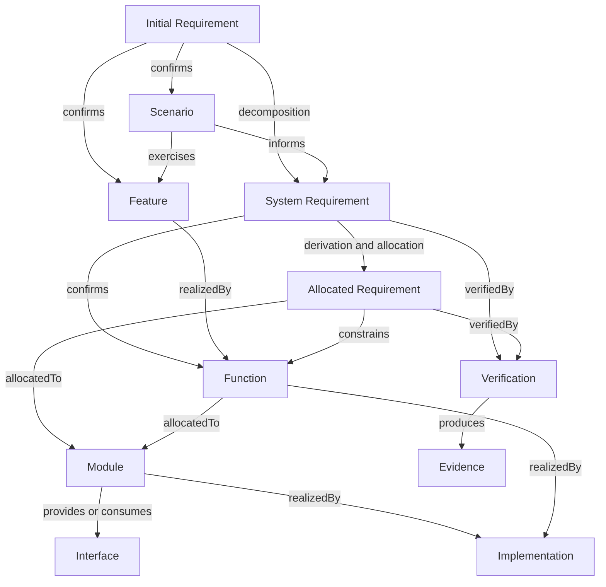

# REM models

Models define structures, typed relationships, and consistency rules using the [concepts](../concepts/README.md).
The [principles](../principles/README.md) govern these models; [methods](../methods/README.md) describe how to develop them.

| Domain | Primary content | Owning model |
| --- | --- | --- |
| Requirement Analysis | IR → SR → AR | [Requirements](requirements.md) |
| System Design | IR → Feature, Scenario → Feature, SR → Function, Feature → Function | [System Design](system-design.md) |
| Architecture Design | Function → Module, AR → Module, Module ↔ Interface | [Architecture Design](architecture-design.md) |
| Operational Support | Metamodel, representation, validation, and maintenance | [Operational Support](operational-support.md) |

The requirement branch has containment semantics; the cross-domain relationships form a graph.
The diagram illustrates common paths and does not require every entity to have every displayed relationship.

## Assurance

Requirement satisfaction is assessed through `Requirement → verifiedBy → Verification → produces → Evidence`.
A Verification defines an assessment method and expected observations; Evidence records actual observations.
A Judgment states what those observations support for the assessed requirement and revision.

An implementation reference or a test's existence does not establish satisfaction.
Evidence applicability depends on the assessed state and scope, even when the entity identity remains unchanged.
Tests, analysis, inspection, demonstration, review, and measurement are possible verification techniques.

## Evolution

A Change records a controlled transition between identifiable Baselines.
A Baseline may include requirements, design, realization, verification, and Operational Support state.
Configuration management identifies, compares, retains, and recovers states while preserving provenance.

Current definitions remain understandable through current authoritative information.
Historical records preserve the meaning and allocation that applied in their original state.
A later allocation or retirement does not rewrite an earlier baseline's responsibilities.

## Representation

Typed references resolve to compatible entity types, and stable identities are independent of names and storage paths.
Each semantic relationship has one authoritative representation; inverse views are derived.
A project-specific profile selects formats, identity namespaces, revision references, and physical containment rules.
Those selections belong to [Operational Support](operational-support.md), not to the universal conceptual diagram.
