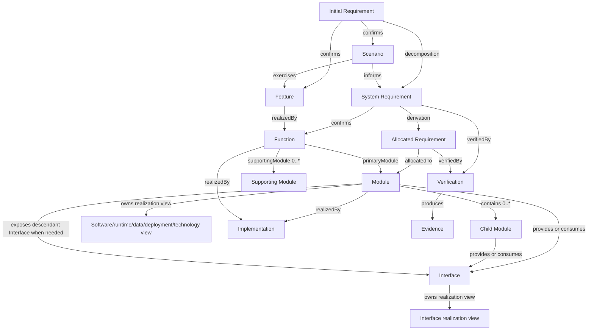

# REM models

Models define structures, typed relationships, cardinalities, lifecycle, and consistency rules using the [concepts](../concepts/README.md).
The [principles](../principles/README.md) explain relationships that inform these choices; the models own REM's selected constraints, and [methods](../methods/README.md) describe how to develop them.

| Domain | Primary content | Owning model |
| --- | --- | --- |
| Requirement Analysis | RR input reconciliation; durable IR → SR → AR | [Requirements](requirements.md) |
| Scenario Analysis | IR → Scenario → Feature; Scenario → SR | [Scenarios](scenarios.md) |
| System Design | IR → Feature; SR → Function; Feature → Function | [System Design](system-design.md) |
| Architecture Design | Function/AR allocation, hierarchical Module containment and encapsulation, Interface contracts/exposure, state/data ownership, and subordinate physical/software realization semantics | [Architecture Design](architecture-design.md) |
| Operational Support | Metamodel, representation, validation, maintenance, and generated-view refresh contracts | [Operational Support](operational-support.md) |

The classic 4+1 architecture views are generated by the [4+1 Architecture View method](../methods/architecture-views.md) from this authoritative model; they are not additional owning models.

RR input remains outside the requirement containment hierarchy. The durable requirement branch has containment semantics; Scenario, System Design, Architecture, and Assurance relationships form a typed graph. Containment identifies which whole an element belongs to; realization, constraint and interaction relationships can cross those boundaries. Do not force the entire engineering system into one hierarchy.
The diagram illustrates common paths and does not require every entity to have every optional relationship.
The realization-view nodes are subordinate architecture information, not first-class governed REM entities.

## Core cardinalities

The tightened REM core establishes:

- SR parent IR: exactly 1;
- AR parent SR: exactly 1;
- confirmed Scenario owning IR: exactly 1;
- confirmed Scenario primary Feature: exactly 1;
- approved SR confirmed Functions: at least 1 before its System Design is complete;
- active Function primary Module: exactly 1 before allocation is complete;
- active Function supporting Modules: 0..*;
- active AR allocated Module: exactly 1;
- Module parent: 0..1;
- Module children: 0..*;
- Module containment: acyclic; REM defines no universal maximum depth;
- Interface provider Module: exactly 1;
- Interface consumer Modules: 0..*;
- descendant-provided Interface exposure: explicit for every containing parent boundary crossed by an external consumer.

Detailed invariants belong to the owning model documents.

## Assurance

Requirement satisfaction is assessed through `Requirement → verifiedBy → Verification → produces → Evidence`.
A Verification defines an assessment method and expected observations; Evidence records actual observations.
A Judgment states what those observations support for the assessed requirement and revision.

An implementation reference or a test's existence does not establish satisfaction.
Evidence applicability depends on the assessed state and scope, even when entity identity remains unchanged.

## Evolution

A Change records a controlled transition between identifiable Baselines.
Current definitions remain understandable through current authoritative information.
Historical records preserve the meaning and allocation that applied in their original state.
A later allocation or retirement does not rewrite an earlier baseline's responsibilities.

## Representation

Typed references resolve to compatible entity types, and stable identities are independent of names and storage paths.
Each semantic fact has one authoritative representation; inverse relationship views are derived. Multiple views do not require independently maintained authoritative copies of the same fact.
A project implementation selects formats, identity namespaces, revision references, and physical containment rules through [Operational Support](operational-support.md) while preserving REM semantics.

## Assessment procedures

Use [verification](../methods/plan-and-assess-verification.md) to assess specified conformance and [intended-use validation](../methods/validate-stakeholder-outcomes.md) to assess stakeholder outcomes.
Each conclusion retains its own scope and support, even when observations are shared.
The methods select no new record format or universal lifecycle gate.
