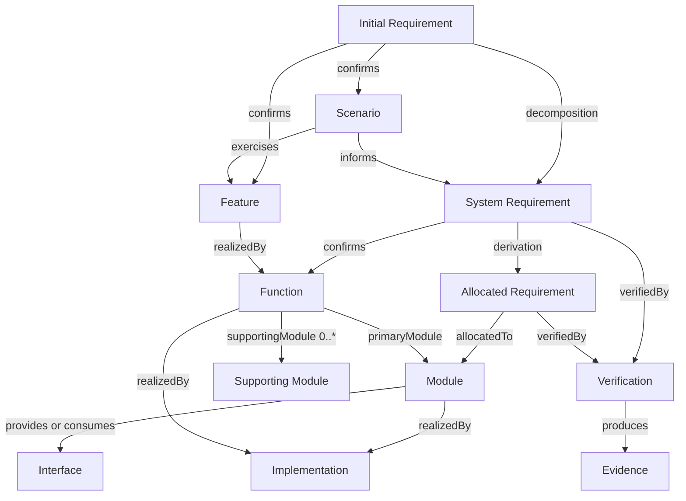

# REM models

Models define structures, typed relationships, cardinalities, lifecycle, and consistency rules using the [concepts](../concepts/README.md).
The [principles](../principles/README.md) govern these models; [methods](../methods/README.md) describe how to develop them.

| Domain | Primary content | Owning model |
| --- | --- | --- |
| Requirement Analysis | IR → SR → AR | [Requirements](requirements.md) |
| Scenario Analysis | IR → Scenario → Feature; Scenario → SR | [Scenarios](scenarios.md) |
| System Design | IR → Feature; SR → Function; Feature → Function | [System Design](system-design.md) |
| Architecture Design | Function → Module; AR → Module; Module ↔ Interface | [Architecture Design](architecture-design.md) |
| Operational Support | Metamodel, representation, validation, and maintenance | [Operational Support](operational-support.md) |

The requirement branch has containment semantics; Scenario, System Design, Architecture, and Assurance relationships form a typed graph.
The diagram illustrates common paths and does not require every entity to have every optional relationship.

## Core cardinalities

The tightened REM core establishes:

- SR parent IR: exactly 1;
- AR parent SR: exactly 1;
- confirmed Scenario owning IR: exactly 1;
- confirmed Scenario primary Feature: exactly 1;
- approved SR confirmed Functions: at least 1;
- active Function primary Module: exactly 1 before allocation is complete;
- active Function supporting Modules: 0..*;
- active AR allocated Module: exactly 1;
- Interface provider Module: exactly 1;
- Interface consumer Modules: 0..*.

Detailed invariants belong to the owning model documents.

## Assurance

Requirement satisfaction is assessed through `Requirement → verifiedBy → Verification → produces → Evidence`.
A Verification defines an assessment method and expected observations; Evidence records actual observations.
A Judgment states what those observations support for the assessed requirement and revision.

An implementation reference or a test's existence does not establish satisfaction.
Evidence applicability depends on the assessed state and scope, even when entity identity remains unchanged.

## Evolution

A Change records a controlled transition between identifiable Baselines.
Current definitions remain understandable through current authoritative information.
Historical records preserve the meaning and allocation that applied in their original state.
A later allocation or retirement does not rewrite an earlier baseline's responsibilities.

## Representation

Typed references resolve to compatible entity types, and stable identities are independent of names and storage paths.
Each semantic relationship has one authoritative representation; inverse views are derived.
A project-specific profile selects formats, identity namespaces, revision references, and physical containment rules through [Operational Support](operational-support.md).
