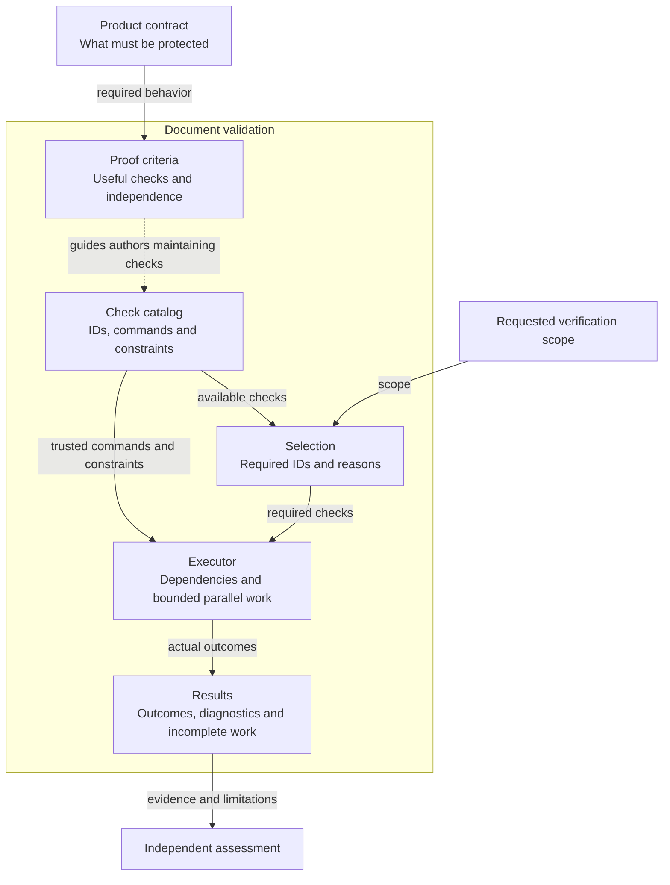
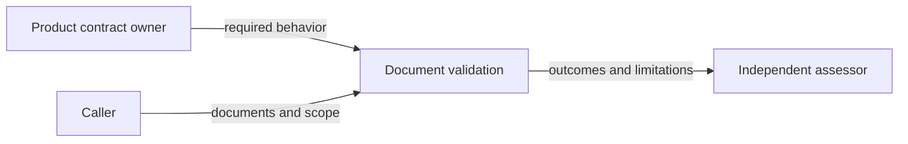
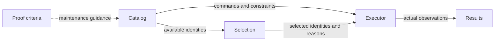
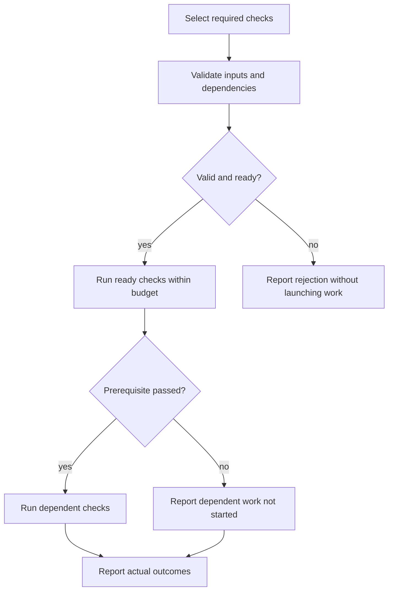
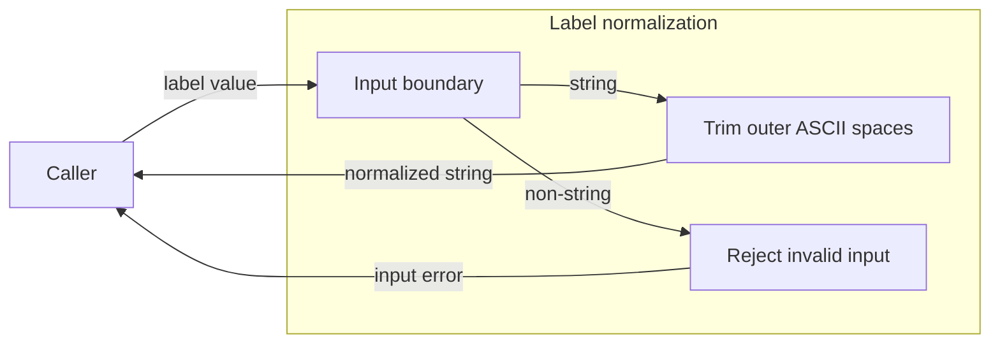

# Architecture views by responsibility

These two synthetic examples are excerpts illustrating overview boundaries, view selection and reference ownership. They are not complete model documents, proposed components, executable services or an exhaustive test list. A real model supplies its own requirements, decisions and acceptance scenarios. Use the structure only when it fits the project's responsibility; do not copy these component names into unrelated systems.

## Composed example: document validation

Assume a project validates documents against an existing product contract. The author owns document corrections; an independent assessor judges whether the results justify acceptance. Validation owns check selection and execution but cannot grant acceptance.

The [context detail](#context-detail) owns inputs and consumers. The [building blocks](#building-block-detail) own local responsibilities; [runtime detail](#runtime-detail) owns ordered cooperation. The overview summarizes those subjects and keeps the independent assessor outside the validation boundary. Dashed guidance is distinct from executable data flow. The boxes need not become separate models or processes.

| Supporting view | Necessary and why | Owning detail |
| --- | --- | --- |
| Context | Yes: scope, behavioral authority and assessment belong to distinct external owners. | [Context detail](#context-detail) |
| Building Block | Yes: trusted catalog, selection and execution have distinct responsibilities. | [Building-block detail](#building-block-detail) |
| Runtime | Yes: failure must leave dependent work visibly incomplete. | [Runtime detail](#runtime-detail) |
| Deployment | No for this excerpt's abstract method: no executable placement or environment is selected. An actual process implementation must reassess resource and deployment boundaries. | This explicit limit; no deployment correctness claim. |

### Context detail

The caller supplies documents and scope; the product owner defines the accepted behavior. The assessor consumes results and owns the acceptance decision. Validation neither edits the documents nor assumes a passing command grants approval.

### Building-block detail

The catalog owns check identity and command constraints; selection owns requested scope, and execution consumes both. Results own the factual account, including missing work. Criteria guide authors and reviewers instead of automatically judging adequacy.

### Runtime detail

Selection is not execution evidence. A failed prerequisite prevents dependent execution and remains visible in the aggregate result. Independent assessment consumes the resulting account under its own criteria.

## Leaf example: label normalization

Assume a pure function trims leading/trailing ASCII spaces, preserves interior characters, rejects non-string input and touches no external state. Its single responsibility does not justify additional submodels.

The input, transformation and error relationships are owned by the behavior stated in this excerpt. The caller owns any storage, authorization or presentation. No persistent artifact or deployed component is implied.

| Supporting view | Necessary and why | Owning detail |
| --- | --- | --- |
| Context | No separate view: the only external relationship is one synchronous caller, fully specified by the function boundary above. | The stated input/output contract. |
| Building Block | No separate view: this leaf has no material internal decomposition beyond the single pure transformation. | The stated normalization behavior. |
| Runtime | No separate view: no interacting components, state transition, retry or concurrency protocol exists. | Deterministic return/error behavior above. |
| Deployment | No: placement and storage belong to the caller, and this function has no environment-sensitive behavior. | Caller responsibility above. |

This is a necessity assessment, not a size exemption. Adding locale dependence, shared state or an asynchronous caller protocol would require reassessment.

## Counterexamples for review

- A validation diagram puts “approve change” inside the executor: reject the abstraction because evidence production has taken the assessor's decision authority.
- The overview adds a store or service that has no owning contract: identify the missing owner or remove the unsupported element before accepting the design.
- Runtime is declared necessary because checks have prerequisites, but only the overview is drawn: require the missing runtime view and its failure behavior.
- Context and runtime disagree about who may initiate publication: reconcile the actual authority owner rather than merely relabeling arrows.
- Every child repeats the parent's detailed rules: keep one owner and reference it; a second diagram cannot become a competing contract.
- A leaf has four empty diagrams solely to fill the template: reassess necessity and keep reasoned dispositions, while retaining its required overview.
